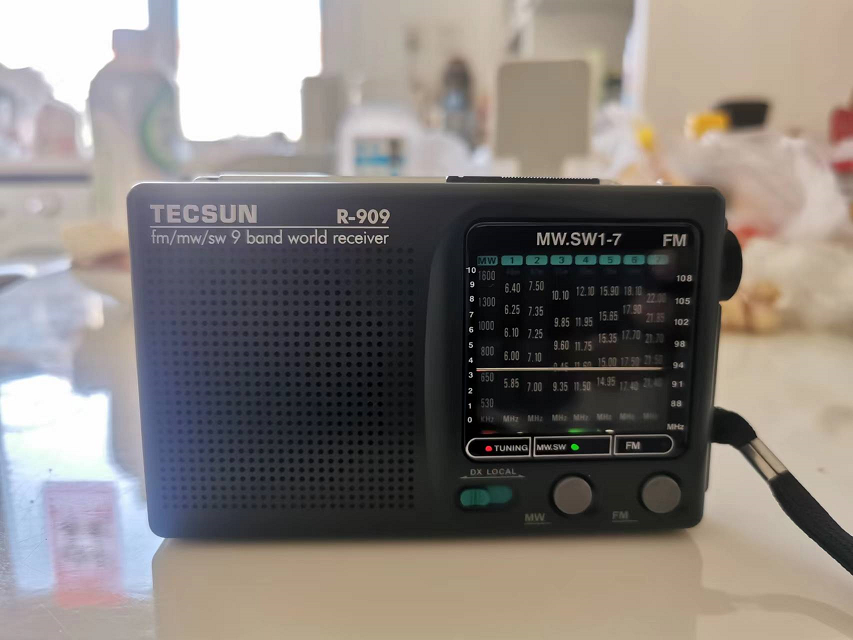
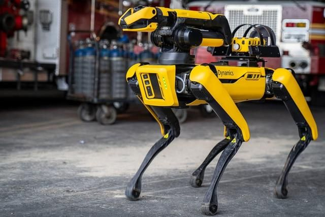
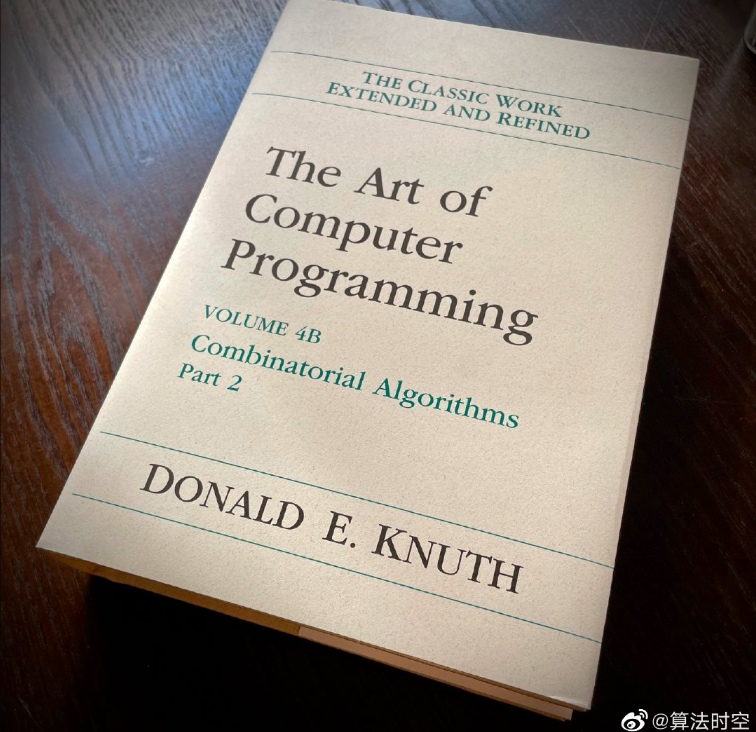
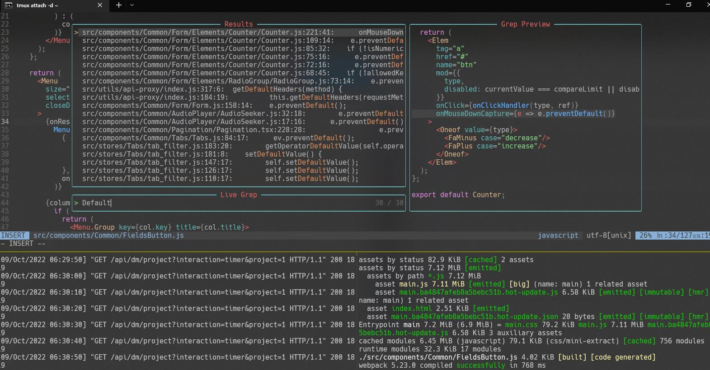

# 机器文摘 第003期

## 搞机

### 收听广播可以缓解压力(*个人体会*)
近期我找到一个缓解焦虑的新方法，听收音机。

一定要老式的那种，收听真正无线电波信号的。随便找个台，最好还带有滋滋啦啦的杂音，当作工作时的背景声音，听着听着就感觉无比的放松。但又不是简单的“粉红噪音”、“白噪音”带来的那种平静，这种“仿佛脱离现在、回到了某个时空”的感觉让人感到愉悦。

我还没找到相关的研究信息，有人知道原理吗？

## 动向
### 欧洲通过法案，将强制统一USB Type-C接口为充电接口

> 欧洲议会今天以压倒性多数投票赞成在2024年底之前将USB-C作为包括iPhone和AirPods在内的各种消费电子设备的通用充电端口。

这对于苹果来说恐怕是个坏消息，对于消费者来说应该是个好消息。不过也许以苹果公司的脾气，说不定将来取消所有物理接口也有可能。

- [欧洲强制iPhone使用usb-c接口](https://www.macrumors.com/2022/10/04/eu-passes-law-to-switch-iphone-to-usb-c-in-2024/)
### 波士顿动力承诺不将机器人武器化

> 当地时间 10 月 6 日消息，波士顿动力、Agility Robotics、ANYbotics 等 6 家公司联合发表致行业的公开信表达了他们对这些可能性的担忧。他们称，先进的商业化机器人的经济可负担性和可获得性越来越强，其被滥用的可能性也越来越大。我们承诺不会将通用机器人或软件武器化，也不会支持其他人这么做；同时呼吁政策制定者、开发者和用户共同促进安全使用。

我个人感觉此类声明并不会带来什么限制，相反地，我偏悲观的认为这种技术很可能以最优先的速度被应用于军事目的。
- [网易新闻：波士顿动力承诺不将机器人武器化](https://www.163.com/dy/article/HJ5DMDS005118DFD.html)

### TAOCP（《The Art of Computer Programming》） 4B正式初版

*图片来自[@算法时空](https://weibo.com/5819320755/M9LXaF5I3)*

世界著名程序员——高德纳老师，日前在他的个人网站宣布了[TAOCP 4B正式出版](https://www-cs-faculty.stanford.edu/~knuth/news.html#v4b)的消息。

这部计算机世界的经典巨著，耗费了高德纳老爷子的毕生心血，虽然已经出到了第四B卷，但本书目前还没有完全写完（本书从1962年开始写（中间停了几年是因为老爷子发现没有趁手的排版软件，就顺手发明了TEX——这又是另一个宏大话题了），计划共有七卷，其中第四卷分ABC三册）。他在自己主页中提到：
> 与此同时，我继续研究第3部分（第4C卷），它已经有许多令人兴奋的主题。

我只能说：祝老爷子身体健康！

### WebAssembly技术发展的怎么样了？

> WebAssembly 是一种运行在现代网络浏览器中的新型代码，并且提供新的性能特性和效果。它设计的目的不是为了手写代码而是为诸如 C、C++和 Rust 等低级源语言提供一个高效的编译目标。
——来自[Mozilla官方文档关于WebAssembly概念的介绍](https://developer.mozilla.org/zh-CN/docs/WebAssembly/Concepts)。

WebAssembly技术号称可以在浏览器中高效执行代码，并可以很方便地将C、Rust等各种语言编译到浏览器中执行，那么目前他的使用体验如何？

我周末做了简单体验。

通过官方给出的文档和入门指南，可以很快速地搭建出程序的原型，上图就是我参考官方示例将Rust代码编译到网页中执行的效果(是一个[经典的Game of life的小游戏](https://en.wikipedia.org/wiki/Conway%27s_Game_of_Life))。

从开发上来说，现在已经有了比较成熟的工具链（尤其是针对Rust语言到WASM的工具），和共享库的生态，想要进行开发，不必像前些年那样费心地搭建开发环境，基本上在Linux系统下简单执行几行命令即可完成环境搭建。

从执行效果来说，我没有做性能测试，直观感受上来说，确实比原生js快了不少。

但这并不是重点，我个人觉得这项技术它最大的意义在于，将之前的桌面程序技术有了向Web移植的可行性。

我们有可能很快就看到完全兼顾Web分发的方便和桌面程序性能体验的产品。

- [一则WebAssembly相关的新闻](https://www.infoq.cn/article/hdwglnhub2wwklo9zz6z)
- [GitHub网友整理的关于WASM的资源大全](https://github.com/mbasso/awesome-wasm)
- [一本手把手教你使用Rust语言进行WASM开发的在线电子书](https://rustwasm.github.io/docs/book/introduction.html)
- [一个使用WASM技术将三维设计软件CAD嵌入到网页中的开源项目](https://zalo.github.io/CascadeStudio)
- [一个使用WASM技术在浏览器中运行的PostgresSQL数据库](https://supabase.com/blog/postgres-wasm)

## 观点
> 在你的密码里面放上一个逗号`","`,这样当你的密码在网上被人拖库时可以给黑客增加一些麻烦，因这样会使得他在作为csv文件往他的密码字典里面导入的时候，因为逗号分隔符的错位而让他崩溃。
> 注：csv文件默认使用逗号分隔符区分字段。
- 来自：佚名网友。

> 当你长期使用windows远程桌面进行远程办公时，一层一层的服务器登进去，时间长了就会陷入盗梦空间那种疑惑，我现在是在哪一层？
- 来自：我自己。

> 量子计算机就是向过去和未来借用了很多乃至无限的时间吗？刹那即永恒。
> 注：量子计算机号称每个bit位可在同一时刻表示多种状态。
- 来自：我自己。

## 长文
### 从0到1打造家庭弱电方案
现在有不少人在困惑家里的网线该如何布局，这篇[《从0到1打造家庭弱电方案》（中文）](https://luolei.org/home-network-1/)记录了作者完整的装修过程，内容十分精彩详尽。看完之后我有点儿后悔，当时装修时没有给各个房间拉上光纤，以及用了比较普通的超五类网线。

### 如何配置一个完全基于命令行窗口的开发环境
我在油管上关注了一个日本小哥（Takuya Matsuyama），是一个个人开发者，经常上传自己的开发过程录屏，他完全基于命令行窗口（控制台）进行开发，没使用任何IDE。

后来我参考他的配置文件给自己也配置了一套，使用fish作为shell，neovim加上各种插件作为主力编辑器，现已成为我的日常开发环境。

有条件的可以到他的主页看看关于如何配置的详细介绍，或者直接去他的github仓库获取配置文件。

- [Takuya Matsuyama小哥的主页](https://www.craftz.dog/posts)
- [他的基于控制台命令行开发的各种配置文件](https://github.com/craftzdog/dotfiles-public)

### 云桌面并不像你想的那么好
给开发人员配置一个廉价的笔记本加上一个高性能的云端工作站，这个点子棒不棒？

听起来有很多的优势，兼具了性能、便携性、安全性等等。

不过先等一等，这里有一位作者在这样尝试了之后，给出了不少负面反馈（比如多显示器支持、GPU加速、网页视频质量等等问题），有兴趣的可以点进去看看。
- [《云桌面并不像你想象的那么好》（英文）](https://mjg59.dreamwidth.org/61535.html)

## 资源
- [从高中到大学，数学中常用符号和计算关系的英文名称](https://webusers.imj-prg.fr/~jan.nekovar/co/en/en.pdf)，适合对数学公式中的各种符号感到困惑的人收藏，这本小册子汇聚了所有数学符号、常用希腊字母、代数式等英文叫法介绍。
- [如何在Ubuntu下进行x86-x64汇编语言编程](http://www.egr.unlv.edu/~ed/x86.html)，一本讲解现代汇编语言的电子书，基于常用的Ubuntu系统，从认识汇编语言开始讲起，到工具链的准备和怎样编写和调试程序，都有详细的介绍。
- [DrawKit](https://www.drawkit.com/)，一个提供矢量插画的网站，有很多免费的高质量插画，可用于网站制作、软件产品等方面。
- [计算机教育中缺失的一课](https://missing-semester-cn.github.io/)，一般学校里不会教开发环境的配置和各种效率工具的使用，这本电子书就是以环境和工具为切入点，将学校学习的理论应用于实际，比较接地气。
  > 大学里的计算机课程通常专注于讲授从操作系统到机器学习这些学院派的课程或主题，而对于如何精通工具这一主题则往往会留给学生自行探索。在这个系列课程中，我们讲授命令行、强大的文本编辑器的使用、使用版本控制系统提供的多种特性等等。学生在他们受教育阶段就会和这些工具朝夕相处（在他们的职业生涯中更是这样）。 因此，花时间打磨使用这些工具的能力并能够最终熟练地、流畅地使用它们是非常有必要的。

## 订阅
这里会隔三岔五分享我看到的有趣的内容（不一定是最新的，但是有意思），因为大部分都与机器有关，所以先叫它“机器文摘”吧。

喜欢的朋友可以订阅关注：

- 通过微信公众号“从容地狂奔”订阅。

- 通过[竹白](https://zhubai.love/)进行邮件、微信小程序订阅。

