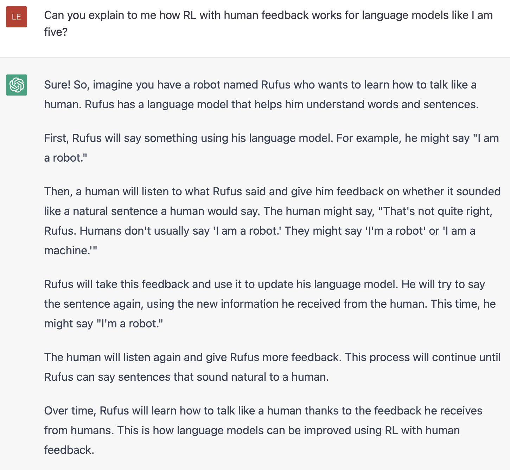
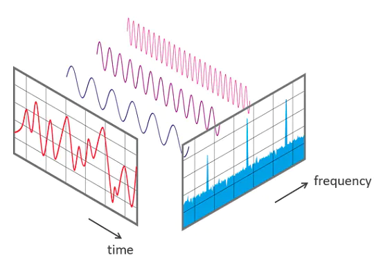
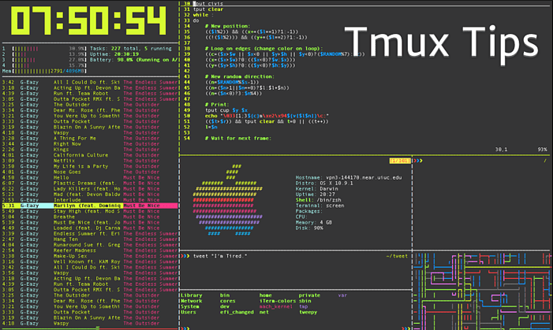
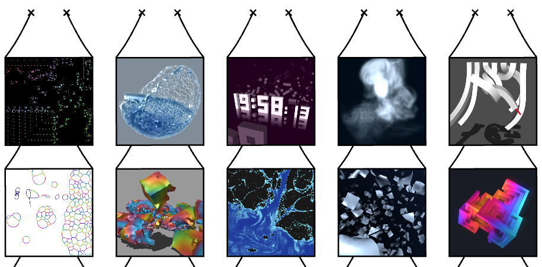
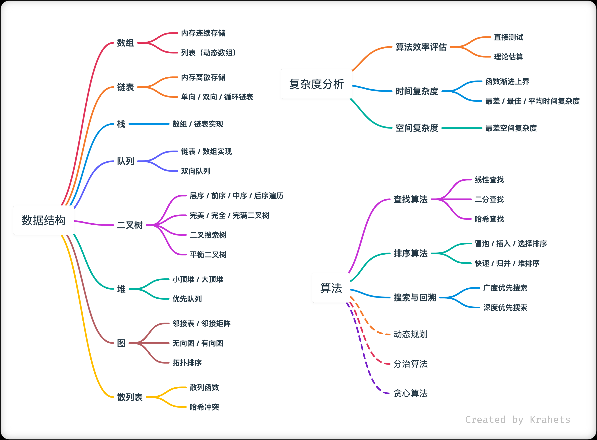
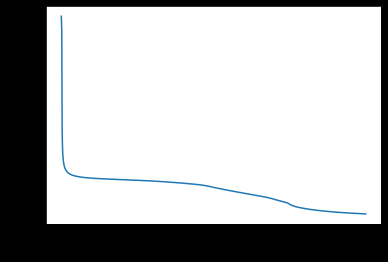

# 机器文摘 第 013 期

## 长文
### [从古董电脑中我们能学到什么](https://github.com/readme/featured/vintage-computing)

我也不知道为什么自己会对老旧电脑，尤其是上世纪80年代、90年代出品的电脑这么迷恋。

我觉得那个时代的电脑散发着一种难以名状的工业气质。

通过阅读[这篇文章](https://github.com/readme/featured/vintage-computing)，使我意识到一些深层次的原因。

这些老式电脑的魅力来自于当时技术的限制、简单粗暴和直接。

通过深入了解这些老古董、学习开发那个时代的软件，可以更容易地了解计算机科学。

毕竟，现在的计算机已经充分的复杂和“人性化”，软件把硬件包裹得越来越严实和抽象。以至于根本看不清它的内部构造和实现原理。

去研究那些古董电脑吧，操作那些裸漏单纯的硬件接口，贴近更加具体的科技。

### [蛋](http://www.galactanet.com/oneoff/theegg_zh.html)

这是一篇很富有哲理的小小说，严格来说跟机器没有关系。

但是写的实在是很好，忍不住收录进来。

毕竟，喜欢机器的人，很难抗拒这种对宇宙天马行空的探索。

### [RLHF 模型详解](https://huggingface.co/blog/rlhf)

近期 AI 圈最火的事情，莫过于 OpenAI 发布的聊天机器人 ChatGPT 了。

这个智能聊天机器人已经强大到可以让人担忧的地步了。

那么，它背后的实现原理是什么？

[这篇文章](https://huggingface.co/blog/rlhf)讲解了 ChatGPT 所使用的 RLHF（人类反馈强化学习） 模型是如何实现的以及它的未来会怎样发展。

### [基于扩散模型生成音乐](https://www.riffusion.com/about)

基于文本生成图像的扩散模型已经火了一段时间了。

我当时还在想，既然基于扩散模型可以生成图像的话，那能不能生成声音呢？

结果我只是动了动念头，人家这边已经把成果拿出来了。

[这篇文章](https://www.riffusion.com/about)介绍了他们基于扩散模型生成音乐的项目。

我试听了一下，效果还不错，挺神奇的。

## 资源
- [tmux 入门](https://ittavern.com/getting-started-with-tmux/)，一篇 tmux 的入门教程。tmux 是一个终端程序，可以同时模拟多个客户端控制台，如果觉得不好理解的话，可以认为它是一个控制台的多页签浏览器。因为在工作中经常需要 ssh 登录服务器进行编程开发，我现在已经离不开它了。

  

- [一个有趣的个人网站](https://oimo.io/works/)，作者是一个日本在读博士生，网站放了一些个人的编程作品，主要跟物理模拟、像素艺术有关。
  
  

- [你好，算法](https://www.hello-algo.com/)，一本开源电子书，可在线阅读，深入浅出讲解数据结构和算法，生动有趣，适合有一定编程基础但是算法这块有些薄弱的爱好者阅读。
  
  

- [神经网络在线教程](https://nbviewer.org/github/gpeyre/numerical-tours/blob/master/python/ml_6_nn.ipynb)，一套神经网络编程教程，提供在线的 python 代码阅读环境，适合作为入门资料学习。
  
  

## 订阅
这里会隔三岔五分享我看到的有趣的内容（不一定是最新的，但是有意思），因为大部分都与机器有关，所以先叫它“机器文摘”吧。

喜欢的朋友可以订阅关注：

- 通过微信公众号“从容地狂奔”订阅。

- 通过[竹白](https://zhubai.love/)进行邮件、微信小程序订阅。

