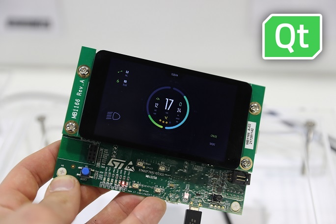
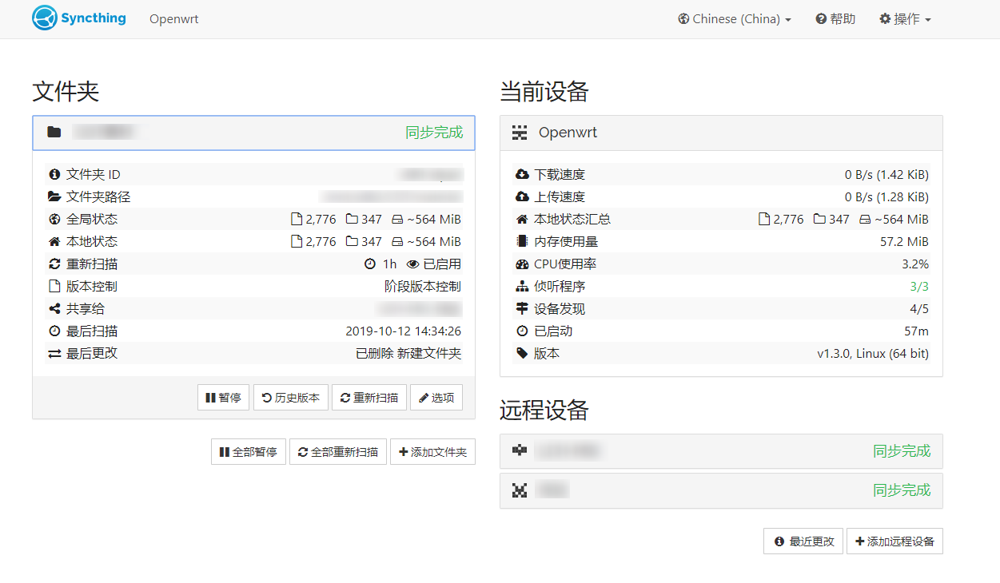
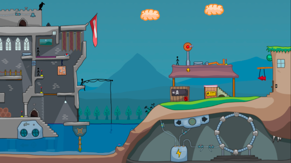
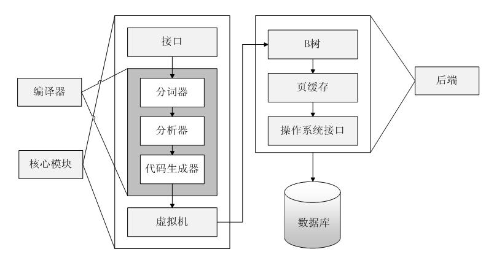
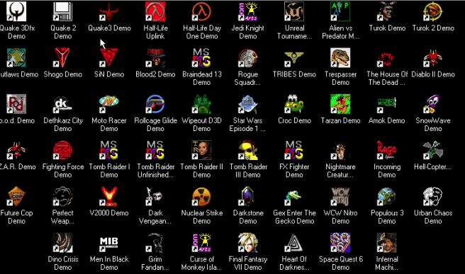
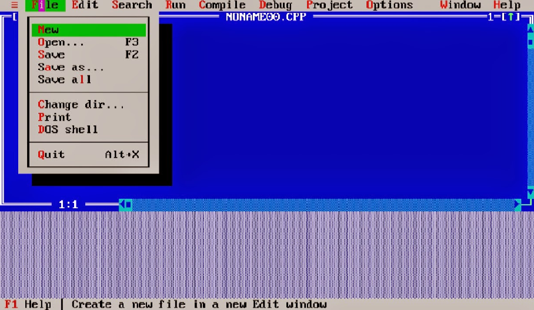

# 机器文摘 第 014 期

## 长文

### [运行在单片机上的 Qt](https://decovar.dev/blog/2022/12/24/qt-on-mcu/)

尝试过给单片机写图形界面没有？

这篇 [《Qt on MCU》 ](https://decovar.dev/blog/2022/12/24/qt-on-mcu/)比较系统的介绍了“为什么选择 Qt（一套开源图形界面库） 给单片机做界面”、“Qt 的基本架构”、“程序移植性”等相关问题。

读完可以较为全面地了解在单片机这种机能较弱的硬件设备上制作图形界面的基本思路和需要关注的问题。

### [OpenWrt/LEDE 搭建 Syncthing p2p 私有文件同步服务](https://chenhe.me/post/openwrt-syncthing/)

现在大家都不止一个电子终端设备，个人数字信息、各种数据文件的同步需求基本上是一个刚需。

有很多厂商提供了收费方案，比较常见的有国内的各种网盘、手机厂商提供的各种 Cloud 服务等等。

如果想基于家庭网络自己动手搭建一个私有服务的话，可能略微麻烦一些，不过也有较为成熟的方案了。

条件具备的话不妨参考这篇[《OpenWrt/LEDE 搭建 Syncthing p2p 私有文件同步服务》](https://chenhe.me/post/openwrt-syncthing/)动手试一试。

### [用 Flash 高清重制一款游戏](https://www.jiqizhixin.com/articles/2022-12-22-2)

Flash 基本已经成为历史了。

即便现在可以通过一些渠道或者浏览器勉强开启 Flash 插件的话，也会提心掉胆地担心计算机的安全性。

毕竟那些恼人的弹窗广告有 80% 都是靠 Flash 技术实现的。

但是还有这么一群人，他们玩着 4399 上的小游戏长大，80 后喜欢的各种主机游戏在他们眼里根本不值一提，倒是网页上那种基于 Flash 制作的即开即玩的小游戏（比如我能想到的就有：黄金矿工、狂扁小朋友、打企鹅等等）才是他们的最爱。

Flash 技术被时代抛弃，那些 4399 们也就逐渐消失了。

不过总有人会拥抱情怀，这篇[《为拯救童年回忆，开发者决定采用古法编程》](https://www.jiqizhixin.com/articles/2022-12-22-2)便讲述了这样一个故事。

里面的哥们儿以极其硬核的方式实现了他的梦想，为了复刻一个 Flash 小游戏，他几乎重新写了一个 Flash 播放器。

### [Unix 终端系统（TTY）是如何工作的](https://waynerv.com/posts/how-tty-system-works/)

没有使用过大型机而直接进入 PC 时代的计算机用户，可能觉得“终端”就是电脑上那个能够输入 CMD 命令的黑乎乎窗口吧。

即便是终日与命令行打交道的软件开发人员、系统运维人员，可能也很难一下子解释清楚什么是“终端”，它为什么叫这个名字。

这篇[《Unix 终端系统（TTY）是如何工作的》](https://waynerv.com/posts/how-tty-system-works/)从计算机硬件发展的历史出发，介绍了计算机系统跟用户交互的发展历程，并针对“终端”系统进行详细展开，讲解了实现原理和后来发展的现代形态。

喜欢硬核知识的朋友可点进去阅读一下。

### [HN 讨论：极大提升你效率的软件有哪些？](https://news.ycombinator.com/item?id=34069106)

哪些软件最能节约你的时间、解放你的双手、使你离不开它？

这个话题几乎每过一段时间就会被拿出来讨论一番。

每个人都有自己的偏爱。

不过，看看大家的讨论，说不定也能发现一些新鲜的软件，也许能更新一下自己的工具库也说不定。

  > 比如上面这篇帖子里，楼主提到的 [这个 csv 工具](https://github.com/BurntSushi/xsv) ，可以在命令行让你高效对 csv 文件进行快速检索、合并查询、切片等等。
  > 不过帖子里可能有人把节奏带偏了，在下面大吹特吹各种 IDE 软件，就仁者见仁了。

## 资源
- [SQlite源码分析](https://huili.github.io/)，一本讲解 SQlite 源码的在线电子书，主要对 SQLite 数据库的实现机制和使用方法做了简要分析。
  
  

- [经典复古 win98 游戏合集](https://retrogame.com.ua/2022/03/moarstalgia-windows-98-3dfx-amp-dos-retro-gaming-pack/)，一个游戏整合包，里面整合了若干在 Win98 系统下才能跑的老游戏，像初代的雷神之锤、半条命、极品飞车等等。提供了基于 DosBox 的虚拟系统，即开即用，性能还不错。
  
  

- [DOS 系统下的编程工具合集](http://www.doshaven.eu/programming-tools/)，想要重温在 DOS 环境下编程的感受，这里有一套比较全面的工具合集，包括 QBASIC、TurboC 等开发环境，以及一些用于游戏开发的图形库、引擎。

  

- [给你自己跑个分](https://humanbenchmark.com/dashboard)，现在一些硬件评测动不动就使用软件进行跑分，用以展示硬件之间的形成差异，这个网站提供了一组小游戏，可以考验你的短期记忆力、反应能力，并给你打分。也试试给自己跑个分吧。
  
  

## 订阅
这里会隔三岔五分享我看到的有趣的内容（不一定是最新的，但是有意思），因为大部分都与机器有关，所以先叫它“机器文摘”吧。

喜欢的朋友可以订阅关注：

- 通过微信公众号“从容地狂奔”订阅。

- 通过[竹白](https://zhubai.love/)进行邮件、微信小程序订阅。

