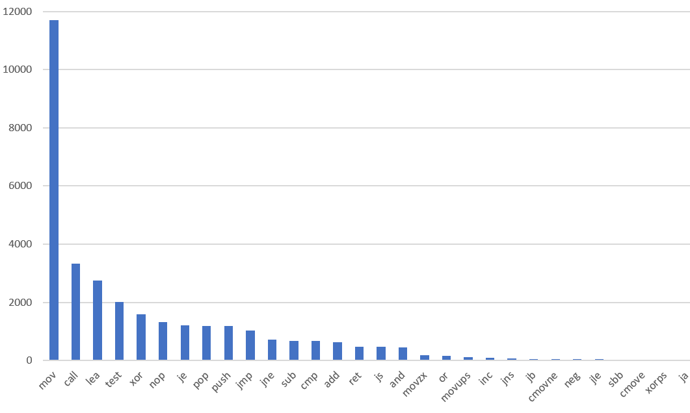
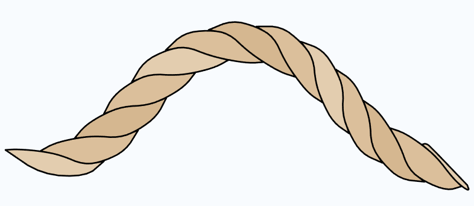
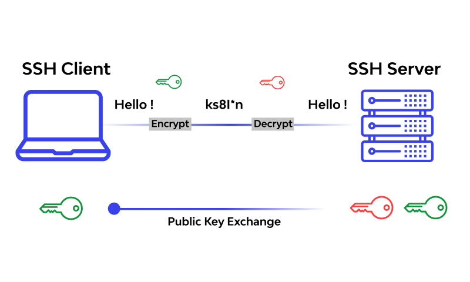
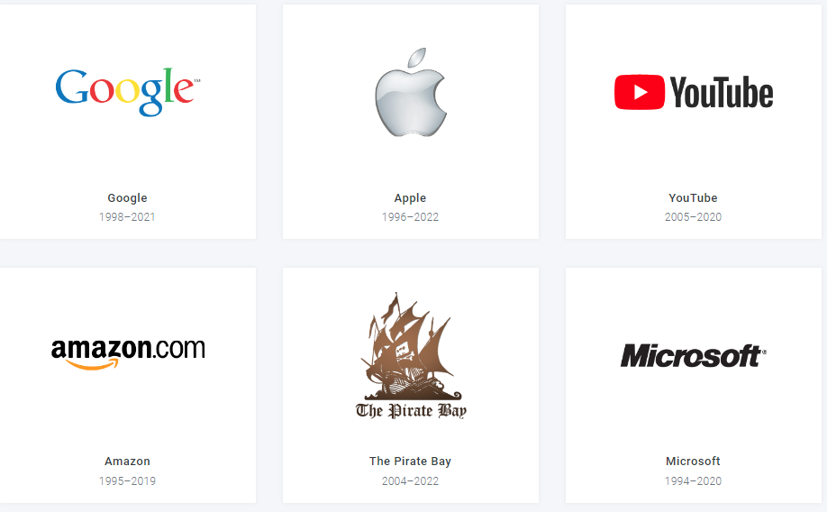
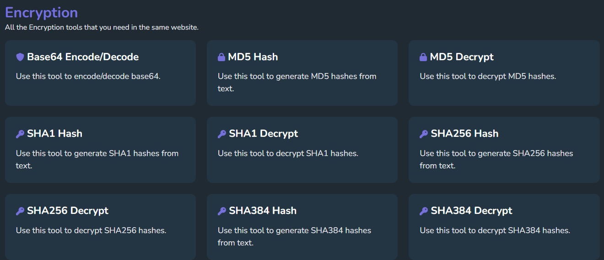

# 机器文摘 第 016 期

## 长文
### [黑客与汽车](https://samcurry.net/web-hackers-vs-the-auto-industry/)

现在的汽车很多都具有联网的能力，可以通过互联网进行便利的远程操作。

比如获取汽车位置、健康状态、远程启动、远程开门等等。

作为消费者来说，在使用这些便利功能的时候，内心是十分信任厂商的。

觉得安全问题肯定会被厂商非常重视，作为头号问题来抓。

然而这篇[《黑客与汽车》](https://samcurry.net/web-hackers-vs-the-auto-industry/)却改变了我的看法，原来这些车联网的安全防护如此的脆弱。

文章作者为业内人士，写的还比较实在。如下列举部分这些黑客可以对车进行的未授权操作：
1. 远程发动机启停、车门解锁与锁定、大灯闪烁、喇叭鸣笛；
2. 锁定用户，迁移管理权；
3. 根据车架号下载到用户的销售档案；
4. 远程刷新更新车辆电脑固件；
5. 跟踪车辆物理GPS位置；

看完我感觉是不是得把我的相关车联网服务给停一停了。

### [汇编代码阅读指南](https://www.timdbg.com/posts/fakers-guide-to-assembly/)

写汇编代码很麻烦，阅读起来也很费劲吗？

这儿有[一份简要的汇编阅读指南](https://www.timdbg.com/posts/fakers-guide-to-assembly/)，作者介绍了一些汇编代码的阅读技巧。

因为根据统计显示，最常用的汇编指令也就那么十来个，所以并没有想象中的那么晦涩和高深莫测。

### [使用 SVG 绘制逼真的绳索](https://muffinman.io/blog/draw-svg-rope-using-javascript/)

SVG 是在网页中进行矢量绘图的技术，比起 Canvas 画板的像素图像，SVG 具有放大不失真的特点，在网页中可以通过 Javascript 操作生成 SVG 图形对象，实现各种复杂的图案。

这篇文章的作者从几何的角度考虑了如何使用矢量图形来绘制一个现实中的麻绳图案，要不仅体现出绳索的扭曲，还要正确表现绳索分支之间的叠压，作者提出了一个巧妙的使用 SVG path 进行实现的方法。还给出了代码。

你要问作者为什么这么做，有什么用没有？我想作者可能会回答：Because I can ！

### [SSH 进阶用法介绍](https://plantegg.github.io/2019/06/02/%E5%8F%B2%E4%B8%8A%E6%9C%80%E5%85%A8_SSH_%E6%9A%97%E9%BB%91%E6%8A%80%E5%B7%A7%E8%AF%A6%E8%A7%A3--%E6%94%B6%E8%97%8F%E4%BF%9D%E5%B9%B3%E5%AE%89/)

经常在 Linux 系统下进行开发或者运维的专业人士，可能每天使用最多的工具就是 SSH 了，每天都要通过它登录服务端系统，进行一系列的操作。

这里[有一篇文章](https://plantegg.github.io/2019/06/02/%E5%8F%B2%E4%B8%8A%E6%9C%80%E5%85%A8_SSH_%E6%9A%97%E9%BB%91%E6%8A%80%E5%B7%A7%E8%AF%A6%E8%A7%A3--%E6%94%B6%E8%97%8F%E4%BF%9D%E5%B9%B3%E5%AE%89/)比较全面地介绍了 SSH 的进阶使用技巧，可以在某种程度上极大提升效率以及操作体验。

列举部分如下：
1. 如何免密码登录；
2. 如何映射服务端的服务端口到本地（以方便调试）；
3. 如何将服务端的图形界面（如xcalc）代理到本地电脑显示和交互（不是远程桌面哦）；
4. 一些网络端口映射之类的高级操作；

## 资源
- [个人年终总结模板](https://gist.github.com/sbabybird/c340dee0fbec2e1dfe4a1c49d311cf4b)，我做了一个基于 Markdown 语法的年终总结模板，方便梳理在编写个人总结时的思路，放在 github 上的 gist 里了，可以随意使用。
  
  

- [web 网页设计博物馆](https://www.webdesignmuseum.org/)，一个保存古老网页设计的网站。记录了 1999 年到 2020 年各大公司的网页设计变迁。包括谷歌、亚马逊、苹果、任天堂、麦当劳等等。
  
  

- [一站式网页工具大全](https://allinone.tools/)，一堆的在线工具汇总，包括图片处理、PDF格式转换、文字编码转换、密码生成、字符串加密解密等等，常用工具一网打尽。
  
  

- [在线手柄测试工具](https://gamepad-tester.com/)，打开网页即可测试游戏手柄的工作状态，按键是否灵敏，遥感是否有死区等等，非常方便。
  
  

## 订阅
这里会隔三岔五分享我看到的有趣的内容（不一定是最新的，但是有意思），因为大部分都与机器有关，所以先叫它“机器文摘”吧。

喜欢的朋友可以订阅关注：

- 通过微信公众号“从容地狂奔”订阅。

- 通过[竹白](https://zhubai.love/)进行邮件、微信小程序订阅。

