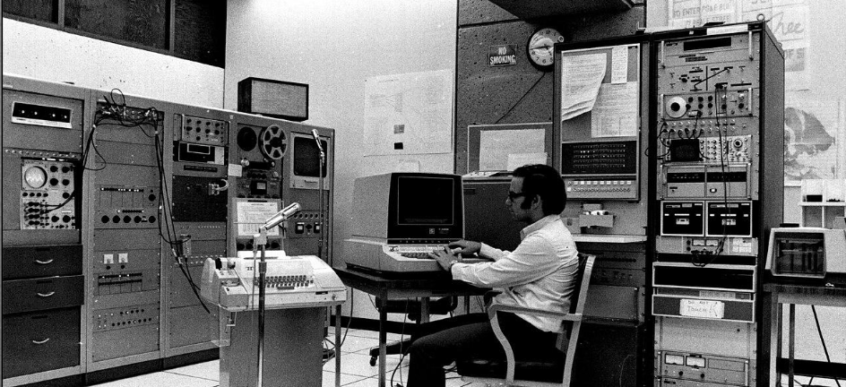

# 机器文摘 第 018 期

## 长文
### 游戏高清重制《科林麦克雷拉力赛3》

游戏高清重制一直是我比较感兴趣的话题，可能因为比较喜欢怀旧吧。

我曾经收藏过采用覆盖显示驱动的方式进行高清分辨率支持的《极品飞车 5》、《Quake 3》等游戏。

也见过一些更古老的游戏在更新资源包之后重新焕发青春。

不过一直没有接触过真正的重制过程。

这篇[《重制科林麦克雷拉力赛》](https://cookieplmonster.github.io/2023/01/15/remastering-colin-mcrae-rally-3-silentpatch/)详细记录了一个优秀的赛车游戏进行高清重制的过程。

可以带你了解老旧游戏如何进行“宽屏”、“超宽屏”支持，如何重制高清界面UI元素等，过程充满了对不可能的挑战。

### 把网页渲染到控制台

通过控制台窗口进行上网，你可能觉得并不新鲜。

毕竟已经有很多类似 w3m 这种在控制台下基于字符的浏览器程序。

但是他们的缺点都是不能显示图形，而且几乎失去了对页面的样式渲染。

今天这篇[《把网页渲染到控制台》](https://fathy.fr/carbonyl)则另辟蹊径，虽然同样是在控制台的字符界面，但是渲染手段却大不相同。

它将控制台字符当作单个像素来处理，采用现代浏览器内核进行页面解析和预渲染计算。

然后在像素渲染阶段，采用了控制台字符来进行替换。

虽然最终效果无法跟图形界面下的浏览器相比。

但是它毕竟提供了一种在终端控制台进行图形化网页显示的可能。

### Chromium 渲染流水线——字节码到像素的一生

看了前面网页渲染到控制台的文章，如果对浏览器的原理架构比较感兴趣的话。

可以看看这篇[讲解 Chromium 浏览器渲染架构](https://zhuanlan.zhihu.com/p/574069391)的文章。

现代浏览器已经复杂到不可能通过个人从零开始实现。

了解一下他们的架构，即便不从事相关开发，也可能对自己的软件架构产生有益影响。

### 99 行代码实现光线追踪

光线追踪在图形渲染中十分关键的概念。

同时也是现代电影工业实现逼真光照渲染所必须的技术手段。

然而它的原理却并不复杂，甚至只需少量代码就可以自己实现一个建议的渲染器。

这篇[《99 行代码实现光线追踪》](http://kevinbeason.com/smallpt/)就只是用了少量 C++ 代码实现了一个简单的带有全局光照、阴影、反射的场景渲染。

虽然看起来简单，效果还是很令人惊艳的。

适合我这种喜欢研究原理，但又不太深入的“技术爱好者”。

### 光线追踪深入

既然前面提到了光线追踪，不妨再引申一下。

很多光线追踪的入门教程都会教你渲染一些简单的模型，比如球体，圆柱体等等。

如果想基于光线追踪技术渲染复杂一些的三维模型，应该怎么做？

这里有一篇[《光线行进和符号距离函数》](https://jamie-wong.com/2016/07/15/ray-marching-signed-distance-functions/)，里面介绍了基于光线行进算法（光线追踪的一种实现方式）和符号距离函数来构建三维场景中复杂模型的思路。

内容比较详细，并带有示例代码。

## 资源
- [chronophoto](https://www.chronophoto.app/game.html)，一个猜照片年代的游戏，根据网站随机展示的老照片，来判断这张照片是哪一年拍摄的，答案区间 1900 到 2020 ，我试了试还挺有意思，可以根据照片中出现的物品和人物的衣着进行分析。  
  

- [Gimel Studio](https://github.com/GimelStudio/GimelStudio)，一个基于节点系统的照片后期处理工具，开源，采用 Python 编写。  
  

- [BugChecker](https://github.com/vitoplantamura/BugChecker)，一个支持 Windows 11 的类  SoftICE 调试器，开源。
  

- [swiftshader](https://github.com/google/swiftshader)，一个基于 CPU 实现 OpenGL 渲染的图形库。主要应用在谷歌开源的 chromium 项目里，用纯软件算法实现了OpenGL、Vulkan图形接口。
  

## 订阅
这里会隔三岔五分享我看到的有趣的内容（不一定是最新的，但是有意思），因为大部分都与机器有关，所以先叫它“机器文摘”吧。

喜欢的朋友可以订阅关注：

- 通过微信公众号“从容地狂奔”订阅。

- 通过[竹白](https://zhubai.love/)进行邮件、微信小程序订阅。

