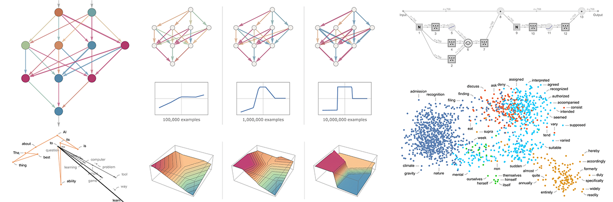
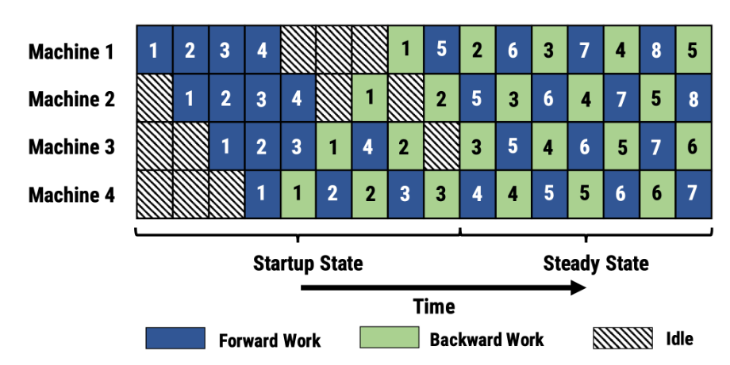
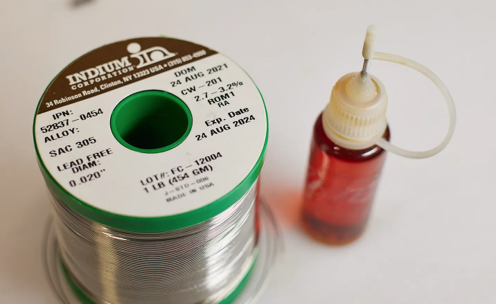
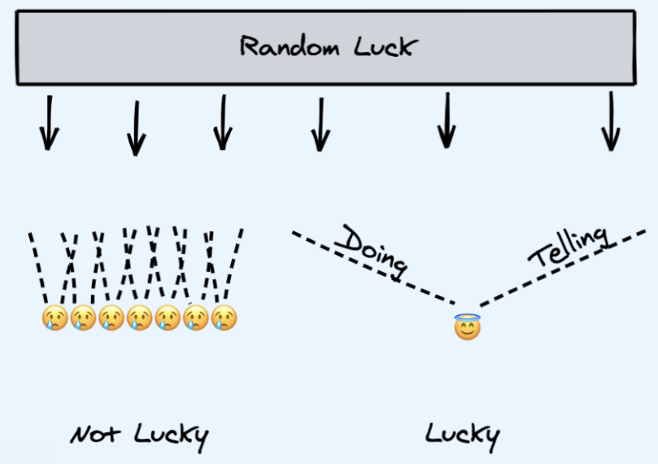
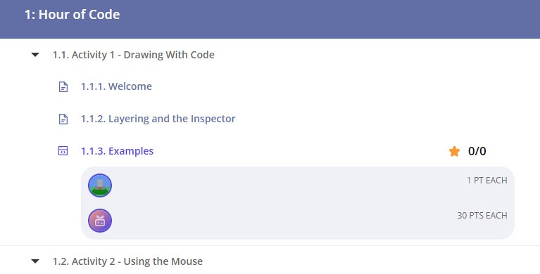
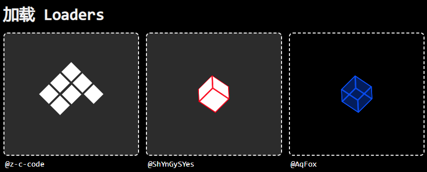
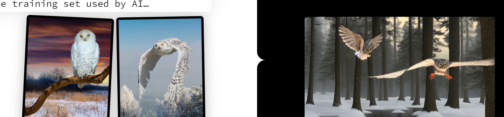

# 机器文摘 第 021 期

## 长文
### chatGPT 原理通俗讲解

可能是有人炒作的缘故，chatGPT 热度一直不降，连街边买菜的大妈都在讨论这个“人工智能机器人”。

可能是它输出语言的流畅度实在是太接近真实的人类了，用惯了之前那种“智能助理”的人很容易感到震惊。

然而其背后的原理并非像想象的那么复杂，甚至是大力出奇迹的又一个经典样例。

最近关于它的文章也是铺天盖地，各种分析、叫好，很少有冷静下来探讨其背后机理的。

我翻看了几篇之后，发现唯有这篇[《chatGPT在做什么以及它为什么好使》](https://writings.stephenwolfram.com/2023/02/what-is-chatgpt-doing-and-why-does-it-work/) 比较优秀。读起来比较平和，没有压力。

文章揭示了即使像chatGPT这样的大型语言模型也是一个单词一个单词慢慢往出崩的，并尝试说清楚这么流畅的语言是基于什么来预测后续单词的概率。

### 怎样利用多GPU训练真正的大型模型

前面提到的 chatGPT 模型，体量非常大，据说训练一次就要耗费上千万美元。

作为普通开发者我们是不敢奢望自己上手训练一番。

不过，这里有一篇文章可以让我了解像这样的[大模型是如何进行并行训练的](https://lilianweng.github.io/posts/2021-09-25-train-large/)。

另外还有个开源的项目，号称可以[在较少资源的基础设施上进行 GPT 模型训练](https://github.com/hpcaitech/ColossalAI/blob/main/README-zh-Hans.md)，有兴趣的可以试试。

### 怎样搭建一个电子爱好者工作间

拥有一个电子产品工作室一直是我的一个梦想。

电烙铁、稳压电源、万用表，是我能想到的最基本的设备。

如果还想更完美，可以借鉴这篇文章所介绍的思路，[搭建一个电子爱好者工作间](https://lcamtuf.substack.com/p/setting-up-an-electronics-workshop)。

### 运气计算公式

看到一个关于运气的文章[《如何获得好运气》](https://www.swyx.io/create-luck)，觉得里面提到的“怎样使得随机的运气变得让好运更加倾向于你”的说法比较有意思。

于是就收录一下。

文章里探讨的问题，很容易让我联想到关于“下雨的时候是飞速跑动淋雨多还是慢慢走淋雨多”的问题。

## 资源
- [卡耐基梅隆大学计算机科学在线教程](https://academy.cs.cmu.edu/)，CMU CS Academy 是卡内基梅隆大学计算机科学学院 (SCS) 的一个项目，其目标是开发一种新颖的、世界级的、在线的、完全免费的交互式高中计算机科学课程。
  
- [纯CSS实现的超漂亮UI组件收集](https://www.handsome-css.com/)，网站收集了超多 UI 组件，基于 纯 CSS 实现，采用 MIT 开源协议发布，可以自由使用。
  
- [为开发者打造的演示文稿工具](https://cn.sli.dev/)，Slidev 旨在为开发者提供灵活性和交互性，通过使用他们已经熟悉的工具和技术，使他们的演示文稿更加有趣、更具表现力和吸引力。
  
- [根据ai做的图倒推出用于训练模型的原始图](https://www.stableattribution.com/)，这个网站比较有意思，前一段时间比较火的根据文字生成图片的 AI ，这里可以将根据 AI 生成的图片反推出它当时样本训练的原始图。
  
  

## 订阅
这里会隔三岔五分享我看到的有趣的内容（不一定是最新的，但是有意思），因为大部分都与机器有关，所以先叫它“机器文摘”吧。

喜欢的朋友可以订阅关注：

- 通过微信公众号“从容地狂奔”订阅。

- 通过[竹白](https://zhubai.love/)进行邮件、微信小程序订阅。

