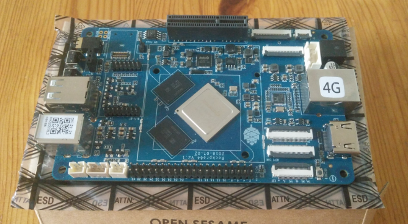

# 机器文摘 第 022 期

## 长文
### 自制家庭服务器

人们常说，中年技术男的最终归宿除了钓鱼和盘核桃之外，还有一项就是折腾家里的服务器，这些服务器形态各异，但是作用都是殊途同归：NAS、软路由、虚拟化、Docker容器。

怎样变着花样搭建家庭服务器几乎是 V 站的月经甚至日经话题。

这里有个国外的老哥，决定使用 ARM64 架构自己“装配”一个，是那种需要焊接的“装配”。

有兴趣的可以翻阅一下这篇[《构建 ARM64 家庭服务器》](https://jforberg.se/blog/posts/2023-02-19-rockpro64/rockpro64.html)。

文章介绍了如何用一种较为困难的方式构建一个 ARM64 架构的家用服务器。

作者使用了一块名为 ROCKPro64 的开发板，并详细介绍了构建过程中遇到的问题以及如何解决这些问题。

文章中包含了安装基础操作系统、配置网络连接、设置磁盘阵列和安装各种软件的详细步骤和指导，涵盖了从硬件到软件的多个方面。

在构建过程中，作者提到了一些常见的问题和解决方法，例如如何处理不同操作系统的差异，如何在开发板上设置固件，以及如何解决硬件不兼容问题。

总之，这篇文章是一份详细的指南，可以帮助有兴趣构建自己的家用服务器的读者了解基础知识，克服可能遇到的问题，并学习如何从头开始构建一个高效、安全的服务器。
> 上面这段是让 chatGPT 帮我写的 :)

### 用Rust写一个大小仅有2K的极简FPS游戏

极简渲染器的编写教程网上有很多，但大都浅尝辄止，以静态渲染为主。

[这篇文章](https://grantshandy.github.io/posts/raycasting/)则从制作一个第一人称射击游戏的视角出发，讲解了怎样使用光线投射技术实现最基本的三维空间渲染、光照、阴影等效果。

作者使用 Rust 语言基于 wasm 技术编写了一个在网页中运行的示例程序，该程序非常小巧，但是也充分展现了如何使用光线投射算法来实现 3D 渲染技术仲的一些基本概念，比如：墙体贴图、视角控制等。

是我看到的教程里比较系统的一个，适合作为爱好者去研究。

### 玩具 CPU 模拟器

国外一个大学老师觉得他的计算机组成原理课程有些枯燥，于是他[动手撸了一个 CPU 模拟器出来](https://jimhall.itch.io/toy-cpu)，以帮助学生们更好的理解计算机内部运作原理。

作者在文章里介绍了基本的原理，以及模拟器的各个组件，适合学习底层原理初入门的学生。

另外这个模拟器也基于 MIT 协议进行了开源，文章中附有开源仓库的地址和编译好的可执行文件下载连接。

需要注意的是该程序运行环境为DOS，现在要想体验的话，需要先安装 [DosBOX](https://www.dosbox.com/download.php?main=1) 这个模拟器。

### 不用任何构建系统编写前端代码

比起十几年前，前端开发工程现在已经变得十分复杂。

有次我想写个简单的页面程序，但是却花费了一上午的时间陷入对框架和构建系统的选择上。

后来不得不放弃，改用记事本随便用原生Javascript完成了功能。

[这篇文章](https://jvns.ca/blog/2023/02/16/writing-javascript-without-a-build-system/)的作者跟我有同样的感受。

作者认为，对于一些简单的项目来说，使用构建系统可能是不必要的。

因为构建系统会增加开发和维护的复杂性，而且可能会导致一些性能问题。

文章演示了作者如何使用原生的Javascript和浏览器的开发者工具来实现一些常见的构建系统功能。

## 资源
- [计算机知识笔记](https://github.com/CyC2018/CS-Notes)，一个计算机科学知识笔记仓库，包括计算机基础知识、编程语言和算法、开发工具、面试笔试题目等等，是一个非常实用的笔记库。目前在 Github 上有超过 162k 个 star 。
  
- [Creating Demos](https://www.hugi.scene.org/online/hugi31/hugi%2031%20-%20index%20coding%20corner.htm)，这套教程是 [Hugi 杂志](https://en.wikipedia.org/wiki/Hugi)在2001年第31期发布的一系列编程文章，主题是“Demo程序”的制作，是我目前在网络上见到的比较完整和耐心的一套讲解 Demoscene 如何制作的教程。虽然有些技术是老旧的，但是思想一直是不变的，能够学到很多平时很难了解到的东西，现在很少有人愿意分享这些了。
  
- [网络视频下载器](https://github.com/iawia002/lux)，一个 go 语言编写的网络音视频资源下载工具，类似 youtube-dl，但是支持的网站要更多一些。
  
- [ambient](https://www.ambient.run/ )，Ambient是一个使用 WebAssembly、Rust 和 WebGPU 技术构建的高性能多人游戏和3D应用的开源引擎。特点是针对构建多人游戏开发进行优化支持。
  

## 订阅
这里会隔三岔五分享我看到的有趣的内容（不一定是最新的，但是有意思），因为大部分都与机器有关，所以先叫它“机器文摘”吧。

喜欢的朋友可以订阅关注：

- 通过微信公众号“从容地狂奔”订阅。

- 通过[竹白](https://zhubai.love/)进行邮件、微信小程序订阅。

