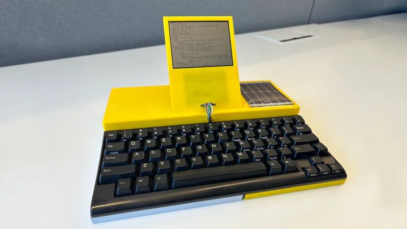
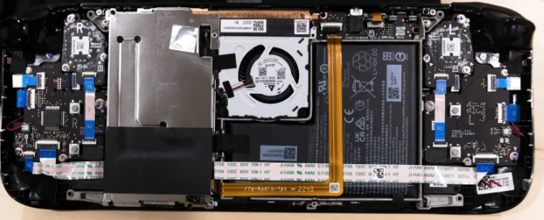
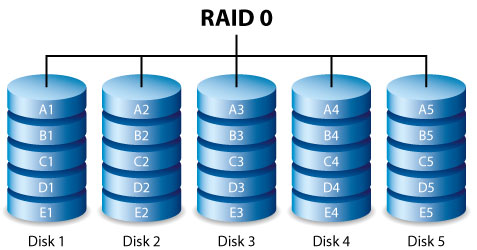
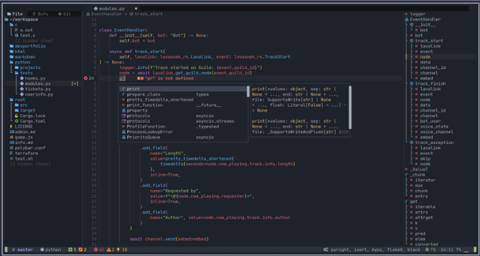
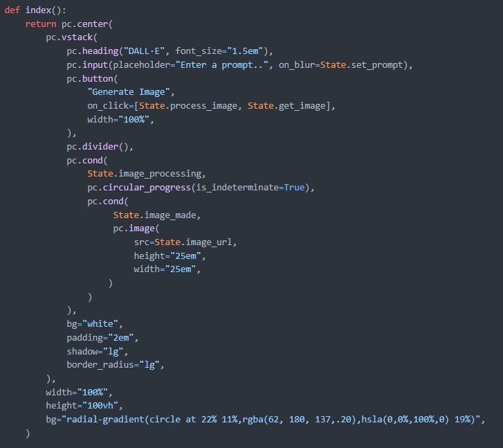
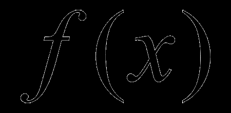

# 机器文摘 第 024 期

## 长文
### 电池充一次可以用两年的“笔记本”电脑

挪威软件开发商安德烈亚斯·埃里克森（Andreas Eriksen）组装了一款笔记本电脑（或者说便携膝上型电脑？）。

它拥有“以年为单位的电池寿命”，并且使用用Lisp编程系统界面，产品名为：[PotatoP](https://www.hackster.io/news/andreas-eriksen-s-potatop-is-a-lisp-powered-laptop-with-a-battery-life-measured-in-years-2f5d79653f24)。

CPU好像是个ARM架构的低功耗单核处理器，最高频率96MHz。

支持蓝牙5.0。

运行的系统为PotatOS，一个基于[uLisp](http://www.ulisp.com/)（一个专门为微控制器设计的Lisp）移植的专用系统。

使用的4.4英寸显示屏采用介于LCD和墨水屏之间的技术，省电。

再加上机身上还带有太阳能电池，据说如果环境光充足的话，可以连续运行两年。

### 详解 AMD 为 Steam Deck 开发的 APU

Steam Deck 无疑是一款革命性的掌机。

如果不是价格在国内被炒的离谱，我定会入手一台，也许再观望一下等待第二代或者三代产品更好。

这款掌机使得在便携设备上游玩3A大作不再是幻想。

取得这样的表现，除了得益于V厂魔改的Linux系统之外，还离不开这块由AMD定制的、代号“梵高”的 APU。

这篇[《“梵高”AMD的Steam Deck APU》](https://chipsandcheese.com/2023/03/05/van-gogh-amds-steam-deck-apu/)详细介绍了这块APU的各种技术细节，解释了为什么Steam Deck可以做到低功耗的同时还拥有相当给力的图形性能。

### 用磁盘阵列（RAID）确保数据安全靠谱吗？

再谈谈 NAS 的事情（中年技术男的三大爱好之一）。

像我这样的人，对于 RAID 磁盘阵列总是抱有美好的幻想。我们认为，只要将数据存放在经过合理规划的磁盘阵列中（例如 RAID 5），我们就可以高枕无忧，确保数据永远不会丢失。然而，实际上，磁盘阵列并不是备份数据的最佳选择，最佳的数据安全策略是异地多份存储。

尽管 RAID 5 宣称随便损坏一块硬盘也不要紧，只需更换一块正常盘即可，但这种理想状态可能不太容易实现，中间随时可能会出现其他状况导致数据永久丢失。

一篇名为[《差点儿就又全没了》](https://www.ucmadscientist.com/almost-lost-it-all-again/)的博文，讲述了作者在使用 NAS 磁盘阵列时经历了一次惊险刺激的数据拯救过程。希望这篇文章能够给计划使用类似方式保存数据的朋友们一个平常心态。

## 资源
- [NESFab](https://pubby.games/nesfab.html)，一个专为开发任天堂8位游戏机（NES、FC）设计的编程语言。具有高性能、易于装载资源、自动内存地址切换等特性，作者还在主页提供了一个使用NESFab开发游戏的教程。
  
- [AstroNvim](https://github.com/AstroNvim/AstroNvim)，一套即开即用的Nvim配置文件，主打界面美观，集成了文件浏览、代码补全、语法高亮、模糊查询、可视化调试等常用插件配置。对于新手和懒得折腾的人来说，可以尝试。
  
- [pynecone](https://github.com/pynecone-io/pynecone)，一个用python开发的web应用框架，特点是使用python语言完成所有任务，包括前端和后端，可以帮助那些对于前端开发不太擅长的人更方便地制作web应用程序。
  
- [函数式编程入门](https://maryrosecook.com/blog/post/a-practical-introduction-to-functional-programming)，一篇介绍函数式编程的文章，介绍了函数式编程的基本概念和一些重要的函数式编程概念，并使用Javascript演示了如何使用这些概念进行函数式编程。
  

## 订阅
这里会隔三岔五分享我看到的有趣的内容（不一定是最新的，但是有意思），因为大部分都与机器有关，所以先叫它“机器文摘”吧。

喜欢的朋友可以订阅关注：

- 通过微信公众号“从容地狂奔”订阅。

- 通过[竹白](https://zhubai.love/)进行邮件、微信小程序订阅。

