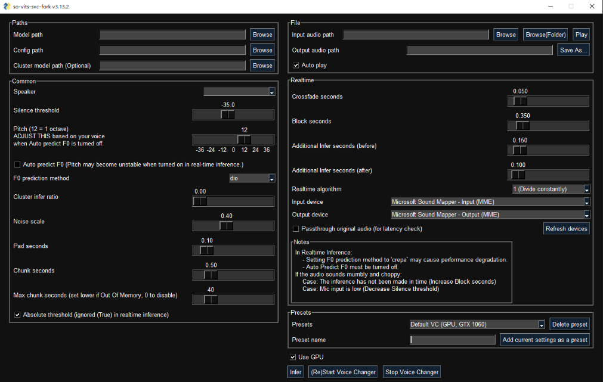
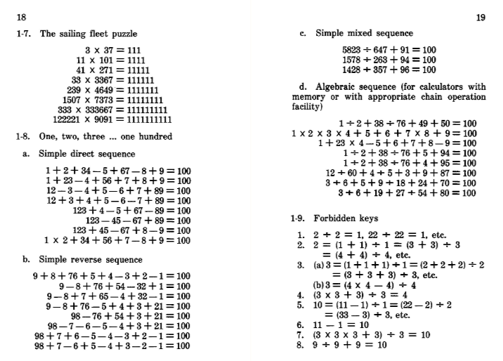
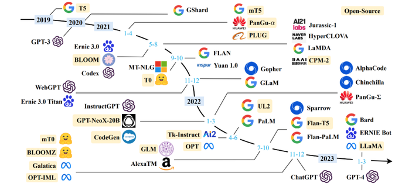
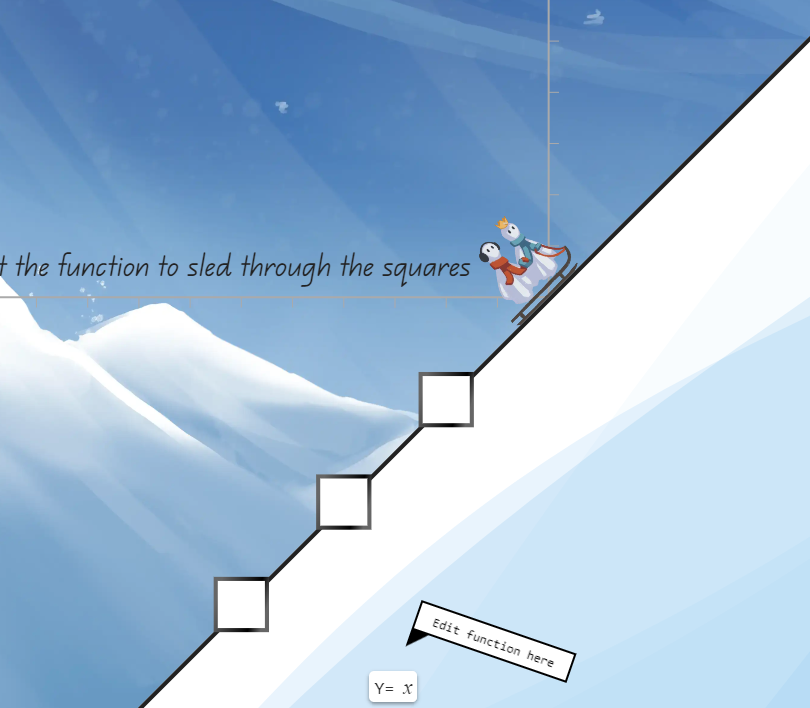
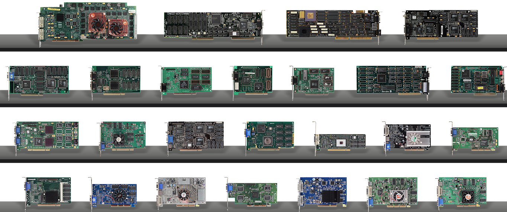

# 机器文摘 第 032 期

## 长文
### AI歌手的训练与使用

最近火了很多AI歌手（即：用AI模型模仿某位歌手的声音），其中b站上AI孙燕姿演唱的《漠河舞厅》、《撒日朗》等歌曲播放已超百万。

为了研究实现原理，我也找到了开源工具体验了一下。

具体步骤主要总结如下：
  1. 选定某一个歌手，找到具有代表性的几首歌曲，通过[Ultimate Vocal Remover](https://ultimatevocalremover.com/)软件利用AI做人声和伴奏的分离，主要用于获取干净的纯人声用于模型训练。（不得不说现在基于AI模型的人声、伴奏分离做的是真的强，可以做到非常干净的提取，让你感觉像是原始独立的音轨）。
  2. 通过安装[so-vits-svc-fork](https://github.com/voicepaw/so-vits-svc-fork)这个一体化开源工具进行模型训练，具体方法见[so-vits-svc-fork的Readme](https://github.com/voicepaw/so-vits-svc-fork/blob/main/README_zh_CN.md)，从数据预处理到最后的模型导出和推理都已经做好了，甚至还提供了图形界面。
  3. 继续使用so-vits-svc-fork提供的gui界面进行操作，将模型载入，将预期修改歌曲的原唱人声（提取方式同第1步）传入，运行推理获得定制的人声（注意看文档的各种参数）。
  4. 将第3步推理所得干净人声，跟原唱分离的干净背景音乐进行混音合成，即可获得一首新歌曲了。

### 怎样用口袋计算器玩耍

在移动互联网时代，人打发无聊的方式实在是太多了，视频聊天、阅读各种资讯八卦、观看短视频、手游等等。

功能机的时代，我有印象的打发无聊的事情是手机上的贪食蛇、发短信、wap资讯等等，也算不错了。

如果时间来到上世纪七十年代呢？那个时代的没有随身携带的手机，怎么打发时间？

答案是：如果有一个随身携带的计算器也行，这里有一本书[《How To Entertain With Your Pocket Calculator》](https://archive.org/details/htewypc)，出版于上世纪七十年代。书中花了大量的篇幅介绍了很多种基于数字的游戏，我翻看了一下，我觉得可能得无聊到一定的程度我才能愿意玩书里的游戏。

### LLM的几篇介绍文章

Large Language Model (LLM) 即大规模语言模型，是一种基于深度学习的自然语言处理模型，它能够学习到自然语言的语法和语义，从而可以生成人类可读的文本。
与其感叹以chatGPT为代表的大语言模型发展太快，不如静下心来，读一读关于LLM的一些基础知识和使用方法，我找了三篇比较有代表性的放在这里收藏。
1. [大语言模型综述](https://github.com/RUCAIBox/LLMSurvey/blob/main/assets/LLM_Survey_Chinese_0418.pdf)，认真地概括并解释了什么是LLM和它的基本原理。
2. [ChatGPT背后的语言模型简史](https://www.bmpi.dev/dev/deep-learning/nlp-language-models/)，从发展历史上捋一捋各种语言模型的辈分。
3. [prompt-engineering-for-developers](https://github.com/datawhalechina/prompt-engineering-for-developers)一个中文版的 Prompt Engineering 教程，翻译自：吴恩达《ChatGPT Prompt Engineering for Developers》课程，主要内容为指导开发者如何构建 Prompt 并基于 OpenAI API 构建新的、基于 LLM 的应用；
4. [大语言模型微调技术笔记](https://github.com/ninehills/ninehills.github.io/issues/92)，记录了基于 LLM 进行微调训练的实战技巧。
  
## 资源
- [sinerider](https://sinerider.com/)，一个很有创意的数学学习游戏，让你通过数学函数构建图像从而帮助画面中的角色到达目标地点。
  
- [map-of-github](https://anvaka.github.io/map-of-github/#0.87/0/16.7)，以节点地图的方式展示Github上面超过40万个仓库，通过虚拟大陆的方式展示他们之间的关系。
  
- [learngitbranching](https://learngitbranching.js.org/?locale=zh_CN)，以交互式游戏的方式学习git命令。
  
- ，在线显卡博物馆，收藏了1982年到2012年之间发布的各款显卡，包括高清图片和规格参数的介绍；
  

## 订阅
这里会隔三岔五分享我看到的有趣的内容（不一定是最新的，但是有意思），因为大部分都与机器有关，所以先叫它“机器文摘”吧。

喜欢的朋友可以订阅关注：

- 通过微信公众号“从容地狂奔”订阅。

- 通过[竹白](https://zhubai.love/)进行邮件、微信小程序订阅。

