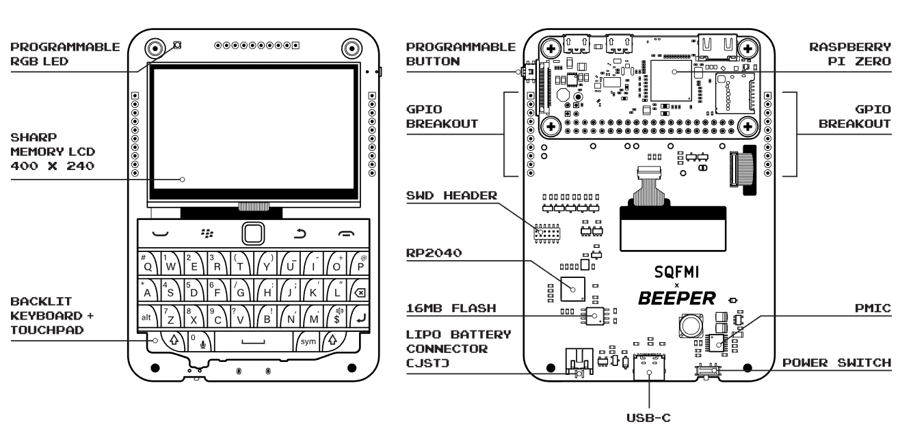
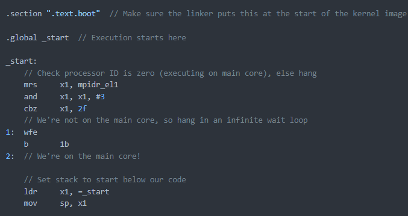
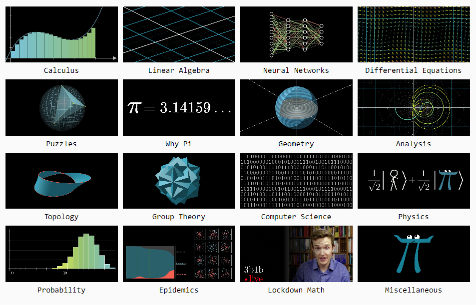

# 机器文摘 第 033 期

## 研究
### 全键盘信息终端

我一直很怀念使用黑莓手机的日子。

物理全键盘的手感比起现在硬邦邦的触摸屏真不知道好到哪里去了。

多少次盯着抽屉里的黑莓尸体，都在想有没有办法再次发挥它的余热。

现在机会来了，有人将树莓派和黑莓手机的全键盘（带触摸板的那一款）结合起来做了一个终端。

取名：[Beepberry](https://beepberry.sqfmi.com/)，具有400*200分辨率的LCD屏幕，和usb type-c接口。

### 自己动手给树莓派写操作系统

学习操作系统的最佳手段是自己动手写一个。

这类教程很多，一般都是针对x86平台，树莓派的比较少见。

[《给树莓派编写“裸机”操作系统》](https://github.com/isometimes/rpi4-osdev)来自github上的一个开源项目。

可以带你从树莓派的硬件层基础上直接构建一个的完整操作系统。

### 关于 Demoscene 制作的一些文章

Demoscene（也称为Demo Party）是一种计算机艺术形式，旨在展示计算机的音频和图形表现能力。Demoscene通常是由小团队制作的演示性程序，也被称为demo，它集计算机程序、音乐、图形和动画于一身，是八十年代初期在个人计算机上发展起来的一种文化和艺术运动。Demoscene的主要目的是展示计算机和程序的美感，通常使用3D渲染和其他复杂的视觉效果，展示计算机的高级图形和音频处理能力。

我对于如何制作这些炫酷的 demo 一直很感兴趣，但是网上关于这方面的资料非常少，成体系的就更少了。

这里收录了一些比较经典的相关资料：
1. [64kb的demos](https://www.ctrl-alt-test.fr/2023/procedural-3d-mesh-generation-in-a-64kb-intro/)介绍了基于SDF（Signed Distance Field，有符号距离场）生成三维网格的方法，这个方法是大部分demo用于在三维场景中产生三维模型的主要方法。

2. [The_Art_of_Demomaking](https://www.flipcode.com/archives/The_Art_of_Demomaking-Issue_01_Prologue.shtml)是一套很系统的教程，讲述Demo的概念、发展历史以及制作过程需要了解的基础知识。

3. [pbr-book](https://www.pbr-book.org/3ed-2018/contents)是一本关于基于物理的渲染（Physically Based Rendering，简称PBR）的经典教材。内容包括计算机图形学相关的基础概念、渲染算法、工作流程和高级特性等。

### 怎样防止针对LLM的prompt攻击

就像之前流行的sql注入攻击，针对大语言模型的提示语注入攻击现在变得也很常见。

一种比较典型的攻击场景是，通过一段特定的提示语，解锁chatGPT原本被封印的能力。

或者对于接入了其他工具接口的语言模型，通过特定的提示语让其执行危险操作（如：删除所有信息）。

这对于使用者来说可能危害不大，但对于服务的提供者是一个不小的挑战。

[《用于构建可以抵抗即时注入的 AI 助手的双 LLM 模式》](https://simonwillison.net/2023/Apr/25/dual-llm-pattern/)提出了一种可能可行的解决方案。

即使用双模型的配置，协同工作，将具有执行危险操作的特权模型放在另一个模型后面，中间使用过滤器进行风险审查，即未被审查的内容永远不会发送到特权模型。

## 资源：
- [gamma](https://gamma.app/)，AI帮你做PPT。支持自然语言描述需要生成的内容，自动给出ppt的大纲和每页基本的排版布局；
  
- [3blue1brown](https://www.3blue1brown.com/)，YouTube上最好的数学科普视频，特点是使用动画直观展示计算原理；
  

## 订阅
这里会隔三岔五分享我看到的有趣的内容（不一定是最新的，但是有意思），因为大部分都与机器有关，所以先叫它“机器文摘”吧。

喜欢的朋友可以订阅关注：

- 通过微信公众号“从容地狂奔”订阅。

- 通过[竹白](https://zhubai.love/)进行邮件、微信小程序订阅。

