# 机器文摘 第 034 期

## 研究
- [图解内存分配](https://samwho.dev/memory-allocation/)，文章展示了 C/C++ 编程中的内存分配过程，包括静态和动态内存分配技术、它们的优势，以及有效的内存管理所需考虑的事项。以图解的形式展示了内存分配过程，希望读者可以通过本文更好地理解内存分配相关的概念，并在实际编程中对内存进行更加高效的管理。
  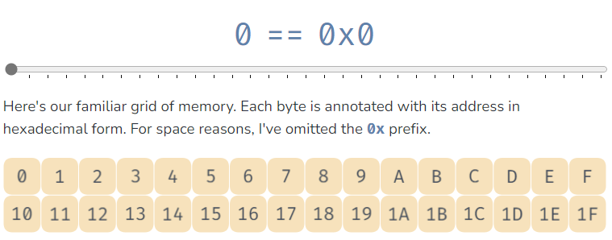
- [文件系统五十年](https://blog.koehntopp.info/2023/05/17/50-years-in-filesystems-towards-2004-lfs.html)，这是一个系列文章，详细记录了计算机文件系统的发展历程。也许我们身在其中无法感受到它的进步，但是回顾历史我们会发现，即便是我们不容易注意到的部分，也在不停地发展和优化。
  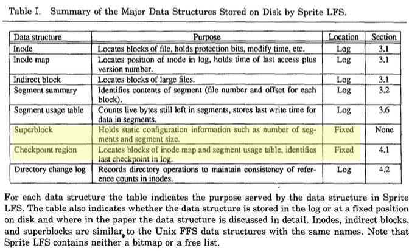
- [只有512字节的C编译器](https://xorvoid.com/sectorc.html)，这篇文章介绍了一个怎样实现最小编译器的思路，SectorC （github） 是一个用 x86-16 汇编编写的 C 编译器，适合 x512 机器的 86 字节引导扇区。它支持 C 的子集，足够大，可以编写真实有趣的程序。它很可能是有史以来最小的C编译器。
  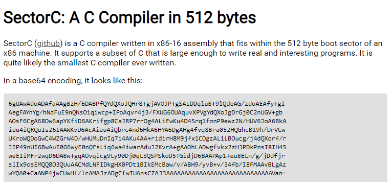
- [上世纪50~60年代的计算机艺术](https://www.amygoodchild.com/blog/computer-art-50s-and-60s)，数字艺术的发展简史。
  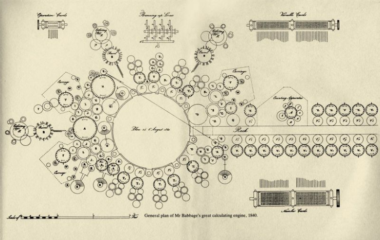
- [win10的隐藏功能]()，原来win10还有这个功能。按Ctrl + Alt + Del 后，按住Ctrl不松，再点击右下角的电源符号，就会进入紧急重启（Emergency Restart）界面。应该是一种强制重启。
  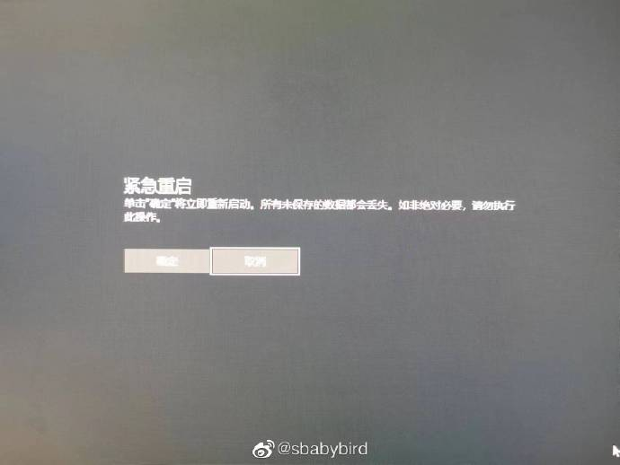

## 资源
- [Ecoute](https://github.com/SevaSk/ecoute)，可用于远程面试作弊的工具？Ecoute 是一种实时转录工具，可在文本框中为用户的麦克风输入（您）和用户的扬声器输出（扬声器）提供实时翻译。它还使用 OpenAI 的 GPT-3.5 生成建议答复内容，供用户“参考”。
  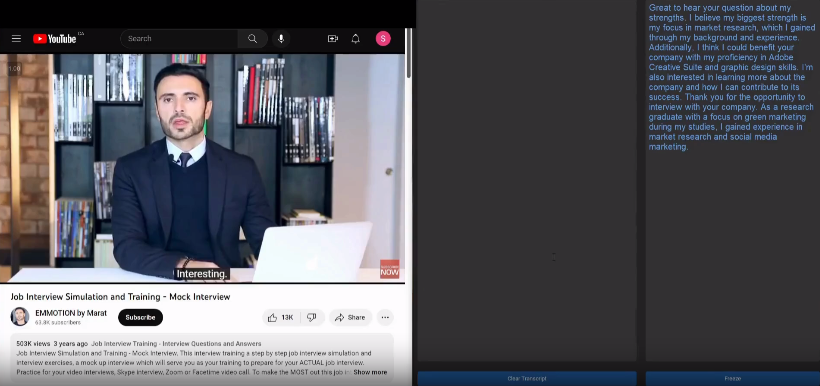
- [rask.ai](https://app.rask.ai/)，自动将视频转成“译制片”，在对内容进行翻译的同时，会尽量保持之前的音色和语调，端到端给你的视频完成多语配音，后续还会推出唇形同步合成。
  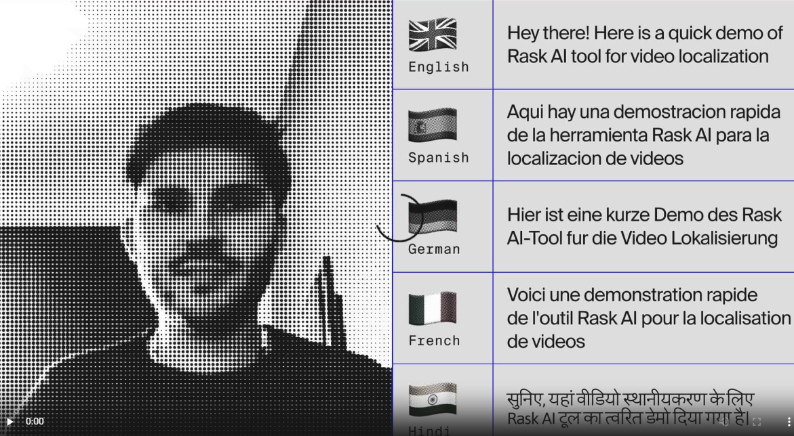
- [Tango](https://chrome.google.com/webstore/detail/tango-how-to-guides-and-s/lggdbpblkekjjbobadliahffoaobaknh)，一个Chrome浏览器插件，能帮你生成一个网站的操作指南。它会自动记录所有的操作流程，并做相应的截图和注解文档。你只需要点一遍就行了。目前还只能生成英文版的，不过自己翻译也不麻烦。可以节省不少时间。
  
- [WebGPU-torch](https://praeclarum.org/2023/05/19/webgpu-torch.html)，PyTroch的webgpu实现。我测试了一下，我的浏览器目前还不支持。
  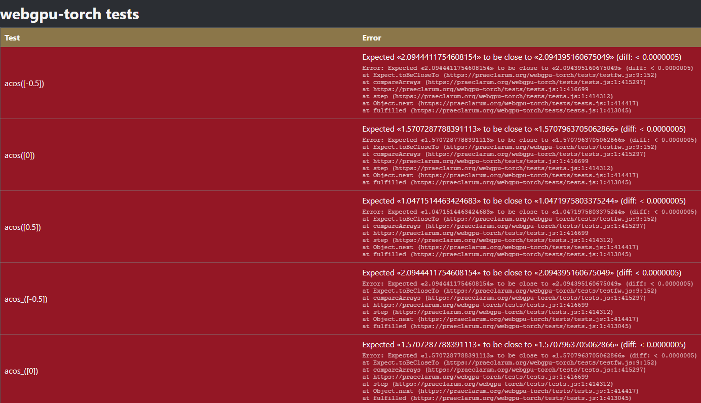
- [basic-english](http://ogden.basic-english.org/)，“基础英语”的概念是：25，000个单词的牛津袖珍英语词典去掉冗余，并消除组合单词，90%的概念可以用850个单词来实现。使用这些基础英语可以简化日常工作和交流。
  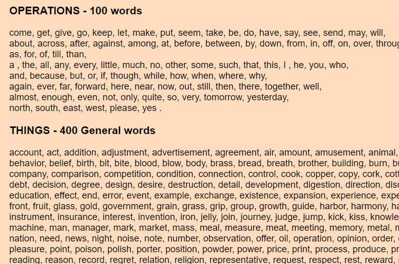
- [Web界面准则](https://github.com/raunofreiberg/interfaces)，讲解如何提升网页界面的交互性、排版、动画、辅助功能、优化和设计。
  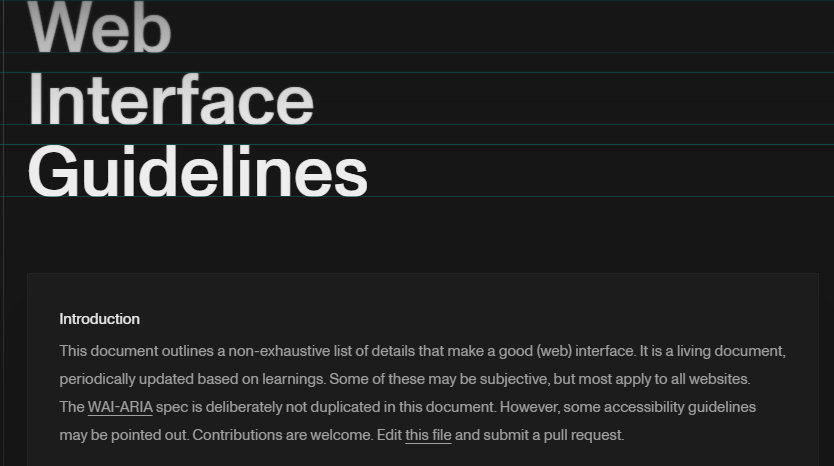
- [excalidraw](https://github.com/excalidraw/excalidraw)，开源虚拟手绘风格白板程序，支持端到端加密在线协作。
  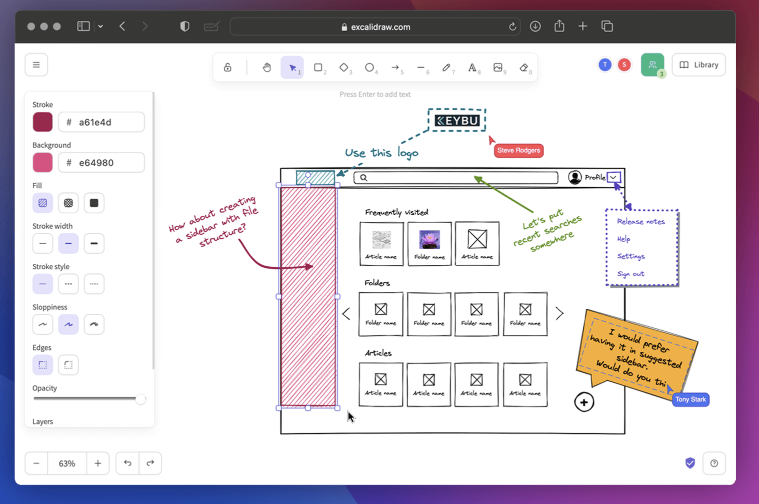

## 沉思录
- 一切商业的本质都是：收购一些东西（包括原材料、人力服务），经过加工（加工过程产生价值）后变成产品或服务出售。这里的原材料可以是实体物品也可以是信息。所以关键动作就是：收、加工、出售，从重要性上来说，出售大于加工大于收。所以如果要策划自己的产品，解决和分析问题的优先级也应如此，我之前想的正好一反；

## 订阅
这里会隔三岔五分享我看到的有趣的内容（不一定是最新的，但是有意思），因为大部分都与机器有关，所以先叫它“机器文摘”吧。

喜欢的朋友可以订阅关注：

- 通过微信公众号“从容地狂奔”订阅。

- 通过[竹白](https://zhubai.love/)进行邮件、微信小程序订阅。

