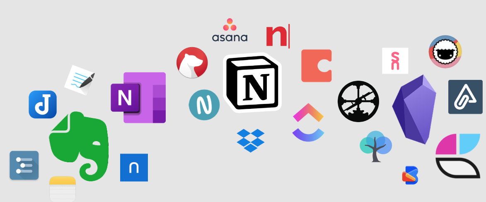
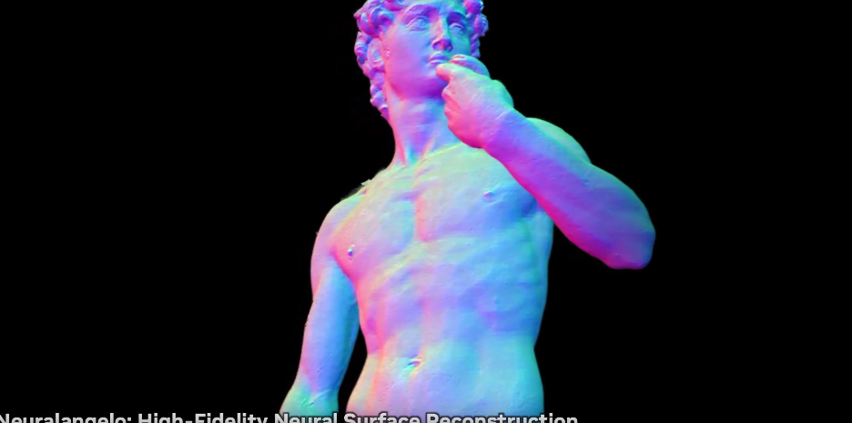
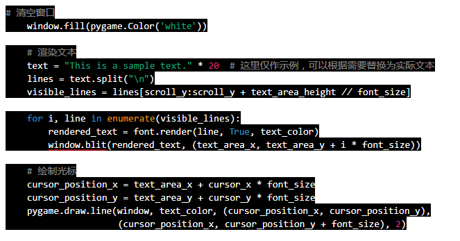
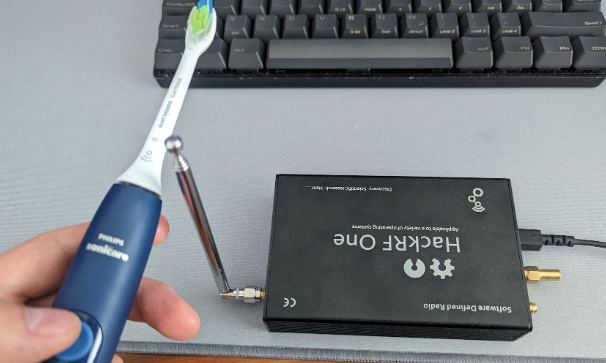
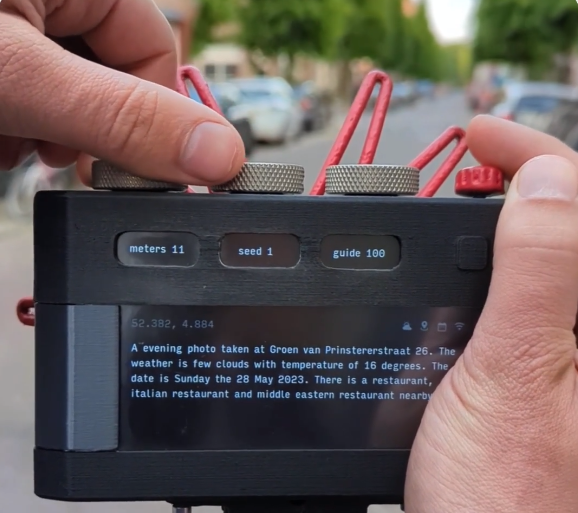
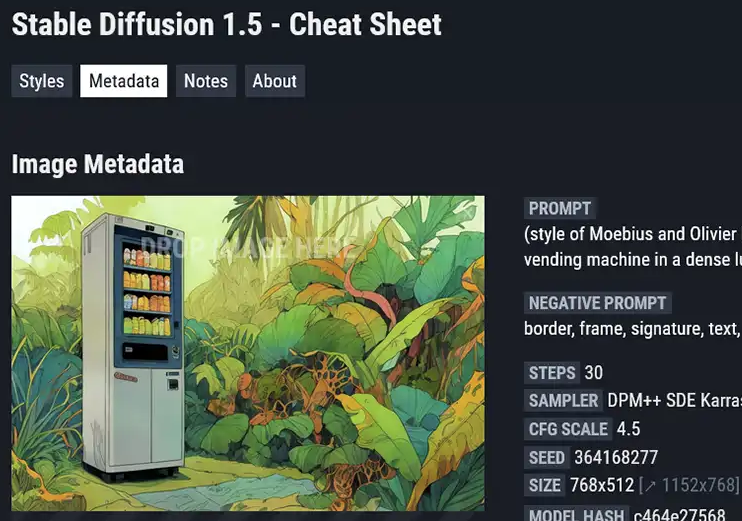
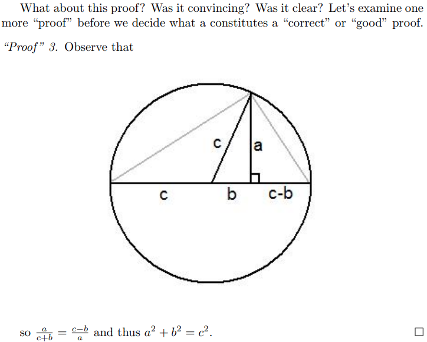
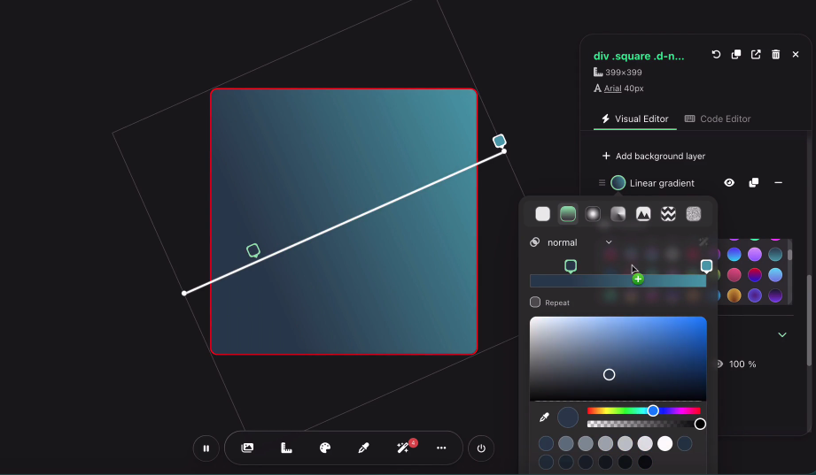
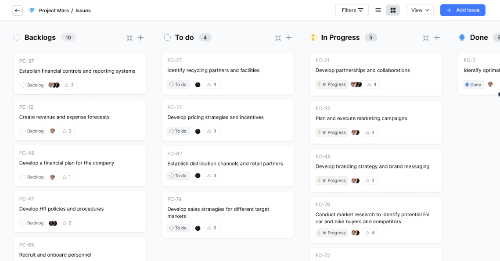

# 机器文摘 第 035 期

## 研究
- [笔记帮我们记住还是忘记？](https://www.reproof.app/blog/notes-apps-help-us-forget)这篇文章讨论了笔记对帮助我们遗忘的作用。作者认为，随着时间的推移，我们无法记住所有的事情，但是只要我们记录了重要的信息，就可以在需要时再次查找，因此笔记实际上帮助我们遗忘。
  
- [高保真神经表面重建](https://research.nvidia.com/labs/dir/neuralangelo/)，Nvidia 新发布的这个 Neuralangelo 有些猛，随便给一个视频就能进行精细3D建模，也许要不多久激光点云技术就要淘汰了。值得关注 ！
  
- [Windows XP 激活算法被破解](https://github.com/Neo-Desktop/WindowsXPKg)， XPKeygen是一个可以随意生成XP有效安装密钥的程序，当前的电脑可能用不到了。不过可能还有一些老旧的设备，只能通过 Windows XP 来操作，这时候这个东西就派上用场了。
  
- [一个整活儿的开源编辑器](https://www.v2ex.com/t/944717)，data:text/html;base64,PGh0bWwgY29udGVudGVkaXRhYmxlPmVkaXQgbWU8L2h0bWw+ 把这个代码粘到浏览器地址栏，竟然是个记事本app，如果从IDE拷贝代码过去，竟然还支持代码高亮。。。。加入到收藏夹即可食用。
  
- [3D打印拯救海龟](https://mymodernmet.com/sea-turtle-birch-aquarium-3d-printed-brace) ，2017年，伯奇水族馆与加州大学圣地亚哥分校图书馆的数字媒体实验室合作。他们一起创造了一种首创的3D打印支架，以固定她的外壳上的缝隙。现在，六年后，这种生物及其照顾者继续从这项发明中获益。这只海龟最近接受了年度检查，健康状况良好。
  
- [破解“智能”牙刷](https://kuenzi.dev/toothbrush/) 国外一个博主记录了他破解自己的电动牙刷的过程。由于牙刷的NFC芯片采用的加密方式是密码加密，并且在通讯过程中是用了明文传递，所以他采取了截获通讯信号的方式窃听到了密码，然后就解锁了各种姿势开始为所欲为了。。。
  
- [真·AI相机](https://bjoernkarmann.dk/project/paragraphica) ，paragraphica 是一个没有镜头但是却有物理实体的“AI相机”，使用位置、时间等参数数据生成特定地点和时刻的prompt，然后由人工智能来生成“照片”。 
  

## 资源
- [Droa](https://www.dora.run/ai)，一个通过自然语言进行网站开发的工具，你只需要提需求，剩下的交给AI。
  
- [StableDiffusion-CheatSheet](https://github.com/SupaGruen/StableDiffusion-CheatSheet)，经常用 Stable Diffusion 进行 AI 绘图的，可以看下这个开源速查表。里面拥有超过 700 种经过测试的艺术风格，可快速搜索查找各类艺术家，并支持一键复制 Prompt。
  
- [你一直想知道的关于数学的一切](https://www.math.cmu.edu/~jmackey/151_128/bws_book.pdf)，此书是CMU数学科学系的博士生布兰登·W·沙利文撰写的，旨在引导读者进入抽象数学和证明写作的世界，帮助培养读者的数学思维和表达能力。主题涵盖集合、逻辑、归纳法、关系、函数、基数和组合数学等基础和工具。暂未有中文翻译。
  
- [Python进阶](https://github.com/eastlakeside/interpy-zh)，是《Intermediate Python》的中文译本。2021最新目录版，实时更新托管在[GithubPages](https://py.eastlakeside.cn)。
  
- [CSSPro](https://csspro.com/)，一个所见即所得的在线CSS可视化开发工具，直接在页面运行，那里修改点哪里。效果真的很惊艳。
  
- [Plane](https://github.com/makeplane/plane)，开源版 JIRA ！不少软件开发者都使用JIRA进行缺陷管理，JIRA确实很强大，也很好用。现在，开源版的来了，据说完全可以作为JIRA的平替。
  
- [机器学习系统：设计和实现](https://openmlsys.github.io/index.html)，一本关于机器学习的电子书，本书希望做成世界上第一本全面讲述机器学习系统知识的开源书籍。可以看作一门衔接机器学习和计算机系统的课程 ​​。
  
- [Callanie](https://callannie.ai/)，练习英语口语的AI对话机器人，支持国内手机号注册，免费且流畅。后端基于大语言模型，可以陪你聊各种话题。
  

## 订阅
这里会隔三岔五分享我看到的有趣的内容（不一定是最新的，但是有意思），因为大部分都与机器有关，所以先叫它“机器文摘”吧。

喜欢的朋友可以订阅关注：

- 通过微信公众号“从容地狂奔”订阅。

- 通过[竹白](https://zhubai.love/)进行邮件、微信小程序订阅。

