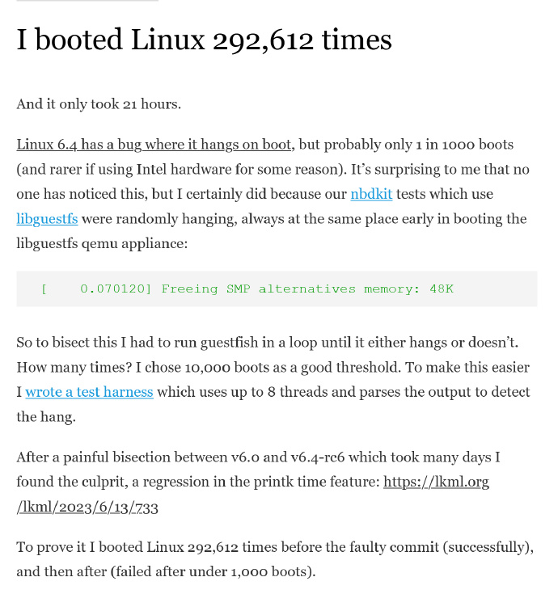
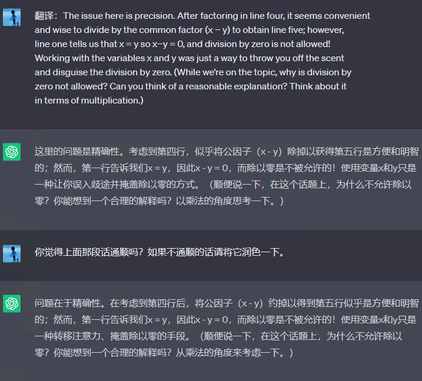
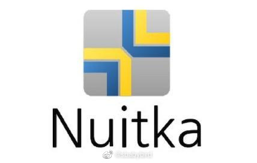
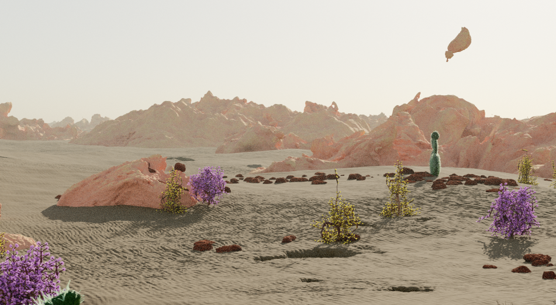
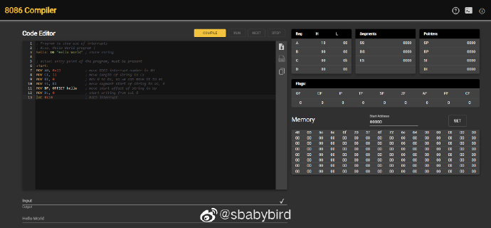

# 机器文摘 第 037 期

## 研究
- [SnapFusion](https://snap-research.github.io/SnapFusion/) 文本到图像的扩散模型可以从自然语言描述中创建令人惊叹的图像。然而，这些模型很大，需要高端 GPU 在服务端运行模型。SnapFusion提出了一种通用方法，可以在移动设备上运行的文本到图像扩散模型，且出图时间不到2秒。
  
- [Framer](https://framer.com/ai) 发布了 AI 工具，直接根据文字需求生成页面，我试了一下，对于个人博客、产品介绍页面等静态展示类型的页面，生成的效果还是十分理想的，而且同步提供桌面端和移动端页面。
  
- [比`#ffffff`还“白”的“超级白”](https://notes.dt.in.th/HDRQRCode)，这里有网友介绍了一个方法，可以显示更高对比度的二维码（以方便用户扫描识别），据说白的程度超出了sRGB颜色范围，前提是你的显示设备支持HDR。作者的思路是用一段HDR视频在网页中伪装成显示二维码的图片。
  
- [我在21小时内重启系统29万次](https://rwmj.wordpress.com/2023/06/14/i-booted-linux-292612-times/)，Linux 6.4内核有一个bug可能导致启动时挂起，但概率很低。为了复现bug，Richard WM Jones重启了29万次电脑，最终找到了问题。这让我想起了之前修改不容易复现Bug的艰辛。
  
- 我发现一个用chatGPT翻译整段文字的小技巧，那就是在他翻译完成之后，再将这段话发给他，让他根据通顺程度和合理性进行二次润色，出来的结果就好很多了。
  
- Python写代码很爽，但是想打包发布成果的时候就稍微麻烦一些了，毕竟一大堆环境依赖和包依赖。我之前一直用的是PyInstaller作为打包工具，但是现在我又发现了这个[Nuitka](https://github.com/Nuitka/Nuitka)。它的打包原理是：直接把 Python 代码转成 C 代码再编译，这样打包出来的成果占用小、执行效率也高，尤其适合PyQt编写的桌面程序。另外，著名的 Blender 就是用 Nuitka 编译的。
  

## 长文
- [你买的每样东西都需要支付两次成本](https://www.raptitude.com/2022/01/everything-must-be-paid-for-twice/)，这篇在Hacker News上的文章引起我的强烈共鸣。

它提出了一个有趣的观点，我以前从未意识到：

每样东西都需要支付两次成本。

通常，我们只关注第一次支付的成本，也就是购买时花的钱，比如买一台相机、一架钢琴或一本小说。

然而，作者指出，如果你不支付第二次的成本，你之前花的钱就等于打水漂了。

第二次成本指的是，你需要花时间和精力去充分使用你所购买的物品。

比如认真阅读一本书，练习钢琴以提高演奏水平等等。

然而，我们常常只停留在第一次购买时的满足感上，然后追求下一个。

随着时间的推移，大量未支付第二次成本的物品使我们积累了一种无形的债务。

为此经常感到挫败。

这种挫败感促使我们寻求那些能够刺激我们的短期享受，比如玩手机、享用美食。

进一步导致没有时间支付第二次成本。

那么，有什么办法可以改变这种情况吗？

作者说，唯一的解决办法就是控制购买欲望，强迫自己安排时间来履行第二次支付的责任。

尽管这听起来可能有些不舒服，但如果我们能克服这种不舒服的临界点，例如学会一首乐曲，耐心读完一本书，我们将会获得意想不到的奖励时刻。

## 资源
- [ratatype](https://www.ratatype.com)，在线键盘盲打指法练习，有完整的练习教程，从初级到高级都有。有点儿像Dos时代的著名打字练习软件TT，不过是网页版的。
  
- [0A.D.](https://play0ad.com/download)，帝国时代是个经典游戏，这里有个开源版，名字叫做0AD，由Wildfire Games开发，虽然是免费开源的游戏，但是效果和可玩性都非常高，适合在周末的午后来一把怀旧局。
  
- [landing.love](https://landing.love)，一个专门收集各种网页动画效果的网站，目前已收录超过400个具有新颖创意动效的网站，并配有截图和录屏视频。
  
- [infinigen](https://github.com/princeton-vl/infinigen)，一款面向计算机视觉研究的3D场景自动生成器，提供多样且高质量的3D训练数据。基于Blender，免费且开源。可以通过重写随机化的默认参数来完全控制资产生成。提供了对自然界中多种对象和场景的生成器，包括植物、动物、地形以及火、云、雨、雪等自然现象。
  
- [8086-emulator-web](https://yjdoc2.github.io/8086-emulator-web/compile) ，用js编写的的8086 cpu模拟器，支持汇编语言在线编写、编译和调试运行，是一个学习汇编语言和理解计算机原理的好工具。
  

## 订阅
这里会隔三岔五分享我看到的有趣的内容（不一定是最新的，但是有意思），因为大部分都与机器有关，所以先叫它“机器文摘”吧。

喜欢的朋友可以订阅关注：

- 通过微信公众号“从容地狂奔”订阅。

- 通过[竹白](https://zhubai.love/)进行邮件、微信小程序订阅。

