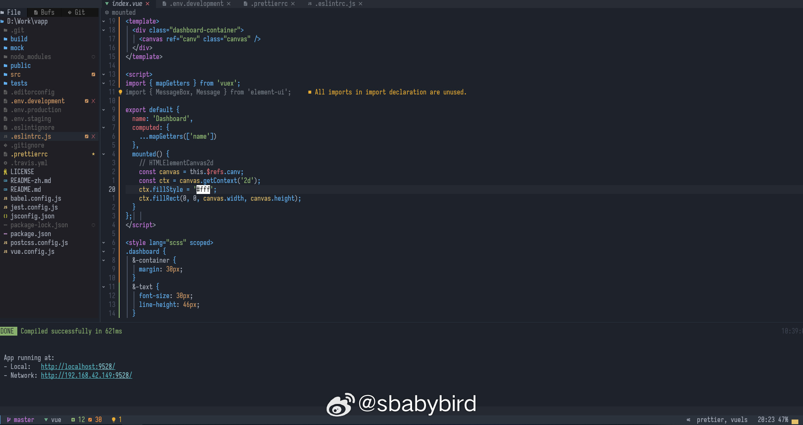
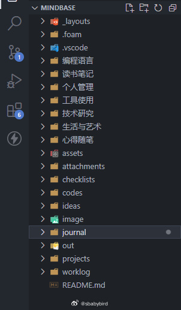
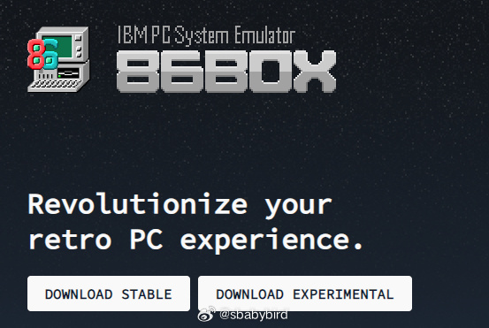
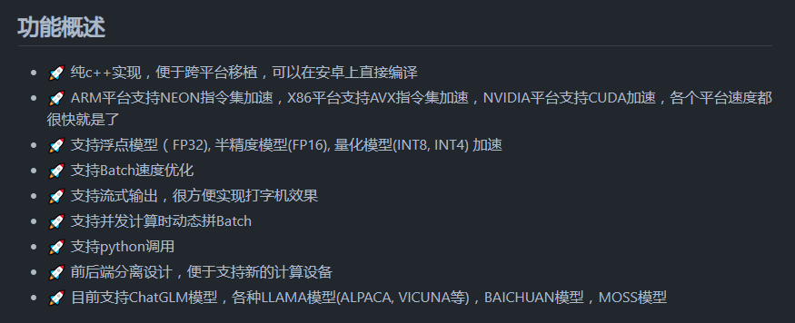
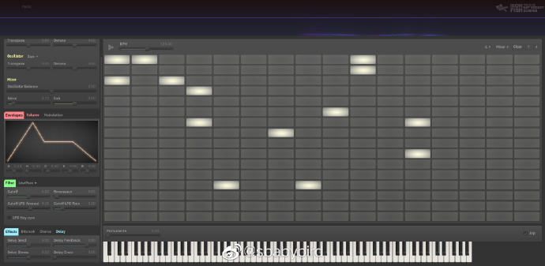

# 机器文摘 第 040 期

## 长文
### 前端代码检查插件`ESLint`和美化插件`Prettier`的冲突

在使用VSCode等现代化编辑器进行前端开发的时候，很多工程样板都默认开启了代码检查和自动格式化的功能，其中以 ESLint 插件和 Prettier 插件为主。

之前有一阵子我总是困惑这两个插件的区别，甚至如果配置不好的话，还会有冲突。

比如 Prettier 插件会在你保存源码的时候按照既定规则进行“美化”代码，如去除行尾分号、增加表达式中的空格等等。此时如果ESLint插件的规则配置不同的话，编辑器就会报错并提示要进行“修复”，然而就在你“修复”之后，刚`Ctrl+S`保存之后，又傻眼了，因为 Prettier 又对代码进行了“美化”。

我周末特意花时间研究了一下，梳理了一下这两个插件的关系以及他们的分工。

首先，他们的职责定位不同：ESLint 用于检查代码编写是否符合某种预定义的规范，可以进行十分详尽的配置和多项检查，比如定义的变量如果未使用可以作为一种警告或者错误，其职责定位以检查为主。而 Prettier 的职责侧重于格式化（美化）代码，对于编写代码的样式如 tab 缩进量、行尾要不要分号、字符串用单引号还是双引号等可以进行统一格式化，一般用于在代码保存的时候进行快速统一样式。

所以两者可以配合使用，但开头提到的规则冲突需要注意。

我个人的习惯是，将两个插件的配置文件里的配置项进行匹配（规则调整为一致），因为我在美化时关注的项并不太多，所以编写这两个配置文件不算费劲。

而网上有人提出了更好的办法，即通过扩展插件的方式，使得 ESLint 自动获取 Prettier 的规则，以自动统一两者的行为。

[关于 ESLint 和 Prettier 的具体分析文章和操作建议可以看这一篇文章：](https://rileycai.com/不以规矩，不能成方圆-彻底搞懂-eslint-和-prettier/)

### 说一说我现在的知识管理工具和流程

Hacknews 上有网友说[Evernote几乎辞退了它的所有员工](https://news.ycombinator.com/item?id=36609641)，才想起来我已经有好几年没用过 Evernote 了。之前大概有将近十年的时间都在使用Evernote（但都是免费用户）。主要使用场景是记录个人的工作日志和借助浏览器插件剪藏一些值得收藏的文章。

后来随着 Evernote 的限制越来越多，体验逐渐下降。我就迁移到了使用纯文本作为知识记录载体的路线上了。

期间使用过 Emacs 的 org 模式，也尝试过 vim 的 wiki 插件，最后选择了现在这个 VSCode + GitHub 的方案，已稳定使用了两年时间。

具体流程如下：
1、使用 VSCode + [foam](https://foambubble.github.io/foam/) 、[MarkdownAllinOne](https://marketplace.visualstudio.com/items?itemName=yzhang.markdown-all-in-one) 等插件实现对 Markdown 的高效编辑，可以实时预览排版效果，foam实现了类似 [Obsidian](https://obsidian.md/) 的文章双向链接和知识关系图谱。我主要使用 Markdown 记录日志和编写知识卡片用于存放个人吸收的信息。
2、所有内容存放在一个 git 仓库中，同步到 GitHub 上的个人私有仓库，这样可以省去对接网盘的麻烦。
3、对于互联网上阅读到的有用文章，使用浏览器插件 [Web Clipper](https://microsoftedge.microsoft.com/addons/detail/web-clipper/opejamnnohhbjflpbhnmdlknhjkfhfdp)，可以完整的抓取页面内容到指定的后端存储，这个插件我最喜欢的点是它可以将文章抓取到你指定的GitHub仓库，并作为Issue提交。
4、来不及看的信息就先抓取到 Issue ，然后等有时间进行整理，形成自己的知识卡片后再关闭该 Issue 。

这套工具及流程的优点：
1、完全免费，不产生任何费用，而且体验不亚于收费软件。
2、自由度高，存储后端可以自己随意选择，如果嫌 GitHub 麻烦的话，可以自己用网盘同步文件夹。
3、纯文本载体，这个算是优点吧，格式开放，不会存在别的编辑器打不开的情况。
4、数据私有，数据随时都在本地（云端的仅作为备份和同步中转），不用担心 SaaS 供应商跑路（你看现在的Evernote）。

欢迎大家讨论。

## 资源
- [朋友圈截图生成工具](https://github.com/TransparentLC/WechatMomentScreenshot)，可以帮你生成逼真的朋友圈截图，可定制头像、评论、点赞个数等细节。收藏[这个地址](https://akarin.dev/WechatMomentScreenshot/)，以后再也不怕被群里晒孩子的家长或者搞活动的商家逼着发朋友圈集赞了。 ​​​
  
- [86box](https://86box.net/)，老式 x86 架构计算机模拟器，与 Virtualbox 等虚拟化技术不同的是，86box采用纯软件模拟的方式，实现了经典老式 cpu （如 AMD Am486DX4）的各种技术细节，甚至是当时的硬件缺陷（有些老游戏的 hack 需要这些缺陷）。可以完美复现一台上世纪 90 年代的经典 DOS PC ，用来复古怀旧游戏是再合适不过了。
  
- [fastllm](https://github.com/ztxz16/fastllm)，fastllm是纯c++实现，无第三方依赖的高性能大模型推理库（待测试验证）。据宣称：6~7B级模型在安卓端上也可以流畅运行，支持python调用，chatglm-6B级模型单卡可达10000+token / s，支持glm, llmam, moss基座，手机端流畅运行。
  
- [PhotoAI](https://photoai.com)，作者说，他为这个网站大概写了14000行PHP代码，样式全写在了`<style>`标签里，JS全写在`<script>`标签里，除了`jQuery`没用任何框架，就连布局也是使用`float:left`这种老式的浮动实现。然而这个网站确能给他带来每月差不多 *6万刀* 的收入。这是不是在吹牛。这个网站的业务是：使用AI生成完全没有任何版权问题的各种人像照片。
  
- [Ironfish synth](https://makepad.nl/makepad/examples/ironfish/src/index.html)，用rust写的在线合成器，虽然感觉像个 Demo 但完成度很高，音源部分具有两个振荡器（可选正弦波、方波、锯齿波等）和一个噪波通道，滤波器、效果器齐全，另外还有一个可视化音序器。可基于键盘直接演奏。
  

## 订阅
这里会隔三岔五分享我看到的有趣的内容（不一定是最新的，但是有意思），因为大部分都与机器有关，所以先叫它“机器文摘”吧。

喜欢的朋友可以订阅关注：

- 通过微信公众号“从容地狂奔”订阅。

- 通过[竹白](https://zhubai.love/)进行邮件、微信小程序订阅。

