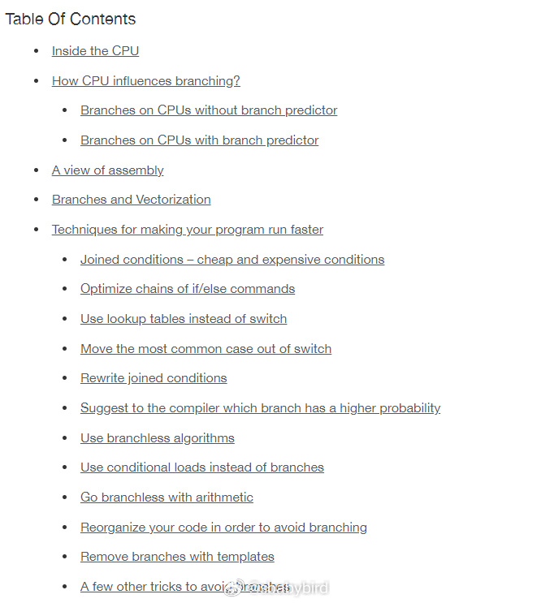
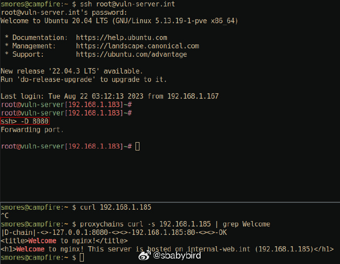
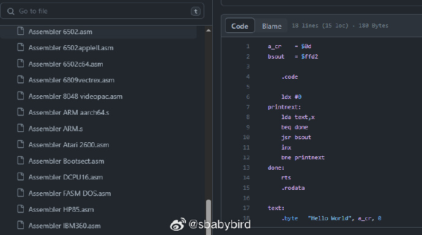

# 机器文摘 第 047 期

## 长文
### 业余爱好者痴迷于工具，专业人士注重技能

[业余爱好者痴迷于工具，专业人士注重技能](https://adamsinger.substack.com/p/amateurs-obsess-over-tools-pros-over)。

> 以原声吉他为例。在数字音乐制作和合成器盛行的时代，这个单独演奏的乐器可能显得有点古老。然而，在熟练音乐家的手中，它变成了一个充满迷人旋律和触动灵魂的载体。它甚至可能为更大的创意提供灵感，如果你直接跳到现代合成器就有可能会错过这些。原声吉他的简单性促使艺术家专注于演奏的细微之处，完善他们的指弹技巧，并通过每一次弹奏传达情感。真正的魔力不在于吉他本身，而在于将其演绎得生动活泼的音乐家的技艺。

这篇文章读来深有感触。

在解决问题的时候，我总是忍不住问自己，我这个方法是最优的吗？我使用的工具是不是最合适/最好的？

这种心理，常常使我陷入对最佳实践和完美工具的追求中，而忘记了解决问题本身。

时间久了，工具积累一大堆，但每个都未曾发挥其真正作用，一边老工具在吃灰，一边继续寻找新工具。

差生文具多。

正如文章中所说：真正的高手明白，应当拿起手里已有的工具，先行动起来。在这个过程中如果有机会创造美好的事物，好的工具自然会出现在眼前。

### CPU 的指令分支预测

现代的 CPU 基本都具有指令分支预测的特性，通过猜测后续会执行的指令分支，提前运行一些指令和设置状态，可以有效利用 CPU 的执行资源，提升效率。

不过，如果预测准确的话效率提升十分明显，但是如果预测错误，CPU 就要多做一些事情（刷新后续预测的指令和相关的状态），随着现代 CPU 中指令流水线越来越复杂，这种代价也变得越来愈大。

在编程的时候，编写一些对于 CPU 分支预测友好的代码，能够对性能产生极大的影响。

这篇[对于 CPU 的分支预测，我们能做什么](https://johnnysswlab.com/how-branches-influence-the-performance-of-your-code-and-what-can-you-do-about-it/)耐心地从 CPU 的分支预测机制讲起，通过具体的代码举例，讲解了怎样让编写的代码对 CPU 分支预测这类优化更加友好。

### SSH 命令详解

[SSH 命令详解](https://grahamhelton.com/blog/ssh-cheatsheet/)，一篇对 SSH 命令的参数介绍十分详细且易懂的文章。

通过举例让我彻底弄清楚了基于 SSH 的端口转发。

另外还知道了可以在已有的 SSH 连接上执行补充命令，以实现不断开终端的情况下将远程主机上的端口转发到本机访问。 ​​​

## 资源
### 开源的房子

[wikihouse](https://www.wikihouse.cc)，是一个开源房屋建造网站，房子的图纸、模型均可从网站上下载，里面有各式各样的房屋建造资料，任何人都可以据此增删、设计、制造、组装自己的建筑。可以理解为建筑界的 github。 
​​​
### 关掉 Edge 浏览器新增的圆角样式

Edge 浏览器的最新更新里，给所有页面强制增加了一个圆角边框，看起来很不习惯（丑陋）。

经过研究，我发现，如果想恢复到之前的样子，可以在设置外观选项里关闭该特性。

我已经关闭，并果断给这个功能特性反馈了负面评价。

### Hello World

[Hello World](https://github.com/leachim6/hello-world) ，这个仓库收录了几乎所有编程语言（997种）的 Hello world 程序。 ​​​

### 前端开发代码大全

[30secondsofcode](https://30secondsofcode.org)。

这个网站有大量可复用的代码片段，主要是 Javascript、CSS、HTML 、Python 等语言的内容，可以覆盖 Web 应用开发全栈。

里面收录的代码段或者文章都很清新，每个都配有细心的解释，具有良好的实用性。 ​​​

### 关于 Win10 的锁屏睡眠时间

我在使用 Windows10 的时候发现一个问题。

无论我将电源设置里的睡眠时间、显示器空闲关闭时间设置多长，锁屏后系统都会在 1 分钟之后关闭显示器。

这会带来一些不方便，并且让人困惑。

在经过一番研究搜索之后，找到了如下解决方案（Windows就是这么喜欢在注册表隐藏设置）：

1、打开注册表编辑器后。

2、定位到：`计算机\HKEY_LOCAL_MACHINE\SYSTEM\CurrentControlSet\Control\Power\PowerSettings\7516b95f-f776-4464-8c53-06167f40cc99\8EC4B3A5-6868-48c2-BE75-4F3044BE88A7`

3、修改右侧的Attributes 数值为2 (初始值为1)

4、再打开“编辑电源计划”时会发现多了一个选项“控制台锁定显示关闭超时。

### 红警2游戏整合包

[红警2 的民间整合包](https://tmioe.com/7991.html)，支持 win7 到 win11。整合大量资源，傻瓜式一键安装。 ​​​

经过我的测试，前面链接页面里提供的安装包里带有额外的广告脚本，在使用时可使用 7z 等压缩软件直接打开该自解压包，选取主文件夹拷贝出来即可。

## 观点
### 隐形的门槛
也许每个领域都存在一个隐形的门槛，无论是你学会一种语言，还是掌握一种能力，哪怕是打通一个游戏，只要你跨不过那个门槛，那么无论你尝试多少次，都会在同样的水平下无功而返。相反，一旦跨过后，那就是一马平川，你有了在那个新世界周游的能力。这当然不是说你不会再遇到困难，而是说，你不再有那种尝试了无数次，带着同一种感受离开的感觉。剩下的区别只是更多经验的积累，是熟练度的问题，因为你已经在那个轨道上了，你已经拿到了入场券。

人生可以被隐喻成一个有着自然消退机制的RPG体系，累积10000经验可以升那关键的一级，那么先前你无论你多少次到达5000，6000，9000都不行，因为熟练度会反复消退到1000，2000的水平。而我知道，很多人就是无数次的卡在了那9000以内，但每次都要从1000，2000这个位置开始。这个和自我接纳也没有关系，因为你知道你遇到的困难并不是基于你对自己的苛求，你的困难在于你无法为自己在乎的事情付出真正的努力，无法将自己的活力与热情持续的灌注在同一个点上，但你隐约知晓跨过那10000的门槛，是你更重要的人生福祉。

来自微博 [@崔庆龙_](https://weibo.com/3762961402/NgprO9HD5)

## 订阅
这里会隔三岔五分享我看到的有趣的内容（不一定是最新的，但是有意思），因为大部分都与机器有关，所以先叫它“机器文摘”吧。

喜欢的朋友可以订阅关注：

- 通过微信公众号“从容地狂奔”订阅。

- 通过[竹白](https://zhubai.love/)进行邮件、微信小程序订阅。

