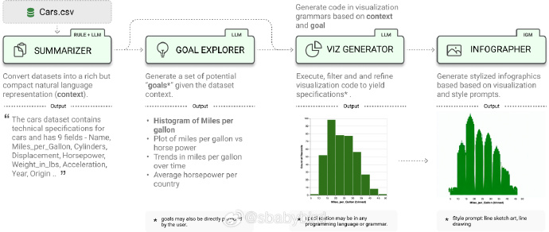

# 机器文摘 第 049 期

## 长文
### 在 Linux 环境里执行 Windows 应用程序

最近遇到一个难以启齿的需求，服务器是 Linux 环境，但是某项服务功能却需要执行一个 Windows exe 文件。 

不得已才想到要求助 Wine 这个经典中间层，据说可以使的 Linux 兼容大部分的 Win32 程序。

但是又不想污染服务器的其他环境，于是选择在容器中运行。

在网上找到了这篇[《利用 Docker 容器和 Wine 在 Linux里运行 Windows 程序》](https://leimao.github.io/blog/Docker-Wine/)，按照文中介绍的步骤成功实现了需求。

基本步骤：
1、根据文章提供的 Dockfile 构建镜像；
2、运行镜像并注意配置运行容器的环境变量；
3、执行所需的 exe 程序。

### Windows 系统是怎样进行引导的

前不久，我在给笔记本更换大容量固态硬盘的时候，由于不愿重做系统，使用了硬盘克隆功能，将原盘整体信息直接克隆到新硬盘。

结果克隆成功并替换安装硬盘之后，却没能正常引导进入 Windows，而是进入了一个类似 PE 系统的界面（猜测是原盘中厂家自制的），并告知我由于检测到硬件更换，拒绝引导，并建议我选择恢复系统。

我猜测之前的隐藏分区可能有笔记本厂家做的一些特定引导程序，才导致这样的情况。

我对系统引导的理解还停留在 MBR 分区表大面积应用的阶段。于是尝试删除了隐藏分区，并手动将系统盘分区设置为了 “激活”分区（事实上这时候已经错了，因为 GPT 分区表方式下无法采用这种引导方式了）。

结果系统干脆直接无法引导。出现这种情况，我之前的知识储备显然不够用了。

经过一番折腾和搜索，我才得知现在 Windows 8 及以上版本操作系统的电脑所采用的方式是 GPT 分区表 + UEFI 引导。

也就是说硬盘上需要单独开辟一个分区存储负责进行操作系统引导的工作。这个分区平时对于操作系统的资源管理器不可见（但磁盘管理中可以看到），由主板上的 UEFI 程序（这个程序可以理解为 BIOS 的升级版）进行访问和管理。

了解这个方式之后，就简单了，重新使用工具修改 GPT 分区并制作专用引导分区即可。

最后，为了弄清这跟之前的 MBR 引导方式有什么区别，我找到了一位运维工程师总结得较到位的文章[《Windows系统开机引导顺序简述及运维小结》](https://zhuanlan.zhihu.com/p/355526135)。

### 500 行代码写一个 C 编译器

[500 行 Python 代码写一个 C 编译器](https://vgel.me/posts/c500/)。

作者立下这个 flag 之后才发现任务有多难。

主要是代码行数太少了，如果使用传统手段实现，可能这点儿代码量还不够写个语法分析器的。

于是作者主动放弃了 AST （抽象语法树）的构建，采用 Token 提取和指令生成“一遍过”的方式，实现了一个相当“简洁”的 C 编译器。

## 资源
### 假装弹钢琴

[touchpianist](http://touchpianist.com/)，在线弹钢琴的网站（也提供手机 App 版），可以让你假装钢琴大师，只需要按键盘上的任意键，旋律就会自动演奏，不过你要控制敲击键盘的速度，以匹配原曲的节奏。我弹了一下，默认曲目是贝多芬的《月光奏鸣曲》，差点儿被自己陶醉了。 ​​​

### Bun V1.0

[bun-v1.0](https://bun.sh/blog/bun-v1.0)，拳打 node ， 脚踢 deno 的 JavaScript 运营环境 bun 推出了 1.0 版本。主打一个“All in one”，号称可以一次性取代一揽子工具：node、npx、npm、webpack、tsc、babel、jest。一个工具包揽了运行、打包、包管理、转译、测试等所有事情，且速度是 nodejs 的 3 倍。

对于这种吹的比较厉害的技术，保持关注，谨慎使用吧。

### 开源基于 LLM 知识库平台

[FastGPT](https://github.com/labring/FastGPT) - 基于 LLM 大模型的 AI 知识库问答系统。提供开箱即用的数据处理、模型调用等能力。同时可以通过 Flow 可视化进行工作流编排，从而实现复杂的问答场景。项目在 Github 开源，采用技术栈: NextJs + TS + ChakraUI + Mongo + Postgres（Vector 插件）。支持 GPT、Claude、Spark、ChatGLM 等多种 LLM 模型。

### 开源基于 LLM 数据可视化平台

[lida](https://github.com/microsoft/lida)，微软出品的数据可视化工具库，特点是基于 LLM 对话模型进行生成，其生成的可视化代码支持多种可视化后端的语法，包括 matplotlib、seaborn、d3等。 ​​​

## 观点
### 编程是一种体育锻炼
编程除了是一种可以以之谋生的专业技能，对于那些真喜欢编程的人来说，它还是一个心理疗愈工具。

编程能使人专注，进入“心流”状态比较容易，也容易让人的心态平和。

编程与体育锻炼一样，都是可以让人受益终生的活动。

----来自[@软件教书匠金旭亮](https://weibo.com/1461522430/NiEh1BHMt)。

### 造成电子阳痿的一种因素
一个不容忽视的因素是现在游戏的加载速度，尤其是 PC 游戏。

我们被碎片化信息惯得一秒钟都不想等待。

每当想玩会儿 CS 或者地平线之类得游戏，光是等待游戏启动、地图加载等就足以让人放弃想玩的念头。

更别提有些游戏还有一些跳都无法跳过得开场引导视频。

所以我现在就算是玩也是偶尔打开模拟器玩一玩老游戏，带有状态存储，随时加载存档。

据说有一部分游戏主机（比如新一代 XBox）有类似笔记本电脑的睡眠功能，开机就玩，随时进入上次未完成的任务。

## 订阅
这里会隔三岔五分享我看到的有趣的内容（不一定是最新的，但是有意思），因为大部分都与机器有关，所以先叫它“机器文摘”吧。

喜欢的朋友可以订阅关注：

- 通过微信公众号“从容地狂奔”订阅。

- 通过[竹白](https://zhubai.love/)进行邮件、微信小程序订阅。

