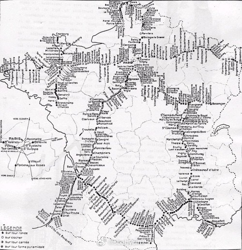
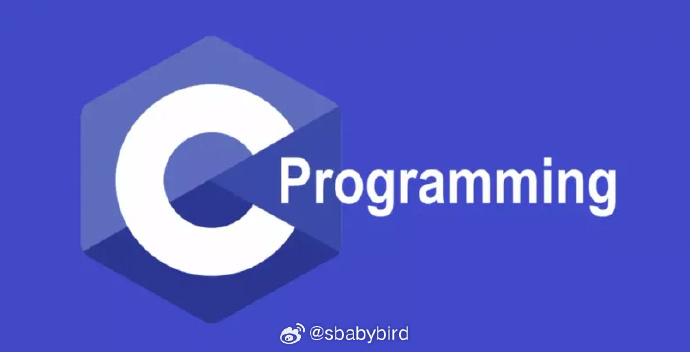
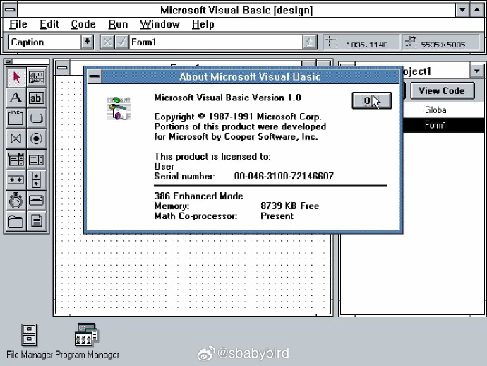
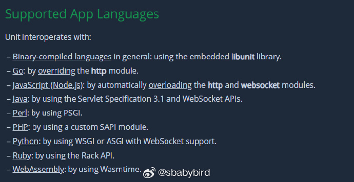
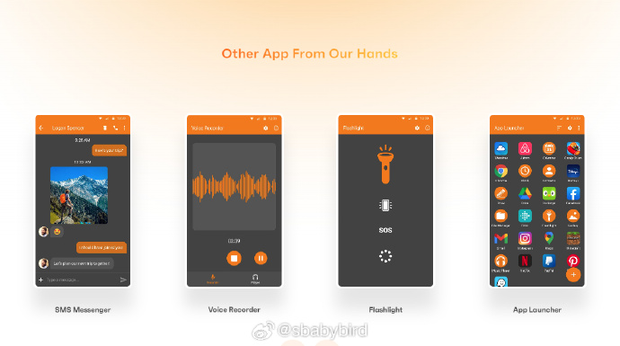
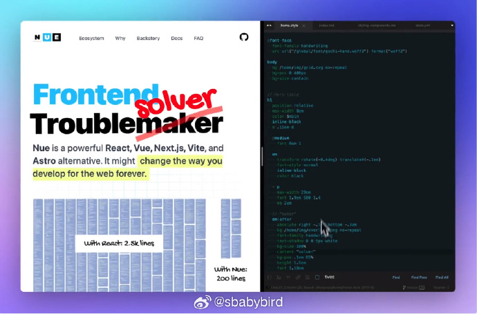
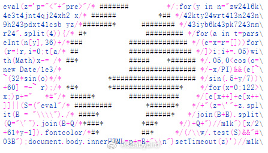
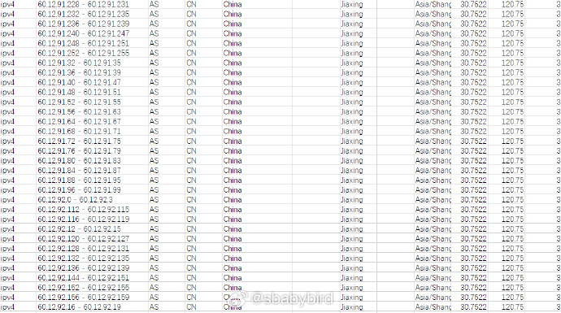

# 机器文摘 第 050 期

## 长文
### 十八世纪的光学电报网络


当年读《基督山伯爵》的时候，有一个让我震惊的科技。

主人公有一项复仇计划是破坏敌人的金融资产。计划采取的手段是收买了一个传递实时信息的人让其传递错误信息。

而具体传递信息的手段是，每隔一段距离设一座瞭望塔，每个塔上有一个人，向一个方向用望远镜观看，远方的上级瞭望塔会有人发射信号弹，一连串的信号弹代表一定的信息，然后这个人再原样发射一遍，让后方的瞭望塔看见。信息就这样一级一级传递下去。

信息经过编码，可以表达股票行情等信息，类似后来的电报系统，但是这是在十八世纪。

读过之后我就一直有疑问，不知道小说是否虚构了这种信息传递技术，直到前几天我发现了这篇文章：[《十八世纪的光学电报网络》](https://www.lowtechmagazine.com/2007/12/email-in-the-18.html)。

里面详细介绍了在两百多年前人类就已经发明了“光学电报”系统，并建立起了巨大的信息网络。信息传递速度达到了惊人的 1380千米/每小时。

### C 语言发展简史


要说 C 语言是计算机历史上最重要的编程语言应该不会有人反对吧。

作为大多数人编程入门的母语，C 语言具有语法简洁、高性能（贴近计算机底层）、使用灵活、适用范围广泛等特点。

虽然诞生于上个世纪 70 年代，但即便是在 2023 年的今天，C 语言仍然排在各大编程排行榜的考前位置，仍然是信息科技的重要支撑力量。

[《C 语言简史》](http://cm.bell-labs.co/who/dmr/chist.html)，由丹尼斯·里奇（C 语言之父）撰写，是一篇难得的介绍 C 语言的诞生和发展的历史性文献。

### VB（Visual Basic）发展简史


前几天 HN 上有个从业近 30 年的老程序员发问：[为什么 VB（Visual Basic）这么高效、好用的开发工具逐渐消失了？](https://news.ycombinator.com/item?id=37470318)。

被顶的最高的网友放出了[《Visual Basic 从诞生到消失》](https://retool.com/visual-basic/)这篇文章。

在上世纪 80 年代末 90 年代初，Windows 操作系统刚刚崭露头角的时候，VB 已经在萌芽状态了。而且已经具有非常先进的组件化、可视化、低代码等超前思想。并且发明了“控件”、“消息触发”等概念。

最初的版本与 BASIC 语言并无关系，只考虑了使用可视化开发并辅助简单的内嵌脚本，但是比尔·盖茨对 BASIC 十分热爱（毕竟那是微软起家的技术），亲自推动了组件化、可视化开发与 BASIC 语言结合，便诞生了 Visual Basic。

得益于超前的可视化开发理念，VB 极大降低了当时开发应用程序的门槛，涌现出一大批开发者。包括当时那些不得不转型给个人电脑开发程序的大型机编程工程师。

这一切在 VB 随着 Visual Studio 发布 6.0 的时候达到了顶峰。

转折点出现在微软为了应对 Java 的威胁而推出 .Net 公共语言运行时的时候，VB 也被纳入到这套体系里，被成为 VB.Net ，扩充了复杂的语法和继承、多态等高级特性。

对于那些真正喜欢 VB6 的人来说，这些都是唯恐避之不及的东西，更糟糕的是新的 VB.Net 无法兼容之前的代码，大量成果移植困难。

之后更是随着网络信息科技的发展，Web 编程逐渐取代了 Windows 桌面编程，VB 这个伟大的技术，被淘汰也就是顺其自然的了。

### 一个在网页里模仿 Excel 表格的故事


[一位前端工程师，讲述了他在 2016 年受雇于 Uber（优步）时的一些开发往事](https://websheets.github.io/websheets/demo/)。

作为服务于数据工程师的内部研发团队，他所在的小组主要是给公司的数据分析人员提供内部工具，以便让他们能够更快地分析数据，更快的分析数据意味着更有可能在产品运营竞争里获胜。

然而数据分析人员总是抱怨工具不满足要求，主要是操作界面，因为他们非常习惯“Excel”，每次提需求的时候总是说：“你就做得跟 Excel 一样就行”。

作者最开始还试图跟用户解释要实现起来是多么困难，后来逐渐放弃了挣扎，并开始着手在网页里实现一个跟 Excel 一样的表格，而且他竟然实现了。

故事的后来有些伤感，作者提供的工具并没有使得 “Uber” 在跟嘀嘀的竞争中胜出，相反地，“Uber”在中国的业务还被“嘀嘀”收购了。

被用于数据分析的工具也被抛弃不再使用。

后来作者选择了将那个像 Excel 的表格代码放在了 [Github 进行开源，地址在这里](github.com/WebSheets/websheets)。

## 资源
### 通用 Web 应用服务器


[NGINX Unit](https://unit.nginx.org/)，通用 Web 应用服务器。是一个轻量且多功能的应用运行时，作为一个单一的开源服务器，它提供了您的 Web 应用程序所需的基本组件：运行应用程序代码（包括 WebAssembly）、提供静态资源、处理 TLS 和请求路由。

Unit 是由 NGINX 团队成员从零开始创建的，以在运行时高度高效且完全可配置。最新版本是 1.31.0，于 2023 年 8 月 31 日发布。

### 绿色安卓 App 合集


[绿色安卓app合集](https://www.simplemobiletools.com/)。

这个网站收集了一大批良心 app，全部没有广告且不要求隐私权限。

几乎涵盖了日常使用的所有类型，包括艺术绘画、音乐播放器、笔记、文件管理、录音、拍照等。 ​​​

### nuejs


[nuejs](https://nuejs.org/)，越来越多的人对前端开发的混乱感到不满了。不同的是有人选择抱怨，有人撸起袖子开干。nuejs 的作者觉得现在使用 React、Vue 等框架再加上若干服务端渲染框架，使得前端开发生态变得越来越复杂和掌握。于是自己动手开发了一个简单的轻量化框架，终极目标是构建一个简洁、高效的前端开发生态。

### 1024 字节的网页，可显示 3D 地球


[1024 字节的 JavaScript，在网页中显示动画 3D 地球模型](https://aem1k.com/world/)，页面动画显示的就是其源代码。

```js
.<script>
eval(z='p="<"+"pre>"/* ,.oq#+     ,._, */;for(y in n="zw24l6k\
4e3t4jnt4qj24xh2 x/* =<,m#F^    A W###q. */42kty24wrt413n243n\
9h243pdxt41csb yz/* #K       q##H######Am */43iyb6k43pk7243nm\
r24".split(4)){/* dP      cpq#q##########b, */for(a in t=pars\
eInt(n[y],36)+/*         p##@###YG=[#######y */(e=x=r=[]))for\
(r=!r,i=0;t[a/*         d#qg `*PWo##q#######D */]>i;i+=.05)wi\
th(Math)x-= /*        aem1k.com Q###KWR#### W[ */.05,0\
x;)p+="   *#"/* b.        OQ####x#K           */[e[x++]+e[x++\
]]||(S=("eval"/* l         `X#####D  ,       */+"(z=\'"+z.spl\
it(B = "\\\\")./*           G####B" #       */join(B+B).split\
(Q="\'").join(B+Q/*          VQBP`        */)+Q+")//m1k")[x/2\
+61*y-1]).fontcolor/*         TP         */(/\\w/.test(S)&&"#\
03B");document.body.innerHTML=p+=B+"\\n"}setTimeout(z)')//

```

### 全球 IP 地址地理位置数据库


[全球 IP 地址 地理位置数据库](https://ipapi.is/geolocation.html)。含 IPV4 和 IPV6。 ​​[​这篇文章里还介绍了构建 IP 地址地理数据库的实现原理](https://ipapi.is/geolocation.html)和一套具有指导意义的实现方法。基本原理是：“互联网中的每个 IP 地址都由组织拥有或管理。可以向互联网注册机构查询WHOIS信息。”

## 观点
### 为什么 Facebook 的 PyTorch 占有率赢了 Google 的 Tensorflow 
Pytorch 已经完全击败了 Tensorflow，成为 AI 开发框架的事实标准。Pytorch 一开始就专注于学术界，方向是把最牛的人吸引过来。而 Tensorflow 则倾向于软件工程炫技，做各种简单但是酷炫的功能。

最终专业化的 torch 击败了 tensorflow 。 我觉得​​​还有一个原因就是 Google 特别容易弃坑，Tensorflow 中间也切换过前后不兼容的 API。

### 越来越多的科技产品让人更好地欺骗自己
比如美颜相机、电影特效、游戏等，研发它们的主要目的就是让人们更好的实现自我欺骗和催眠。

### 东方文明为什么警惕科技（我个人不完全同意）
中国古代对于科技非常警惕和打压的原因，也许是古人早就意识到科技（或技术）力量很容易对人类造成强烈反噬。 

观点来自 [@​​​安东尼2001：量子自旋理论背后，是人类历史的轮回](https://www.bilibili.com/video/BV1pu4y1r7KW/)。

## 订阅
这里会隔三岔五分享我看到的有趣的内容（不一定是最新的，但是有意思），因为大部分都与机器有关，所以先叫它“机器文摘”吧。

喜欢的朋友可以订阅关注：

- 通过微信公众号“从容地狂奔”订阅。


- 通过[竹白](https://zhubai.love/)进行邮件、微信小程序订阅。

