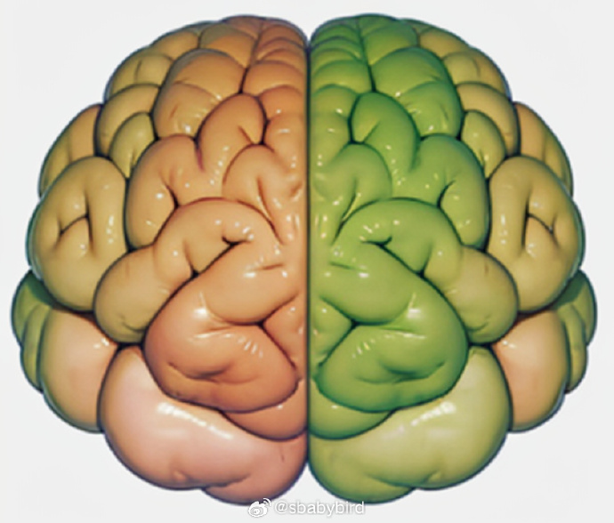
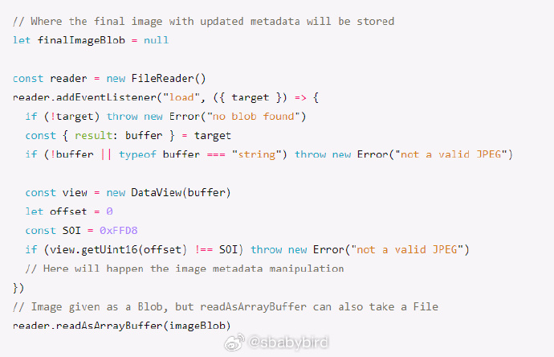
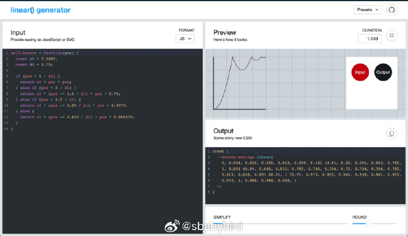

# 机器文摘 第 050 期

## 长文

### 基于 Github Pages 服务搭建个人博客

[基于 Github Pages 服务搭建个人博客 ](https://sbabybird.github.io/p/%E5%9F%BA%E4%BA%8E-github-pages-%E6%9C%8D%E5%8A%A1%E6%90%AD%E5%BB%BA%E4%B8%AA%E4%BA%BA%E5%8D%9A%E5%AE%A2/)
这是我自己写的一篇文章，发布在[我的博客](https://sbabybird.github.io)。

搭建独立博客网站的方法多种多样，常见的方法包括租用服务器自行架设，或者选择托管服务商提供的博客发布服务。

但是上述两种方式都会产生一定的费用，对于非盈利网站而言，不太友好。

经过多年的实践，现在已有越来越多的人选择了使用免费且易用的 GitHub Pages 服务来搭建个人博客。

然而，现有的使用教程大多侧重于操作步骤，对于新手或非专业人士而言，难以真正理解其中原理。

他们可能看到别人的博客既漂亮又实用，却在自己尝试搭建时屡屡遇到挫折，逐渐失去信心。

这无疑会打击那些希望通过博客持续创作文字、并且希望能够免费建立个性化站点的人的积极性。

本文将介绍如何使用 GitHub Pages 服务搭建免费的个人博客网站，及其背后的实现原理，以帮助初学者顺利建立自己理想的博客站点。

### 人的大脑不是由爬行脑、哺乳动物脑、智人脑累加而成

心理学界有一个关于人类大脑流传很广的理论：人的大脑主要由三层不同能力的大脑构成，位于最核心的“爬行动物脑”、随着演化逐渐增加的“低级哺乳动物脑”，以及带来更多灵活性和语言能力的“高级脑”。

这种理论给人的感觉就好像人的大脑是像洋葱那样，由一个“旧”的大脑结构逐渐添加“新”大脑形成。

而且换句话说，青蛙和鱼仍然在我们身体里，我们只是有了更高级的东西把它们包裹了起来。

然而以上理论只是心理学家所提出的一种错误观点，近年来随着生物科学的发展，越来越多的科学家开始指出这种错误。

这篇[《你的大脑不是洋葱，你的脑子里并没有一个爬行动物》](https://journals.sagepub.com/doi/10.1177/0963721420917687)是由神经科学家撰写，重点澄清了上述关于“三层大脑”的传言。

文章指出：之所以这种理论流传甚广，是因为大家普遍对“进化论”的进化过程有所误解，大多数人认为进化过程是一种先低级再逐渐高级的线性过程。然而事实的进化是一种同步辐射进程。

### 使用 Javascript 操作照片的 EXIF 信息

[使用 Javascript 操作照片的 EXIF 信息](https://getaround.tech/exif-data-manipulation-javascript/)
可交换图像文件格式（EXIF）是一种规范，用于指定图像和声音的格式。它通过元数据存储技术细节，所谓元数据即用来描述其他数据的数据，例如相机制造商和型号、图像拍摄日期和时间等信息。

最初，EXIF仅用于JPEG和TIFF两种图像格式。然而，如今，其他文件格式如PNG、WEBP或HEIC也支持EXIF以用于元数据。

本文将重点关注JPEG格式，探究其内部结构，然后展示如何在浏览器环境中通过JavaScript读取和更新相关的元数据。

### CSS 的自定义缓动曲线

[使用 linear（） 函数实现惊人的 CSS 缓动动画](https://www.smashingmagazine.com/2023/09/path-css-easing-linear-function/)，随着新的 CSS linear() 缓动功能的出现，我们可以创建自然感觉的动画和过渡的可能性大大扩展。Jhey Tompkins 在本文中介绍了 CSS 缓动的当前状态，并演示了 linear() 函数令人期待的特性。 ​​​

### 通过放大 ROM 芯片搞破解

[gbrom](https://github.com/travisgoodspeed/gbrom-tutorial)，通过拍摄 ROM 芯片的显微照片，将里面固件的二进制代码还原了出来，硬破解的世界就是这么朴实无华。

## 资源

### 免费开发云服务大全

[free-for.dev](https://free-for.dev/#/)。这个网站筛选收录了大量面向开发者提供的在线服务。收录的标准非常严苛：必须真正免费（免费试用的不算），如果套餐有时间限制，则至少提供 1 年的免费时间。收录的服务涵盖：云基础设施、内容托管、设计资源、字体、在线 IDE 、产品监控等。

### 在线提示词工厂

[promptperfect](https://promptperfect.jinaai.cn/a/NEW)，来自 JinaAI 的 PromptPerfect。能自动生成提示词。让用户可以逐步调试提示词，提供了各种参数。我试着让它帮我编写 AI 作画的提示语，感觉比我自己写的要靠谱一些。

### 更新的光线追踪教程

[《花一个周末学会光线追踪》](raytracing.github.io)，Ray Tracing in One Weekend，这本在线电子书出新版了。真正从零开始手把手教你通过光线追踪进行三维场景渲染。 ​​​事实上整个系列一共包括三部曲，继续阅读《光线追踪：下一周篇》，将添加纹理、体积（如雾）、矩形、实例、光源，并支持使用包围体积层次结构（BVH）来处理大量对象。最后，在《光线追踪：往后余生篇》中，将深入探讨创建一个非常严谨的光线追踪器所涉及的数学。

## 观点
### 专注是良药
不用过多考虑某些时间的投入是否值得，而陷入对时间流逝的焦虑。

如果做一件事情能够使得一个人在一段时间内保持专注，就是非常值得做的事情。

因为，“专注”本身就是收获成果的一部分。

能够在快节奏的生活中，找到不容易被分散注意力、不被各种诱惑干扰、可以集中精力投入的事情，已属难得。

“专注”做事看似简单，却是解决各种精神内耗的良药。

## 订阅
这里会隔三岔五分享我看到的有趣的内容（不一定是最新的，但是有意思），因为大部分都与机器有关，所以先叫它“机器文摘”吧。

喜欢的朋友可以订阅关注：

- 通过微信公众号“从容地狂奔”订阅。

- 通过[竹白](https://zhubai.love/)进行邮件、微信小程序订阅。

