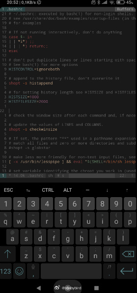
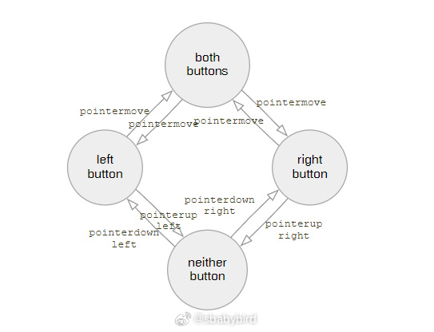
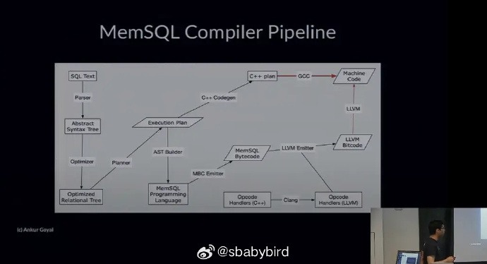
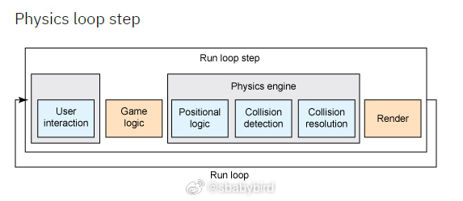
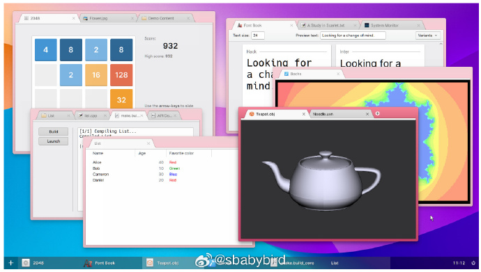
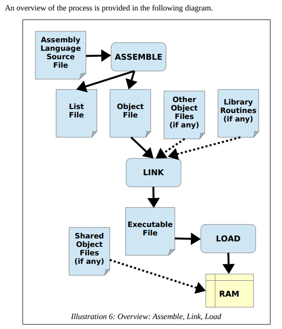
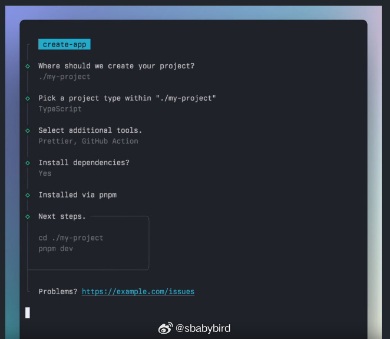
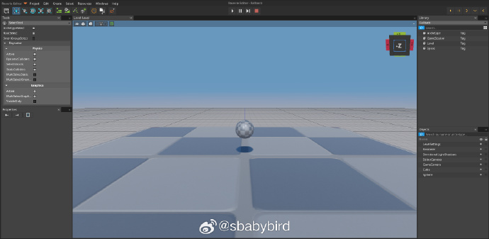

# 机器文摘 第 052 期

## 长文
### 手机端的文字编辑交互

在手机等移动端延续桌面电脑的文字编辑习惯很可能是一条走歪的路。

这篇[看不见的问题](https://jenson.org/text/)由谷歌工程师编写，作者专注于研究在移动终端上进行文字编辑的课题。

简单来说，无论是安卓还是 iOS，都有一个共同的问题，那就是延续了桌面电脑的文本编辑约定，但是却又没有鼠标和菜单栏。

作者在本文中列举了当前移动编辑的各种让人疑惑的交互设计，分析相当到位透彻。在文末作者给出了一个可能的改进方案，但是对于在移动端的改进推行却比较悲观。

### 怎样网页里实现拖拽操作

[网页元素的拖拽实现](https://www.redblobgames.com/making-of/draggable/)。

这篇文章深入讲解了实现网页元素拖动交互的底层原理和标准模式。

作者从头记录了他所编写的代码从简陋模型到支持各种异常事件的完美模型进化的全过程。

文章的最后，作者甚至还封装了一个 ​​​VUE 组件来总结成果，很有实战参考价值。

### 不同的数据库怎样执行查询语言

[数据库是怎样执行查询语句的](https://notes.eatonphil.com/2023-09-21-how-do-databases-execute-expressions.html)。

这篇文章的作者花时间研究了一些常见开源数据库的源码，并分析判断了这些数据库在执行语句时所采用的不同方法。

一般来说，数据库对于查询语句的执行，与我们所使用的各种编程语言在底层机制上并无太大差别。

比较常见的方法也是包括：抽象语法树遍历（解释执行）、构建中间层虚拟机（基于堆栈或寄存器）、编译为本地指令（JIT）等。

### 游戏中的物理模拟是怎样实现的

[给你的 Js 游戏写一个物理引擎](https://developer.ibm.com/tutorials/wa-build2dphysicsengine/)。

这篇教程，介绍了怎样给 Js 编写的网页游戏提供物理模拟相关的支持。

包括游戏场景和角色重力加速度模拟、碰撞模拟等等。

教程虽然发表于十多年前，但是真正的技术历久弥新，其原理并未过时，基本框架和核心思想是不变的。

文章深入浅出，逻辑清晰，适合一边阅读一遍动手实践。

## 资源
### 又一个新写的桌面操作系统

[nakst](https://gitlab.com/nakst/essence)，一个从零打造的桌面操作系统。目前仅支持 SVGA 显卡接口，有自己的文件系统，同时支持对 FAT、NTFS 等文件系统的只读。实现了基本的文件管理、进程管理等功能，移植有 GCC 编译器。 

### 现代汇编语言教程

[assembly64](http://www.egr.unlv.edu/~ed/assembly64.pdf) 在现代处理器和操作系统上学习 x86-64 汇编语言。

### 给命令行程序增加漂亮的 “UI”

[clack](https://github.com/natemoo-re/clack)

clack 是一个命令行交互库，可以让你方便地构建带有美观、高级交互的命令行程序。 ​​​

### 基于 WASM 技术的游戏编辑器

[raverie-engine](https://raverie-us.github.io/raverie-engine/)

一个在网页中运行的游戏引擎，使用 WASM 技术实现了纯页面加载的全功能游戏编辑器。 ​​​

## 观点
### 先问是不是，再问为什么
人的大脑特别喜欢「逻辑自洽」的感觉，如果我们太快的进入逻辑，进入因果关系的分析当中，会很容易「忽略那些与逻辑不符的事实」，而这对于做出正确决策来说是致命的。

----来自[@Murph丶璇](https://weibo.com/3978383590/Nl53Y6nrF)

## 订阅
这里会隔三岔五分享我看到的有趣的内容（不一定是最新的，但是有意思），因为大部分都与机器有关，所以先叫它“机器文摘”吧。

喜欢的朋友可以订阅关注：

- 通过微信公众号“从容地狂奔”订阅。

- 通过[竹白](https://zhubai.love/)进行邮件、微信小程序订阅。

