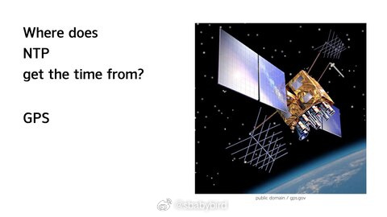
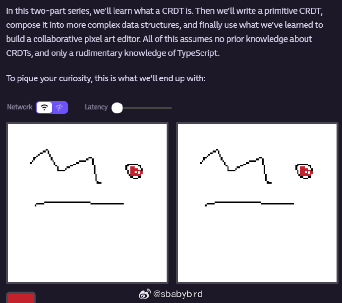
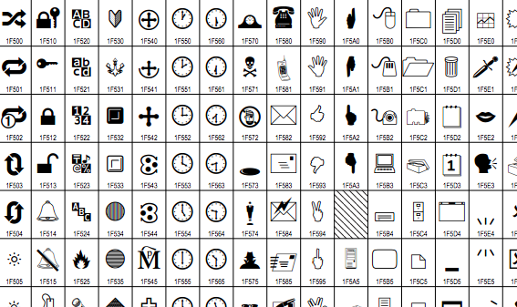
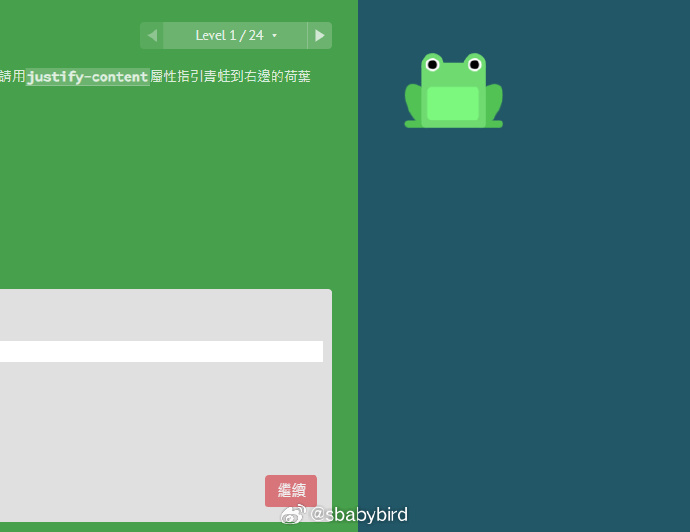
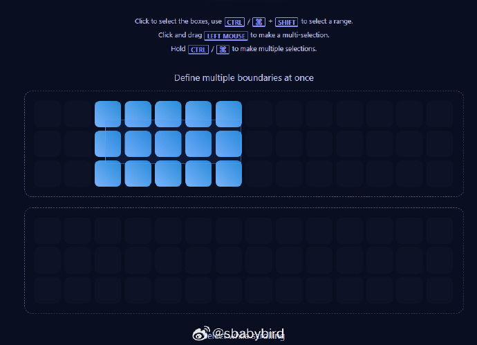
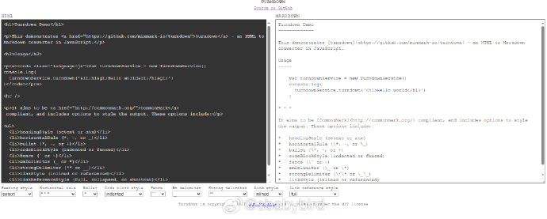
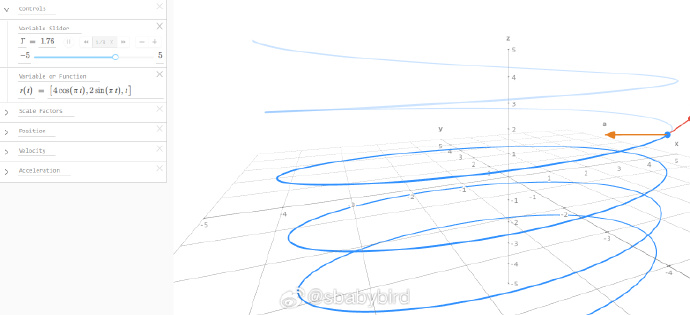
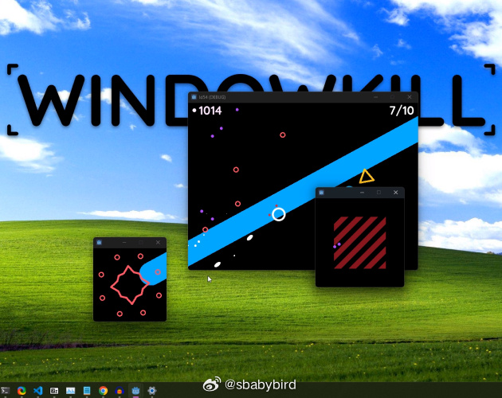

# 机器文摘 第 053 期

## 长文
### 手机和电脑的时间来源

现在使用手机和电脑基本默认开启了网络校时功能，只要能联网，就可以保证电脑的时钟是准的，误差很小。

用于校时的网络服务是由网络校时服务器基于 NTP 提供的。

那么 NTP 服务器的时间是跟谁对的？

答案是 GPS（全球卫星定位系统）卫星 。

那 GPS 跟谁对的时？ 

[你手机和电脑上的时间是从哪儿来的？](https://dotat.at/@/2023-05-26-whence-time.html)。这篇文章解答了这一系列问题并追溯到了最初的时间定义。

### 构建用于在线协作的数据结构

CRDT 这个概念可能听过的人不多，但是如果思考过怎样进行网络协同工作的朋友，可能多少都接近过这个概念。

CRDT 全称为：`Conflict-free Replicated Data Type` 无冲突复制数据类型。

目标是建立一种能够同时存储在不同计算设备上的数据结构，这种数据结构可以使得每个设备都能够自由地编辑状态，而且通过一定的技术约定，使得数据载体可以协商到一个大家都不冲突的状态。

说的直白一点，就是大家能够同时在线编辑一份数据，但是不会产生编辑冲突，这是非常美好的一个愿望。

[CRDT(无冲突复制数据类型)入门](https://jakelazaroff.com/words/an-interactive-intro-to-crdts/)。这篇文章介绍了如何初步实现这种数据结构，并给出了交互式代码，如果你有关于制定协作程序数据结构相关需求，可以考虑深入阅读一下。

### 再介绍一下 Unicode 技术

[每个开发人员都应该掌握的 Unicode 知识](https://tonsky.me/blog/unicode/)。

2023 年了，还没搞清楚 Unicode 的人，再给一次机会。

比较喜欢这种讲技术先从历史讲起的方式。

因为很多技术点的出现都有它的历史背景，了解了其背景，一些看似莫名其妙的规范要求也就合理了。

## 资源
### 练习 CSS 布局的小游戏

[flexboxfroggy](https://flexboxfroggy.com/)。

一个通过网页交互游戏学习 CSS 布局的网站。

通过编写合适的 CSS 代码让青蛙过河，以达到学习 flex 布局的目的。 ​​​

### 页面元素可视化选择

[viselect](https://simonwep.github.io/selection/)。

一个页面元素可视化选择库。

如果你需要用户能够以分组、个别选择，甚至多个分组的方式选择页面中的元素，这个库可以轻松提供这种功能。

可以以原生方式使用，也可以与 React 或 Vue.js 集成一起使用。

### HTML 反向转为 Markdown

[trundown](github.com/mixmark-io/turndown)。

找到一个好工具，HTML 代码转换为 Markdown 代码。

近期我需要迁移一部分博客文章，导出的备份为 HTML 格式，找到了这个 JS 编写的工具库。可以转换 HTML 页面到 Markdown 格式。

复杂一点的页面也能比较完美的转换，效果不错。 ​​​

### 数学公式图形化交互

[math3d](https://www.math3d.org/derivatives)。

一个在线展示数学公式图形的工具，与以往的 2d 绘图工具不同，
math3d.org 是一个可以实时交互的三维场景，通过鼠标实时改变查看角度。

还可以通过设置时间 `T` 变量进行动画模拟。 ​​​

### 杀时间的小游戏

[windowkill](https://torcado.itch.io/windowkill)。

一个 72 小时内做出来的杀时间小游戏。

玩家通过不断发射子弹以击打怪物，子弹打在屏幕边缘可以使得游戏窗口越来越大。 ​​​

## 观点
从物理学的角度观察，生命的本质就是抵抗无序、逆熵发展。

有了这个视角，就理解了为什么人们最喜欢的一项运动------抬杠。

因为那是人们所遵循的、生命赋予的最基本源动力。

不信你观察抬杠的人或者话题，本身都毫无意义，但是人们非要争论不休。

>你说一个人牛逼，他说，哪里哪里，自己差的很远。
>你说一个人差的很远，他说，你算什么东西？老子天下第一。

总之就是要跟你逆着来。才舒服。

## 订阅
这里会隔三岔五分享我看到的有趣的内容（不一定是最新的，但是有意思），因为大部分都与机器有关，所以先叫它“机器文摘”吧。

喜欢的朋友可以订阅关注：

- 通过微信公众号“从容地狂奔”订阅。

- 通过[竹白](https://zhubai.love/)进行邮件、微信小程序订阅。

