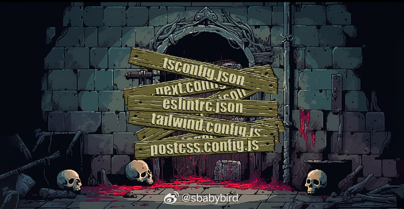
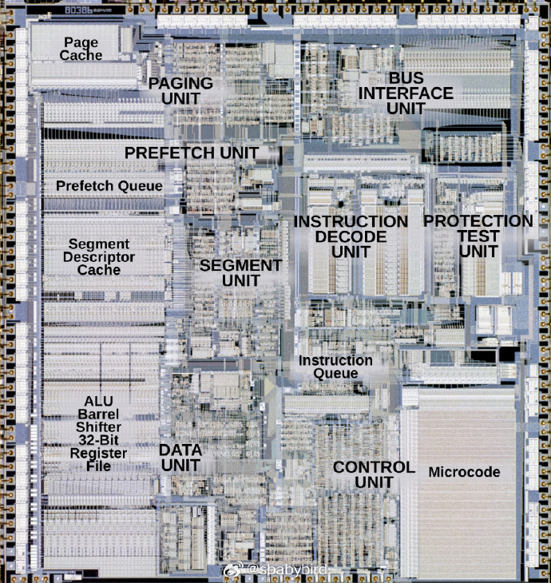
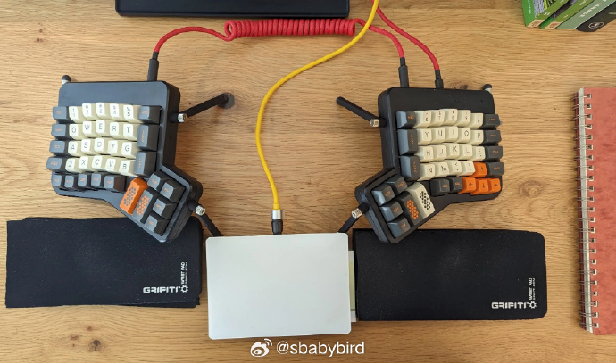
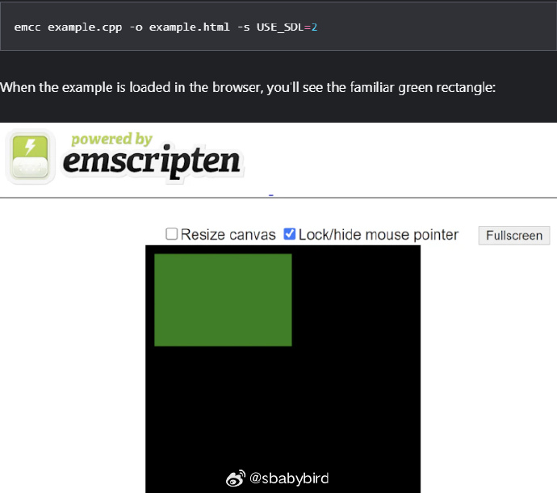
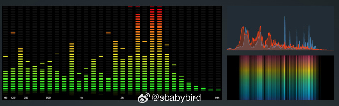
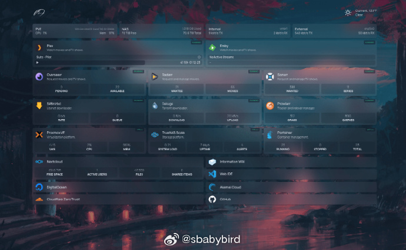
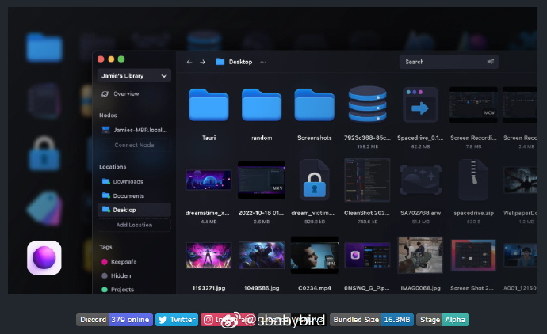

# 机器文摘 第 054 期

## 长文
### 前端技术栈为什么这么复杂

[《前端技术栈为什么这么复杂？》](https://matt-rickard.com/why-is-the-frontend-stack-so-complicated)。想吐槽 Web 前端开发技术的可以看看这篇文章，能给你提供一些弹药。

作者列举了引起前端生态如此混乱的多个槽点，喷的在点子上：

1、缺少通用的包引用系统：ESM、CommonJS、AMD、UMD，一堆标准。

2、转换层太多：TS 转 JS、ES6 转 ES5、原始转压缩、混淆，一系列步骤下来给定位问题带来困扰。

3、运行环境多：除了要在浏览器端执行，还要考虑判断是否执行在 Node 端，一个库既要、又要、还要。

4、过于依赖文件结构：前端工程往往会有一些对文件路径以及命名的潜规则，比如各种配置文件、路由信息等等。

### Intel 80386 CPU 解析

与很多人想象的不同（多数人认为 8088、8086 是 Intel 最具里程碑意义的处理器），实际上 1985 年发布的 Intel 386 处理器才是 x86 家族中最关键的一款处理器。

386 在几个方面是现代计算的关键转折点：

1. 386 将 x86 架构移至 32 位，定义了 20 世纪剩余时间的主要计算架构。

2. 386 也确立了 x86  对整个计算机行业的趋势引领。

3. 386 结束了 IBM 对 PC 市场的垄断，使康柏这类兼容机成为架构领先者。

在这篇[《Intel 386 硅芯片研究》](http://www.righto.com/2023/10/intel-386-die-versions.html)中，作者通过放大了的英特尔 386 芯片照片，探索了这款经典处理器所创下的历史。

### 老程序员的外设推荐

[一位 40 年编程经验的程序员编程设备推荐](https://fabiensanglard.net/40/index.html)。

作者“年仅” 46岁，却已有 40 年的编程经验，据称其中至少有一半的时间是职业编程。

作者随着技术的进步（和身体的老化）在不断升级自己的用着趁手的工具，在文中积极推荐了一波。 ​​​

### WASM 图形操作入门

介绍过很多次 WASM 的技术，这次介绍一个比较容易上手的实验。

[使用 WASM 在网页上渲染 2D 图形](https://web.dev/articles/drawing-to-canvas-in-emscripten?hl=zh-cn)。也就是说在网页上绘图，不过不是通过 Javascript 操作 canvas 画布，而是使用 WASM 技术编译 C++ 代码，基于 OpenGL 或者 SDL 接口进行绘制。

这样做的好处 1 是性能强一些，2 是可以轻松移植之前基于 SDL 编写的游戏或者图形程序到网页里。

## 资源
### 一个频谱动画库

[audioMotion-analyzer](https://audiomotion.dev/)。一个 Javascript 写的实时音频频谱分析与动画库。

用于在网页制作音频频谱实时动画，性能优秀且自带多种风格样式。 ​​​

### 全能仪表盘

[Homepage](https://gethomepage.dev/v0.7.3/网页链接)，不仅是一个现代的应用程序仪表盘，还是一个充分静态、快速、安全且高度可定制的工具，能够将超过100个服务集成到一个地方，界面支持多国语言。

主要特性如下：

全静态：不需要复杂的服务器设置或后端处理，具备出色的性能和可靠性。

超过100个服务集成：支持超过100个不同的服务集成，包括各种云服务、开源工具和社交媒体平台。无论使用哪些服务，都可以在一个地方轻松地查看它们的状态和数据。

### 在一个地方管理你的全部文件

[Spacedrive](https://github.com/spacedriveapp/spacedrive)

Spacedrive 是一个基于虚拟分布式文件系统的文件资源管理器。

可以在一个地方组织跨多个设备的文件。包括云服务和离线硬盘，Spacedrive 可以将这些文件资源合并为一个个人的分布式云，既安全又易于使用。 

注意：项目目前还在开发中，功能特性还未稳定。

## 观点
### Docker 的意义
> 一个服务运行起来依赖许多假设：当前目录，安装了了哪些软件，系统上存在了哪些文件。这些都很难用语言来描述清楚，而且假设通常也会被打破。这个时候如果有了 docker 的话，所有的假设都被物化下来，对于开发和运维都是好事。
来自 [@dirtysalt](https://weibo.com/2048838462/N7bBxpf2B)

### 鱼有灵魂吗
> 鱼类要多久才能进化到知道渔线上吊着一块肉其实是一个陷阱？
> 可能已经进化出来了。
> 答主【瞻云】解释，作为具有高级中枢的鱼类，是能够在长期被钓的过程中，产生复杂条件反射，从而对食物、鱼钩、鱼线、人影、鱼竿等陷阱特征，产生高度的警觉。
> 他认为鱼类是可能具有浅层意识的，是能意识到危险和陷阱的。但可能会类似于我们半梦半醒状态。
> 当然，如果我们依据保守的观点，还是认为，具有大脑皮层才能产生意识。
> 那么，如果提供合适的进化条件，它们可能还需要1~2亿年的时间，才能知道这是个陷阱～
来自 [@知乎](https://weibo.com/1904769205/NnZa39XD0)。

人类可能也需要一到两亿年才能悟道更上一层吧，如果有机会的话。

## 订阅
这里会隔三岔五分享我看到的有趣的内容（不一定是最新的，但是有意思），因为大部分都与机器有关，所以先叫它“机器文摘”吧。

喜欢的朋友可以订阅关注：

- 通过微信公众号“从容地狂奔”订阅。

- 通过[竹白](https://zhubai.love/)进行邮件、微信小程序订阅。

