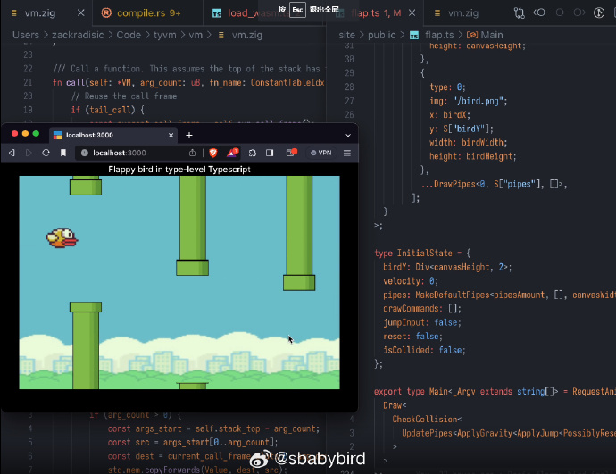
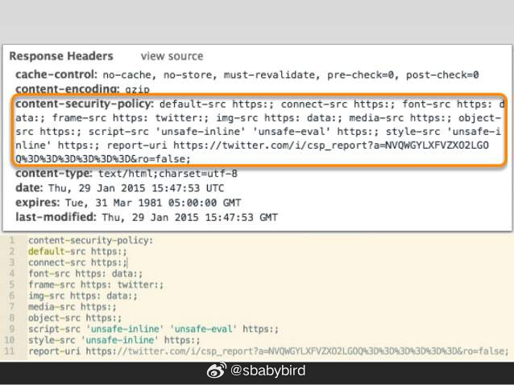
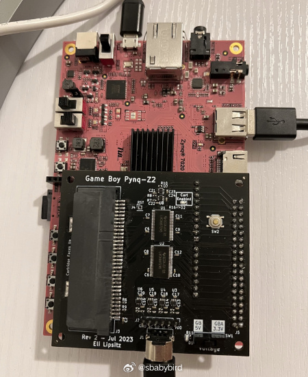
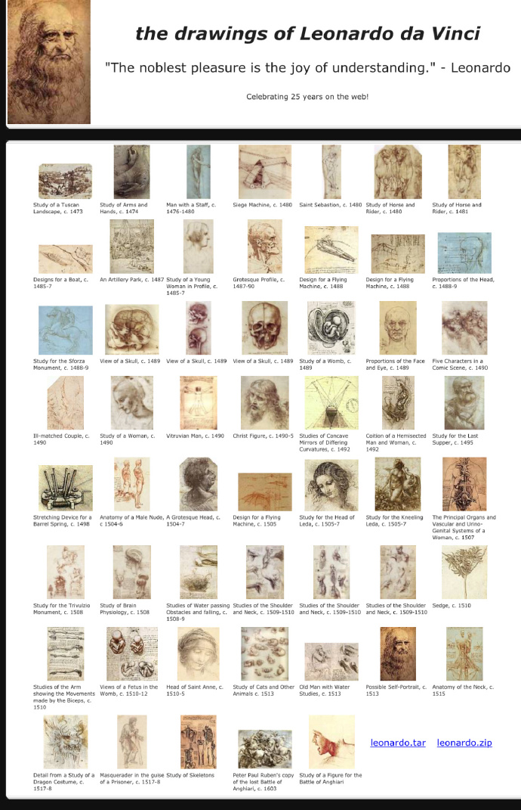
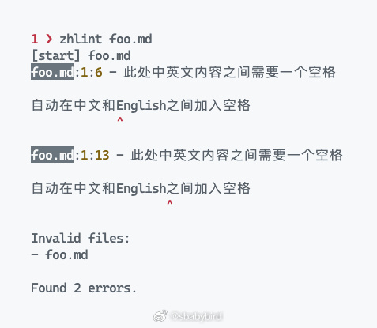
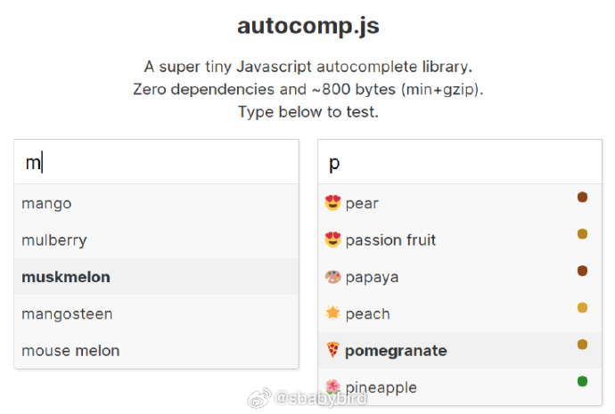
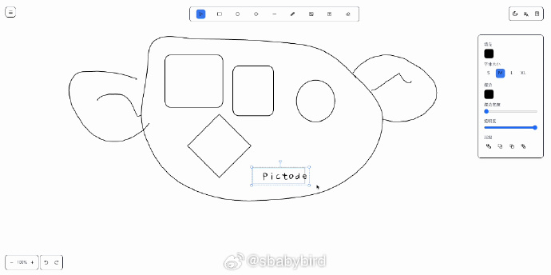
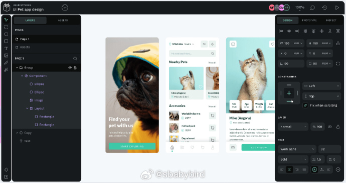
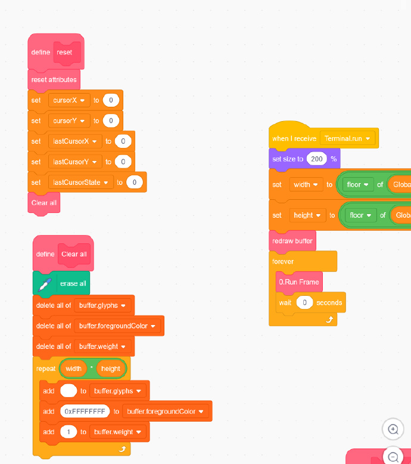

# 机器文摘 第 055 期

## 长文
### C 语言限制了现代计算机处理器的发展？

在 HN 上读到一篇有些深度的文章：[C 不是一种低级语言](https://queue.acm.org/detail.cfm?id=3212479)。

需要了解一些背景知识才能读的进去，比如 C 语言诞生于上个世纪 70 年代古老的 PDP-11 计算机上。

这篇文章的作者认为，C 在诞生之初确实是一个十分靠近硬件底层的“低级语言”（业界认为越靠近硬件底层的编程语言为“低级语言”，相反越接近人类则为“高级语言”）。

因为最初的 C 语言确实准确反映了当时 PDP-11 计算机的硬件抽象：没有缓存、扁平的内存空间、串行（顺序）执行的指令等等。

但是随着时间的推移，处理器逐渐性能提升，硬件复杂度也在倍增。

但面对 C 语言仍旧不得不提供一个像 PDP-11 那样古老硬件的抽象接口，而新的硬件比如三级缓存、多核心等无法暴露给 C语言进行编程。

处理器自己在底层默默做着指令分支预测、寄存器重命名（用于欺骗 C 语言的进程）等操作，消耗了大量的能量，限制了性能的发挥。

作者在文末畅想了一种没有受 C 语言对硬件抽象限制的处理器，具有函数式编程架构、简化的寄存器缓存、天然的并行执行等等特性。

但是最终作者也不得不感叹，由于现在绝大多数的软件都是构建在 C 语言之上的，所以上述畅想的处理器，想在商业上取得成功就很难了。

人类技术的发展历史，也确实是不断在打补丁、打补丁、打补丁，想改底层，很难了吧。

### Typescript 的类型系统是图灵完备的

[基于 Typescript 的类型系统编写一个 flappy bird 游戏](https://zackoverflow.dev/writing/flappy-bird-in-type-level-typescript)。

Typescript 的类型系统很强大，大家发现它甚至是[图灵完备](https://baike.baidu.com/item/%E5%9B%BE%E7%81%B5%E5%AE%8C%E5%A4%87/4634934)的。

于是喜欢折腾的人开始充分发挥想象力，使用 Typescript 的类型系统开发各式各样的程序。

之前见过有人拿它写一个下棋 AI 的，这篇文章的作者，则是实现了一个完整的 2d 游戏。

### 什么是 CSP （网页安全政策）

最近在使用 [Pixi.js](https://pixijs.com/) 写一个 Demo 的时候，遇到一个问题：如果我把页面的安全选项设置的比较严格，则 Pixi.js 库无法正常运行（貌似 Pixi.js 库要求在页面脚本中执行 eval 的权限）。

于是我认真研究了一下 “Content Security Policy” 这个东东（之前都是拷贝的模板放在 HTML 的头部）。

"网页安全政策"（Content Security Policy，缩写 CSP），起初的设计是为了防止 [XSS](https://baike.baidu.com/item/XSS%E6%94%BB%E5%87%BB) 跨站攻击的。

也就是说，在服务端进行了相应的 CSP 声明之后，符合规范的浏览器就会仅加载执行经过许可的 Js 代码或其他资源。

这使得跨站攻击变得几乎不可能了。

但同时，过于严格的 CSP 声明也会导致你自己的脚本执行受到影响。

这篇[《Content Security Policy 入门教程》](https://www.ruanyifeng.com/blog/2016/09/csp.html)可以帮助你了解相关的知识。

如果希望知道更多的细节，可以看一下[这篇 MDN 专门介绍 CSP 的文档](https://developer.mozilla.org/zh-CN/docs/Web/HTTP/CSP)。

### 想玩怀旧复古游戏除了用模拟器还有这个办法

玩复古游戏可以有多种方式，最常见的是在 PC 或者手机上使用软件模拟各种古老的游戏机平台，以及如果不差钱的话去搜罗各种古董硬件设备和卡带（这样的老爷机往往不舍得下手玩）。

不过近些年也有人走上了另一条路线，那就是使用 FPGA 进行硬件级模拟。

FPGA 的全称是现场可编程门阵列，通过直接对芯片中的模块和逻辑单元编程来模拟老游戏机硬件的运行方式。

比起软件模拟，硬件级模拟具有高度还原（连原有硬件的 BUG 也还原）、无延迟等优势。

这篇[《使用 FPGA 做一个 GBA 模拟器》](https://eli.lipsitz.net/posts/fpga-gameboy-emulator/)记录了作者从头手工制作的过程。

因为作者原本就是软件模拟器开发者，所以对于各项原理和特性讲解都比较清楚，愿意动手试一试的可以看一下。

## 资源
### 下载达芬奇的手稿

[达芬奇手稿](https://www.drawingsofleonardo.org)，这个网站收录了达芬奇所有的经典手稿，每张手稿都标注了主题和完成时间，可以直接点击打开大图，或直接下载。 

### 设计模式 Javascript 版

[常用设计模式的 Javascript 实现](https://blog.carlosrojas.dev/quick-reference-guide-to-design-patterns-in-js-1ebeb1e1c605)。以示意图的方式简单介绍了抽象工厂、单例、桥接等 21 种设计模式，并给出了使用 Javascript 语言的实现。 ​​​​​​

### 中文文本格式检查

[zhlint](https://github.com/Jinjiang/zhlint)，一个中文文本格式自动检查工具。可以像检查编程语法那样检查中文文本内容，给中文文本中的标点符号、英文字符等自动增加空格间距，以实现排版的美观。

谁要是能把它做成 vscode 插件帮我自动格式化 md 文档就更好了。 ​​​

### 超轻量自动补全库

[autocomp.js](https://github.com/knadh/autocomp.js)。一个超级小型 JavaScript 自动补全库。零依赖，压缩后只有800个字节大小。 ​​​

### 又一个网页绘图板

[Pictode](https://pictode.com/) 是一个基于 Vue 3、TypeScript、Konva、HeadlessUI 和 Tailwind CSS 等酷炫技术构建的画板项目，它让你可以随心所欲地绘制、创作和表达自己的创意。 

### 一款开源的设计工具

[penpot](https://penpot.app/)，开源的 Figma 平替。

是一个矢量图形编辑器和原型设计工具，主要基于网页进行工作。

源代码在此：github.com/penpot/penpot  

可以直接在线使用他们官方提供的服务，也可以自己搭建私有服务。 ​​​​​​

### 用儿童编程工具 Scratch 运行 Linux 内核

[Linux 6.1.14-rv32ima On Scratch](https://scratch.mit.edu/projects/892602496/)，使用纯Scratch（常见的图形化搭积木式的少儿编程工具）运行Linux 6.1.14内核！原理是先在 Scratch 中运行一个 RISC-V（rv32ima）CPU 模拟器。

我的感觉是：就像有人拿着鸡爪子也能写出好看的字，我拿着毛笔也写不好，拿着鸡爪子就更不行了。
## 观点
### 原来我早已不是我，是我们
> 【研究表明：#寄生虫或能向宿主借基因控制宿主思想#】铁线虫在水中生活和繁殖，但它们的幼虫只能寄生在其它动物体内，通常是陆生昆虫，比如螳螂。一旦幼虫在宿主体内生长成熟，它就必须说服宿主主动跳进水中淹死自己，使其回归水中生活，完成生命周期。那么这种寄生虫是如何说服宿主跳水的呢？长期以来，这个问题一直困扰着科学家。近日，日本科学家的一项新研究发现，铁线虫幼虫用来控制宿主的3100个基因中有1400多种是从宿主那里借来的，有反过来操控宿主跳入水中。但是这种基因如何转移仍然是一个谜，下一步科学家将深入研究以解开更多答案。

来自[@机械科技](https://weibo.com/1029527725/NoKg67mGw)。

## 订阅
这里会隔三岔五分享我看到的有趣的内容（不一定是最新的，但是有意思），因为大部分都与机器有关，所以先叫它“机器文摘”吧。

喜欢的朋友可以订阅关注：

- 通过微信公众号“从容地狂奔”订阅。

- 通过[竹白](https://zhubai.love/)进行邮件、微信小程序订阅。

