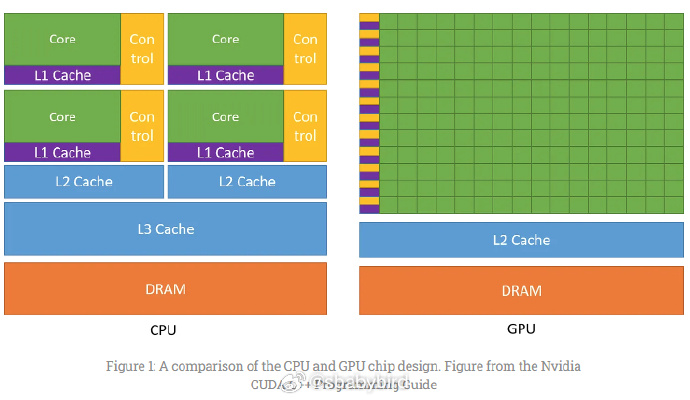
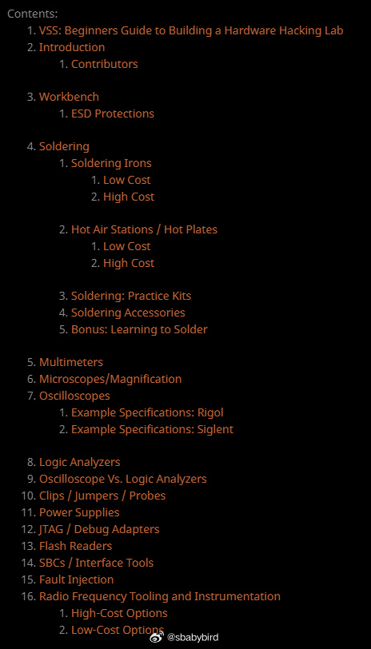
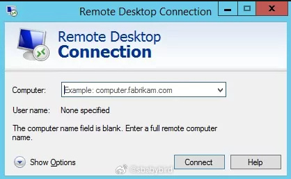
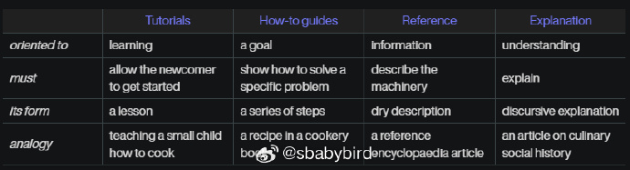
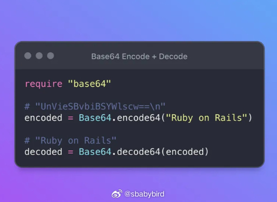
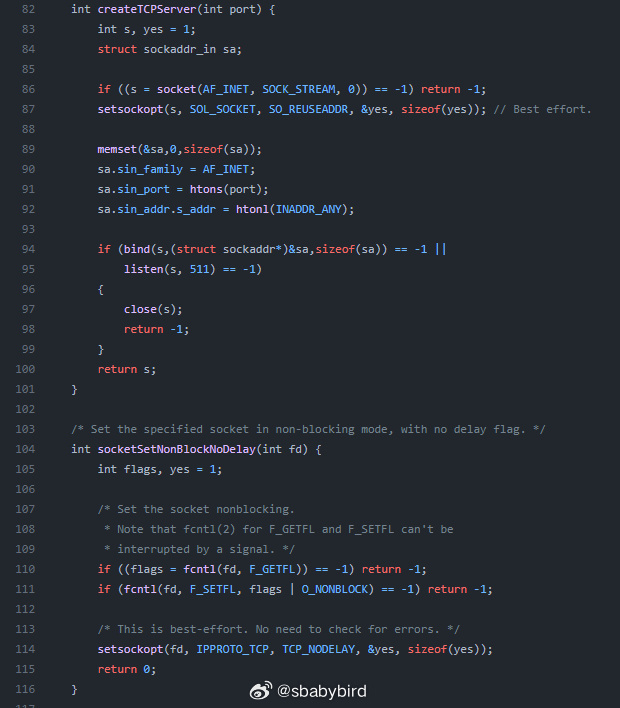
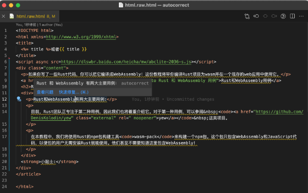
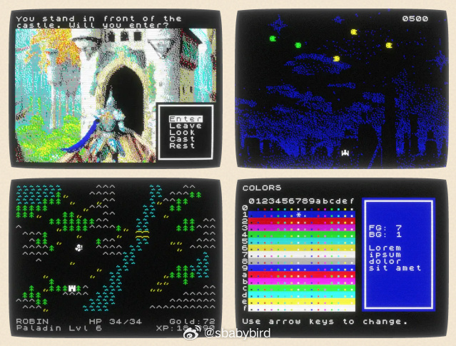

# 机器文摘 第 056 期

## 长文
### 每个开发者都应该了解的 GPU 计算

[《每个开发者都应该了解的 GPU 计算》](https://codeconfessions.substack.com/p/gpu-computing)。

大多数程序员对 CPU 和顺序编程都有深入的了解，因为他们入门就面向 CPU 编写代码。

但是在过去的十年中，GPU 因其在深度学习中的普遍使用而变得非常重要。

这篇文章可以让不熟悉 GPU 编程以及其内部工作原理的开发者对 GPU 的工作方式有一个基本的了解。

文章主要内容：
1. 对比 CPU 和 GPU 的主要区别，前者顺序执行指令，后者并行执行指令。

2. GPU 以流处理器（SM）为核心的计算架构和显存架构。

3. GPU 的程序执行模型以及怎样编写此类程序；

### 年轻人的第一间硬件实验室

动手能力比较富余的朋友，往往在业余时间喜欢捣鼓一些 DIY 制作，或者拆解一些电子设备，窥探现代科技的魅力。

对于初入门者来说，除了经典的螺丝刀、万用表、电烙铁这几大件之外，如何在家里构建一套比较全面的 DIY 设备往往是个头疼的问题。

这篇[《手把手教你打造黑客硬件实验室》](https://voidstarsec.com/hw-hacking-lab/vss-lab-guide)介绍的比较详尽，从工作台到各种设备设施（稳压电源、热风焊台、示波器、显微镜、逻辑分析仪等），十分齐全，为每种设备都提出了高配和低配的解决方案。

并且都给出了详细的参数和介绍。

我看了一下，如果全配下来还是比较发烧的，差不多够开个小作坊了。

### Windows 远程桌面的一些技巧

Windows 系统的 RDP 远程桌面技术非常强大，是一些开发者和运维人员必备的工具。

尤其是如果你在租用云服务虚拟机的时候，选择了 Windows 作为操作系统，那么使用 RDP 作为远程管理工具是最方便的了。

然而，RDP 的技术细节非常多，包括很多未公开的参数等等，我推测现在就连微软也很难找到一个人能把它的各项开关说清。

比如我近期发现了这样一篇文章，解决了我在使用远程桌面时困扰了很久的问题。

[《如何关闭远程桌面后仍处于可交互状态》](https://www.cnblogs.com/bangejingting/p/6846480.html)。

> UI 自动化测试期间，执行测试的电脑几乎不能继续被他人使用（因为鼠标、键盘等输入设备此时需要响应自动化测试脚本）。为了不影响电脑使用，一般会搭一个虚拟机，然后远程连接到虚拟机里，在虚拟机里执行 UI 自动化测试。

> 但是，万一你不小心把某个远程桌面“最小化”了...Oops，你的自动化测试就挂了。既然连最小化都会失败，相信你已经猜到直接关闭远程桌面的后果了。

为什么最小化或关闭远程连接的桌面会导致自动化测试失败呢？

查看这篇文章可以尝试寻找答案。

### 关于编写技术文档的一些解释

这里有个系列文章介绍了[“教程”、“指南”、“参考手册”、“详解”等技术文档之间的差别](https://documentation.divio.com/introduction.html)，以及如何更有效地编写各类技术文档。

比如“教程”要侧重于面向初学者，目标是要让读者可以开启体验。

“指南”则重点要向读者讲清楚，怎样一步一步解决某个特定问题。 ​​​

### Base64 是如何编码解码的

[Base64 编码详解](https://www.writesoftwarewell.com/base64-encoding-explained/)。

Base64 是将二进制数据转换为文本的优雅方法，使其易于存储和运输。本文涵盖了Base64 编码的基础知识，包括它的含义，其工作原理以及为什么重要。

作者还举例说明了如何用各种编程语言实现对数据的 Base64 编码和解码。 ​​​

## 资源
### 体素编辑器

[什么是体素见这里](https://zhuanlan.zhihu.com/p/348563616)。体素简单来说就是立体像素，是用一个个立方体来组成三维模型的方法。
[MagicaVoxel](https://ephtracy.github.io/index.html?page=mv_main)。是一个超级轻量级基于 GPU 的体素编辑器和基于光线追踪的渲染器。

### 200 行代码写的聊天室

发明了 [Redis](https://redis.io) 的作者 [antirez](http://antirez.com/)，前一段时间说是代码写累了，改行去写科幻小说了。

不过，现在又回来了，这两天新写了个[仅有 200 行 C 代码的在线聊天室系统](https://github.com/antirez/smallchat)。

据他所说，此代码是为了给大量的前端开发者，演示一下系统编程的大概套路。

麻雀虽小五脏俱全，这个聊天室支持使用 telnet 登录，并且可以设置聊天账号的昵称。

### VSCode 的中英文混合排版补正插件

[AutoCorrect](https://marketplace.visualstudio.com/items?itemName=huacnlee.autocorrect) 能自动帮你格式化中英文混排的文字，补充正确的空格。

上周介绍 [zhlint](https://github.com/Jinjiang/zhlint) 的时候我还说要是直接有个编辑器插件就好了，结果已经有人做出来了。

### 模拟复古游戏机显示效果的渲染引擎

[qx82](https://btco.github.io/qx82/)。一个 Javascript 编写的小型渲染引擎，可以模拟复古的上世纪 80 年代的计算机（家用游戏主机）的显示效果。如果想在网页制作复古小游戏的话，也许能用得上。 ​​​

## 观点
### 社会和个体，就像婆媳，是一对天然的对手却又不得不建立亲密关系。
> 看到有人说，当你被现代心理学测出有心理疾病的时候，说明你正在偏移社会主体，你这颗工业螺丝在异变，想成为个体，简单的来说：你即将挣脱地球 ol 这个游戏中 NPC 的框架，正在成为有名字的游戏角色。

来自[@烟灰海2023](https://weibo.com/7743682633/Np9LRgKkV)

## 订阅
这里会隔三岔五分享我看到的有趣的内容（不一定是最新的，但是有意思），因为大部分都与机器有关，所以先叫它“机器文摘”吧。

喜欢的朋友可以订阅关注：

- 通过微信公众号“从容地狂奔”订阅。

- 通过[竹白](https://zhubai.love/)进行邮件、微信小程序订阅。

