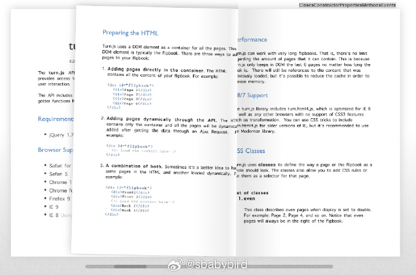

# 机器文摘 第 057 期

## 长文
### 浏览器反广告插件是如何工作的

[视频网站和反广告插件的猫鼠游戏](https://andadinosaur.com/youtube-s-anti-adblock-and-ublock-origin)。

我之前也好奇像 adblock 这种浏览器插件是如何屏蔽掉 Youtube 这类网站嵌入在网页或者视频播放器里的广告。

起初我以为广告插件是简单粗暴地屏蔽掉了某些 DOM 元素，但事实比我想象的要复杂得多。

在上面这篇文章里，作者讨论了视频网站嵌入广告的技术路线，以及反广告插件是如何通过技术手段使其失效的。

其基本原理如下：

1、视频网站会在前端请求一个 API，获取面向当前所播放视频相关的广告信息，这些信息是通过 JSON 格式进行传递的，广告信息就在其中某个数组里。

2、广告屏蔽插件会重写覆盖 JS 引擎的 JSON.parse 函数，使得视频网站前端代码在执行解析之后，获得一个空的广告信息数组。（想出这个点子的人真是个天才）。

不过就像军备竞赛一样，双方都在非常认真地升级，近期 Youtube 实在忍无可忍，通过“先发送虚假请求并判断信息是否被篡改”的方式，主动识别出安装了这类插件的浏览器，并弹出窗口严词要求用户关掉该插件。

插件开发者又要开启了一轮技术升级了。

### “全栈工程师”升级到了“产品工程师”

这篇[《顶级工程师最有价值的特质》](https://engineercodex.substack.com/p/the-1-trait-of-the-most-valuable)讨论了一个逐渐被认识的的事实：*最好的工程师不仅在技术上非常敏锐，而且能够以技术推动他们的产品向前发展*。

虽然面向产品和面向代码并非矛盾，并且有时候是相辅相成的。

但毫无疑问有产品思维的工程师要比有技术的工程师稀缺的多。

### 神奇的光影包 MOD

第一次在《我的世界》中加载光影 MOD 时，那种神奇的渲染效果震惊了我。

怀着强烈的好奇心研究了一下，发现并收藏了这篇[《如何编写Shadersmod光影包》](http://blog.hakugyokurou.net/?p=1364)。

作者在呕心沥血制作光影包的同时还抽了半年时间完善这套教程实在是令人敬佩。

基本原理：
1、通过 MOD 使的我的世界具备加载定制着色器（Shader，即在 GPU 中执行的程序）的能力。

2、定制化着色器驱动渲染管线复杂的光影计算，改变了最终的显示渲染效果。

> 回想一下当你第一次见到Minecraft光影包时的感觉,是不是就像黑魔法一样?为何MC原版那么简陋的画面只要安装上一个Mod就能拥有一个主流游戏的画质?它是怎么绘制阴影和反射的?
> 
> 一切都要归功于着色器(Shader),着色器就是决定内存或显存中的顶点数据和纹理是如何在GPU上正确(或错误)地变形、组装、光栅化成像素并进行着色然后绘制到屏幕上的黑魔法,遥想在过去消费级显卡尚未出现的年代,编写软件渲染器是每一个3D游戏程序员都必须掌握的事情,在主频只有数百MHz的CPU上以定点数学编写渲染器虽然不是愉快的事情,但至少那时的程序员对每一个像素都有绝对的控制权.
> 
> 而当显卡普及时硬件几乎完全接管了渲染的处理,只留给了程序员一套API,在一些老的图形学或游戏制作相关的书籍中你经常能看到"硬件T&L"这个名词,它指的就是由硬件实现的顶点变换和光照,也就是所谓的固定管线渲染.
> 
> 硬件加速的渲染固然高效,但却让程序员失去了对像素的控制权,开发者只能通过图形API提供的最简单的操作,通过搭积木似的拼凑出想要的效果,你还记得在OpenGL1.0规范中甚至不包括纹理吗?
> 
> 随着时间的推移,可编程电路逐渐取代了单一功能的电路,在原本由CPU一家独大的主板上,另一股不容忽视的计算力已经悄然崛起,显卡已经从只能执行简单任务的劳工变成了可以处理灵活任务的工程师了,但毕竟各家显卡的编程规范不同,程序员如果想编写一个能在大多数主流显卡(要知道那时候的显卡商是百花齐放)上运行的着色程序得学习数款显卡驱动和它们的汇编语言(高级语言?抱歉,没有),毕竟不是每一个图形学程序员都能像约翰卡马克那样一天适配一款显卡,业界需要一个统一的标准
> 
> 这时作为后起之秀的DirectX却抛下了自诩为业界标准的OpenGL,独自扛起了可编程着色器的大旗,在2000年的DirectX8.0中提供了统一的汇编语言用于编写着色器,而在这一关键时期OpenGL规范的众谋特性却让它没能赶上时代步伐,OpenGL规范是由各家(不管是不是做显卡的)统一协定
> 
> 这种制度免不了会有各种扯皮,结果是直到2004年9月它才提供了一个可用的着色器语言 - GLSL(OpenGL着色语言),不过相比它的老冤家DirectX来说倒也不算太糟,毕竟DirectX当初提供的是汇编语言,而OpenGL提供的是一个C-like的高级语言,相比之下DirectX到了2004年11月才做出了同为高级语言的HLSL(高级着色语言).
> 
> 着色器语言用于编写一个着色器程序,经由驱动编译成显卡能执行的汇编语言后传入显卡,替代原本的固定管线,以此让开发者得以控制渲染的方式.
>

## 资源
### 1886年的水果画册

[水果画](https://www.openculture.com/2019/06/the-us-government-commissioned-7500-watercolor-paintings.html)，1886 年，美国政府委托制作了 7,500 幅水彩画，描绘了世界上所有已知的水果。这里提供了一些线索，可以找到并下载这些档案。

### 命令行下的 JSON 解析工具

[fx](https://github.com/antonmedv/fx)。最近控制台下的交互体验也提升迅猛，fx 是一个进行 JSON 数据查看和处理的命令行工具。

交互体验丝滑（甚至支持鼠标），适合控制台爱好者收藏使用。

### 把手机当作电脑的话筒

[WO Mic](https://wolicheng.com/womic/) 用任意一部手机当作电脑的音频输入设备，可以通过蓝牙、Wifi、USB等方式进行连接。

工作方式为，在电脑端启动一个虚拟音频服务，并监听来自手机 app 的连接。 ​​​ ​​​

### VSCode 的 Activity Bar

VSCode 终于支持调整 Activity Bar 的位置了，可以切换到顶部与文件页签对齐，这下给右侧的编辑区节省了一列的宽度。

需要升级到最新 1.84 版本才有这个特性。

### 又一个 AI 编程助手插件

[通义灵码](https://tongyi.aliyun.com/lingma)。阿里云出的 AI 编程助手插件，感觉速度还不错。

支持 VSCode、JetBrains IDEs 等主流 IDE，支持 Java、Python、Go、JavaScript、TypeScript、C/C++ 等主流语言。 

### PNG 素材下载站

[PNG派](https://pngpai.com/)。一个透明PNG素材下载网站，目前有10+万张，种类多样，免费下载。 ​​​​​​

### 在网页中实现书籍翻页效果

[turnjs](http://www.turnjs.com/)。一个实现书籍翻页效果的轻量级（10K） js 库。

### 动画展示神经网络原理

[animateai](https://animatedai.github.io)。一个通过三维动画讲解 AI 神经网络原理的网站。

以生动形象的动画展示了卷积神经网络里各项计算的执行过程。 ​​​

### 可以脱离浏览器 DOM 的 Canvas API 实现

[PureImage](https://github.com/joshmarinacci/node-pureimage)。"PureImage" 是 HTML Canvas 2D 绘图 API 的纯 JavaScript 实现，可以脱离浏览器完全在 NodeJS 端执行。

支持调整图像大小、绘制文本、渲染徽章、转换为灰度图等操作。

或者执行标准 Canvas 2D API 规范的其他操作。

另外还提供额外的 API 用于将图像保存为 PNG 和 JPEG 格式。

### 软件架构设计的工具

在进行软件架构设计的时候，[“C4 模型”](https://c4model.com)可以很好地辅助表达一系列的分层图表，它按照上下文（Context）、容器（Container）、组件（Component）和代码（Code）四个维度对软件架构的层级做了定义。

之前一直是徒手画框，看到 PlantUML 已经内置了 C4 元素，使用简单的 DSL 就可以完成架构图的绘制，实在是太方便了！C4 还内置了一些主题，也可以通过 PlantUML 提供的语法对界面样式进行自定义，不过，一般也不用特别追求好看，内置的主题基本就够用了。

另外，VSCode 上的插件名就是 [PlantUML](h++ps://github.com/plantuml-stdlib/C4-PlantUML)，它提供了一个包含大量示例的参考仓库。

来自微博[@Barret李靖](https://weibo.com/1812166904/NqnBpnpvx)

## 观点
### 应当多做提升内心秩序的事情
内心秩序的建立十分重要。

应该定期通过一些活动来重新整理自己内心的秩序。

每当我整理完电脑文件夹，个人知识库，或者是房间、办公桌之后，我都会进入到一种欣喜舒畅的状态。

整个人都清爽了，各项效率都得到提升，甚至有种踌躇满志的感觉。

每个人都应该找到能让自己提升内心秩序的事情。

## 订阅
这里会隔三岔五分享我看到的有趣的内容（不一定是最新的，但是有意思），因为大部分都与机器有关，所以先叫它“机器文摘”吧。

喜欢的朋友可以订阅关注：

- 通过微信公众号“从容地狂奔”订阅。

- 通过[竹白](https://zhubai.love/)进行邮件、微信小程序订阅。

