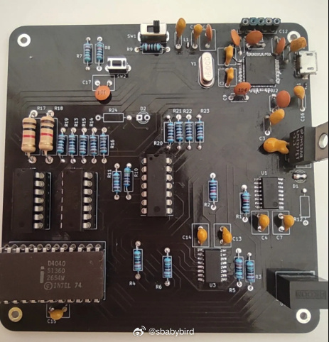
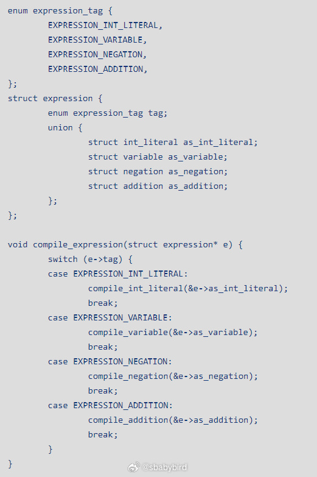
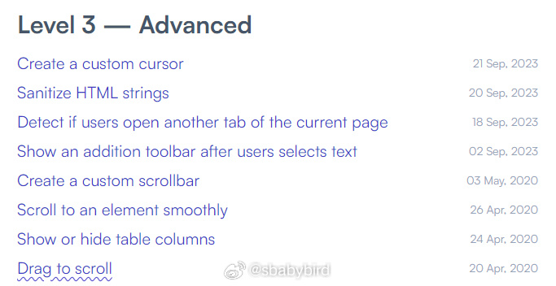
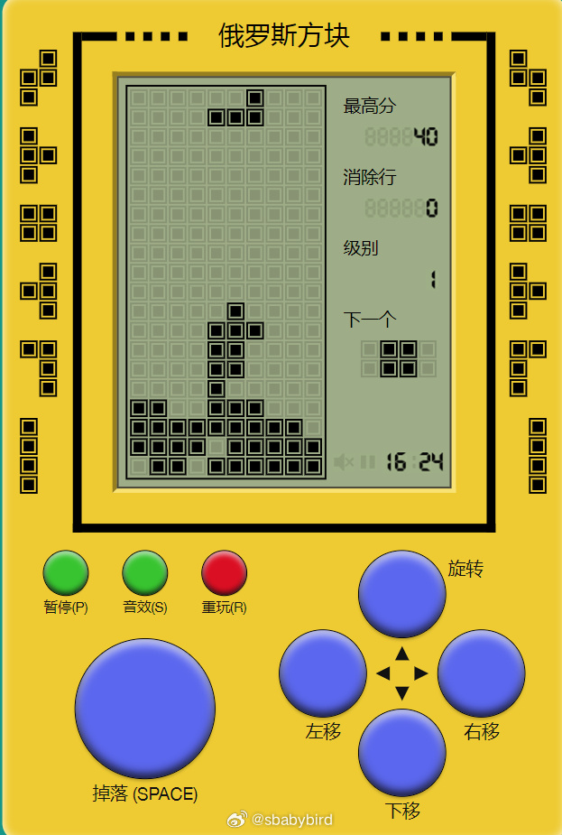
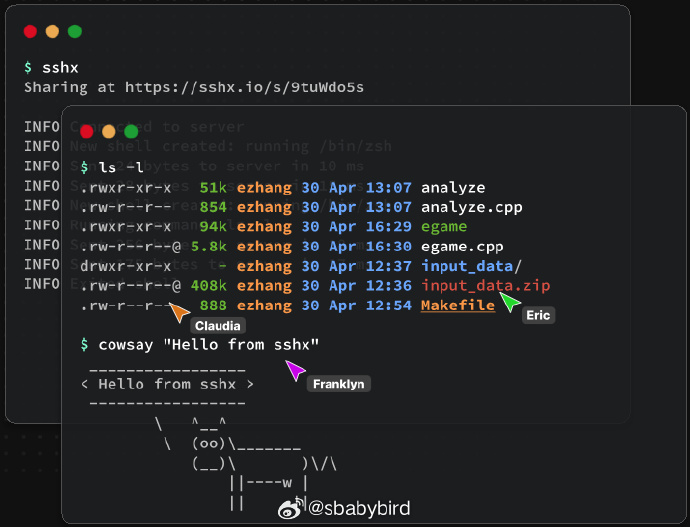
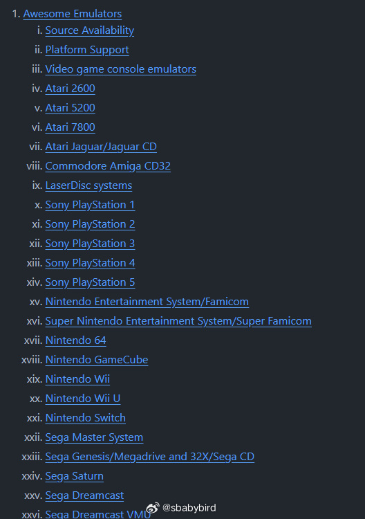
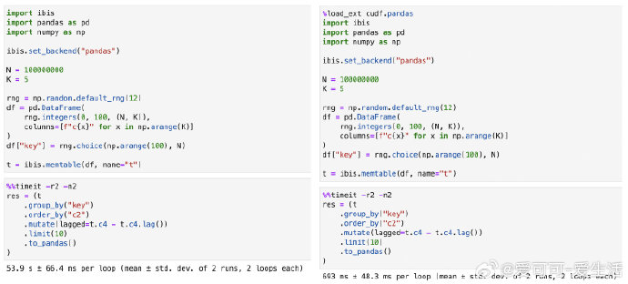
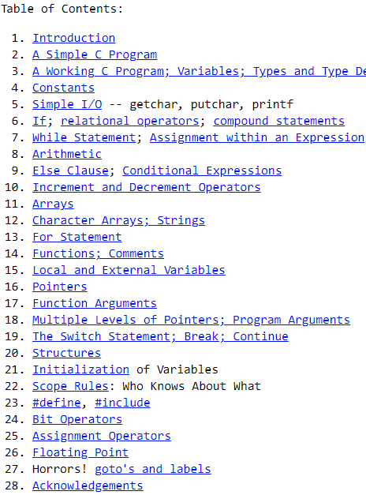

# 机器文摘 第 058 期

## 长文 
### 将运行在 50 年前处理器上的程序性能提升 1800 倍

[《将运行在 50 年前处理器上的程序性能提升 1800 倍》](https://mark.engineer/2023/11/speed-up-a-program-for-50-years-old-processor-by-180000/)。

了解过一点儿计算机历史的都知道世界上第一台真正的电子计算机是 1946 年宾夕法尼亚大学的 ENIAC。

当年科学家实现了在 ENIAC 上计算 PI 的小数点后 2035 位，耗费时长大概是 70 个小时。

技术发烧友有一个流派，就是深挖各种硬件的极限性能。

为此，此文作者希望挑战这个记录。

即：在 Intel 4040 （4004 的后续产品）CPU 上计算 PI 的小数点后 2035 位，并在耗时上小于 70 小时。

当然这不是一件容易的事情，涉及到算法选择，以及在捉襟见肘的指令集上反复优化。

文中对使用计算机计算 PI 的方法也做出了比较详细的介绍。

### 又有人自己动手写编译器

[写一个编译器非常简单](http://sebmestre.blogspot.com/2023/11/en-writing-compiler-is-surprisingly.html) （吗？）

写这篇文章的作者从小就希望创造一个属于自己的编程语言，但是从来没有完成过。

因为每次做到“从源码生成汇编代码”这一步时就因为复杂度而放弃了。

后来很多年过去了，作者总觉得欠小时候的自己一个编译器。

于是他决心自己动手撸出来一个。

在这个过程中，他发现，如果设置合理的限制条件的话，做个编辑器并没有想象中的那么难。

文中分享了整个编写过程，限制条件为：
1、目标平台为 x86-64 处理器；
2、只生成汇编代码，由汇编到可执行文件的过程交给 gcc 来干；

### 复杂的问题不等于重要的问题
为什么有的时候人们会把简单的问题复杂化，看完这篇[《你不需要解决困难的问题》](https://www.benkuhn.net/hard/)可能会找到一点儿线索。

文章作者在学生时代以“解决棘手问题”作为最高工作目标，并引以为傲地写入简历。

后来经历过现实中各种目标、边界、考核维度都十分模糊的项目之后，作者感悟到了原因。

即：很多人在现实中错误的将“困难的”问题跟“重要的”问题划上了等号。

所以在工作中拆解目标时，很容易陷入“困难”、“复杂”的问题中去，而实际上，识别那些问题更重要，哪怕它是简单枯燥的，那也应该优先解决它们。

### 纯 Javascript 操作 DOM 

使用框架使多了，已经忘了用原生 Javascript 怎样跟 DOM 元素打交道？

这里有个系列文章[《使用纯 Javascript 精通 DOM 操作》](https://phuoc.ng/collection/html-dom/)。

作者编写了十分详尽的文档，并列举了丰富的例子帮我们掌握在不借助任何外部框架的基础上，操作 DOM 元素。

这些文章每篇都解决现实中一个特定的问题，并给出了最佳实践。

每篇文章都可以在线交互运行代码示例，例子很小巧、容易理解。

系列文章深度由浅入深，从最基本的元素插入、修改，到高级的光标定制、滚动条定制与交互操作等，覆盖面非常广泛。

## 资源
### 逼真的俄罗斯方块模拟器

[俄罗斯方块](https://chvin.github.io/react-tetris/?lan=zh-cn)。非常复古拟真的俄罗斯方块游戏，手机或 PC 直接打开链接即可玩。 ​​​

### 在线协作终端

[sshx](https://github.com/ekzhang/sshx)。一个基于 Web 的安全协作终端。

具有实时协作功能，可以远程分享终端环境。端到端加密，采用 Rust 编写。 ​​​

### 复古游戏机模拟器大全

[awesome-emulators](https://github.com/DerekTurtleRoe/awesome-emulators)。这是一个开源的专门收集复古电脑和游戏机模拟器的仓库。 ​​里面整理了非常齐全的复古电脑和游戏主机的不同版本的模拟器。​

### GPU 加速科学数据处理

[cuDF](https://colab.research.google.com/drive/12tCzP94zFG2BRduACucn5Q_OcX1TUKY3)是 Nvidia 开发的 pandas 加速器。

只需一行代码将 Pandas 代码的速度提高 10-1000 倍

Notebooks 运行：`%load_ext cudf.pandas`

命令行运行：`python -m cudf.pandas`

### 贝尔实验室在上世纪七十年代的 C 语言教程

[bwk-tutor](https://www.lysator.liu.se/c/bwk-tutor.html)，一份 1974 年，贝尔实验室的 C 语言教程。

### 年会抽奖工具

[lucky-draw](https://vitozyf.github.io/lucky-draw/index.html)。

一个开源的抽奖工具，基于网页技术实现，支持导入名单和人员照片作为头像。 ​​​

### 笔记本的 Nvidia 独显竟然没有视频编码硬解支持
老黄刀法精准，从多年前就开始了。

我近期才发现我那个老掉牙的笔记本电脑（Thinkpad t450s），里面带的 Nvidia 940M 显卡居然不支持视频格式硬件解码。

如果我使用独显渲染网页（在 Win10 的图形设置里将浏览器强制指定使用独显，本以为这样会提升性能）的话，访问哔哩哔哩这些视频网站就只能使用 CPU 软解视频流。

导致 CPU 占用极高。

今天抱着试试看的态度将之切换为核显，结果发现 Intel 核显支持各种视频格式的硬解，CPU 占用一下就下去了。 ​​​

## 观点
### 痛苦就是信息
小时候，当你触碰到滚烫的物品时，你感觉到了疼痛。这份疼痛给了你一条信息：小心滚烫的东西。

当你报名参加马拉松比赛时，你是在跟痛苦签约，但跑步过程中你是否要继续，则取决于你自己。用村上春树的话说，“痛苦是必然的，但受苦是可选择的”。你可以选择痛苦，而不选择受苦。

痛苦就是信息，信息也会带来痛苦。重塑大脑并不是一个无摩擦的过程，有些知识只能通过艰难的方式获得。

越早将痛苦转化为知识，你就越早能体验到下一个有用的痛苦。不要让自己多次经历同样的痛苦。要获取新的信息，你必须经历新的痛苦。

人们常说“知识就是力量”。如果痛苦就是信息，那么痛苦也可以转化为力量。为此，你必须学会控制你的受苦，接受伤疤其实是美丽的。

如果你感到痛苦，问问它给了你什么信息。如果那个信息很有用，那就寻找下一个痛苦。这就是学习的过程。

来自微博[@本恰恰-](https://weibo.com/2166767661/NrRSBpk8l)

## 订阅
这里会隔三岔五分享我看到的有趣的内容（不一定是最新的，但是有意思），因为大部分都与机器有关，所以先叫它“机器文摘”吧。

喜欢的朋友可以订阅关注：

- 通过微信公众号“从容地狂奔”订阅。

- 通过[竹白](https://zhubai.love/)进行邮件、微信小程序订阅。

