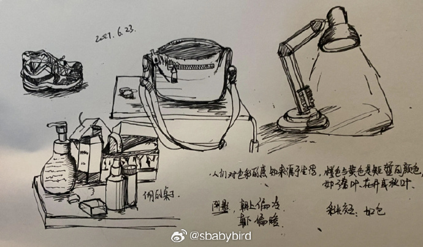
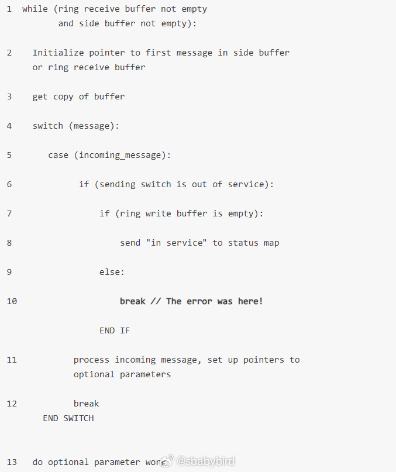
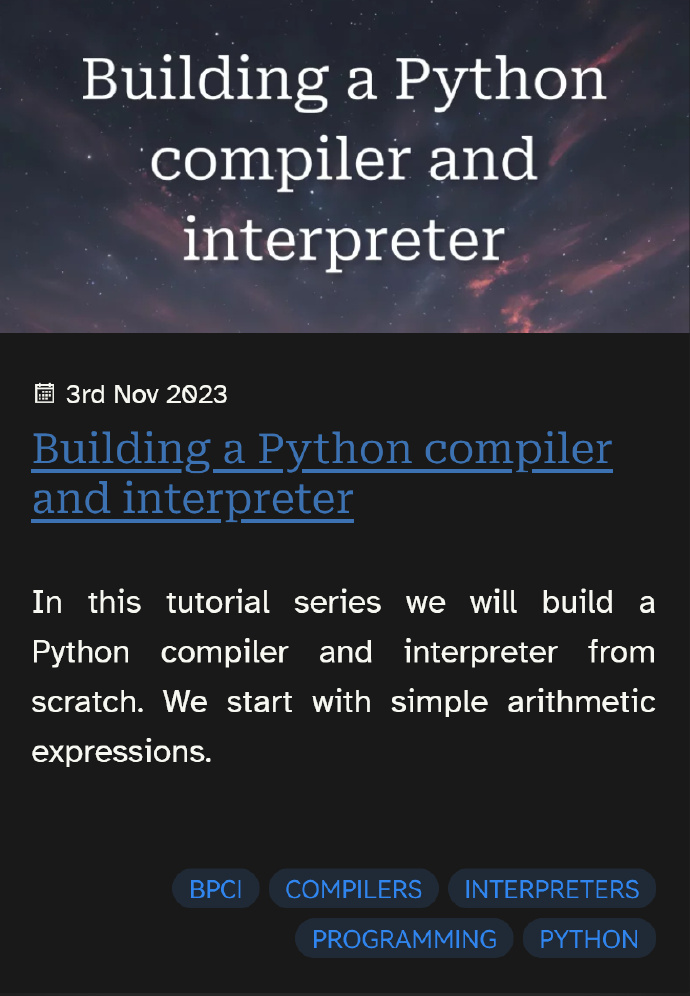
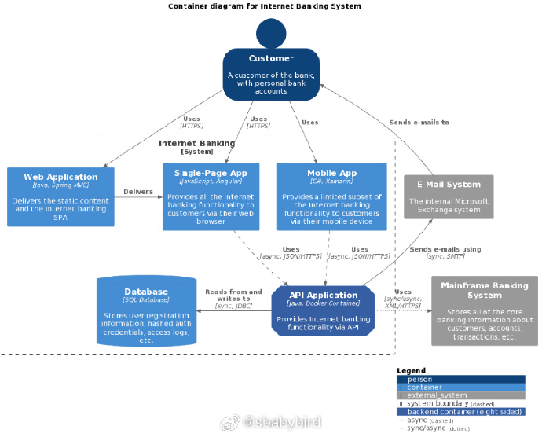
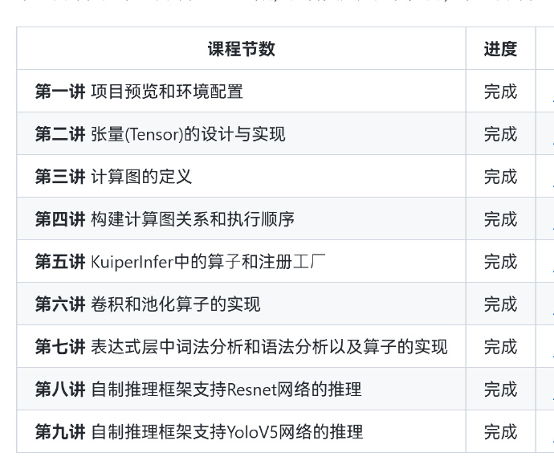
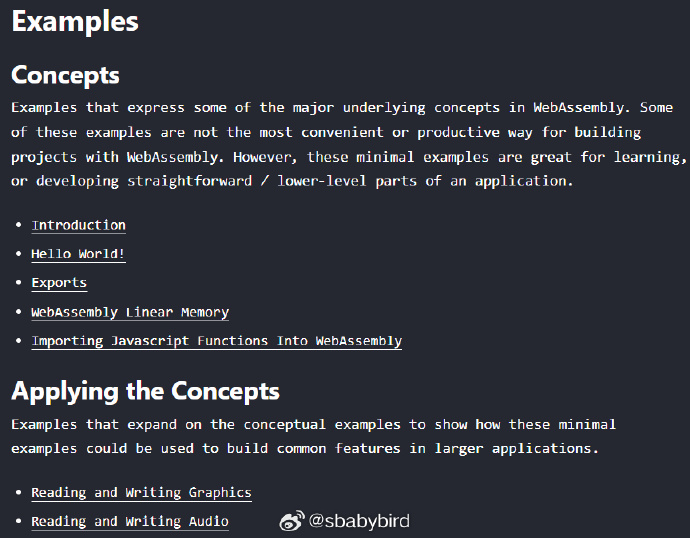
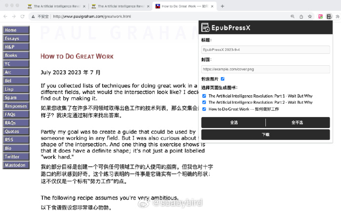
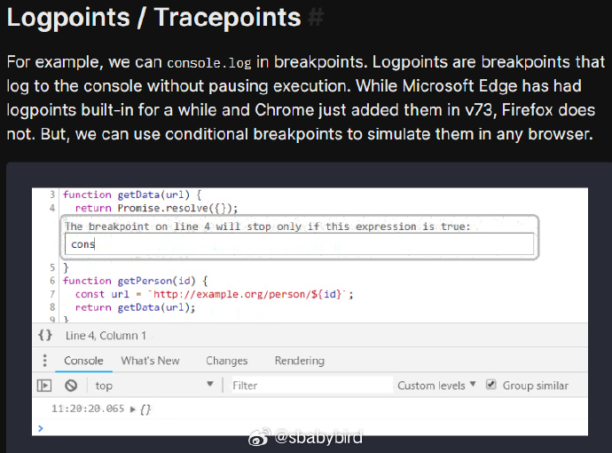
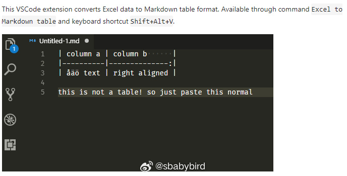
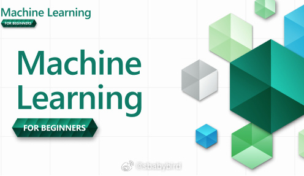

# 机器文摘 第 059 期

## 长文
### 一个独立游戏开发者自学手绘的探索

[以笔为剑：聊一聊独立游戏开发者的邪道自学绘画](https://indienova.com/indie-game-development/the-process-of-learning-art-for-an-indie-game-developer/)。

作者是一个独立游戏开发者，受限于美术资源的匮乏只得自己学习绘画并亲自制作（当然我感觉作者本身是热爱绘画的）。

他谈到了自己曾多次启动学习绘画的计划，但每次都被“系统性学习”这个概念给压倒，周围一帮人要告诉他正确的学习方法和“最佳实践”。

而这个“最佳实践”就是“素描是一切的基础”，以及艺术成就来自大量练习和“天生的”。

作者在这个框架下多次挫败、放弃、重启，然后再失败。

终于有一天他悟了，作为擅长计算机图形学的开发者，能否用 3D 建模以及渲染的思维来学习绘画呢？

他决定尝试，并取得成功。

作者文风幽默，可见其对生活、学习乐观积极，文章记录了详细的学习过程，对于有绘画情节的开发者，也许会有所触动。

### 一行代码造成 6 千万美元损失的故事

[一行代码造成 6 千万美元损失的故事](https://engineercodex.substack.com/p/how-one-line-of-code-caused-a-60)

这个故事发生在 1990 年，AT&T 当时是全球最大的通信公司，因为这次事故导致了近一半的网络瘫痪， 6 万人无法通话，500 个航空公司的航班延误。

原因是有人更新了运行在交换机上的程序。

按理说应该会经过严格测试才能上线，但这次没有测试就上线了，因为“改动很小，只有一行代码”。

正是这行代码中出现了因为看错语句嵌套而写错位置的“break”语句，导致了数据被错误覆盖，然后监控程序识别到这个错误就会重启交换机，结果一时间，大量的交换机被重启，网络瘫痪了。

### 用 Python 写一个 Python

[Building a Python compiler and interpreter](https://mathspp.com/blog/building-a-python-compiler-and-interpreter)。

> 在这一系列的文章中，我们将从头开始用 Python 语言实现 Python 编程语言。

> 这个系列的最终目标是探索和体验实现类似 Python 编程语言所需的概念和算法。为此，我们将创建一种具有 Python 部分功能的编程语言，并在此过程中涉足词法分析器、解析器、编译器和解释器的实现！！

### 用 c4model 进行软件架构设计

[C4](c4model.com) 是的一个比 UML 更简练的系统架构模型。

C4的理念是，具体把系统分为：System Context（上下文）, Container（容器）, Component（部件）, Code（代码）。

这四层每层代表着不同的视图架构，每层适用于不同的系统角色，我们会针对当前的人员的角色，找到共同的关注点（合适的层级）来统一认识，然后展开设计。

但是介绍它如何落地使用的资料偏少，这里我找到了[一篇关于如何使用 C4 模型进行架构设计的入门文章](网页链接)。

介绍了基本的概念以及如何在 vscode 里使用 PlantUML 插件进行绘图。

## 资源
### 自制深度学习推理框架

[KuiperInfer](https://github.com/zjhellofss/KuiperInfer)，带你从零实现一个高性能的深度学习推理库，支持Unet、Yolov5、Resnet等模型的推理。

### 去除图片任意物体（网页版）

[inpaint-web](https://github.com/lxfater/inpaint-web/tree/main​)，一个运行在浏览器端的inpaint实现，能够去除掉图片的无关物体。

### 跟着例子学 Wasm

[Wasm By Example](https://wasmbyexample.dev/home.en-us.html)，一个简洁的、通过示例介绍 WebAssembly 的站点。

通过代码片段和带注释的 WebAssembly 示例程序让你更好的理解 WebAssembly 技术的使用。 ​​​

### 把网页做成电子书

[EpubPressX](https://github.com/sunxen/EpubPressX)，一个 chrome 浏览器插件，可以将打开的多个网页制作成一本 epub 电子书，然后在微信读书等进行阅读。 

### 浏览器调试器技巧

[browser-debugging-tricks](https://alan.norbauer.com/articles/browser-debugging-tricks)，一些浏览器调试器的使用技巧。 

### Excel 表格粘贴为 Markdown 格式

这个 vscode 的插件可真是太好用了：[Excel to Markdown table](https://marketplace.visualstudio.com/items?itemName=csholmq.excel-to-markdown-table) 。

用法比较简单，先在打开你的 Excel 文档，复制你要的表格内容。

然后 `Shift+Alt+V` 就可以转化并粘贴成 Markdown 格式的 Table 到你当前打开的这个文档中。 ​​​

### 机器学习入门课程

[ML-For-Beginners)](https://microsoft.github.io/ML-For-Beginners)，微软出品的面向初学者的机器学习入门课程（含PDF）。

虽然是系统学习，但比较偏向于实践，各种知识通过各种实例任务进行串接。 ​​​

## 观点
### 做好产品的人
只有那些心里有他人，真正为他人着想的人，才能做好产品，才能成为合格的工程师。----看到有人发布了一个基于 AI 的导盲 APP 有感。

## 订阅
这里会隔三岔五分享我看到的有趣的内容（不一定是最新的，但是有意思），因为大部分都与机器有关，所以先叫它“机器文摘”吧。

喜欢的朋友可以订阅关注：

- 通过微信公众号“从容地狂奔”订阅。

- 通过[竹白](https://zhubai.love/)进行邮件、微信小程序订阅。

