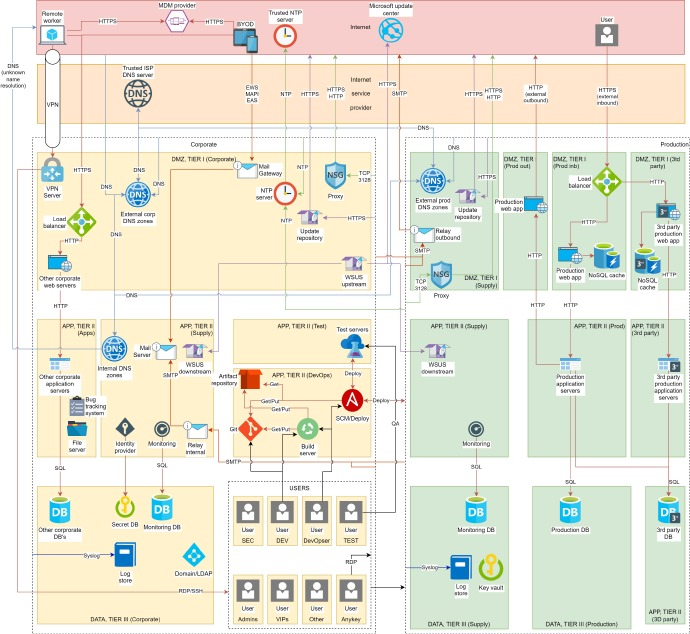

# 机器文摘 第 060 期

## 长文
### 在 Linux 下运行一个 Hello world 到底发生了什么？

这是一个有点儿类似于“你在浏览器里输入网址并回车之后到底发生了什么”的话题。

如果深入探讨的话，你会发现每一步都没有你想象的那么简单。

文章作者以运行 Python 程序 hello.py 为例，讲述从输入 `python3 hello.py` 到在控制台看到 `hello world` 字符串所发生的全部事情。

大致过程为：
1、解析命令；
2、寻找命令程序在磁盘中的位置；
3、获取可执行文件内容；
4、启动进程；
5、加载动态链接库及相关依赖；
6、执行文件指令；
7、看到执行结果；

文章中介绍了每一步在命令行下进行跟踪的细节，喜欢动手的可以跟着作者调试一遍，感受更深刻。

### 浮点数在计算机里是如何表示的

即便是每天都在与计算机打交道的程序员，也未必十分清楚浮点数在计算机是如何表示的，以及为什么要这样表示。

如果去看 IEEE754 （电气工程师学会制定的二进制浮点格式规范）又显得有些太枯燥。

这篇[《详解浮点数在计算机中的表示》](https://ciechanow.ski/exposing-floating-point/)容易下咽一些。

总的来说，计算机采用目前的这种表示方式，是权衡了表示精度与表示范围的矛盾，在有限的二进制位中尽可能的表达更高精度和更广的数值范围。

为了展示存储细节，作者甚至制作了一个网站 [float.exposed](https://float.exposed/)，用于展示浮点数在计算机中的每一个细节。

### 如果不想陷入困境，就去感知尚未察觉的事物

这篇[《现实世界有着惊人的细节》](http://johnsalvatier.org/blog/2017/reality-has-a-surprising-amount-of-detail)告诉我们一个容易被忽略的事实：物理定律本身往往非常简单——但这些定律的表现往往是复杂和违反直觉的，现实中的细节比理论上要复杂很多，要接受这种复杂度。

作者自幼跟随父亲从哥伦比亚移民美国，从小就跟兄长一起帮助父亲做一些建筑活计，在这些活动中，作者意识到了上面的问题。

在文中，作者以“建造一段简单的楼梯”和“观察水的沸腾举例”，看似简单的任务里面包含了丰富的细节。

现代社会的各种方便工具，让我们忽略了的很多繁琐，以至于更容易不加思索地接受别人通过他们的感知而获得的一些简化后的失真观点。

但事实上，作者提醒道，你要主动去了解现实的各种细节，这对于你成功地做事、解决各方面的问题，至关重要，否则就会陷入困境。

## 资源
### 企业划分网段的最佳实践

[Network-segmentation-cheat-sheet](https://github.com/sergiomarotco/Network-segmentation-cheat-sheet)

从简单到复杂，这个开源项目列出了4个不同级别的划分网段的最佳实践。​​​

### 一键禁用 Win10 自动更新

上次我分享了一个禁用 Win10 更新的方法（将系统时间调整到 2050 年，然后设置延迟更新时间），不过对于一些人来说操作还是过于麻烦。

这里有网友分享的一个[禁用 Windows 更新](https://cwj-cloud.s3.sgp.tebi.io/windows/%E5%85%B3%E9%97%ADwin10%E6%9B%B4%E6%96%B0.zip)的软件，可以一键禁用。 ​​​

### 开源数码照片后期软件

[ansel](https://ansel.photos/en/)，开源数码照片后期软件，可作为 Adobe Lightroom 平替。

支持 Linux 和 Windows 平台。 ​​​

### 浏览器跨窗口互动

最近有个浏览器跨窗口的 Demo 火了，多个浏览器窗口里的显示内容进行互动，组成复杂的图形。

大家纷纷放出了自己的代码实现。

在这里有一个：https://bgstaal.github.io/multipleWindow3dScene/

主要原理是通过localStorage存储来交换各个窗口的信息。 ​​​

还有个通过 websocket 的实现的，代码在这里： https://github.com/Momciloo/fun-with-sockets

### 学习 CSS Grid 布局的资料

[interactive-guide-to-grid](https://www.joshwcomeau.com/css/interactive-guide-to-grid/)，CSS Grid 布局的交互式指南。

虽然现在大家都 Flex 布局一把梭了，但是某些情况下 Grid 布局更加适合。

如果觉得 Grid 布局学起来稍微有些复杂的话，这篇教程应该会好理解一些。

### 最好的爬虫工具

[crawlee](https://crawlee.dev/) 评价很高的爬虫工具。

技术栈非常新，功能很强大。

支持两种模式，HTTP 和 Headless 模式。

其中，Headless 模式基于 Pupperteer 提供真实的浏览器模拟，支持 JS 渲染，有反封锁和类人操作模拟，可以降低被封概率。 ​​​

## 观点
### 电影和游戏
电影是一种可以观看的快进人生。

电子游戏是一种可以参与的快进人生。 ​​​

### AI 的另类用法

犯罪嫌疑人开始戴假手指，如果被监控摄像机抓取，会显得像是人工智能生成的图片，从而无法被当成证据。

--来自新浪微博：[@周健工](https://weibo.com/1666430060/NujKiqNr1)

## 订阅
这里会隔三岔五分享我看到的有趣的内容（不一定是最新的，但是有意思），因为大部分都与机器有关，所以先叫它“机器文摘”吧。

喜欢的朋友可以订阅关注：

- 通过微信公众号“从容地狂奔”订阅。

- 通过[竹白](https://zhubai.love/)进行邮件、微信小程序订阅。

