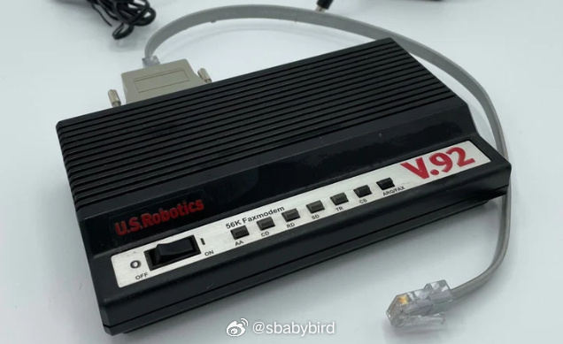
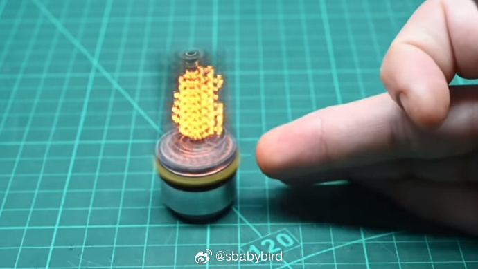
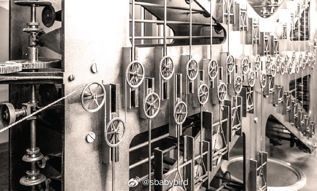
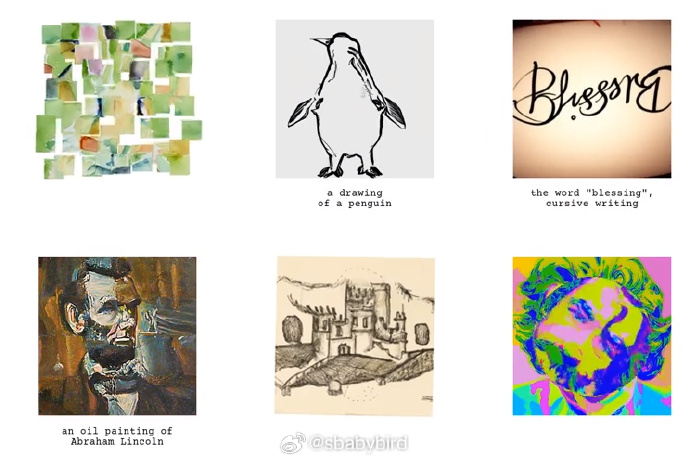
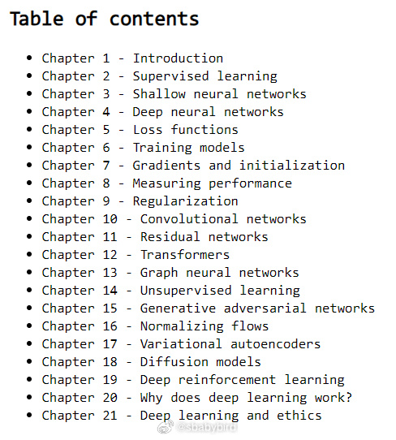
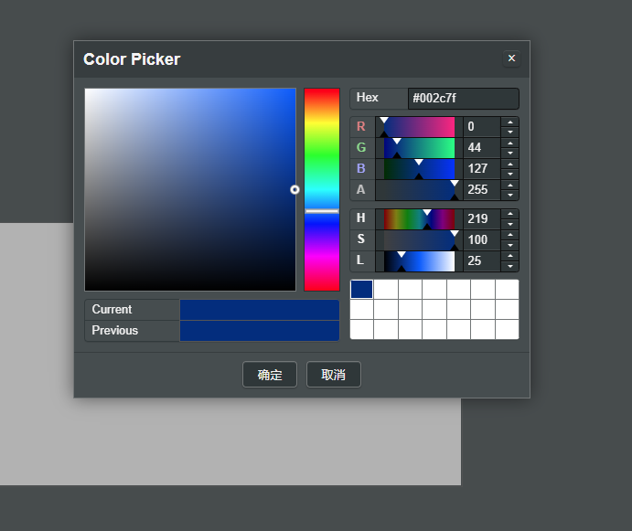

# 机器文摘 第 061 期

## 长文
### 在 ADSL 之前，电话线拨号上网，为什么最高只能是 56k？

用过最早的电话线猫拨号上网（非 ADSL 宽带）的同学，都体会过拨号即将接通那一刻猫欢快地吱吱叫（电影黑客帝国中能回味这种声音），你的心也如猫抓的感受。

然而当时没人太在意为什么那个猫的速率最高只能达到 56k 每秒（事实上这是理论值，现实中永远达不到）。

56 这个数字既不是 2 的幂，也不能被 10 整除，它是怎么来的？

国外有个闲人（他自己说的），认真研究了一大段历史，然后撰写这篇文章：[《为什么 56k 是最快的拨号调制解调器速度？》](https://www.10stripe.com/articles/why-is-56k-the-fastest-dialup-modem-speed.php) 记录了形成这个数字的原因。

大概如下：
1、电话线最初是为语音通话服务的，按照最小化成本的原则，选择了一个技术标准：4kHz 的带宽给语音。

2、转为数字交换机之后，只有用户到接入箱的信号是模拟的，其余都是数字化的，按照科学定律，数字采样频率为 4kHz 的两倍（也就是8000）即可完美保留信息了。

3、最开始的数模转换芯片是 8-bit 的，每秒 8000 的频率，所传输的数据为 8*8000，也就是 64k。

4、由于控制信息还要占用 1 位，所以 64k 并不能都给数据载荷，所以传输的数据位 7*8000，也就是 56k。

### 自制一个真 3D 显示器

[一个小小的体积显示器](https://mitxela.com/projects/candle)

这篇文章的作者使用电机带动一个 LED 点阵电路板的旋转，实现了一个逼真的 3D 显示器，虽然分辨率很低，但是它真的是 3D 的。

支持从水平方向上的各个角度观看。

技术通过调节 LED 的点亮时间与电机旋转速度的匹配，以实现不同角度显示不同画面的效果。

### 怎样搭建自己的电子邮件服务？

[探索自托管电子邮件服务](https://synergeticlabs.com/email-alchemy/)。

很少有技术能像互联网上的电子邮件服务那样保持其原始形式。

虽然它有时会穿上一些不同的马甲，但基本概念和协议至今基本保持不变。

现在普通用户使用电邮服务基本上都要依托于几家大的服务商（谷歌、微软、苹果等，国内有网易、阿里、腾讯等）。

这样做的代价就是会被特定的系统绑定，不得不依赖电邮服务商所构建的生态，失去了自主控制的能力。

本文作者正是基于摆脱特定服务商控制的目标，意图构建一套完全自主管理和运营的电邮系统。

这在上个世纪电邮刚刚兴起的时候或许还更简单一些，现在由于那些服务商的垄断，导致不得不面临一些技术问题。

有兴趣的朋友可以跟随作者感受一下完整的从技术选型到构建的过程。

### 语音识别时怎样区分多人谈话？

----来自微博[@Barret李靖](https://weibo.com/1812166904/NuI5ridW8)
OpenAI 推出的开源免费 Whisper 在语音识别领域（ASR）可以说无出其右，不过它有一个较大的局限性，就是无法进行说话人分类（Speaker diarization），尤其是在重叠语音检测（Overlapped speech detection）方面，Whisper 在训练过程中只识别了一个声音，同时将其他声音视为背景噪声。

社区有一个发展了多年的音频处理工具包，[pyannote-audio](https://github.com/pyannote/pyannote-audio)，它具备非常强大的音频分析、处理、识别和分类能力，在多人同时讲话的时候，也可以很准确地区分说话者内容，只不过它的 ASR 能力还是比不过 Whisper。

有人想到结合两者的能力，并做了一个[工程化的实践](https://colab.research.google.com/drive/12W6bR-C6NIEjAML19JubtzHPIlVxdaUq)，大致思路如下：

1）通过 pyannote-audio 将不同 speaker 的音轨时间片段给识别出来

2）将不同 speaker 的声音按照各自的时间片段进行合并，空白处使用静音填充

3）将分离的多个 speaker 音频交给 Whisper 进行语音识别

4）最后将识别的内容按照 speaker 和时间顺序进行还原

这个实验还演示了如何使用 yt-dlp 从 Youtube 下载视频，如何使用 pydub 分离音频，以及解决了 Whisper 和 pyannote-audio 安装时的依赖冲突问题，算是一个比较完整的解决方案，不过这个思路需要对音频进行多次分析（取决于 speaker 数量），性能一般。

[这篇文章提出了一个性能稍微优秀一点点的方案](https://medium.com/@xriteshsharmax/speaker-diarization-using-whisper-asr-and-pyannote-f0141c85d59a)，仍然是通过工程手段解决问题：

1）首先利用 pyannote-audio 根据静音、暂停和说话者变化等特征，将音频流分割为更小的片段

2）对于每个片段，将不同说话者的语音特征提取出来（Speaker Embedding）

3）将分割的片段极其衍生的更多片段进行聚类（Clustering）和打标（Labeling）

4）最后交给 Whisper 进行语音识别

这部分[工程的实现已被作者整理成一个开源项目](https://github.com/riteshhere/Speaker_diarization)，目前还没有找到更优的解决方案，不知道有经验的朋友都是如何去做的？

### 有哪些值得推荐的冷门技术？

[有网友在 HN 上发起的一个讨论](https://news.ycombinator.com/item?id=38499134)，里面抛出了很多平时不被广泛了解的技术或产品。

比如：
1、[U++](https://www.ultimatepp.org/)：一个跨平台的 C++ 快速开发框架，专注于提高程序员的生产力。它包括一组库（GUI、SQL 等）和一个集成开发环境。

2、[flatassembler](https://flatassembler.net/)：一个专门学习高级汇编语言的网站。

3、[模拟计算]()：纯机械、利用物理系统实现的计算系统，有人认为实现神经网络的最合适技术不应该是基于二进制的数字技术，而是基于机械运动的模拟计算。

## 资源
### 用 AI 生成视觉错觉图片

[visual_anagrams](https://dangeng.github.io/visual_anagrams/) 是一个用 AI 生成视觉错觉图的样例站点。

生成的图片从正方向来看是一副图像（比如人像、景物等），倒转 180° 之后是另外一副图像，也可以是其他人物或者景物。

项目开源并且有对应的论文。 ​​​

### 深度学习入门

[Understanding Deep Learning](http://udlbook.com)。一本深度学习入门的电子书。基于 MIT 协议开源。

注重实操，从基础概念一直讲到最新比较流行的神经网络模型。

每个章节都附带可直接运行的样例代码（以 ipynb 格式呈现）。 ​​​

### 在线网页 PS 

[在线PS网页版](https://zaixianps.net/)。

## 观点
- [NordPass](https://nordpass.com/most-common-passwords-list/) 公布了 2023 年 Top200 常见密码，其中“123456” 5 年 4 次登顶常见密码榜，可被秒破。
- 我感觉“123456”搭配上用户名“admin”更有内味儿。

## 订阅
这里会隔三岔五分享我看到的有趣的内容（不一定是最新的，但是有意思），因为大部分都与机器有关，所以先叫它“机器文摘”吧。

喜欢的朋友可以订阅关注：

- 通过微信公众号“从容地狂奔”订阅。

- 通过[竹白](https://zhubai.love/)进行邮件、微信小程序订阅。

