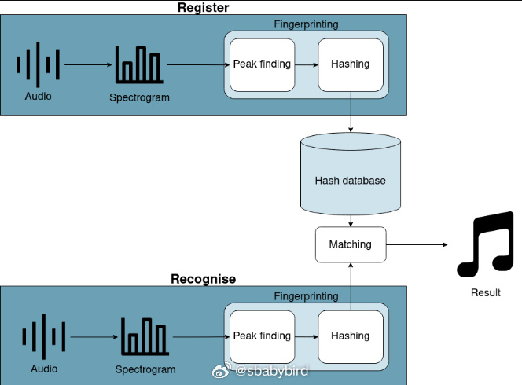
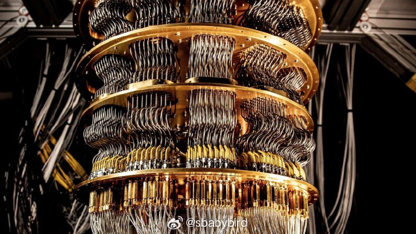
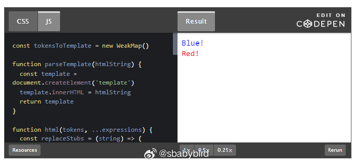
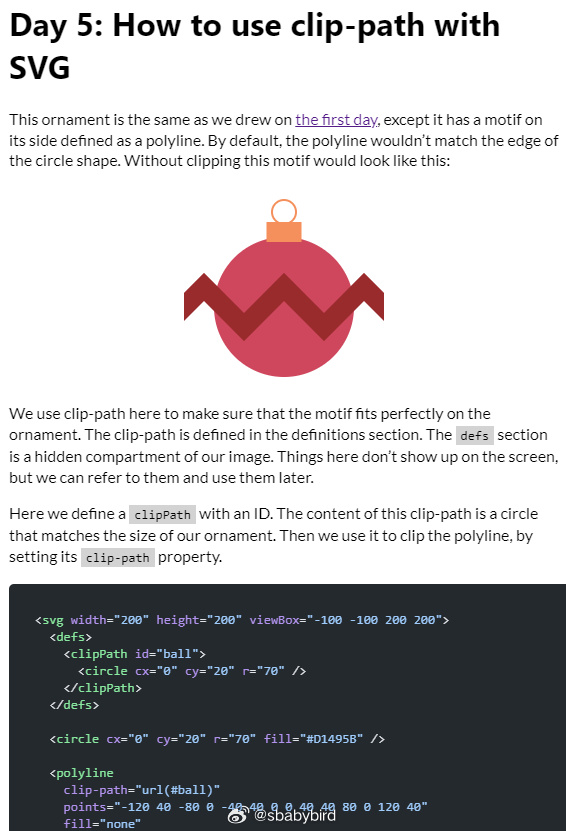
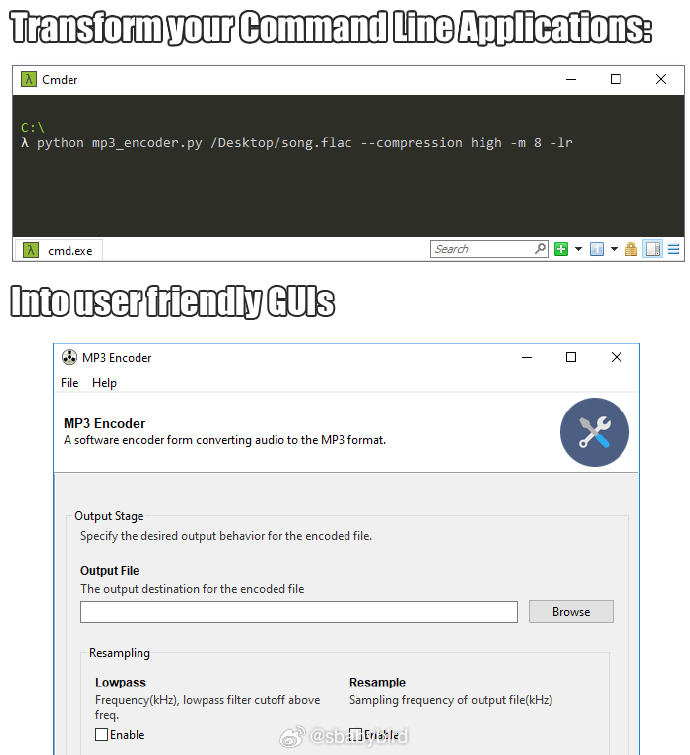
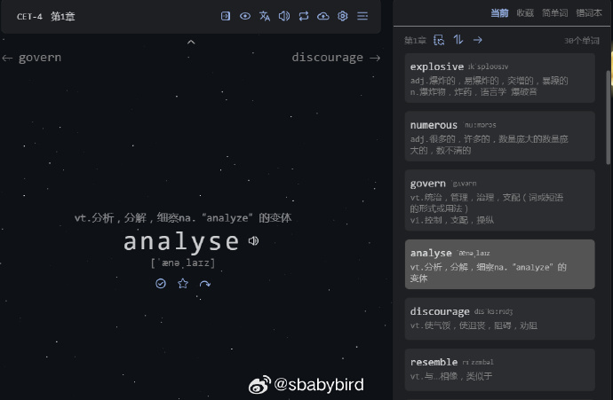
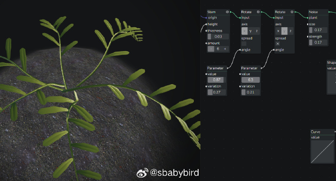
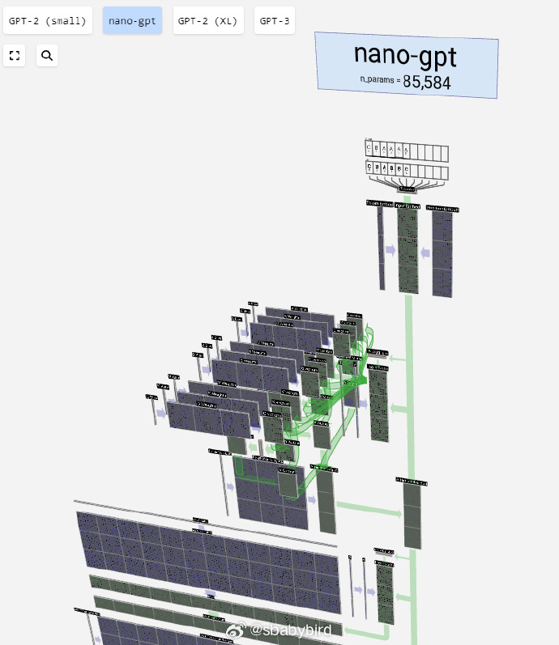

# 机器文摘 第 062 期

## 长文
### 听歌识曲的技术原理

现在不少音乐播放应用以及网站音乐库都提供了“听歌识曲”的功能。

其背后的原理是怎样的？是否有个人蹲在后台一边听一边帮你搜索呢？

[Shazam是如何工作的](https://www.cameronmacleod.com/blog/how-does-shazam-work)，这篇文章介绍了一款听歌识曲软件及其背后的工作原理。

Shazam 可以说是听歌识曲界的鼻祖了，最早的时候，它只是一个电话号码，用户遇到要识别的歌曲，只需拨打这个电话，然后 30 秒后挂断电话，用户就会收到歌曲信息的短信了。

最开始那还是 2002 年，那时的电话音质，真是一言难尽，我怀疑最初真的是老板蹲在那儿接电话。

其基本原理如下：

1、生成曲库中每一首歌的频谱图（当然离不了傅里叶）；

2、使用算法提取每首歌的声纹特征（主要是通过在频谱中查找峰值）；

3、Hashing 散列算法固定声纹特征表示形式；

4、对未知歌曲做同样的提取声纹特征；

5、通过一种对齐算法，计算未知歌曲的声纹特征与数据库里的声纹特征对齐程度；

6、那个对的最齐的，就是答案。

### 量子计算机从入门到“精通”

毫无疑问，人类近几十年的飞速发展主要得益于计算机的发明。

这里的计算机实际上指的是，现在非常普及的计算机。

开关电子元件天然适合表达二进制数据的特性，使得我们现在能接触到的计算机，绝大部分都是基于祖师爷“图灵”的机器模型，和计算机之父“冯·诺依曼”提出的“程序+存储”架构的。

可是，假如有外星人，他们要发明计算机，或者如果宇宙中所有文明最终都进化出一种终极计算机的话，它应该是什么样的？

答案是：量子计算机。

量子计算机，号称速度高于传统计算机千万倍，分分钟破解现在最严苛的加密等等。

然而，吹嘘了这么多年，量子计算机一直没能摆脱它神秘的面纱。

这主要得益于大量媒体的捕风捉影和信口胡诌。

如果你也像我一样疑惑，可以看看这篇[写给好奇者的量子计算](https://quantum.country/qcvc)，作者试图以轻松又严谨的风格，认真聊聊什么是量子计算机。

这是一篇非常长的文章，不建议一口气看完（也看不完）。可以按照作者的设定进行小节划分，并尝试做一下里面的课后练习。

作者认为，只需了解一点点高等数学和线性代数的基础，就具备深入理解量子计算的能力。当然，如果对传统计算机原理（基于逻辑门）有所了解就更好了。

### 通过构建一个前端框架来学习前端框架

现代的 Web 前端开发已经基本离不开 React、Vue 之类的框架，此类框架比起上一代 jQuery 那种直接操作 DOM 元素的方式，有了更高层次的抽象和更清晰的逻辑分层。

然而由于这些框架追求封装和使用上的便利，对用户隐藏了很多内部细节，以使用框架入门前端开发的初学者，很难接触到事情的本质。

以至于一旦遇到问题，便无从下手，想要了解原理，又觉得这些东西太神秘深奥。

不过，最好的学习方式是在实践中学习，有网友写了这篇[Learn how modern JavaScript frameworks work by building one](https://nolanlawson.com/2023/12/02/lets-learn-how-modern-javascript-frameworks-work-by-building-one/)。

以现有新一代框架为模仿对象，自己动手做了一个最小化版本，实现了最核心的功能。

可以揭示一些前端框架的背后原理。

## 资源
### SVG 在线学习

[svg-tutorial](https://svg-tutorial.com/)，一个学习 SVG 绘图的网站。叫你用源码一点点绘制 SVG 图形。

课程涵盖简单图元和复杂的动画。 ​​​

### 给命令行程序加上图形界面

[Gooey](https://github.com/chriskiehl/Gooey)，又一个很有创意的 Python 库，可以给几乎所有使用 Python3 编写的命令行程序加上图形界面。

只需要在你的 Python3 脚本里引入这个库，然后在主函数之前加上一个 `@Gooey`注解。 ​​​

### 边练指法边背单词

[ttentau](https://typing-word.ttentau.top/)。一位工厂小哥，利用下班时间在 B 站学习前端开发。

然后用 Vue 写了这个一边练习打字一边背单词的网站。

网站参考了 [qwerty-learner](github.com/RealKai42/qwerty-learner/) ，不过增加了生词本、错词本、简单词 的功能。

佩服小哥的学习力和执行力。

----来自 V 站 ：h++ps://www.v2ex.com/t/997978

### 植物模拟器

[Simulate 3D plants in the browser](https://plant.max-richter.dev/)，在浏览器中模拟渲染 3D 植物，通过参数化节点控制模拟效果。

### 可视化 LLM 大模型

[LLM Visualization](https://bbycroft.net/llm)，这个网站应该是把开源大语言模型的神经结构给 3D 建模了。可以图形化查看不同版本大模型的神经网络架构。 ​​​

## 观点
### 弯路与直路
无论是一万小时定律还是有效练习的理论，都好像规定了必须不能浪费练习时间。

这给人带来误解和焦虑。

任何一个熟练的技能习得，一定是浪费了很多时间在看似低效甚至无效的重复练习上，因为要靠这个来感悟真正的心法。

很多人站在起点，一心只想着避免走弯路，实际上这世上哪有直路，弯路才是必经之路。

## 订阅
这里会隔三岔五分享我看到的有趣的内容（不一定是最新的，但是有意思），因为大部分都与机器有关，所以先叫它“机器文摘”吧。

Github仓库地址：https://github.com/sbabybird/MachineDigest

喜欢的朋友可以订阅关注：

- 通过微信公众号“从容地狂奔”订阅。

- 通过[竹白](https://zhubai.love/)进行邮件、微信小程序订阅。

