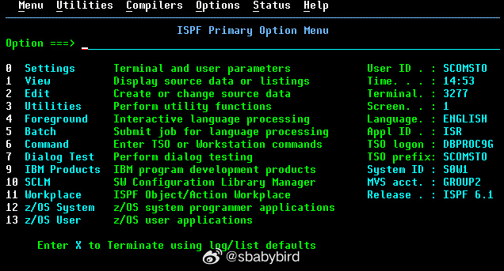

# 机器文摘 第 063 期

## 长文
### 采访一位真正的古董程序员

HN 上有一个程序员发布了一篇帖子里面记录了[一些关于他的程序员母亲的工作经历](https://ezali.substack.com/p/interviewing-my-mother-a-mainframe)。

他的母亲是一位 [COBOL](https://baike.baidu.com/item/COBOL%E8%AF%AD%E8%A8%80) 程序员，为一家大型银行工作，负责给 IBM 的大型机编写程序。

这是一个难得的访谈。

毕竟现存的、仍在一线工作的 COBOL 程序员屈指可数。

里面提到了一些有意思的点：

1、1991 年最开始从事这个工作的时候，他的母亲还需要通过智商、心理健康等一系列严苛的测试。

2、现在这些程序仍然在运行，而且非常重要。如果他妈妈和那几个共同维护的员工一起消失的话，那家银行会在几周内倒闭。

3、使用的数据库是基于当年 IBM 给阿波罗登月计划开发的后续版本，而且积累了大量的数据，如果想要迁移到现在流行的支持通用 SQL 语言的数据库则需要数年时间。

4、主要的数据是历史交易记录，大概存了 110 亿笔，法律规定这些数据要至少保存 10 年不能丢失。

5、他们所用的 IDE 更像是一个包含了一切的操作系统（注：不是 Emacs），叫做 ISPF，直接连接到大型机，没有本地开发环境。

### 一条奇怪的 CPU 指令

在目前使用的大多数 CPU 里，都有一条名为 popcount 的指令，是“population count”的缩写。

它的作用是计算一个二进制机器字中的 1 的个数，比如（为简单起见，假设是 8 位 CPU ，一个机器字长 8 位），popcount(00100110) 是 3 ， popcount(01100000) 是 2 。

可是算这个有什么用？而且，为什么从上世纪六十年代一直到现在，大多数 CPU 里都有这个指令？

[你不会相信这个奇怪的 CPU 指令！](https://vaibhavsagar.com/blog/2019/09/08/popcount/)一文介绍了这个指令的来龙去脉。

最初是 NSA（美国国家安全局）出于密码分析与加解密需要而加入的，后来随着时间推移逐渐用不到了，于是人们又发现了它还有其他的用途。

比如：纠错、用于卷积神经网络的矩阵乘法等等。

文章里提到了一些人们发明的有效算法，而使得这个指令得以保存，直到今天还在发挥作用。

### 平均每晚睡多长时间的人寿命最长？

《我们为什么睡觉》是英国科学家马修·沃克（Matthew Walker）2017 年写的有关睡眠的科普书籍。

此书被 NPR 评为当年最受欢迎的科普书籍。

书中声称，每晚睡眠少于六七个小时会使一个人增加患癌风险。

然而此观点并未受科学证据支持。

这篇[《我们为什么会睡觉》一书中的错误观点](https://guzey.com/books/why-we-sleep/)探讨了书中的一些错误观点，并通过引用科学论文数据的方式证实了该书的错误之处。

文章作者引用《科学报告》上的研究图表显示，平均每晚睡眠 5 小时的死亡率甚至低于每晚睡 8 小时。

有科学研究调研了超过 155 万名参与者和 8 万名癌症病例，发现睡眠时间短或长都与癌症风险增加无关。

所以科普读物有时候会缺乏科学严谨性，不可全信。

### 边做边学迷你数据库

你在为产品选择不同的数据库时，了解它们之间的差异吗？

抛开那些用于宣传的营销用语，哪些是它们最重要的指标？

这里有篇文章，作者通过动手做一个小数据库，以了解学习[数据库的基础知识](https://tontinton.com/posts/database-fundementals/)。

从数据库的基本要求： ACID（原子性、一致性、隔离、持久性）讲起，逐步实现对数据的存储、搜索、过滤等基本操作。

## 资源
### 科技美感，一些上世纪控制室照片

[前苏联的复古科技感的控制室](https://designyoutrust.com/2018/01/vintage-beauty-soviet-control-rooms/)，这个页面里收集了很多苏联时期的老式控制室。里面装满了大按钮和模拟表盘，喜欢那个时代复古科技的朋友不可错过。 ​​​

### shader 编程电子书

计算机图形学领域中，[着色器（shader）](https://zh.wikipedia.org/wiki/%E7%9D%80%E8%89%B2%E5%99%A8)是一种计算机程序，原本用于进行图像的浓淡处理（计算图像中的光照、亮度、颜色等），但近来，它也被用于完成很多不同领域的工作，比如处理CG特效、进行与浓淡处理无关的影片后期处理、甚至用于一些与计算机图形学无关的其它领域

[The Book of Shaders](https://thebookofshaders.com/?lan=ch)

这是一本关于 Fragment Shaders（片段着色器）的入门指南，它将一步一步地带你领略其中的纷繁与抽象。

本书用于学习 shader 编程入门是再合适不过了，在线版本还带有程序执行环境，可以边学边练。

### 在线学习莫斯码

[morse](https://www.perry.qa/morse)，一个在线学习莫斯码的网站。 ​​​

## 观点
### 故意留点儿工作给明天，对效率更好

“今日事，今日毕”是个好习惯不假。

然而有些人发现，对于有些需要长时间专注的工作（比如编程、写作），前一天留一点儿简单的“小尾巴”对于工作效率则更高。

原因是这点儿遗留的工作可以让你第二天迅速热身并进入“心流”状态。

而创作类工作进入这种状态非常重要，对工作效率有极大影响。

当然了，前提是你留下的是一个简单的“小尾巴”而不是“烂摊子”。

### 我的游戏喜好
比起无脑的砍杀，我更喜欢带有解密性质的游戏，《塞尔达-缩小帽》算是其中一种。

另外需要一定操作技巧才能上手的动作游戏也喜欢（掌握后可以进入心流），这一类的代表是《古墓丽影》，当然古老的《波斯王子》也算。

除此以外就是能快速进入状态的赛车游戏了。

不太喜欢需要十分深入剧情的游戏，比较耗神，比如《巫师》、《大镖客》等等，玩起来有些累。

## 订阅
这里会隔三岔五分享我看到的有趣的内容（不一定是最新的，但是有意思），因为大部分都与机器有关，所以先叫它“机器文摘”吧。

Github仓库地址：https://github.com/sbabybird/MachineDigest

喜欢的朋友可以订阅关注：

- 通过微信公众号“从容地狂奔”订阅。

- 通过[竹白](https://zhubai.love/)进行邮件、微信小程序订阅。

