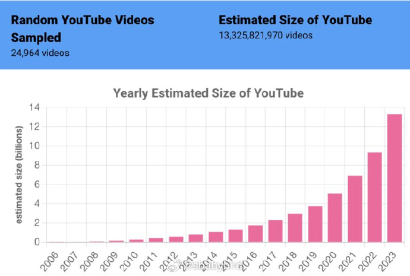
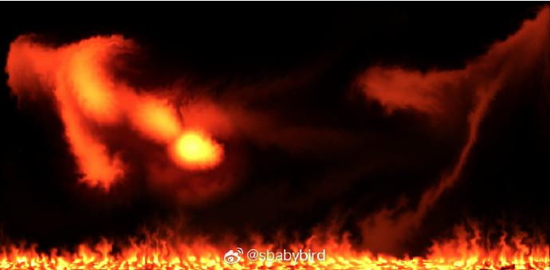
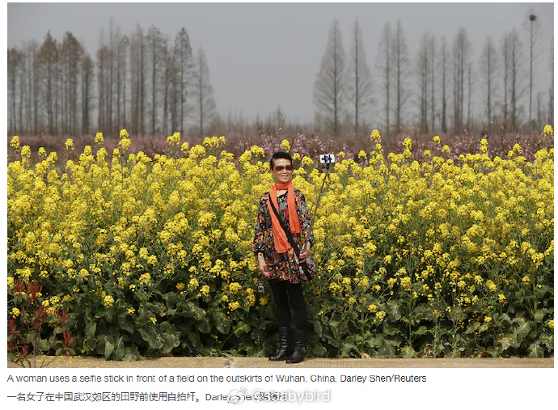
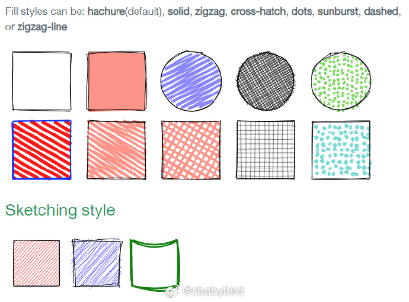
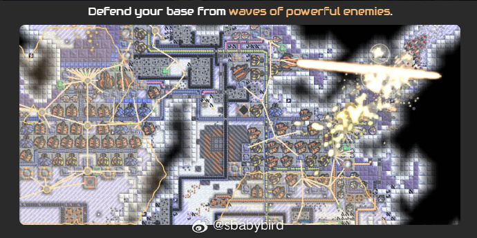
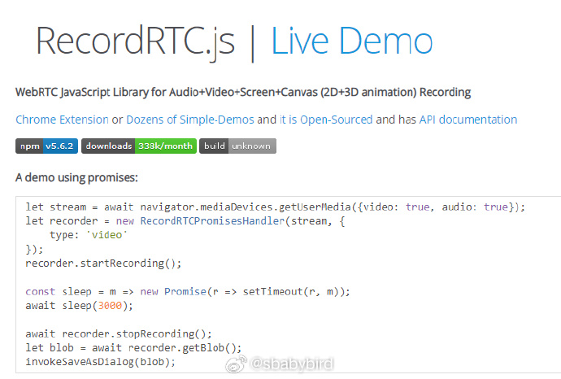
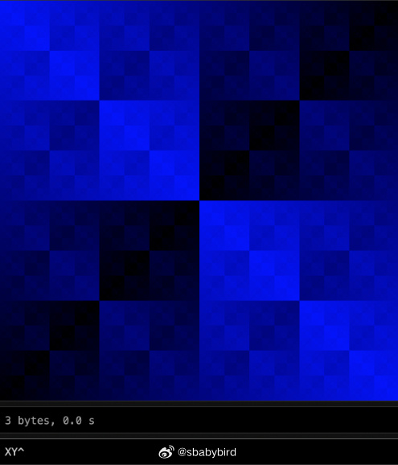
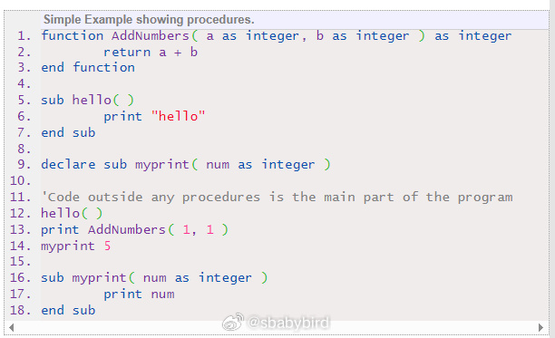
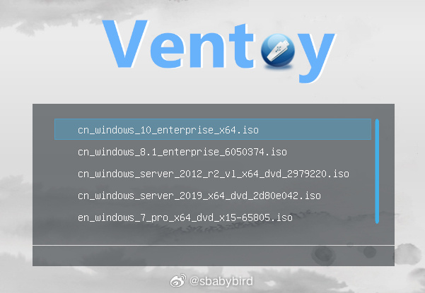
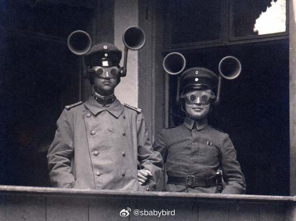

# 机器文摘 第 064 期

## 长文
### [Youtube 到底有多大？](https://ethanzuckerman.com/2023/12/22/how-big-is-youtube/)

作为世界上第一大的视频网站，Youtube 的体量想必是很大了。

但是究竟有多大，很多人可能没有概念。

有人对此做了一些研究，使用了一些有趣的手段，最终形成一篇报告，记录了对这个视频网站的探索过程。

有趣的一些点：

1、仅 2023 年一年就有超过 40 亿个视频发布在 Youtube。

2、Youtube 视频的观看次数中位数仅为 39 次。

3、Youtube 只喜欢向观众推荐观看次数超过 10000 次的视频。

4、作者是通过随机算法来批量猜测视频网址的方法进行统计计算的，因为不可能把所有视频都检索一遍。

### 在 GPU 上模拟火焰

火焰模拟是一个有趣的图形问题。

过去的方法通常是采用非物理计算去伪造。

例如，电影《指环王》中使用了大量烟雾的精灵（即使是对电影工业来说流体模拟也是太贵了）。

所以当时像电脑游戏这样的实时渲染的，几乎只能使用非物理方法。

但在过去的 10 年里，GPU 使快速流体仿真变得容易。基本的流体动力学算法在GPU上很容易实现。

[这篇文章记录了如何在 GPU 上模拟火焰](https://andrewkchan.dev/posts/fire.html)。

它介绍了流体动力学背后的数学原理、用于建模流体的并行算法。

文中给出了用 WebGL 实现的 Demo 代码。

### 当相机替代我们体验生活，我们失去了什么？

答案是：我们失去了集中注意力体验生活的能力。

[《当相机替代我们体验生活，我们失去了什么》](https://theconversation.com/whats-lost-when-we-photograph-life-instead-of-experiencing-it-58392)这篇文章写于 2016 年，那时互联网的趋势已经是视频影像取代文字作为内容的主体了。

影像越来越多地成为与他人交流、获得肯定和记录新体验的重要组成部分。尽管一连串的颜色、像素、面孔和风景似乎只能丰富我们的想象力，增强我们与世界的互动，但事实似乎恰恰相反。

借助我们的手机和电脑，无论我们身在何处或附近，我们都会不断与他人联系并与之互动。但是，拍照和制作视频已成为这种数字交流的核心部分。

我们的冲动不是停留在当下——并真正观察我们所处的位置——而是利用所有的生活经历作为视觉上表现和表达自己的机会。

### 停止阅读新闻
[为什么你应该停止阅读新闻?](https://www.cnblogs.com/IcanFixIt/p/8524843.html)

[原文地址](https://fs.blog/stop-reading-news/)

我们花费数小时时间来消费新闻，因为我们希望得到充分的信息。

但这段时间过得好吗？新闻的定义是不持久的。

而且随着新闻变得更容易分发和制作成本更低，质量也下降了。

我们很少停下来问问自己，我们消费的是什么：这很重要吗？

这是否会经受住时间的考验——比如，在一周或一年之内?写这篇文章的人是否了解这个问题?

我们今天消费时间来阅读新闻的方式存在几个问题：

首先，新闻传递的速度有不断增加。 

过去我们必须等待才能得到一份报纸或八卦信息，与我们镇上的人们一起获取我们的消息，但现在不了。

由于通知、短信和其他干扰，新闻几乎在它发布的那一刻就能找到我们。

其次，生产新闻的成本大幅下降。

有些人每天为主要报纸写12篇博客文章。

几乎不可能在一个话题上写一些深思熟虑的东西，更不用说12个了。

在一年的时间里，可以写出2880篇文章(假设有4周的假期)。

你从他们所报道的主题中获得新闻的人的流利程度接近于零。

因此，你的头脑中充斥着关于孤立话题的表面观点。因为成本已经降到了接近零的水平，所以竞争非常激烈。

第三，新闻生产者试图劫持我们的大脑。 

新闻制作人一直保持着“调入，不要错过，跟随这个或者你会被误导，等等，看看这个！”的文化。

当你越来越多地消耗这种类型的新闻，你就会越来越少的关注那些重要的事情。

第四，激励机制失调。

在某种程度上，由于竞争激烈，大多数新闻媒体都被迫提供免费新闻。

毕竟，其他人都在这么做。

然而，当新闻免费的时候，你仍然需要付钱给人们，所以你从一个卖静态广告的订阅模式转向一个把观众卖给广告商的模式。

页面视图成为游戏的名称，越多越好。

对于很多创建新闻的人(我不会在这里使用“记者”这个词，因为我对他们的评价很高)，他们获得的页面访问量越多，得到的补偿就越多。

很多广告不仅仅是印象；他们也向广告商提供你的信息，但那是另一回事。

## 资源
### 手绘风格图形库

[Rough.js](https://roughjs.com/)，手绘风格图形库。

很轻巧的一个 JS 库，可以使你的 Canvas 画布或者 SVG 图形轻松拥有手写风格（就是那种，粗糙歪扭的感觉）。 ​​​

### 开源塔防游戏

[Mindustry](https://mindustrygame.github.io)，一款开源的以资源管理为核心的无尽塔防游戏。

目前在 Steam 上大概卖三十多人民币，不过可以在 itch.io 免费下载（虽然会提示你多少给一点）。

项目在 Github 开源，目前有超过两万颗星。 

### Web 页面录屏库

[RecordRTC.js](https://recordrtc.org/index.html)。

[开源的 Web 录屏库](github.com/muaz-khan/RecordRTC/)，可以录制声音、视频等媒体信息，信息来源支持麦克风、摄像头以及网页截屏，可以录制指定 Canvas 画布渲染的图像结果。

支持多种分辨率及压缩格式。​​​

### 极简画布着色器

[FXYT](https://susam.net/fxyt.html)，只有 36 命令的“画布着色语言”，有点儿像 GPU 的片元着色器，但是很精巧。

FXYT 是一种微小的画布着色语言，由 36 个简单的基于堆栈的命令组成。

针对 256x256 图形画布的每个单元格计算输入代码。每个单元格的颜色由评估结果决定。

以下是一个非常简单的 FXYT 代码：

`XY^`

输出如图。

### 现代开源 BASIC 编程套件

[FreeBASIC](https://www.freebasic.net/)，兼容微软 QuickBASIC 语言的开源 BASIC 编程套件。

FreeBASIC 项目是一套跨平台的开发工具，由编译器、基于GNU的汇编器、链接器和存档器以及支持的运行时库（包括基于软件的图形库）组成。

编译器 fbc 目前支持在 DOS、Linux、Windows 和 Xbox 平台上构建基于 i386 架构的程序。

同时支持一些流行的第三方库（Allegro、SDL、OpenGL、GTK+、Windows API 等）用于图形界面、游戏等高级开发。

### 制作 U 盘万能引导盘

[Ventoy](网页链接)，一个开源的优盘启动方案。

使用优盘做启动盘，大家在安装操作系统的时候都用到过，不过一般做法是将整个引导镜像写入优盘，直接覆盖它整个的文件系统。

这样做也就会破坏整个优盘原有的存储。

有了 Ventoy 你就无需反复地格式化U盘，只需要把 ISO/WIM/IMG/VHD(x)/EFI 等类型的文件直接拷贝到U盘里面就可以启动了，无需其他操作。

你可以一次性拷贝很多个不同类型的镜像文件，Ventoy 会在启动时显示一个菜单来供你进行选择。

Ventoy 安装之后，同一个U盘可以同时支持 x86 Legacy BIOS、IA32 UEFI、x86_64 UEFI、ARM64 UEFI 和 MIPS64EL UEFI 模式，同时还不影响U盘的日常使用。

Ventoy 支持大部分常见类型的操作系统 （Windows/WinPE/Linux/ChromeOS/Unix/VMware/Xen ...）
目前已经测试了各类超过 1100+ 个镜像文件。 

支持 90%+ 的操作系统。

### 早期的声学定位技术

[声学雷达技术](网页链接)，这篇文章介绍了一种通过声音进行定位的技术，收录了很多历史照片。

在无线电雷达出现之前，从第一次世界大战中期到第二次世界大战初期，声学定位被用于通过拾取发动机的噪音来被动检测飞机的方位。

## 观点
### 被认同的需求
以前大部分的时候没有意识到，别人在问我问题的时候，是为了获得认同，而不是答案。

所以答案不重要，在回答的那一刻你能提供的认同感才是最重要的。

我以前很讨厌这样，认为这是明知故问脱裤子放屁。

但是我逐渐意识到，人们有被认同的情感需求，而这个需求大部分的时候比获得事实或真理的需求大多了。

我有两种选择，一种是提供点儿什么以满足这种需求，还有就是去他妈的，装聋作哑。

## 订阅
这里会隔三岔五分享我看到的有趣的内容（不一定是最新的，但是有意思），因为大部分都与机器有关，所以先叫它“机器文摘”吧。

Github仓库地址：https://github.com/sbabybird/MachineDigest

喜欢的朋友可以订阅关注：

- 通过微信公众号“从容地狂奔”订阅。

- 通过[竹白](https://zhubai.love/)进行邮件、微信小程序订阅。

