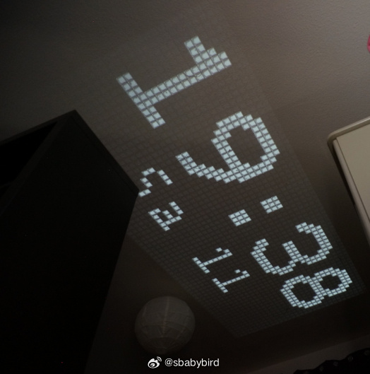
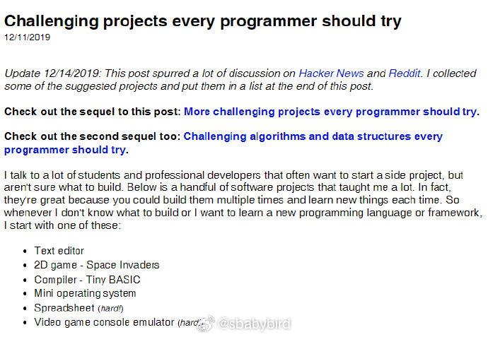
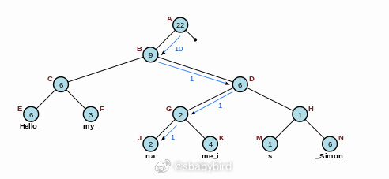
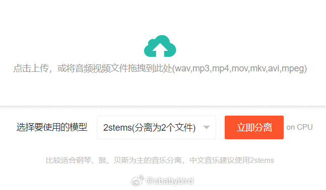
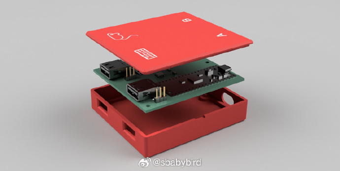
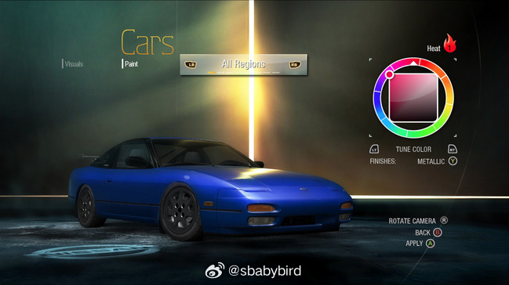

# 机器文摘 第 065 期

## 长文
### 自制一个时钟投影

现在可以很容易购买到那种卧室投影，可以将时钟、星空等图像投射在房间墙壁或者天花板上。

不过，这篇[DIY一个夜间时钟投影仪](https://microengineer.eu/2018/05/01/diy-night-clock-projector/)文章的作者选择自己做一个。

选用 LED 灯光加 LCD显示的方案，3D 打印外壳。

为了控制成本，作者选择在中国购买各种零件（一个焦距 25mm 的小镜头竟然才 12 美元）。

作者把他的设计图纸和相关资料都开源了，地址在这里：https://github.com/shufps/diy-projector-clock

### 每个程序员都应该尝试的个人小项目

关于学习，几乎每个人都认可这一点：在实践中学，是最有效的学习方式。

对于一些喜欢编程但是又不知挑战实现哪些题目的话，这里有一些[程序员应该挑战的小项目](https://austinhenley.com/blog/challengingprojects.html)。

这些项目经过精心挑选，而且都有一定难度，如果全部实现一遍的话，内力必然大增。

主要包括：

1. 文本编辑器；
   
2. 2D 小游戏（太空入侵者）；
   
3. 编译器：袖珍 BASIC；
   
4. 操作系统：迷你 OS；
   
5. 模拟器：游戏主机模拟器；

### 从底层做文本编辑器，应该用什么数据结构？

这篇[文本编辑器：数据结构](https://www.averylaird.com/programming/the%20text%20editor/2017/09/30/the-piece-table.html)，有寻找答案的过程。

作者说，如果是编辑文本的话，最次的数据结构就是直接用一个大数组来存储字符。

如果想试着自己做个编辑器，可以试试文中推荐的数据结构。

配图为一种叫做 [rope](https://en.wikipedia.org/wiki/Rope_%28data_structure%29) 的二叉树。 ​​​

## 资源
### 音乐人声分离工具

[vocal-separate](https://github.com/jianchang512/vocal-separate)，一个极简的人声和背景音乐分离工具，完全本地化网页操作。

内置 spleeter模型 2stems/4stems/5stems，解压后开箱即用，无需连接外网。

可将一首歌曲或者含有背景音乐的音频、视频文件，分离为单独的人声文件、伴奏文件。

预编译 Windows 版解压即用，无需额外配置。

源码版支持本地部署到 Linux/Mac/Windows。

### Lowpoly 风格背景图片生成器

[Triangle Patterns](https://sinqi.tools/triangle)，一个专门用于生成 lowpoly 风格渐变背景图的在线小工具。

可挑选和设置自定义调色板，免费下载和导出自己生成的图片。 ​​​

### 基于树莓派的鼠标键盘切换器

[桌面键鼠切换器](https://github.com/hrvach/deskhop)，一个很有意思的开源项目。

可以使用一套键鼠接入两台电脑，虽然市面上类似这样的 USB 切换器有很多，但是这一个确实比较特别：

1. 不需要按按钮切换，而是使用快捷键，或者自动识别你的鼠标拖动到窗口的边缘。

2. 免费且开源（不过需要你自己打印外壳，以及购买零件：树莓派的 PICO 版本）。

3. 同时支持 Linux、macOS 和 Windows。

### 给老游戏打补丁以支持宽屏分辨率

[老游戏宽屏补丁](https://thirteenag.github.io/wfp#nfsuc)，一些旧电脑游戏（比如 《GTA 4》、《极品飞车-卧底》等）由于年代久远，对宽屏分辨率支持不佳（或者不支持），这里有一个系列补丁包，专门针对这些游戏提供宽屏支持，甚至有些增加了手柄震动、HUD 贴图显示质量提升等特性。 ​​​

## 观点
### 降低复杂度的通用思想
中间代码、中间层、虚拟化（虚拟机）是降低复杂度的关键----读《游戏脚本高级编程》有感，复杂的问题往往需要拆解才能解决，比较通用的办法就是拆分步骤然后加入中间层（约定多个任务中间传递的成果）；

## 订阅
这里会隔三岔五分享我看到的有趣的内容（不一定是最新的，但是有意思），因为大部分都与机器有关，所以先叫它“机器文摘”吧。

Github仓库地址：https://github.com/sbabybird/MachineDigest

喜欢的朋友可以订阅关注：

- 通过微信公众号“从容地狂奔”订阅。

- 通过[竹白](https://zhubai.love/)进行邮件、微信小程序订阅。

