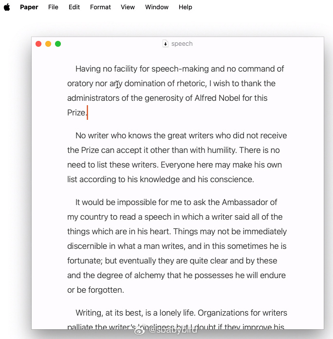
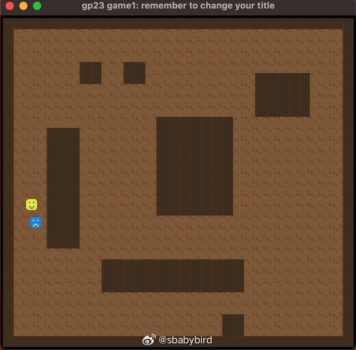
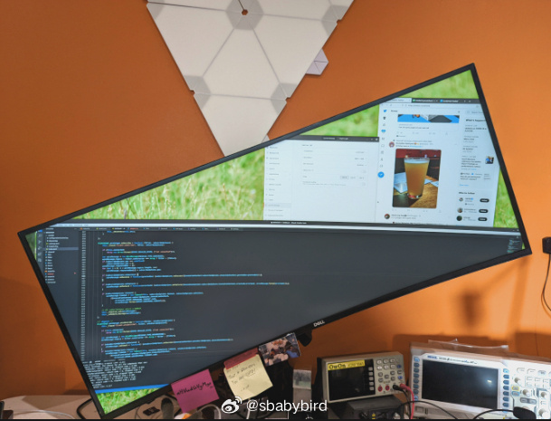
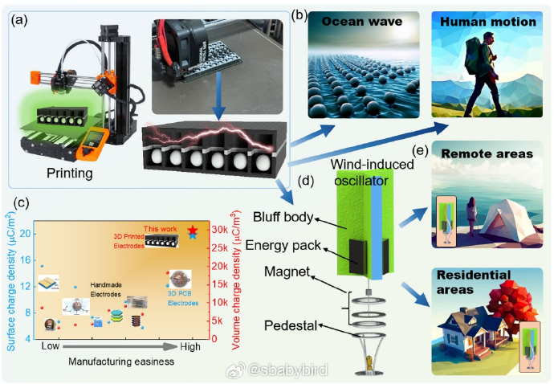
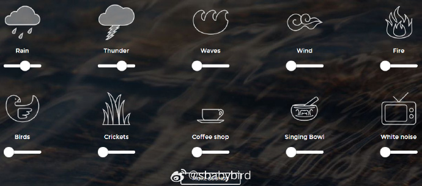
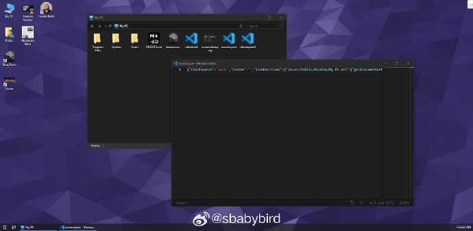
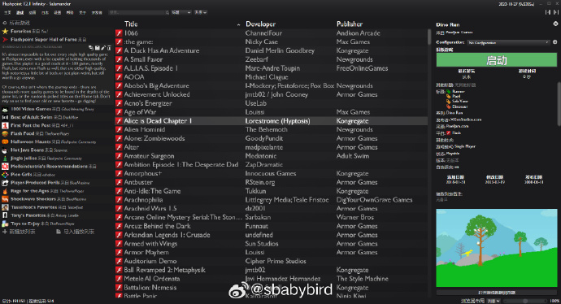
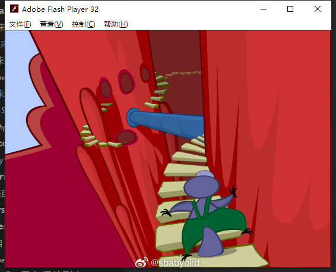
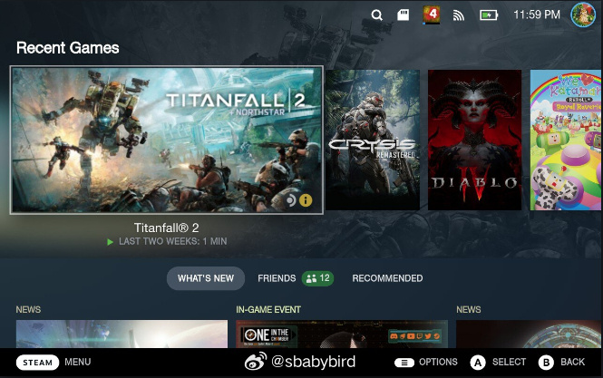

# 机器文摘 第 066 期

## 长文
### 一个文本编辑器独立开发者的 9 年回顾

[一个文本编辑器独立开发者的 9 年回顾](https://papereditor.app/dev)

作者是一个全栈开发者，9 年来一直独立开发一款 Mac 系统下的文本编辑器。

文章里记录了他在开发和产品运营上的一些选择，以及为什么这么做。

Mac 系统下不乏优秀的文本编辑器，作者的产品为什么还能占有一席之地，并且持续获得用户的好评？

这主要源于作者对于细分市场的敏锐嗅觉，以及对于确立的产品定位极致的坚持（有很多产品做着做着就在用户的呼声里迷失自我）。

作者的很多观点都与业界公认的思想有所抵触，比如他坚持所有东西都是自己做（违背了：*不要重新发明轮子*）、坚持极简的界面和极少的功能、对性能的极致追求（业界普遍会为了研发周期缩短而牺牲性能，或者觉得硬件浪费无所谓）等等。

### 使用 A* 搜索算法给游戏做路径查找时的一些技巧

迪杰斯特拉（Dijkstra）算法是经典的最短路径搜索算法，它能保证你找到最短路径，但是如果在游戏中使用的话，对于资源的消耗有些多，尤其是之前的游戏主机性能羸弱的情况下。

最早的时候，像吃豆人那种游戏选择使用最直接的算法，也就是计算怪物和玩家的距离及角度，让怪物直接朝玩家奔去，遇到阻挡的墙壁就顺势滑行。

但后来的游戏的场景逐渐复杂，这种简单算法不能满足需求。

于是诞生了更好用的 [A* search](https://en.wikipedia.org/wiki/A*_search_algorithm) 算法。

这篇[《A* 游戏寻路技巧》](https://timmastny.com/blog/a-star-tricks-for-videogame-path-finding/)，介绍了这种算法在游戏中的应用。

作者本来是打算给一个复古 8 位主机 PPU466（一个用于教学的类似 PICO-8 的幻想主机平台） 编写图形游戏，在实现路径搜索时觉得有必要分享一下思路，记录整理成为了本文。

### 显示器旋转多少度最有利于开发？

[有位闲人发现是 22°](https://sprocketfox.io/xssfox/2021/12/02/xrandr/)。

显示器能够旋转 90° 竖起来，这个大家都知道。

而且，对于文字阅读、网页浏览等任务，竖起来的话明显空间利用率更高。

对于 Windows 系统来说，你能做的也就这么多了，要么横着，要么竖着。

不过，Linux 的自由度就很高了，可以使用一个叫做 xrandr 的小工具将显示内容旋转任意角度。

于是开头那个哥们就测试了很多角度，得出了 22° 是个合适的角度的结论。

*但是实际使用中估计没有人会真这么做吧。*

### 纯塑料3D打印的环境能量收集器

[纯塑料3D打印的环境能量收集器](http://www.binn.cas.cn/ktz/wzlyjz/yjcgwzl/2023/202301/W020231130596295514704.pdf)

如何把让人讨厌的静电转换成人类赖以生存的能源，是从 2012 年摩擦纳米发电机（TENG）的发明才开始有了解决方案。

特点：因为几乎世上所有的材料都会摩擦升电，所以可以作为发电机材料的物品种类繁多，而且很多日常废弃物品都是可用的，比如纸，动物毛皮，废弃塑料等。简单的制作和多样的材料选择（几片塑料薄膜和金属片就可完成制作）让它成为绿色能源的一个热门选项。

原理：利用摩擦生电原理发明的发电机，其基本原理就是运动的带电物体（比如毛皮，塑料等）吸引电极和导线内的电子运动，产生电流。

用途：常用的电磁发电机，需要高频的有规律运动。TENG更加适合于低频率的无规则环境振动能量收集，例如海洋能，雨滴能，风能和人体运动。第 267 期提到的雨水发电板就是该发电机的一种。

文章作者用3D打印的方法，制作了纯塑料可随身携带的能量包，设计开源，让每个人都可以随心所欲的制造它。

## 资源
### 在线模拟自然声音的网站

[asoftmurmur](https://asoftmurmur.com/)是一个可以在线播放自然声音的网站，可以根据自己的喜好调整雨声、雷声、鸟鸣、风声等声音的占比。

适合读书或自习当作背景播放。

### 网页桌面模拟

[DaedalOS](https://dustinbrett.com/)，又一个运行在网页里的桌面模拟环境。

模仿 Win10 的界面风格，具有开始菜单和资源管理器。

自带浏览器、文本编辑器、画图板等基础应用。 ​​​

### 在 2024 年还想玩 Flash 游戏

[Flashpoint](https://flashpointarchive.org/)，这个项目我记得推荐过一次。但值得再次细说。

对于痴迷 Flash 游戏的人来说，当下的环境无疑是让人失落的，因为 Flash 技术已经被淘汰，不再被主流浏览器和操作系统支持。

曾经好玩的 Flash 小游戏也没有合适的平台来玩了。

不过，还是有一群有情怀的人启动了一个项目。

Flashpoint，一个保存 Flash 小游戏的项目，提供了一个集成的运行环境，打包存储了超过 17 万个小游戏和动画。

可以去他们的官方网站下载，内置少量游戏的基本版文件包大概 1GB 左右，包含全部游戏的版本安装完成大概需要 1.48TB 的存储空间。

ps：我最近在这个项目上找到了二十年前玩过的一个解密游戏 Chasm ，村里的水停了，一个小鸭嘴兽一路上山修复水管的故事。

我找了很久这个游戏，靠着一点儿零星的关键词，终于找到了，花了一个周末的时间才打通。

### 将卧室电脑打造成游戏机

[bazzite](github.com/ublue-os/bazzite)，一个可以将你的卧室电脑打造成 Steam Deck 操作体验的开源系统。

Steam Deck 是一个游戏掌机，其自带系统（基于 Linux 的魔改版本）专为游戏而生，操作体验进行了特别优化。

如果你也想让你的家用电脑获得这样的体验，可以尝试一下这个开源系统，不管是放在卧室还是客厅，都可以做到即开及打。

主要特性：
1. 预装 Nvidia 显卡驱动；
2. H264 编码硬解；
3. 预装 Xbox 手柄驱动；
4. 内置录屏解决方案；
5. 优良的 CPU 调度，平衡功耗和性能；
6. 预装安卓模拟器，可玩手机游戏；

## 观点
### “索引”思维
就像“分层” layer、“缓存” cache 这种通用思维一样，“索引” index 也是一种通用思维；

“缓存”在各种系统中起到了减少数据搬运而提升速度的作用，而“索引”则在各种场景中起到聚合信息、以少量信息检索大量信息的作用；

这种通用思维不仅仅局限于信息化软件本身，广义上来说，物理世界的任何“系统”都是可以使用这种通用思维的。

举例来说，谷歌搜索引擎建立了互联网网页内容的索引、门户网站和导航网站建立了分类信息的索引、淘宝商城建立了可交易商品的索引、维基百科建立了知识概念的索引，这些索引极大地满足了人们对信息获取的需求，所以取得了成功。

如果想提供自己的产品或服务，除了能直接提升生产力的工具类之外，还有一种可能，就是利用“索引”思维去提供整理好的信息。

目前已经有很多人在做类似的事情了，比如影视解说、读书解说、分类资源汇总。

写到这里我想到一个段子：有三家开的比较近的商店竞争，第一家招牌叫“最好的商品”，第二家招牌叫“最实惠的商品”，第三家把店开在他两家的中间，招牌叫“入口”。

## 订阅
这里会隔三岔五分享我看到的有趣的内容（不一定是最新的，但是有意思），因为大部分都与机器有关，所以先叫它“机器文摘”吧。

Github仓库地址：https://github.com/sbabybird/MachineDigest

喜欢的朋友可以订阅关注：

- 通过微信公众号“从容地狂奔”订阅。

- 通过[竹白](https://zhubai.love/)进行邮件、微信小程序订阅。

