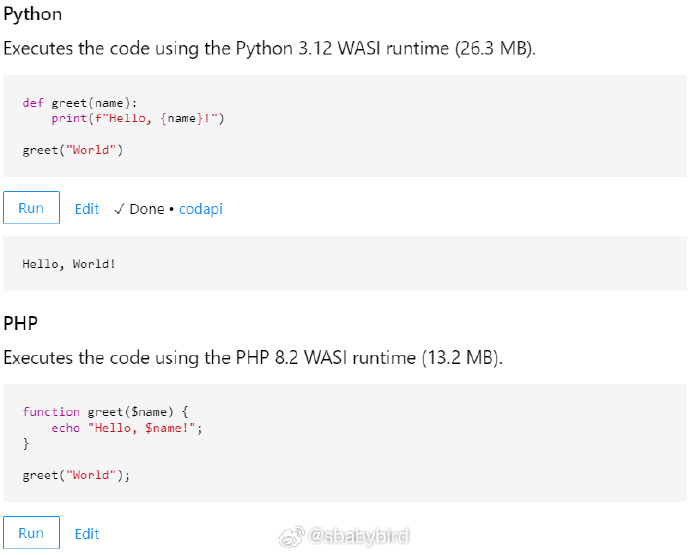
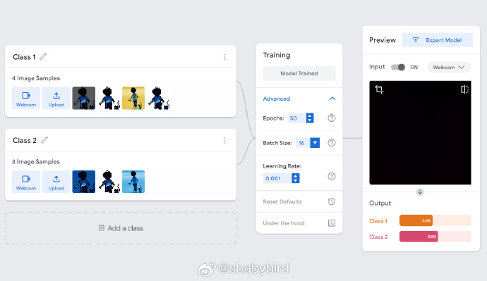
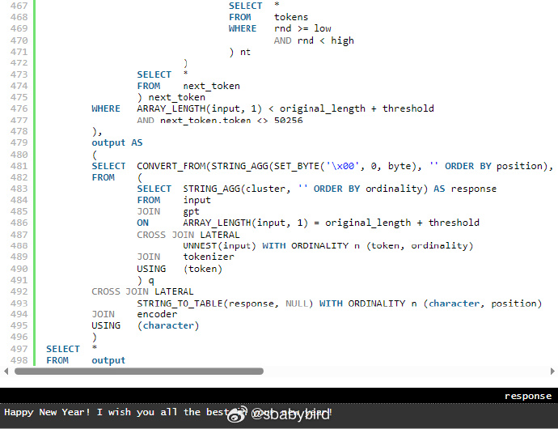
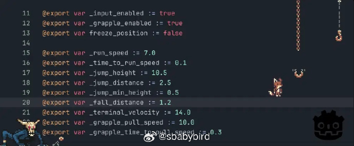
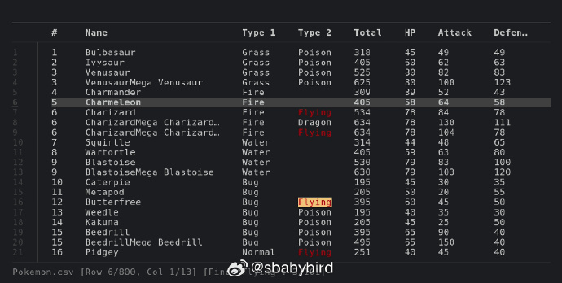
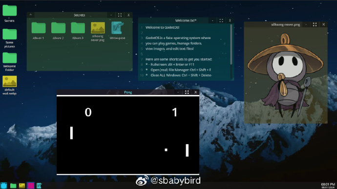

# 机器文摘 第 067 期

## 长文

### C 语言编译器简史

C 语言诞生于上世纪七十年代的贝尔实验室，最初目标是给新诞生的 Unix 操作系统配套一个更高级别（相对于汇编）的可移植语言。

[《C 语言编译器简史》](https://www.deusinmachina.net/p/compiling-history-a-brief-tour-of)，从编译器的视角出发，简介记录了 C 语言特性的发展过程，以及主流的编译环境和开发套件是如何一步一步“演化”到现在的样子的。

### 在浏览器里实时运行各种编程语言

现在有不少网站提供编程练习的交互环境，一般的做法是，在浏览器中编辑代码，提交到后台服务器进行运行，输出结果返回给浏览器展示。

这样做也没什么问题，不过有些用户不希望对服务端产生依赖，想要一个纯客户端的环境，在网页中嵌入运行 Python、PHP、Ruby、Lua 以及 SQL 语言。

[《在浏览器里的代码演练》](https://antonz.org/in-browser-code-playgrounds/)，这篇文章介绍了一种借助 WebAssembly 技术在浏览器中嵌入各种编程语言代码片段的方法。

作者使用 VMWare 实验室预先编译的语言解释器，封装了一个开源工具，可以将 Python、PHP、Ruby、SQLite 等语言的代码片段嵌入到页面中，并直接在浏览器里执行。

### 在网页里训练 AI 模型

[Teachable Machine](https://teachablemachine.withgoogle.com/)，是一个在线提供 AI 模型工作流的网站。

不同于其他 AI 云平台，这个网站主要使用你自己的浏览器调用你的本地资源实现计算（借助 Tensorflow.js）。

以可视化拖拽的方式建立自定义的 AI 应用，上传图片、声音、身体捕捉等样本后直接训练自己的模型。

网站提供模型下载或者部署代码的框架，可以轻松制作自己的带有 AI 特性的站点。

### 用 500 行 SQL 实现一个 GPT 语言模型

[500 行 SQL 中的 GPT](https://explainextended.com/2023/12/31/happy-new-year-15/)

> “嘿，ChatGPT。你能在SQL中实现一个大型语言模型吗？”
> 
> “不，SQL不适合实现大型语言模型。SQL 是一种用于管理和查询关系数据库中的数据的语言。实现语言模型需要复杂的算法、大型数据集，并且通常还需要深度学习框架，这些都超出了 SQL 的能力。”

这就是机器比不了人的地方，人类会突破极限，有人在现实中通过 SQL 实现了一个 GPT。

文章作者首先解释了 GPT 大预言模型的工作原理以及发展历史，对于相关概念和名词的解释比较浅显易懂。

总的来说，这种生成式大模型可以理解为一个函数，这个函数接受一段文字输入，然后再输出一段文字。

然后作者挑战自己，使用 SQL 语言实现了“分词器”、“向量嵌入”等操作，以及实现了“注意力”机制。

最终竟然通过大约 500 行的 SQL 语句实现了一个可以在 PostgreSQL 中运行的 GPT 模型。

### 2023 年十个基于 Godot 引擎开发的优秀开源游戏

[2023 年十个基于 Godot 引擎开发的优秀开源游戏](https://dev.to/github/top-godot-games-from-game-off-2023-5f3k)。

[Game Off](https://itch.io/jam/game-off-2023) 是 Github 每年 11 月份举办的游戏开发比赛，要求在一个月的时间内开发一款游戏，随便用什么语言或者引擎。

所有游戏源码和成果上传至 Github 接受全部开发者的投票。

上面的文章里收集了 2023 年度比赛中表现突出并且使用 Godot 引擎的游戏。

## 资源
### 复制任意网页的内容

[超级复制插件](https://enablecopy.com/)

新加坡前端工程师 Goh Tong 开发了一个浏览器（Chrome、Edge）插件，可以一键解除网页限制，解除网页禁用右键，任意复制网页上的内容。

### 专门用于查看 csv 文件的命令行工具

[csvlens](github.com/YS-L/csvlens)，一个命令行下的文本查看器，功能类似 less ，但是专门针对 csv 文件格式进行了优化。

有类似 vim 的快捷键绑定，可使用正则表达式快速搜索。 ​​​

### 用游戏引擎 Godot 开发的 OS ？

[GodotOS](https://github.com/popcar2/GodotOS)，一个用游戏引擎模拟桌面操作系统的开源项目。

借助 Godot 引擎强大的 UI 系统，作者做出了逼真的桌面环境，这虽然不是真实的操作系统，但却展示了游戏引擎制作界面的能力。 ​​​

## 观点
### 存储膨胀
类似通货膨胀，计算机存储也存在着空间增长赶不上需求增长的情况。

以游戏为例，之前的硬盘容量在几十 GB 级别的时候，游戏大小以 MB 为单位，很多主机游戏一共只有几 MB 也很精彩。

现在的游戏容量轻则几十 GB 动辄上百 GB ，2TB 的硬盘很快就给吞没没了。

*这种现象是不是跟整个宇宙也在膨胀有关?*

### 打游戏的深度
打游戏，不应该同时打多个游戏的进度，而是应该将游戏一个个打通关；

我近期在开源掌机里就体会到这一点，由于存储的游戏太多，深怕错过了什么经典的游戏，这种心态导致没有心思深入到一个游戏里面去，常常刚开了一点儿进度，就又调头玩其它的了；

由此也可以映射出现实世界里，这种心态导致学习什么东西都是浅尝辄止，开坑容易，弃坑更容易，但真正的收获较少；

所以应该认准选中几个游戏，认真玩下去，至少坚持一段时间，打到一定的深度，体验通关的乐趣，而不是启动的乐趣；

### 来自 HN 网友对于当前科技发展的评论
[我对技术感到非常失望，这让我非常难过。](https://news.ycombinator.com/item?id=38983067)

>我的职业生涯始于互联网繁荣时期，人们对技术和互联网将带来的有益社会变革非常乐观。
>
>如今，我并不觉得所有的科技都是“邪恶的”，但我确实觉得，如果所有的大型科技公司（谷歌、Facebook、苹果、Microsoft）都完全停止开发任何新技术，世界会变得更好。
>
>显然这是不现实的，但它凸显了我的感觉，即我不期待这些公司的任何新技术，因为更多的技术总是会导致更多的孤立，更多的“厄运滚动”，更多的攻击我们的注意力。
>
>我觉得大多数大型科技公司都变成了毒贩，只是试图劫持我们大脑的进化注意力机制来让我们上瘾。
>
>“注意力就是你所需要的”是对的（注：这是对一篇人工智能论文的”双关“引用）

## 订阅
这里会隔三岔五分享我看到的有趣的内容（不一定是最新的，但是有意思），因为大部分都与机器有关，所以先叫它“机器文摘”吧。

Github仓库地址：https://github.com/sbabybird/MachineDigest

喜欢的朋友可以订阅关注：

- 通过微信公众号“从容地狂奔”订阅。

- 通过[竹白](https://zhubai.love/)进行邮件、微信小程序订阅。

