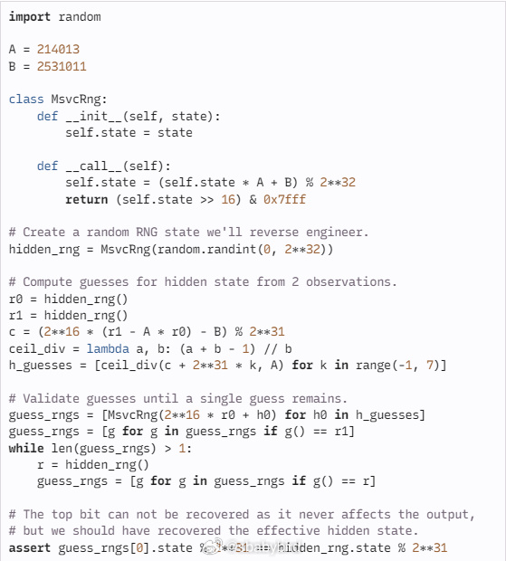
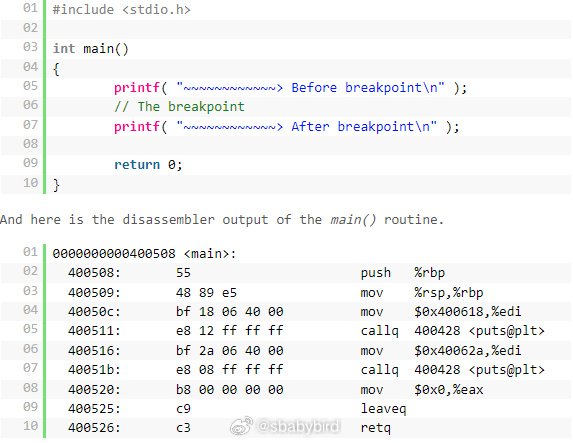
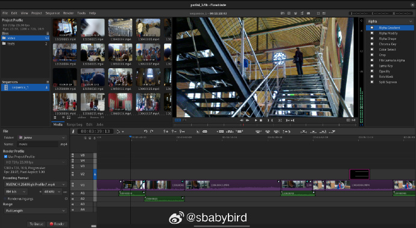

# 机器文摘 第 068 期

## 长文
### 利用随机数算法突破游戏安全限制


[当随机数不再随机](https://orlp.net/blog/when-random-isnt/)，文章作者回忆了一段当年玩《魔兽世界》的往事。

作者在 14 岁接触这款当时爆火的游戏，与其他游戏不同的是，这款游戏允许用户编写一些 Lua 脚本来作为游戏的扩展（Addon）。

一般用来对游戏界面进行定制，或者增强游戏交互。

为了安全起见，游戏厂商当然限制了脚本的一些能力，使其不至于影响到游戏的核心规则，比如宝物数量和法术激发等。

具体做法就是，只允许在一个安全的环境中调用有限的接口。

这刺激了作者的破解欲望，但是他不希望通过一些强制的手段（比如修改内存等等），而是使用游戏本身的机制，在许可的范围内“合法”地突破限制。

绕来绕去，作者将目光锁定在了 MSVC 运行库（因为魔兽世界是用 MSVC 编译的，微软又躺枪）提供的随机数函数 `rand` 上。

这个函数，一共就 4 行代码 ：
```c
uint32_t state;

int rand() {
    state = state * 214013 + 2531011;
    return (state >> 16) & 0x7fff;
}
```

使用“线性共余”算法生成随机数，注意那个 `state` 全局变量，导致了所有随机数的生成都共享了这个数据。

作者通过这个算法，做出了最关键的一步，即根据随机数生成的值，逆向猜出了这个共享的状态值，然后就可以放心猜测接下来的随机数会产生什么值了。

有了这些随机数值的提前预测，就像考试提前知道了答案一样，作者可以随心所欲地将一些信息输出在屏幕上给自己参考，整个游戏也就变得“索然无味”了。

### 调试器是如何工作的？


调试是每个开发者必备的技能，调试器是离不开的工具。

下断点、单步跟踪是每个开发者在软件开发过程中必不可少的活动。

然而，我们很少去关注，这样的调试过程是怎样实现的，它背后有什么机制？

毕竟调试器给人很神秘的感觉，拥有魔法能力，可以让时间暂停。

这篇[《调试器是如何工作的？》](http://www.alexonlinux.com/how-debugger-works)深入探讨了这个话题。

事实上调试器的工作离不开操作系统在底层提供的 API，而且最终还得 CPU 在硬件层面提供支持。

在文章里，作者简要讲解了调试器的工作原理，并尝试在 Linux 系统下带领大家实现一个极简的调试器。

### WebCodecs 科普


在浏览器中操作多媒体信息，现有的 API 已经开放了比较方便的接口，比如“视频播放”、“音频解码”、“视频录制”、“实时流媒体”等等。

但如果需要深入操控编码、解码的细节，现有 Web API 就无能为力了。

也有人尝试使用 WASM 技术将编解码器直接运行在浏览器里，但由于缺少硬件加速，很难解决功耗与性能问题。

不过现在一个新的标准即将普及，那就 WebCodecs，可以在页面中惊喜控制音视频数据的编码、解码细节。

这篇[《WebCodecs 开启 Web 音视频新篇章》](https://hughfenghen.github.io/posts/2023/10/06/webcodecs-new-era-for-media-on-the-web/)介绍了这个标准的基本情况，并进行了相关能力展示，适合入门扫盲。
​​​

## 资源
### 开源视频剪辑软件


[flowblade](https://jliljebl.github.io/flowblade/) 是一个在 GPL3 许可下发布的多轨非线性视频编辑器。

支持剪辑、合成、调色、动画全工作流。 ​​​

### 在网页里看星星


Stellarium 是全世界大学都在使用的开源天文学软件， [Stellarium Web](https://stellarium-web.org/)，是一个基于开源 Stellarium Web Engine 项目的在线天文馆，无需安装，可直接在Web 浏览器中运行 Stellarium 。

直接在网页里即可查看自己所在地区的天空、星座、甚至可以看到实时的卫星和空间站（我看到了马斯克的星链在快速移动）。

### 复古桌面个人门户


[henryheffernan.com](https://henryheffernan.com)，一个很有意思的个人门户网站。

作者在主页用 Three.js 模拟了一个 CRT 的显示器，细节（闪烁、条纹、指纹）还原非常逼真。

里面还模拟了一个 win32 风格的桌面系统，桌面的浏览器还能用，打开是浏览作者的简历。

### 用 CSS 的 3D 特性制作逼真的云朵


[用 CSS 的 3D 特性制作逼真的云朵](https://www.clicktorelease.com/blog/how-to-make-clouds-with-css-3d/)，这篇教程介绍了使用 3D 变换功能制作出有层次、立体的云朵图案（且随着鼠标移动会改变视角）。 

## 观点
### 再说电子阳痿
太高的自由度会使人疲惫，因为患得患失是人的本性，所以做决策是很消耗精力的事情。

因此，设计精良的产品（无论是软件还是硬件），在完成它的功能的时候，不会给用户太多选择，而是通过最符合直觉的那条路径实现，让你“没得选”，不用动脑子。

有的时候“没得选”反而是一种轻松幸福的事情，比如听 FM 广播里的音乐就比自己直接用播放器的要享受一些，因为前者无需选择，而后者给你太多的选择（还能快进切歌）。

同样的道理，看电影、电视剧、打游戏也都一样，当选择越来越多的时候，带来的压力是巨大的，且容易陷入反复尝试（生怕错过）的循环，很难完整、深刻体验一部作品。

小时候资源匮乏，“没得选”，才能把一个游戏反复打几十遍上百遍，反而体会到了巨大的幸福。

## 订阅
这里会隔三岔五分享我看到的有趣的内容（不一定是最新的，但是有意思），因为大部分都与机器有关，所以先叫它“机器文摘”吧。

Github仓库地址：https://github.com/sbabybird/MachineDigest

喜欢的朋友可以订阅关注：

- 通过微信公众号“从容地狂奔”订阅。


- 通过[竹白](https://zhubai.love/)进行邮件、微信小程序订阅。


