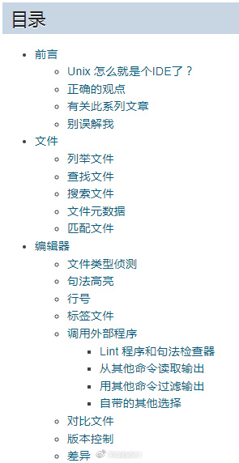
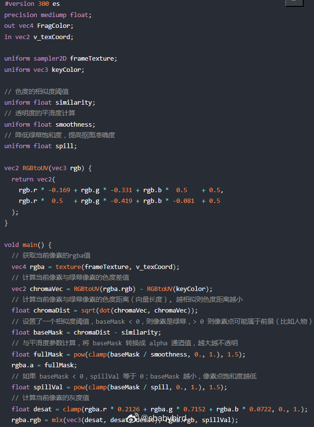
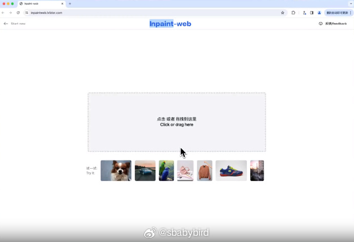
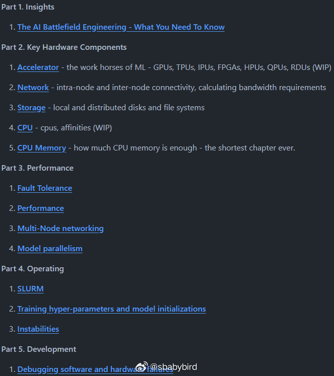

# 机器文摘 第 069 期

*春节期间将暂停更新*

## 长文
### 怎样用肉眼识别二维码

假如未来人工智能真的统治了地球，二维码对于它们的文明来说，可能算是甲骨文了吧。

作为普通人类，可以提前多修一门“外语”，真到了那一天，也能跟计算机套套近乎。

这篇[《不用电脑识别二维码》](https://qr.blinry.org/)，旨在让读者能够从最底层的技术原理理解二维码的构成。

即便不能真的用肉眼读取二维码，也可了解这些黑白方块为什么可以组成让计算机识别的数据。

核心点：
1、锚点：用于确认和锁定二维码区域的标识；

2、掩码：统一盖上一层特定分布的黑白块，叠在最上层。这样做可以容错、使得数据分布均匀、增强对比；

3、编码：用相邻的四个黑白块来表示数据内容；

4、纠错：使用一些数学算法增加校验和数据修正；

### Unix 即集成开发环境（IDE）

[Unix 即集成开发环境（IDE）](https://conanblog.me/Unix-as-IDE--Chinese-/)，对于熟悉了 IDE 作为开发环境的人来说，基于命令行下的一组工具进行“零散”的开发工作，可能有点儿难以接受。

但是如果把整个 Unix （或者类 Unix 系统）整体是为集成开发环境的话，也许会有所启发。

这篇文章，对于喜欢 Unix 哲学的人，是一个很好的回顾与复习，对于习惯了“传统” IDE 的人，说不定会打开另外一扇门。

主要内容：
1、文件管理：查找、搜索、匹配；

2、代码编辑：行号、语法高亮、差异对比；

3、编译：编译、链接、错误分析、优化；

4、构建：Makefile；

5、调试：gdb、ltrace；

6、版本控制：git、svn；

### 8kB 大小的动画短片

令人惊叹的 demoscene 技术再次刷新，国外有团队 [ctrl-alt-test](https://www.ctrl-alt-test.fr) 制作了一个[只有 8kB 大小的动画短片](https://www.ctrl-alt-test.fr/2024/how-we-made-an-animated-movie-in-8kb/)，源代码在 Github 开放：github.com/ctrl-alt-test/mouton

本文详细记录了创作团队的制作过程，以及对于一些 [demoscene](https://en.wikipedia.org/wiki/Demoscene) 技术的介绍。

大概技术路线：

最终成果是一个 8kB 大小的 exe 可执行文件，不依赖外部资源或者文件。

所有视觉效果都是运行在 GPU 上的 [GLSL shaders（着色器）](https://developer.mozilla.org/zh-CN/docs/Games/Techniques/3D_on_the_web/GLSL_Shaders)实现的，包括对时间线、摄像机等的控制。

为了降低最终文件大小，使用了专门开发的压缩程序。

声音采用 [4klang](https://github.com/hzdgopher/4klang) 软件合成器制作，最终会生成用于产生音乐的二进制汇编。

### 实时绿幕抠图

[WebGL Chromakey 实时绿幕抠图](https://hughfenghen.github.io/posts/2023/07/07/webgl-chromakey/)

本文介绍了一种通过 WebGL 片元着色器实时进行逐像素比对的方式进行抠图的技术。

作者提供了封装好的 npm 包以及调用演示代码。 ​​​

## 资源
### 在浏览器运行模型修复图片

[inpaint-web](https://github.com/lxfater/inpaint-web)，基于 Webgpu 技术和 wasm 技术的免费开源 inpainting（图片修复） & image-upscaling 工具, 纯浏览器端实现。 

### 机器学习在线书籍

[机器学习在线书籍一套](https://github.com/stas00/ml-engineering)

这是一本适合 LLM/VLM 模型训练工程师和操作人员的技术资料。教程里提供了大量可直接运行的脚本，可以直接复制粘贴使用。 ​​​

### 专为制作音频软件而开发的UI库（旋钮、推子等）

网址：echoui.dev

Echo UI 是一款专为 Web Audio API 设计的 UI 库，它的目标是让工程师在开发浏览器音频应用的过程更加简便，它主要有以下几点特性：

📦 开箱即用：Echo UI 提供了一套开箱即用的组件库，你可以直接使用这些组件来搭建你的音频应用，比如一个 EQ 均衡器、一个音频播放器或一款 VST

🎛️ 优质交互：大部分组件的交互设计灵感来自于 Ableton Live 和 FL Studio 等优质的 DAW 应用，这些交互可以极大的提升用户体验

🛠️ 响应式 Hook：Echo UI 提供了一套响应式 Hook，你可以使用它们来快速构建响应式的音频应用

✨ 可定制 & 易于扩展：基于 React 和 TailwindCSS 开发，这使你可以很容易地定制组件的样式和交互行为，同时也可以很容易地扩展 Echo UI 的组件库

## 观点

### 行动
“天下事有难易乎？为之，则难者亦易矣，不为，则易者亦难矣。”

讲的是行动对于成事的重要性，畏惧行动、不愿行动是阻碍事情成功的最大因素；

不愿行动的背后一般是对“浪费”时间和精力的恐惧，对于做事要达成的目标相对单纯和唯一；

认为唯一目标未达成，就算是白白投入，陷入失望，久而久之，便抗拒行动；

这里面的关键是对“目标”的定义，只看结果不讲过程的话，十件恐怕有九件都是不能完全达标的；

但行动的意义远不止于此，就像运动的目的不仅仅是“做功”或者“消耗能量”；

做任何事情，都不应将目标定义的太单纯和唯一，可以有核心目标，也要有辩证的评价策略，失之东隅得之桑榆，即使核心目标短期没有达成，但也有其他的收获；

有了这样的认知，在做事情的时候才不会患得患失、抗拒行动，因为什么都不做才是对时间和精力的最大浪费。

## 订阅
这里会隔三岔五分享我看到的有趣的内容（不一定是最新的，但是有意思），因为大部分都与机器有关，所以先叫它“机器文摘”吧。

Github仓库地址：https://github.com/sbabybird/MachineDigest

喜欢的朋友可以订阅关注：

- 通过微信公众号“从容地狂奔”订阅。

- 通过[竹白](https://zhubai.love/)进行邮件、微信小程序订阅。

