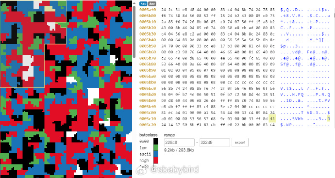

# 机器文摘 第 070 期

## 长文
### 通过服务器的访问日志，对一些常见网络攻击的分析

[通过服务器的访问日志，对一些常见网络攻击的分析](https://nishtahir.com/i-looked-through-attacks-in-my-access-logs-heres-what-i-found/)。

“互联网是一个危险的地方”，如果你有一个暴露在公网上的 IP 的话，你立即就能理解前面那句话意味着什么。

因为在当前的互联网上，将任何的 IP 暴露在公共网络上，都会马上招致大量恶意流量（访问请求）。

一位自己维护服务器超过十年的开发人员，近期对他的访问日志（服务器用于记录外部请求的日志）进行了分析，看看常见的攻击究竟是怎样的。

主要内容：
1、最常见的是对部署人员的粗心大意抱有期望，这些请求会扫描常见的存储程序密码的文件，比如  `.env` 文件；通过 `GET `请求路径里加入这些猜测文件的地址进行碰碰运气。看来粗心的人还真有，不然这种扫描就不会存在了。

2、跟上一条差不多，对于一些文件路径的猜测，比如 `/old /temp /new /test /backup `，期望有程序员将一些没来及删除的备份文件夹还留在 HTTP 服务器的公开目录下。

3、利用 Web 服务器的漏洞，将恶意的 `Shell` 命令嵌入到 `HTTP` 请求的 `HTTP_USER_AGENT` 字段里。

4、对一些带有 `CGI` 界面的路由器进行恶意请求，尝试执行嵌入在请求头里的恶意命令。

5、上述的恶意命令往往是去一个指定地址下载恶意软件，这些恶意软件具有复制自己的能力。

结论：
公网是一个充满恶意的地方，如果需要暴露服务给公网，请暴露最低限度的东西，不是必须的东西绝对不要暴露它。

### 具有超链接的书架

[具有超链接的书架](https://jamesg.blog/2024/02/14/clickable-bookshelves/)。

作者突发奇想，希望能够通过计算机视觉技术，给自己的书架照片加上超链接，使得每一本书都可以被点击。

点击跳转的链接是该书籍的详情信息（由谷歌提供的服务，可调用 api 实现）。

本文记录了实现思路，文中给出了可以体验的 Demo 网址。

主要思路：

1、使用目标检测和图像分割模型识别出图片里的书脊区域；

2、使用 OCR 技术将书脊区域的文字提取出来；

3、将提取的文字告诉给大语言模型让它匹配到精确的书名和作者；

4、调用“谷歌图书”服务，获取书籍详情信息链接；

### 怎样居中一个 DIV

在很长一段时间里，将元素在其父元素中居中是一件非常棘手的事情（注：一般也是新手前端开发者遇到的第一个难题）。

随着 CSS 的发展，有越来越多的方式来解决这个问题。以至于现在很多人都不记得原来居中一个 DIV 曾经有这么多讲究。

有专业人士出于整理对比一下各种方法优缺点的目的，着手编写了此篇[《怎样居中一个 DIV》](https://www.joshwcomeau.com/css/center-a-div/)。

几乎集齐了“元素居中”这个问题的全部答案，并进行了深刻分析，读完至少成为半个前端布局高手

## 资源
### 极小的 Linux 发行版

[Damn Small Linux 2024](https://www.damnsmalllinux.org/)，一个极小的 Linux 发行版，大概 50MB 大小。

目标是让十分低配的 x86 计算机也能具有基本的办公和多媒体能力。

麻雀虽小五脏俱全，这个发行版配备了 Web 浏览器、office 办公套件、邮件客户端、多媒体播放器、图像编辑器等一大堆即开即用的软件。

另外还有一批精心挑选的控制台命令行程序，包括 Tmux、FZF、Vim、Nano 等。

所有入选的软件都遵循基本的原则：对资源占用低、依赖少。

手上有老电脑的，可以尝试安装一下，说不定能焕发第二春。

### 在线分析二进制文件

[Binvis](https://binvis.io)，一个在线可视化工具，可直观地剖析和分析二进制文件，在页面中交互展示二进制文件的内部结构和数据组成。 

### 软件设计的哲学

[《软件设计的哲学》](https://cactus-proj.github.io/A-Philosophy-of-Software-Design-zh/)

经典软件设计书籍《A-Philosophy-of-Software-Design》的中文翻译版电子书。

80 多年来，人们一直在为电子计算机编写程序，但令人惊讶的是，关于如何设计这些程序或什么是好的程序应该是什么样子的讨论却很少。

关于软件开发过程（如敏捷开发）和开发工具（如调试器、版本控制系统和测试覆盖工具），已经有了相当多的讨论。还广泛分析了编程技术，如面向对象编程和函数式编程，以及设计模式和算法。

所有这些讨论都是有价值的，但是软件设计的核心问题在很大程度上仍然没有触及。

David Parnas 的经典论文“关于将系统分解成模块的标准”发表于 1971 年，但是在随后的 45 年里，软件设计的技术水平并没有超过这篇论文。​​​

### 通过 AI 模型快速辨别文件类型

[Magika](https://opensource.googleblog.com/2024/02/magika-ai-powered-fast-and-efficient-file-type-identification.html)，谷歌开源的一个轻量级 AI 模型，可以快速判别给定文件的类型（文本、编程源码、图片、音频等）。

即使不使用 GPU 加速而跑在 CPU 上的话，也能达到毫秒级识别速度。 ​​​

### 运行在浏览器里的 LLM

现在大语言模型可直接运行在浏览器，无需服务器支持！

借助 Web LLM 工具，可以将大语言模型直接在浏览器中运行，并且通过 WebGPU 加速，目前已支持 Llama 2 7B/13B、Mistral 7B 和 WizadMath 等。

甚至，可以运行 Llama 2 70B 模型，只需要有一台 64GB 内存的设备。

GitHub：https://github.com/mlc-ai/web-llm

另外，Chrome 浏览器从 113 版本开始已支持 WebGPU 特性。

意味着，可以通过 WebGPU 加速更快更流畅的运行 LLM，经测试仅需约 6GB 的显存即可运行 Llama 7B、Vicuna-7B。

--来自微博：[@GitHubDaily](https://weibo.com/5722964389/NDMulfXnj)

### 从 0 实现一个极简的自动微分库

["micrograd" 项目的学习笔记](https://nagi.fun/micrograd-tutorial)。该项目是 OpenAI 创始人之一 Andrej Karpathy 创建的一个小型、教育性质的项目。这个项目实现了一个非常简化的自动微分和梯度下降库。

--来自微博：[@蚁工厂](https://weibo.com/2194035935/O1bDZ7Ydj)

### 下载飞书文档到本地 MD 文件

[Cloud Document Converter](https://chromewebstore.google.com/detail/cloud-document-converter/ehkomhhcinhikfddnmklbloahaakploh) ​​​，一个浏览器扩展，支持下载飞书云文档为 Markdown。

### ThinkPython 第三版

[ThinkPython](https://github.com/AllenDowney/ThinkPython/tree/v3)，是一本面向非专业人员的 Python 编程入门书籍，如今出了第三版。

电子书内容完全运行在 Jupyter notebooks 中，可以直接在线阅读并运行代码。

是业余爱好者入门编程的好帮手。 ​​​

## 观点
### 客观事实与主观臆想
混淆客观事实和主观臆想是造成错误决策的主要原因。

所谓战略上的懒惰，多半是因为不愿意多花精力去看清现实，甚至不愿意面对现实。

第一性原理是一种比较容易执行的认清现实的方法，可作为思考训练。

撇去主观臆想，是去除幼稚走向成熟的重要标志。

虽然很难做到百分百，但是，优秀的人，往往在此方面有着高于常人的观察和判断。

说白了就是凡事尽量抛去成见，去除“意必固我”，知行合一。

## 订阅
这里会隔三岔五分享我看到的有趣的内容（不一定是最新的，但是有意思），因为大部分都与机器有关，所以先叫它“机器文摘”吧。

Github仓库地址：https://github.com/sbabybird/MachineDigest

喜欢的朋友可以订阅关注：

- 通过微信公众号“从容地狂奔”订阅。

- 通过[竹白](https://zhubai.love/)进行邮件、微信小程序订阅。

