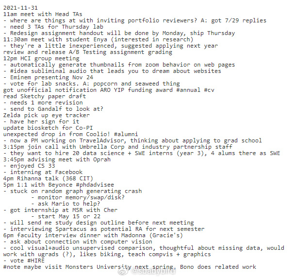
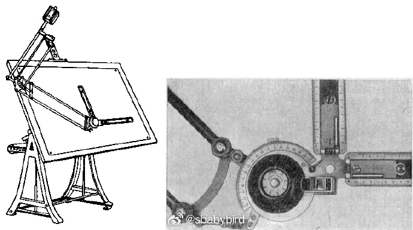
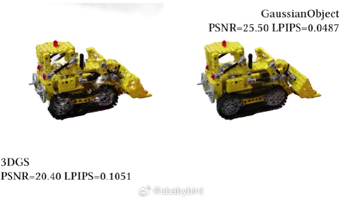
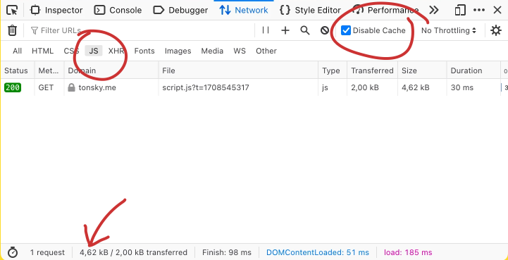
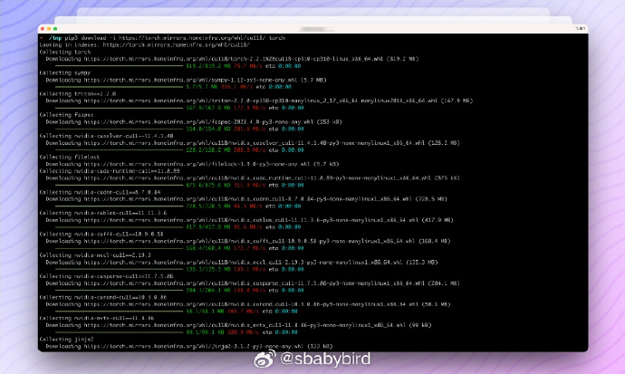
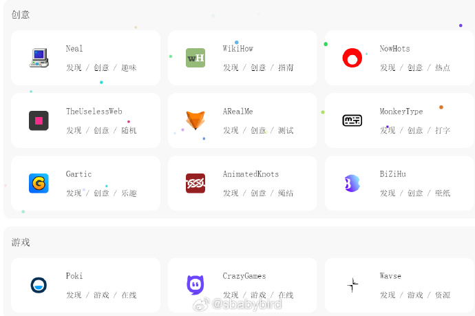
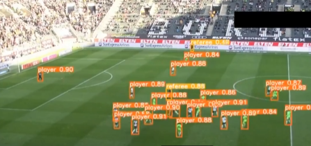
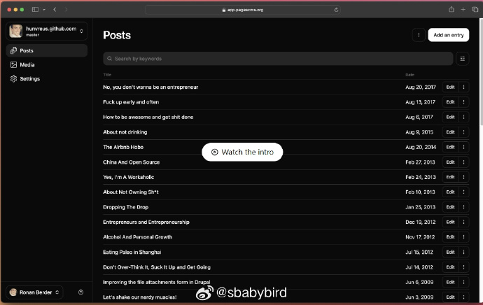

# 机器文摘 第 071 期

## 长文
### 在一个文本文件中管理待办 14 年

有不少书籍和方法论都在指导人们更加高效地处理日常生活中的各项事务。

一般都会使用一个或多个工具（软件或物理实体），这些工具常以“清单”或者“日程表”的形式出现。

这些工具如此精美，以至于大多数人难以抵御诱惑，沉溺于寻找更加强大、高效的工具中，忘记了提升效率的初衷。

也有例外。

[《我的生产力应用程序是一个永无止境的.txt文件》](https://jeffhuang.com/productivity_text_file/)，文章作者便是反其道而行之，将所有事务都放在一个文本文件中进行记录和管理。

这样做超过了 14 年，而且形成了自己特有的“系统”。

作者说他本人感受到了较大的生产力提升，早已离不开这个“系统”。

文中详细介绍了他这套“系统”的方式，可以进链接了解细节。

大概思路：

1、所有待办都放在日历中，每天按照日历的安排开展事务，每日更新日历，将未完成的挪到后续的日期中。

2、所有事务的完成情况、随时的想法、与人的讨论内容，都记入同一个笔记文件（每天一个标题新起一段）；

3、建立搜索关键词，比如“会议”、“购物”、“课程”等，可迅速搜索到所有同类的信息；

4、每天白天做当日待办，并记录。晚上回顾更新日历以及笔记中需要跟踪或者重新安排到待办中的事情。如此往复循环。

### 为什么你几乎从来不会在商场看到时钟？

[为什么你几乎从来不会在商场看到时钟？](https://thehustle.co/originals/why-you-almost-never-see-a-clock-at-the-mall)

答案是：你停留的时间越长，你买的越多。

但是为什么？

研究表明，人的大脑中负责决策的部分，在刚开始的时候，是以理性认知为基础的。

然而在同样的环境中，待的时间超出 23 分钟之后，决策部分将转换为情感部分，而不再是认知部分。

40 分钟之后，他们的大脑将疲惫到降低要求，只要求能做出“合乎逻辑”的决策即可。

于是商场会拼命让你忘却时间，给你迷宫路线，让你在里面走来走去绕不出来。

然后一些“合乎逻辑”的推销就对你特别地凑效了。

### 前数字时代的绘图工具

习惯了计算机绘图软件（如：CAD、Adobe Illustrator）的现代人，可能无法想象在计算机绘图软件发明之前，人们是如何绘制图纸（物理）的。

[《前数字时代的绘画和插图》](https://www.daube.ch/docu/glossary/drawingtools.html)这篇文章回顾了一些曾经用于绘图的专业工具（非计算机软件）。

看完后，我发现，除了我们小时候文具盒里的圆规和尺子之外，原来还有这么多辅助绘图的玩意儿。

比较有意思的有：

1、带导轨的宽幅绘图板（这个好像在电影中见过）；

2、带比例放大的绘图尺；

3、长得像罗盘的计算尺；

### 只需四张照片实现 3D 模型构建

高斯泼溅是一种用于表示3D 场景和渲染新颖视图的方法，在“实时辐射场渲染的3D 高斯泼溅”中引入。 它可以被认为是NeRF² 类模型的替代品，就像当年的NeRF 一样，高斯分布导致了许多新的研究工作，这些工作选择将其用作各种用例的3D 世界的底层表示。

[GaussianObject](gaussianobject.github.io)，是一个使用高斯飞溅来表示和渲染 3D 对象的框架，只需 4 个输入图像即可实现高渲染质量。

链接中有对应的论文和演示样例。

摘要：

>从高度稀疏的视图重建和渲染 3D 对象对于促进 3D 视觉技术的应用和改善用户体验至关重要。

>然而，来自稀疏视图的图像仅包含非常有限的 3D 信息，这导致了两个重大挑战：
> 
> 1） 由于用于匹配的图像太少，难以建立多视图一致性;
> 2） 由于视图覆盖率不足，部分省略或高度压缩的对象信息。
>
>为了应对这些挑战，我们提出了 GaussianObject，这是一个使用高斯溅射来表示和渲染 3D 对象的框架，只需 4 个输入图像即可实现高渲染质量。
>
>我们首先介绍了视觉船体和浮子消除技术，这些技术将结构先验明确地注入到初始优化过程中，以帮助建立多视图一致性，从而产生粗略的 3D 高斯表示。
>
>然后，我们构建了一个基于扩散模型的高斯修复模型，以补充省略的目标信息，进一步细化了高斯修复模型。
>
>我们设计了一种自生成策略来获取用于训练修复模型的图像对。
>
>我们的 GaussianObject 在多个具有挑战性的数据集上进行了评估，包括 MipNeRF360、OmniObject3D 和 OpenIllumination，仅从 4 个视图就获得了强大的重建结果，并且性能明显优于以前的先进方法。

### 膨胀的 JavaScript

[膨胀的 JavaScript](https://tonsky.me/blog/js-bloat/)。

js 文件越来越大了…… 打开个网站下载 js 文件就要 10 多 M。作者对常见的网站做了 js 大小的统计。

大网站里表现最好的是 P 站（不愧是最关心性能的网站）。

## 资源
### 录制屏幕内容，实现记忆搜索

[Windrecorder | 捕风记录仪](github.com/yuka-friends/Windrecorder)。
捕风记录仪 是一款通过记录屏幕上所有内容、从而实现记忆搜索的应用。它可以根据 OCR 文本、或对画面的描述进行搜索，摘要浏览活动。它的所有能力都完全运行在本地，无需联网或上传任何数据，你完全拥有所有数据。

### 轻量级缓存镜像站服务

[LightMirrors](https://github.com/NoCLin/LightMirrors)是一个开源的缓存镜像站服务，用于在内网加速软件包下载和镜像拉取，基于Aria2实现了下载进度显示。

目前支持DockerHub、PyPI、PyTorch、NPM等镜像缓存服务。 ​​​

### 一个致力于分享优质资源的网站（极简风格）

一个致力于分享高质量资源的平台，包括但不限于文章、视频、图片、音乐等多种形式。网站目标是帮助用户发现并分享有价值的资源。

地址：https://shareduck.fun/

### 在网页里运行的 Yolo 模型

YOLO 是目标检测模型中的佼佼者，现在YOLOv9 来了，它是一种实时对象检测模型，超越了所有基于卷积和 Transformer 的模型。

有网友把 YOLOv9 与 transformer.js 结合，在浏览器本地进行检测（不需要服务器），地址：https://huggingface.co/spaces/Xenova/yolov9-web

### 基于 Github Pages 服务的开源 CMS 应用

[The No-Hassle CMS for GitHub](https://pagescms.org/)，一个基于 Github Pages 服务的开源 CMS 应用。

Github 提供的 Pages 服务十分适合给自己的项目或者个人博客搭建静态站点。

不过操作起来偏技术流一些，对于习惯了直接在线编辑站点内容的人来说仍有不小的挑战。

所以作者推出了这个应用，完全基于 Pages 服务，且 100% 免费，让你搭建和维护静态站点变得更加便捷。

## 观点
### 警惕“概念爆炸”
学习技术知识，最重要的是抓大放小，避免“概念爆炸”。即：因为要弄懂一个概念而不得不引入另一个概念导致的链式依赖，从而陷入无限的概念中去了；

应首先从框架知识入手，找到几个支撑运行逻辑的关键概念，在必要的时候再细化了解每个节点上的细节；

拿 C++ 编程来说，整个活动中关键环节就这几项：编辑源码、编译和链接（产生可执行成果）、运行和调试（查看结果和除错）；

虽然有了 IDE（或者具有一点儿 IDE 能力的编辑器如 vscode）将这些活动整合到了一起，但是了解和掌握这个运行框架是十分重要的，每个环节都可以有很多可替代工具进行支撑，也都有很多概念、知识点需要学习；

但是初学者只有基于这样的框架，才可以比较高效地吸收或储存知识（不然知识点就会凌乱地缠绕在脑海里，无法有效发挥）；

## 订阅
这里会隔三岔五分享我看到的有趣的内容（不一定是最新的，但是有意思），因为大部分都与机器有关，所以先叫它“机器文摘”吧。

Github仓库地址：https://github.com/sbabybird/MachineDigest

喜欢的朋友可以订阅关注：

- 通过微信公众号“从容地狂奔”订阅。

- 通过[竹白](https://zhubai.love/)进行邮件、微信小程序订阅。

