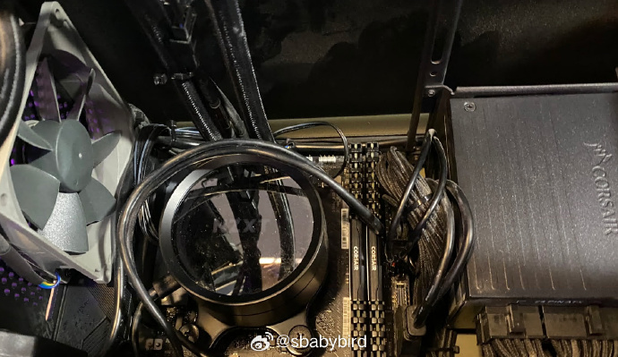
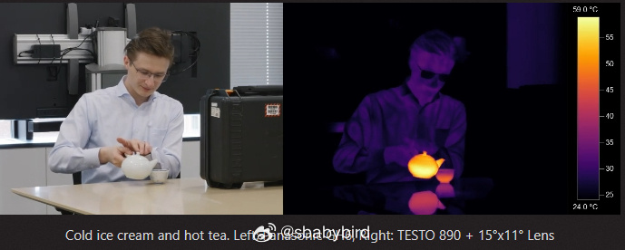
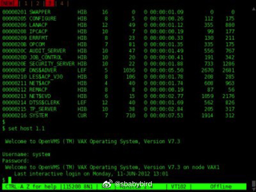
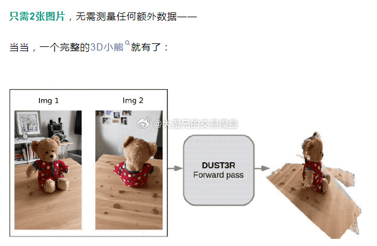

# 机器文摘 第 072 期

## 长文
### 自己编写程序控制电脑的散热

现在的个人电脑，无论是采用风冷还是水冷，基本都带有根据温度情况自动调整风扇转速的控制系统，以达到散热与噪音平衡的目的。

对于水冷散热来说，除了散热风扇的转速之外，还可调整水泵的功率（增大或减小水流速度），这些控制都是为了避免不必要的功率浪费和噪音抑制。

现代 CPU 所带的温控传感器更加灵敏，且随着“睿频”等技术的发展，CPU 的温度波动变得更加剧烈，如果风扇转速时刻与温度参数绑定，对于调度程序来说，很可能造成频繁启停，增加对用户的噪音干扰。

这篇[《使用 Python 和 Grafana 实现更好的 PC 冷却》](https://calbryant.uk/blog/better-pc-cooling-with-python/)的作者意识到现在的温控程序不够智能，于是自己动手搓了一个更加细致的程序，替代了原有的方案，效果不错。

具体改进的细节：

1、根据 CPU 温度控制水泵功率；

2、根据冷却液温度控制风扇转速；

作者开源了用于控制的 Python 脚本，在文章原文里提供了相关链接。

### LUT 查找表在游戏技术中的应用

之前提到过在技术领域，有一些非常通用的“方法”或者“概念”，可用于解决很多难题。

比如：“索引”、“缓存”、“分层”，无论是硬件还是软件，都可以从这些概念和方法的应用中获得好处。

LUT（查找表），也是这样一个“概念”。

这篇[《视频游戏如何使用 LUT 以及使用 LUT 能做什么》](https://blog.frost.kiwi/WebGL-LUTS-made-simple/)，便是探讨和了解 LUT 的很好材料。

部分引用：
> 查找表，通常称为 LUT，与数学本身一样古老。将事物预先计算到行或表中的行为并不是什么新鲜事。但是在图形编程领域，这个简单的行为解锁了一些令人难以置信的创造性技术，艺术家和程序员在面临艰难的技术障碍时都会发现这些技术。
> 
> 我们将踏上一段小小的旅程，这将带我们从简单的事情，如将灰度镜头转换为彩色，到创建无限变化的嗜血僵尸，在此过程中有许多交互式 WebGL 示例，您可以使用自己的视频或网络摄像头进行尝试。尽管本文使用 WebGL，但所展示的技术适用于任何其他图形编程上下文，无论是 DirectX、OpenGL、Vulkan、Unity 等游戏引擎，还是普通的科学数据可视化。

### 一切为时不晚

[KK](https://kk.org) 在 2014 年写的一篇文章[《一切为时不晚》](https://kk.org/thetechnium/you-are-not-late/)，[中文翻译在这里](http://blog.fujiji.com/you-are-not-late/)。

[这篇十年前的文章近期又被 HN 网友顶上来讨论了一番。](https://news.ycombinator.com/item?id=39508046)

文中 KK 主要表达的观点是：

看到互联网上该发明的已经被发明了，先机已被占尽，不要感到沮丧。

实际上再过 30 年回头看的话，还是有很多新的东西出现，现在动手，一切也都来得及。

十年过去了，虽然科技创业环境已经不如从前，但网友们仍然对此观点持支持态度。

## 资源
### 开源的类超级马里奥游戏

[SuperTux](https://github.com/SuperTux/supertux)，是一款跳跃游戏，其灵感来自各种任天堂平台的超级马里奥兄弟游戏。在多个世界中奔跑和跳跃，通过跳到敌人身上、从下面撞到他们或向他们扔物体、在途中抓住动力装置和其他东西来击退敌人。

场景和操控成熟度很不错，可玩度很高。

游戏支持 WASM、MacOS、Windows、Linux 多平台。

### 智谱清言

https://chatglm.cn/main/detail

清华出的大语言模型，可在线使用，个人感觉对话能力在国产领域属于前列；

### 两张照片生成 3D 模型

AI 3D 建模越来越卷了。

[DUSt3R](https://github.com/naver/dust3r)，不需要任何相机校准或视点姿势的先验信息，只需2张图片，无需测量任何额外数据，2秒钟就可完成任意图像的密集或无约束3D重建。

### 直接生成 PNG 素材的扩散模型

[Layer Diffusion](https://github.com/huchenlei/ComfyUI-layerdiffusion)，直接生成 PNG 素材，工作流兼容 SDXL 系列的所有模型和 Lora，甚至能直接生成发丝和透明玻璃杯。

- 插件安装和部署：github.com/huchenlei/ComfyUI-layerdiffusion
- DreamShaper XL 下载：civitai.com/models/112902/dreamshaper-xl

### 绿色 apk 资源下载网站

[简洁无广告的 apk 直接下载网站](https://apkfreedown.com/)，收录 42w+的 app， apkpure 替代网站

作者花了两个月爬取的 apk 文件，花了两个星期开发的网站，目前收录了 42w+的 app ，简单绿色无广告但是有些 app 有兼容性问题，不一定能正常使用。

## 观点
### 把别人说的话当作真理是愚蠢行为
有的时候，别人在表达方面确实能够比自己更清晰地表达出自己的感受，这种时候就容易特别认同别人表达的观点，从而忽略了客观现实。

管中窥豹、盲人摸象、小马过河等成语记录了古人很早之前就意识到的“主观”与“客观”的差异性，以及视角不同所带来的认知差异（实际上每个人都是对的，但是每个人又都是错的）。

唯有自己用心体会和观察，才能探索和接近真相，才有可能找到最符合自身利益的行动。

## 订阅
这里会隔三岔五分享我看到的有趣的内容（不一定是最新的，但是有意思），因为大部分都与机器有关，所以先叫它“机器文摘”吧。

Github仓库地址：https://github.com/sbabybird/MachineDigest

喜欢的朋友可以订阅关注：

- 通过微信公众号“从容地狂奔”订阅。

- 通过[竹白](https://zhubai.love/)进行邮件、微信小程序订阅。

