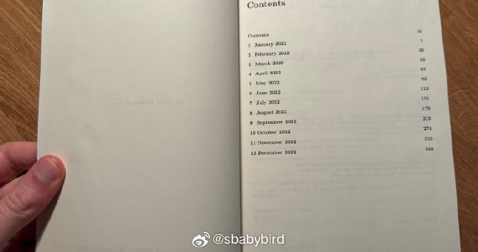
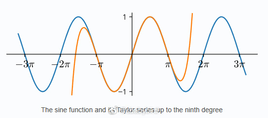
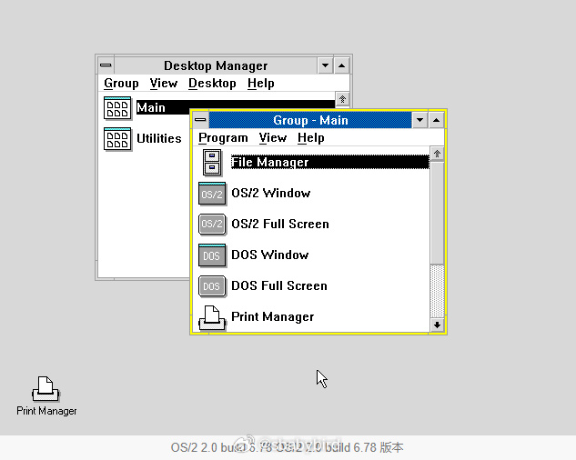
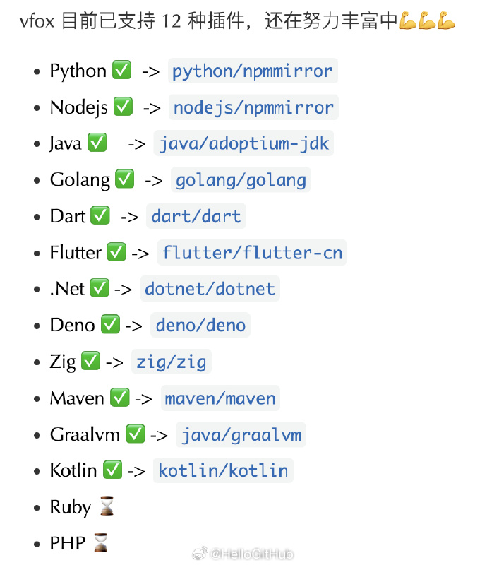
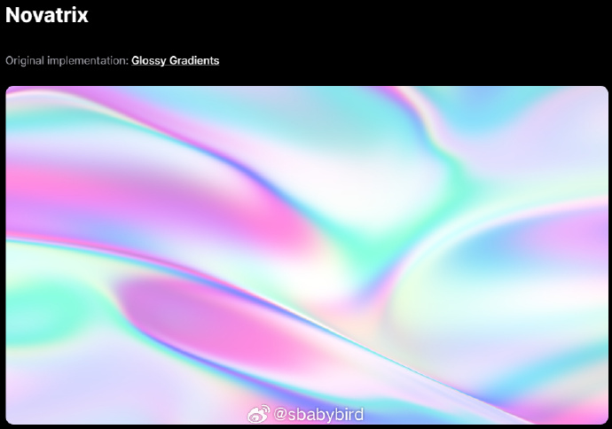
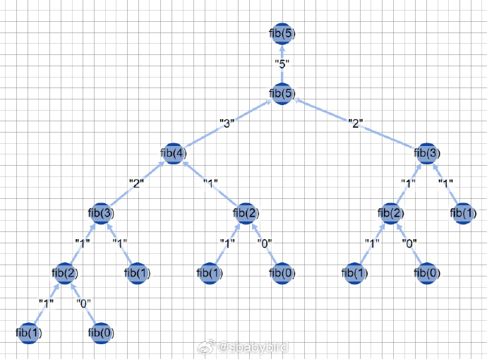
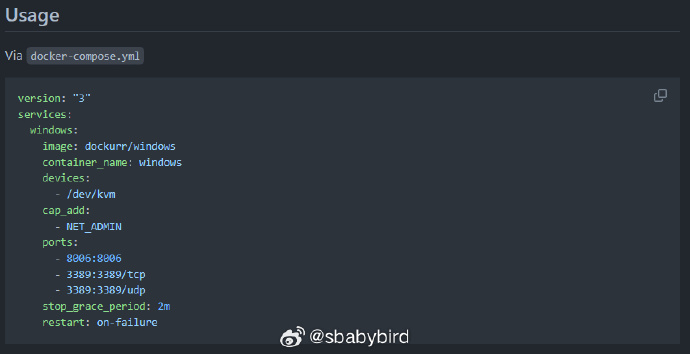
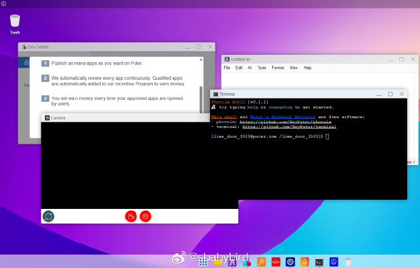

# 机器文摘 第 073 期

## 长文
### 你希望把你的微信聊天记录印成纸质书吗？

国内我没听说过，国外有个哥们儿这样做了。

[《提取三年的 iMessages 聊天记录印成书》](https://benkettle.xyz/posts/message-book/)，记录了这个过程。

1、作者突发奇想希望自己能够随时翻阅（物理上）自己的聊天记录；

2、通过苹果提供的备份软件，将聊天记录备份到 Mac 电脑上，就可以得到一个 SQLite 的数据库（然后可以为所欲为）；

3、使用 LaTex 进行排版（作者是个讲究人。。。）；

4、到网上寻找印制服务，作者的“书”一共 1300 页，花了他 300 美元（嚯）；

5、最后，如果你也想这样干，作者开源了一些过程中有用的代码脚本，地址在这里：https://github.com/bkettle/message-book

### 电脑是如何计算正弦值的？

正弦函数是基本的三角函数之一，在数学、物理、工程和计算机科学等各个领域都起着至关重要的作用。它的计算并非易事，尤其是在电子计算器中实施时，效率和准确性至关重要。

这篇[《计算器如何计算正弦》](https://androidcalculator.com/how-do-calculators-compute-sine/)将深入探讨计算正弦函数的复杂过程，从简单的近似到更复杂的方法。

文中有意思的点：

1、由于正弦函数的周期性，只需计算 [0; pi/2]区间的值就足够了；

2、泰勒级数近似可以逼近正弦函数，但是在 pi/2 处有较大的误差，不可接受，但提供了思路；

3、英特尔有论文表明他们在处理器中使用了专门的多项式公式来近似正弦值（但是没公开！）；

### 为什么有些专业基金经理的回报率还不如一个啥都不懂的外行？

因为有科学研究表明，就像喝水一样，喝多了会中毒，聪明的过头了也会带来危险陷阱。

[《聪明人愚蠢的一面》](https://collabfund.com/blog/the-dumber-side-of-smart-people/)，论述了聪明的脑袋的局限，如果你很聪明，建议看看，说不定可以避开一些陷阱。

关键信息：

1、聪明的人喜欢给结果强行套入自己的公式：面对外部事情发生的结果，总是要拟合出一个自己的函数，并且认为其预测无比精准，比如解释股市涨落的各种公式。

2、聪明的人基本听不进去资历比自己低的人提出的建议或观点：这也是很多企业走下坡路的原因，CEO 太聪明，无法接受任何外部的建议。

3、很难改变主义：坚持自己的判断，会为错误付出巨大成本。

### 关于 OS/2 操作系统的那些事儿

如果你有幸摸过 2000 年之前的个人电脑，并且进入过它的 BIOS 界面的话，应该对一个选项有所印象。

主板会让你选择希望安装的操作系统，以便做出对应的程序准备和调整，其中操作系统选项里一直有个叫做 “OS/2”的名字。

这是我对这个操作系统的最早印象，后来 Windows NT/98/ME/2000/XP 几乎占据了所有桌面电脑，操作系统在一段时间内几乎就等于 Windows 了。

然而如果把时钟拨回到 1990 年，那个时候，微软和 IBM 都在同一个操作系统上发力，那就是[ “OS/2”](https://baike.baidu.com/item/OS%2F2/1958699)，一款面向未来的操作系统。

这篇[《从未有过的未来》](https://www.os2museum.com/wp/the-future-that-never-was/)回顾了这款操作系统的诞生以及短暂的发展历程。

如果你好奇 OS/2 到底长什么样的话，可以看一看，里面展示了一些古老的操作界面。

它记录了上世纪 90 年代计算机操作系统从 16 位逐渐迈向 32 位的艰难过程。

值得一提的是，虽然这款操作系统最终没能成功，但是微软的开发人员在相当长的一段时间内是使用了 OS/2 上面的环境开发了 Windows 系统 。

## 资源
### 支持多编程语言的环境版本管理工具

[vfox](https://github.com/version-fox/vfox)，一款跨平台的通用版本管理工具，通过命令行快速安装、切换编程语言的不同版本，并支持自定义源地址。相比于针对每种语言的独立版本管理工具（如 nvm、fvm、gvm 等），这个项目让开发者摆脱繁琐的学习和记忆过程，只需一个工具、一条命令，轻松搞定多编程语言版本管理。

### 一键给网页添加 WebGL 动态背景

[uvcanvas](https://github.com/latentcat/uvcanvas)，一个开源的 React 组件库，使用 webgl 的着色器，可以快速给网页加入炫酷的动态背景。

### 递归查看器

[recursion-viewer](https://dmytrobaida.github.io/recursion-viewer/)，这个网站可以可视化展示 JS 递归函数调用的过程，方便理解和调试你的递归函数。 

### 在 docker 容器里跑 windows 系统

[Windows in a Docker container](https://https://github.com/dockur/windows). 一个开源项目，在 docker 容器里跑 windows 系统，可选择 Win7，Win10，Win11 等，支持自动激活，还支持远程桌面连接。

基于 Linux 内核的 KVM 虚拟化技术，相当于容器里面跑虚拟机，然后再跑 Windows 系统，不过镜像已经实现了激活和开启远程桌面控制，比较方便使用。

### 浏览器中的桌面环境

[Puter](https://github.com/HeyPuter/puter​​) 是浏览器中的高级开源桌面环境，旨在功能丰富、速度极快且高度可扩展。它可用于构建远程桌面环境或用作云存储服务、远程服务器、Web 托管平台等的接口。

此产品已运营 3 年，且用户量达到了 100 万，现在作者把他开源了出来。

## 观点
### 《论生命之短暂》
塞涅卡的《论生命之短暂》读起来有些类似马可奥勒留的《沉思录》的感觉，看完并不能记住太多内容，只记得作者在进行一些哲学反思，推崇追求高尚的人格；

其中对于幸福的论断，要求人们看重财富但不能将之放在中心地位，只有这样才能避免成为财富的奴隶；

作者论述了一个反极端的观点：即便是上述要求没有做到，也不能认为是失败的，人们树立了追求美德的目标，只要有这个向善的认识，即便没有做到“知行合一”也没什么好指责的；

看得出来，作者作为当时斯多葛学派的代表人物，应该是遭受了很多“网络”喷子的攻击，不过作者拥有强大的内心，并未进行反驳和过多解释，坚信自己对美德的追求；

## 订阅
这里会隔三岔五分享我看到的有趣的内容（不一定是最新的，但是有意思），因为大部分都与机器有关，所以先叫它“机器文摘”吧。

Github仓库地址：https://github.com/sbabybird/MachineDigest

喜欢的朋友可以订阅关注：

- 通过微信公众号“从容地狂奔”订阅。

- 通过[竹白](https://zhubai.love/)进行邮件、微信小程序订阅。

