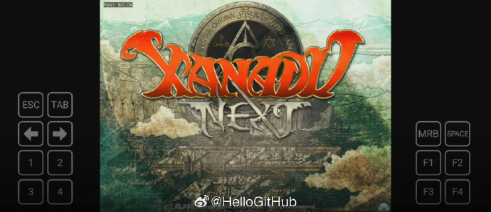

# 机器文摘 第 074 期

## 长文
### 在谷歌日历里玩打砖块游戏

打砖块是一款历史悠久但是十分容易上瘾的消除类游戏。

之前在家用主机、PC、街机等游戏平台上都有大量的版本。

现在有人把打砖块游戏移植到了一个从没去过的地方----谷歌日历。

作者做了一个叫做 [BreakTime](https://chromewebstore.google.com/detail/breaktime/efajcgehdfpliglonbkjmifmibpphafk?hl=en&authuser=0) 的休闲游戏，打开谷歌日历的页面就能玩。

游戏是一个谷歌浏览器插件，到市场安装后再打开谷歌日历后就玩到游戏了。

游戏一共写了大概 1500 行 Js 代码（含一个迷你游戏引擎）。

[这篇文章记录了作者研发这个游戏的历程。](https://eieio.games/nonsense/game-13-breaktime/)

### 上世纪三十年代怎样传输照片？

前一段时间我读了一本书，匈牙利著名的战地记者罗伯特·卡帕所著，名为[《失焦》](https://book.douban.com/subject/1270508/)。

那句著名的“你拍的不够好是因为你离得不够近”就是出自卡帕之口。

书中记述了作者在二战欧洲战场上记录战斗场景的各种惊心动魄故事。

但我对于他将照片及时传送给远在纽约的报社所用手段更感兴趣，于是研究了一下当时可能采用的技术。

经过搜索，锁定了一个通过在滚筒上绕线的方式传输照片的技术（实际上就是传真机），维基百科有相关介绍：https://en.wikipedia.org/wiki/Wirephoto

相关资料较少，[这篇中文论文探讨了照片传输的技术发展](https://blog.sciencenet.cn/blog-469915-1094198.html)。

> 在发送端，照相软片缠绕在一个玻璃圆筒上，外置光源（这里使用能斯特灯）发出的光线通过透镜汇聚于一点，穿过胶片进入玻璃圆筒，经棱镜反射于硒光电池上。
> 玻璃圆筒旋转的同时沿轴向运动，光点就以螺旋线的形式对整个胶片表面进行扫描。由于胶片各点的透明程度不同，照射于硒光电池上的光强度亦不相同，硒的电阻值随光照强度的变化引发导线上的电流强度随之变化。
> 在接收端，将与发送端相同的玻璃圆筒置于一个暗箱中，其表面覆盖着感应相纸。
> 接收端装有一个线动电流表，这个电流表由两根平行银线构成，两线中间安置了一个镁片，镁片覆盖于一个三角形的小孔前，其另一侧为一强光源。
> 由发送端传来的电流经过电流表时，银线带动镁片发生偏转，使得小孔部分露出，电流越强，小孔露出的部分越大。这样，通过小孔进入暗箱的光线强度随着电流强度而发生改变，光线经透镜汇聚后使相纸上相应位点的感光程度亦不相同，从而实现图像复制。

据说直到上世纪 90 年代仍有报社在使用这项技术进行照片传输。

### 九岁小孩用汇编语言能做什么

汇编语言几乎等于机器语言，编程的视角非常贴近硬件，写起来枯燥乏味且不易人类理解。

现在除非一些特殊场景，否则应该没有人再愿意用它来编程了。

不过在个人电脑还没那么普及的上个世纪八十年代，想要编程整点儿活儿，很有可能还得首选汇编。

这篇[《我在 9 岁时开发了一个绘画语言》](https://nanochess.org/locs.html)的作者真乃神童也。

小小年纪因为喜欢用 Logo 语言进行绘图，但苦于手头缺乏市面上能够运行 Logo 语言的计算机，干脆自己撸了一个面向 Z80 机器的移植版本。

（作者在 1988 年时才 9 岁，向小孩哥致敬 5 分钟）。

虽然功能不算完备，但竟然具有可用性，成果后被作者的父亲用于教学活动中。

他在整理父亲用于教学的文件夹时发现了自己写的代码以及说明文档。

于是在 36 年之后写文章记录了下来。

文中展示了他编写的代码，并讲解了部分实现原理。

### 了解古老的矢量显示器

无论是现在的液晶显示器，还是再稍微古老一点的阴极射线管（CRT）显示器，都采用了一种叫做“光栅化”的技术来显示图像。

这也是现代计算机图形学的基础，即：采用若干个有限的像素点来组成可见图像。

但是，在此之前，还有一种显示技术，很少有人提到，不过它也曾经风靡过一段时间。

它就是“矢量（Vector）显示器”，与现有的光栅化技术不同的是，其通过电子枪在荧光屏上直接“绘制”矢量图形来实现画面的显示。

矢量显示器曾经一度作为高级图形工作站、航空航天仪器控制台、游戏机等各种应用场景的显示设备，甚至早期的科幻电影中，畅想的未来宇宙飞船中的控制台也是使用矢量显示器。

这篇[《XY显示器的秘密生活》](https://www.jmargolin.com/xy/xymon.htm)，非常深入地探讨了早期矢量显示器的技术细节，其中有很多微妙的部分。

作者早年在雅达利公司工作，参与了几款矢量游戏的制作（估计类似太空飞船对射的那种？）。

那时还没有形成计算机图形学的专门理论，更没有图形 API 可供调用。

作者作为技术人员，必须了解相当多的硬件细节才能开发游戏。

一些有趣的细节：

1、控制 CRT 电子枪在荧光屏聚焦瞄准的部件是由若干个产生电场的线圈阵列组成，其使用的数学方程与设计相机镜头玻璃参数的方程一样，也就是说，这些线圈是一组用于电子束的“透镜”（原理和作用都一样）。

2、如果希望产生接近平面直角的画面，必须使用特殊的手段来纠正屏幕角落的偏转失真，这些特殊手段包括在控制电路中加入模拟乘法器以实现偏转非线性矫正（1980 年代，数字控制肯定不现实）。

3、显示器需要高电压（大概 1 万伏）来加速电子，那时最容易坏的器件就是那个提供高电压的变压器。

### 用 Excel 实现一个 GPT

[Excel 现在是图灵完备的了](https://linux.cn/article-13078-1.html)，理论上可以用它来做任何编程语言做到的事情。

现在有人整活，实现了一个[在 Excel 里的 GPT](https://spreadsheets-are-all-you-need.ai/index.html)（GPT2 模型，估计太大的运行不了吧）。

事实上作者是希望通过这个项目来向大家讲解 GPT 的基础技术原理。

项目仓库在这里：https://github.com/ianand/spreadsheets-are-all-you-need 可以去下载最新版本的 Excel 文件。

### 从神经网络到 Hugging Face

互联网上优质而公开的中文内容越来越少，这篇[《从神经网络到 Hugging Face》](https://hutusi.com/articles/the-history-of-neural-networks)，是一篇科普神经网络、深度学习发展历程的文章。

文章条理清晰，一边梳理神经网络技术的发展历史，一边讲清楚了神经网络的核心思路，是我近期在中文网络上看到的少有的好文。

## 资源
### 跨平台数据库客户端

[DBeaver](https://github.com/dbeaver/dbeaver) ，一款为开发人员、SQL 程序员、数据库管理员和分析师提供免费的跨平台数据库客户端应用。

基于 JDBC 支持几乎所有常见数据库（商业版本支持非 JDBC 数据源）。

具有许多功能，包括元数据编辑器、SQL 编辑器、丰富的数据编辑器、ERD、数据导出/导入/迁移、SQL 执行计划等。

基于 Eclipse 平台进行开发。

### 基于矢量的绘图应用程序

[Rnote](https://github.com/flxzt/rnote) 是一个开源的基于矢量的绘图应用程序，用于素描、手写笔记以及注释文档和图片。它面向学生、教师和拥有绘图板的人，并提供 Pdf 和图片导入和导出、无限画布和适用于大屏幕和小屏幕的自适应 UI 等功能。

配合手写笔和绘图板使用效果更佳。

用 Rust 和 GTK4 编写。 ​​​

### 在安卓上运行 Windows 老游戏

[winlator](https://github.com/brunodev85/winlator)，一个可以在 Android 系统上运行 Windows 游戏和应用的开源模拟器。

这是一个 Android 应用，可以让你使用 Wine 和 Box86/Box64 来运行 Windows 应用和游戏，实现在手机上畅玩各种经典的 PC 游戏。

### 电子书《Transformers 快速入门》

教程旨在帮助 NLP 初学者快速熟悉 Transformers 库的使用方法，并且通过实例带领读者一步一步构建自己的模型，完成各种 NLP 任务。

Transformers 是由 Hugging Face 开发的一个 NLP 包，支持加载目前绝大部分的预训练模型。

随着 BERT、GPT 等大规模语言模型的兴起，越来越多的公司和研究者采用 Transformers 库来构建 NLP 应用。

读者只需要熟悉 Python 语言即可，并不需要提前掌握 Keras、Pytorch 等深度学习包的使用。

地址：https://transformers.run/

### 吴恩达新的 AI 课程 RAG 知识图谱

课程包括：
- 通过从头开始构建公共财务文档图来探索知识图谱的工作原理
- 学习编写从图表中检索文本和数据的查询，并使用它来增强传递给 LLM 聊天机器人的上下文
- 将知识图谱与问答链相结合，构建更好的 RAG 驱动的聊天系统

免费注册：https://www.deeplearning.ai/short-courses/knowledge-graphs-rag/

## 观点
### 降低输入，保持专注
当下的环境里，想要保持专注，比以往的任何时候都要更难一些。

但也不是不能做到，有一些简单易行的方法；

其中最首要的便是减少信息输入，尤其是网络碎片信息，短视频、社会新闻、娱乐新闻等等；

信息输入的降低，可以有效减轻大脑负担，才有精力感受当下，脑海才能出现属于自己的思想意识（生其心）；

其次是做一些自己能够持续产生心流的事情，比如写字、绘画、编程、运动、喝茶、游戏，在过程中，逐渐沉浸，进入心流状态，忘记时间的存在；

保持专注是对当下的最好体会，也是解决担忧人生虚度的良药，是“应无所住，而生其心”的一种实践；

## 订阅
这里会隔三岔五分享我看到的有趣的内容（不一定是最新的，但是有意思），因为大部分都与机器有关，所以先叫它“机器文摘”吧。

Github仓库地址：https://github.com/sbabybird/MachineDigest

喜欢的朋友可以订阅关注：

- 通过微信公众号“从容地狂奔”订阅。

- 通过[竹白](https://zhubai.love/)进行邮件、微信小程序订阅。

