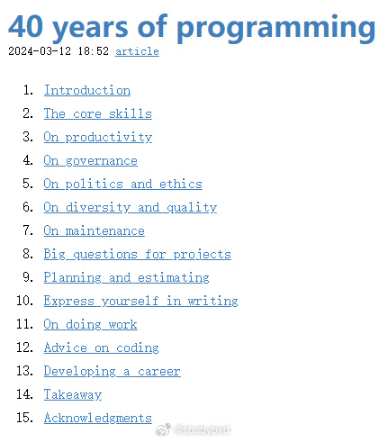
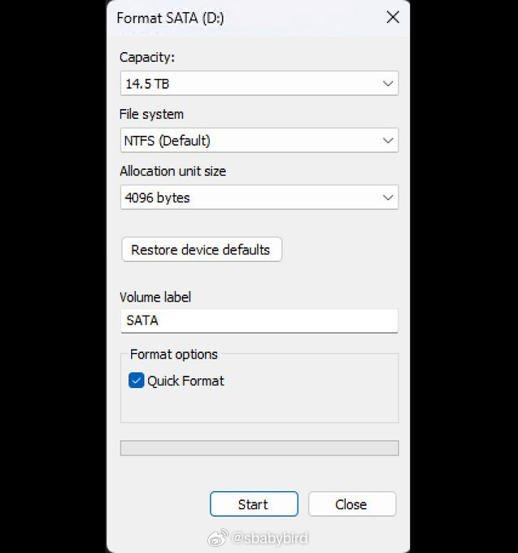
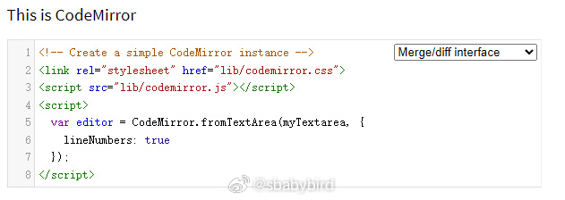
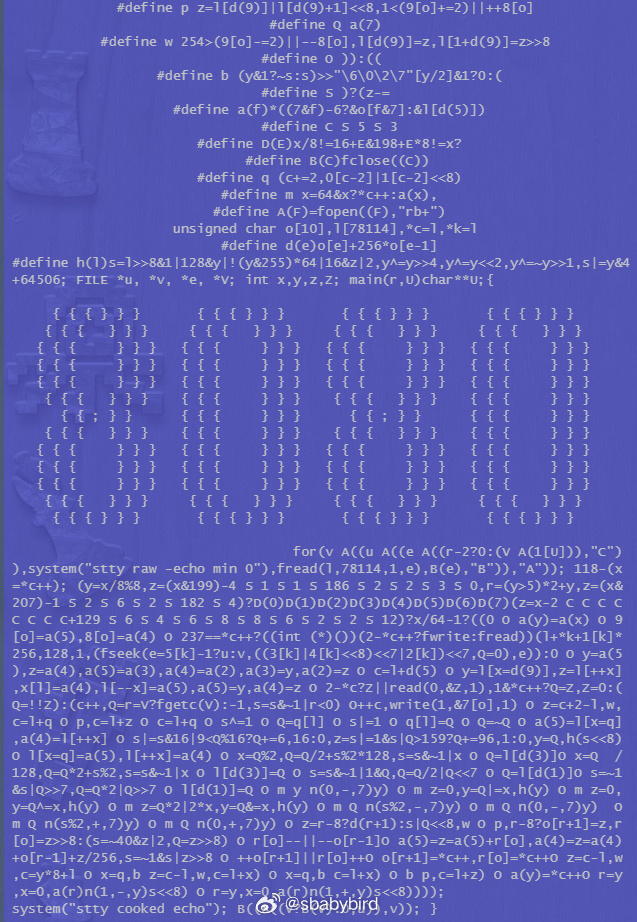
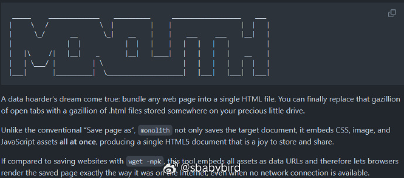
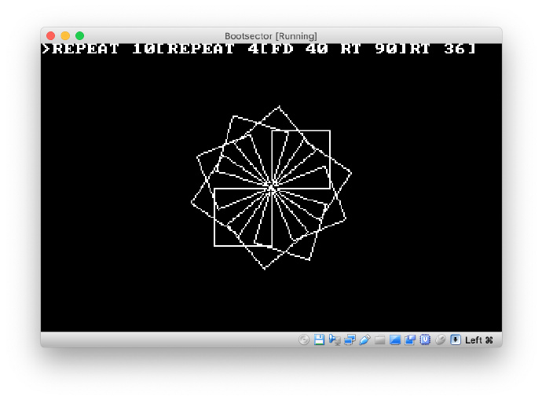
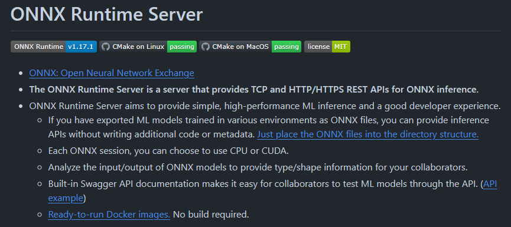
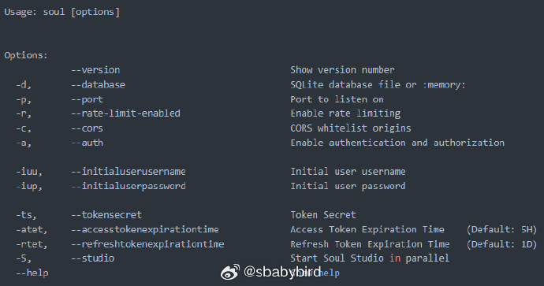

# 机器文摘 第 075 期

## 长文
### 40 年编程经验分享

[40 年编程经验分享](https://liw.fi/40/)

作者 14 岁接触电脑（1984年），为了玩到游戏而不得不学习 BASIC 编程，而后一发不可收拾，决定了他一生的事业。

与几乎所有过来人一样，作者认识到自己走了一些弯路，并希望分享一些掏心窝子的话，给那些刚起步不久的程序员。

*作者很罗嗦，写了很多，我觉得大概率没人能听进去*

歌词大意：

1、创造软件的核心技能不是编程，而是沟通和协作，哪怕是只有 1 个人的项目，也需要考虑“过去的你”、“现在的你”和“未来的你”这三个人的沟通；

2、做事有条理，不被打扰，吃好睡好是提升生产力的关键，一套合理的个人事务管理与跟踪系统很有必要。作者提到了[ GTD ](https://gtdfh.liw.fi/)这套个人时间管理方法论（我也曾沉迷过一段时间）。

3、软件生产的大部分成本来自初始版本之后，即所谓的维护阶段。最初的开发可能需要一两年的时间，维护将需要几十年的时间。(这说的是比较成功的软件吧？）所以提前考虑好维护成本也很重要。

4、两周之外不要做详细计划，但两周内进行详细计划并且按照方向进行迭代，是比较有效的方式。

5、书面表达很重要，文字材料用于交流的实用性很高。

6、写简单的、清晰的代码，而不是复杂的、高级的代码。

7、推荐阅读[《软件设计哲学》](https://github.com/Cactus-proj/A-Philosophy-of-Software-Design-zh)（链接是我找到的中文版，之前好像收录过）。

### 30 年前写的一个对话框一直用到今天

 Windows 自带的格式化磁盘对话框，来自于 30 年前的一次临时提交，当时作者花了大概一个早上，编写了它。

谁知后来竟再也没改过。

文章来自作者的推文：twitter.com/davepl1968/status/1772042158046146792

> 在1994年的一个阴雨连绵的星期四早晨，我在微软公司写下了这个格式化对话框，如果我没记错的话。

> 当时我们正在将Windows 95用户界面的无数行代码移植到NT系统上，而格式化功能正是Windows NT与Windows 95差异足够大，以至于我们必须设计一些定制化的用户界面的领域之一。

> 我拿出一张纸，记录下了所有与磁盘格式化相关的选项和选择，比如文件系统、标签、簇大小、压缩、加密等。

> 接着我启动了VC++ 2.0，使用资源编辑器简单地将所有你必须做出的选择以垂直堆叠的方式布局出来，大致按照你必须做出这些选择的顺序。它并不优雅，但在优雅的用户界面到来之前，它能够凑合使用。

> 那是大约30年前的事了，而那个对话框至今仍是我那个星期四早上的临时版本，所以请小心对待“临时”解决方案！

### 追求财富的科技智慧：Naval Ravikant 的深刻见解

在这个快速变化的时代，科技不仅重塑了我们的生活方式，也重新定义了财富的概念。Naval Ravikant，作为一位杰出的科技投资者和 AngelList 的联合创始人，为我们提供了一份关于如何在科技领域追求财富、实现个人自由和成功的宝贵指南。

[《How to Get Rich》(怎样致富？）](https://nav.al/rich)

这篇文章是基于Naval在Twitter上发布的一系列推文（tweetstorm）而扩展的，这些推文因其深刻的见解而迅速走红。Naval在文中讨论了如何通过追求财富来获得自由，而不是仅仅为了金钱或社会地位。他提出了一系列原则和建议，包括：

1. 寻求财富而不是金钱或地位。
2. 财富是可以在你休息时仍能为你赚钱的资产。
3. 金钱是社会信用，可以用来转移财富。
4. 地位是社会层级中的一种排名。
5. 创造财富不是零和游戏，而是正和游戏。
6. 通过提供社会所需的产品或服务来创造财富。
7. 避免将自己的时间出租，而是要拥有股权以获得财务自由。
8. 通过建立信誉和独特的个人品牌来吸引运气和机会。
9. 利用互联网扩大职业可能性，找到并放大你的小众兴趣。
10. 选择与长期合作的长期伙伴一起工作。

Naval认为，财富不仅仅是金钱的堆砌，更是能够在我们休息时持续创造价值的资产。他区分了财富、金钱与地位，强调了财富的真正价值在于它能够为我们带来自由——从日常的束缚中解放出来，拥有选择的自由。

Naval Ravikant的见解为我们提供了一种全新的视角，让我们认识到在科技时代追求财富不仅仅是为了物质的积累，更是为了实现个人的梦想和自由。他的理念和策略无疑将激励和指导科技爱好者、创业者和投资者在这个时代创造更多的价值和可能性。

*这篇文章很长，长到我一直没耐心看完，不得不求助于 AI 帮我总结*

### 用 Javascript 实现一个源码解析器

解析器（Parser）是源码编译工具的重要组成，包括一些现代的文本编辑器，为了实现语法高亮、自动补全等功能，也需要在代码编辑时刻进行解析。

很多人遇到此类任务的第一感觉是很难（比如让你手写一个 C++ 的解析器），但如果写一个轻量的、小的解析器也许很简单。

这篇[《Lezer ： A parsing system for CodeMirror, inspired by Tree-sitter》](https://marijnhaverbeke.nl/blog/lezer.html)，是开源前端代码编辑器 [CodeMirror](https://codemirror.net/) 的作者所写。

写这篇文章主要是为了介绍他给 CodeMirror 所编写的解析器 [Lezer](https://lezer.codemirror.net/) ，同时讲解了怎样使用 Javascript 语言构建一个解析器，作者认为此类任务并没有想象中那么复杂，只要掌握一些基本的思路，普通程序员也可以做出符合自己需求的解析器来。

### 2000 个字符写一个 Intel 8080 CPU 模拟器

[2000 个字符写一个 Intel 8080 CPU 模拟器](https://nanochess.org/emulator.html)

注意，不是 2000 行代码，是 2000 个字符。

作者给出的这些代码是他参加[ IOCCC ](https://www.ioccc.org)比赛的获奖作品，即文章标题提到的 8080 模拟器。

IOCCC 的全称是 International Obfuscated C Code Contest（国际C语言混乱代码大赛）。

这段仅有 2000 个字符的 C 语言程序不仅模拟了 8080 CPU，并且还带有键盘输入和屏幕输出的支持，以及一个磁盘控制器，可以算是一个简单的个人电脑了。

在运行后可以加载一些古老的 BASIC 解释器，实现最基本的编程操作。

作者在文章里介绍了 8080 的一些技术细节，比起现在的 CPU ，那时的 CPU 确实简单很多。

至于这段代码，虽然作者也在文中试图解释了一些原理，不过还是不要试图弄懂它了吧。

## 资源
### 网页打包下载到本地

[monolith](https://crates.io/crates/monolith)，一个可以将任何网页打包下载到一个 HTML 文件中的工具。

与传统的“将页面另存为”不同， monolith 不仅保存目标文档，还同时嵌入了 CSS、图像和 JavaScript 资源，生成了一个存储和共享的 HTML5 文档。

与使用命令 `wget -mpk` 保存网站相比，此工具将所有资产嵌入为数据 URL，因此即使在离线情况下，浏览器也可以还原页面的原始效果。

### 最小的 LOGO 语言解释器

[BootLOGO](https://github.com/nanochess/bootLogo)，Logo 语言的一个小型解释器，只有不到512字节大小。

汇编语言写的。可以装在x86 引导扇区启动系统。

小海龟 LOGO 语言是一代人的计算机启蒙语言。早年流行的小霸王学习机上也有过 ​​。

### 将任意 AI 模型发布为 HTTP 服务

[ONNX Runtime Server](https://github.com/kibae/onnxruntime-server) 是一个为 ONNX 推理提供 TCP 和 HTTP/HTTPS REST API 的服务程序。

可以方便地将任意 ONNX 格式的模型发布为 HTTP 服务供外部调用。

ONNX 是一个开放格式，用于描述和承载深度学习模型，允许跟不同的深度学习框架进行模型格式转换。ONNXRuntime 旨在提供一种高效的方式来运行 ONNX 模型，支持多种硬件和软件平台，包括 CPU、GPU 和边缘设备。

### 给 Sqlite 数据提供 HTTP 服务

[Soul](https://github.com/thevahidal/soul)，一个给 Sqlite 数据库提供 REST API 的命令行工具。

运行 `soul -d sqlite.db -p 8000` ，它会在 网页链接 上启动一个 REST API，在 `ws://localhost:8000` 上启动一个 Websocket 服务器。 ​​​

## 观点
### 信誉堪比黄金
在低信誉社会里要不要坚持守信，是一个有点儿复杂的问题。

普遍讲信誉的环境里，低信誉个体短期会带来极大收益，但长期是无法生存的。

与之相反，低信誉环境下，高信誉个体短期会损害利益，但长期会积累起坚不可摧的东西。

所以我个人的想法是，在物理条件允许的情况下，尽量讲信誉，将之视为比黄金更珍贵的品质。

## 订阅
这里会隔三岔五分享我看到的有趣的内容（不一定是最新的，但是有意思），因为大部分都与机器有关，所以先叫它“机器文摘”吧。

Github仓库地址：https://github.com/sbabybird/MachineDigest

喜欢的朋友可以订阅关注：

- 通过微信公众号“从容地狂奔”订阅。

- 通过[竹白](https://zhubai.love/)进行邮件、微信小程序订阅。

