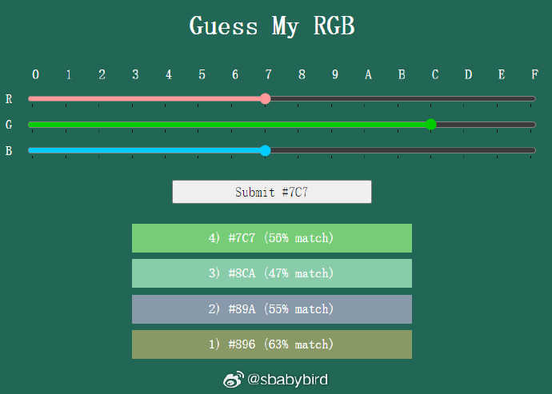

# 机器文摘 第 076 期

## 长文
### 太阳有意识吗？

许多文化和宗教传统中，太阳和其他天体被认为是有生命和智慧的。

例如，在古罗马和印度，太阳被尊为神；在其他某些文化中，太阳是女神。

这些传统反映了人类对自然界的拟人化理解。

[太阳有意识吗？](https://www.sheldrake.org/files/pdfs/papers/Is_the_Sun_Conscious.pdf)

这篇文章的核心内容是探讨太阳是否可能具有意识。

文章首先指出，从机械唯物主义或物理主义的角度来看，太阳显然不是有意识的，因为在这些观点中，宇宙是一个机械系统，自然是非意识的，意识只是大脑物理活动的产物或幻象。然而，作者提出，从泛心论（panpsychism）的角度来看，意识可能是自然界多层次组织结构中的基本特征，不仅仅局限于大脑。

文章进一步探讨了泛心论和信息整合理论（Integrated Information Theory, IIT），这些理论认为意识可能是物质的基本属性，存在于从原子到生物体的各种自组织系统中。文章还讨论了电磁场理论对意识的看法，这些理论认为大脑的电磁场可能就是意识的物理基础。

作者提出了几个假设，包括Greg Matloff的“志愿星假设”（volitional star hypothesis），该假设认为恒星可能通过控制电磁驱动的喷流来调整在星系中的位置。另一个假设是Clément Vidal的“stellivore hypothesis”，该假设认为一些恒星可能是捕食者，通过从双星系统中的伴星吸食物质来维持自己。

文章最后讨论了太阳的电磁场可能是其意识的物理基础。太阳是一个由等离子体组成的极其复杂的电磁系统，其电磁活动影响整个太阳系甚至更远。太阳的电磁场可能像大脑的神经网络一样，整合来自太阳系各个部分的信息。

作者总结说，我们可以选择相信宇宙是非意识的，由永恒的数学法则统治，通过无目的和无意识的过程演化；或者我们可以选择接受泛心论的观点，即意识可能是自然界多层次组织结构中的基本特征。如果太阳有意识，那么它可能关心的是调节和保护自己的身体，以及通过电磁活动影响整个太阳系。此外，太阳可能通过其在银河系中的位置和与其他恒星系统的相互作用来感知和影响更大的宇宙。

*注：以上内容来自月之暗面聊天模型 [kimi](https://kimi.moonshot.cn/) 的总结*

### 计划式编程还是探索式编程？

来自 HN 上的一个讨论：https://news.ycombinator.com/item?id=39835343

作者写了一篇文章表达了自己的编程习惯以及正在做的一些尝试：https://blog.dziban.net/essays/explorative-programming/

作者表示，自己从来就没有按部就班地编程过，那种教科书上“从设计蓝图到开发计划再到编码实现”的“正规”方式自己根本适应不了。

他喜欢的方式是，面对一个需要编程解决的问题，直接上手干，然后一边试一边改。

貌似有很多程序员都是这样，我自己在编程时一般会在脑子里先构思一下，但也是边写边改。

不过也有例外，记得有次我在 YouTube 上看到一个大神面试，考官给出问题，然后他直接写代码，写完一遍执行通过，一个错误都没改。

HN 上同样有不同的声音，有人表示喜欢先仔细设计好再进行编码实现，可能个人习惯不同吧。

但是，讨厌反馈周期长的事情是人的本性，人们都喜欢立即能看到效果。

所以作者推断，肯定是喜欢这种边干边改的程序员居多。

他给这种编程方式取名叫“探索式编程”，并表示目前的 IDE 、编程语言等各种环境都没有为这种编程方式提供方便。

比如：不要基于文件管理各种函数和变量，随时自动给整套环境或某个函数提供快照，这样可以像探索迷宫那样，错了可以立即回到刚才的转角。

最后作者表示自己正在动手制作一套这样的环境，并且选择 Common Lisp 作为编程语言（因为 Lisp 最接近作者想要的动态定义效果）。

不过我看完作者的构思之后，感觉当前比较火的 Python 语言外加 [Jupter notebook](https://www.dataschool.io/jupyter-and-ipython-terminology/) 也能满足一部分需求吧。

### 探索遗失的网络世界：Telnet 的复古魅力

尽管 Telnet 作为一种远程访问服务器的工具已经被 Secure Shell (SSH) 所取代，但仍有一些人保持着他们的 Telnet 服务在线，因为它能够提供一种复古的娱乐体验。 

通过 Telnet，用户可以连接到不同的服务器，欣赏动画ASCII艺术、玩游戏等。

在文章[《The Lost Worlds of Telnet》](https://thenewstack.io/the-lost-worlds-of-telnet/)中，作者回顾了 Telnet 这个被遗忘的互联网工具的历史和文化。

从ASCII艺术到复古游戏，Telnet不仅仅是SSH的前身，它还是一个充满乐趣的数字时光机。

### 从 160 行代码到 200 亿安装量：Curl 的传奇故事

[本文介绍了 curl 的创始人 Daniel Stenberg 在 FOSDEM 2024 大会上的演讲内容](https://www.infoq.cn/article/fEABoclZW0Fswu2g5Vvu)。

Stenberg 分享了他从事开源项目的经历和见解，强调了成功的开源项目背后并没有天才或魔法，只是长期的努力和对创意的持续追求。

他还提到了 curl 项目的起源和发展历程，以及在开发过程中所遇到的挑战和教训。

尽管 curl 已经成为一项广泛应用的数据传输工具，但 Stenberg 强调了团队合作的重要性，并分享了他对开源社区的感悟和建议。

## 资源

### 猜 RGB 值的小游戏

[这有一个小游戏，网页随机显示一个背景色](https://susam.net/myrgb.html)。

并给你三个滑动条，代表 RGB 的值，你通过拖动他们形成一个你的猜测值。

看你几次能够才对当前背景色的值。

前端开发和设计师应该比较好上手吧。 ​​​

### 图像分辨率增强工具

[开源免费的跨平台图像分辨率增强工具](https://github.com/upscayl/upscayl)。

支持在你的桌面环境独立部署。 ​​​

### NotepadNext

替换 Windows 自带记事本又多一个选项。

[NotepadNext](https://github.com/dail8859/NotepadNext)，开源跨平台编辑器（GPL3协议），Notepad++ 的平替。

虽然作者说目前还有不少 bug 和待完成的功能，但是估计网友们苦 Notepad++ 久矣，对这个项目都很热情，目前超过 7k star。 ​​​

### 用 Javascript 做深度学习

[js-torch](https://github.com/eduardoleao052/js-torch)，Javascript 深度学习库，跟 PyTorch API 基本一致，优势是可在任意 JS 环境运行，在浏览器里也可以进行深度学习训练。

Demo 地址：eduardoleao052.github.io/js-torch/assets/demo/demo.html ​​​

### 丑丑头像生成器

地址：https://txstc55.github.io/ugly-avatar/

随机生成丑不拉几的手绘头像。 ​​​

## 观点

## 订阅
这里会隔三岔五分享我看到的有趣的内容（不一定是最新的，但是有意思），因为大部分都与机器有关，所以先叫它“机器文摘”吧。

Github仓库地址：https://github.com/sbabybird/MachineDigest

喜欢的朋友可以订阅关注：

- 通过微信公众号“从容地狂奔”订阅。

- 通过[竹白](https://zhubai.love/)进行邮件、微信小程序订阅。

