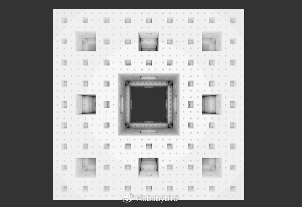
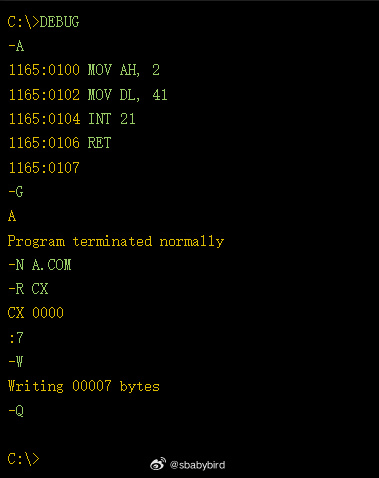
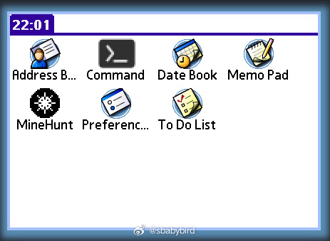

# 机器文摘 第 077 期

## 长文
### 不下雨就不能上网？

当年有个流传很广的关于汽车的故事。说的是福特工程师接到一个顾客投诉，他每天开车路过冰淇淋商店买冰淇淋，每当买香草冰淇淋的时候，发动机就会锁死。

看似很玄的一个故障，在工程师不屑的努力下，发现了故障原因----“香草冰淇淋制作时间非常短”，顾客短时间内停车再发动，导致车载电脑开启了保护模式。

现在又有一个关于 Wi-fi 的真实段子，来源于这篇[《只有下雨才有 Wi-fi》](https://predr.ag/blog/wifi-only-works-when-its-raining/)。

这篇文章是作者在愚人节发布的，旨在以幽默的方式探讨一个看似荒谬的现象。

作者分享了一个非常“走近科学”的故事，即：家里的 Wi-Fi 信号只有在下雨时才能正常工作。

每当下雨时，Wi-Fi 连接就会变得非常稳定，而雨停后不久，连接就会变得不稳定。

为了解决这个问题，作者开始调查家庭网络设置。

他们家使用的是一种通过两个高增益定向 Wi-Fi 天线建立的视线Wi-Fi桥接（line-of-sight Wi-Fi bridge）连接，这种设置在过去的十年里一直运行得很好。

作者通过一系列的排查和调试，包括重启设备、检查网络硬件、测试有线连接等，都没有找到问题的根源。

最终，作者在一次检查过程中意识到，他们家附近的一棵大树随着时间的增长，其顶部的树枝开始干扰 Wi-Fi 信号。

每次下雨时，雨水的重量会使树枝下垂，暂时避开了对 Wi-Fi 信号的遮挡，

这就是为什么雨停后不久 Wi-Fi 就会再次出现问题的原因。

解决这个问题的方法是升级硬件。

作者家更换了新的 802.11n Wi-Fi 设备，这些设备采用了“波束成形”（beamforming）技术，可以在多天线传输时形成和引导信号，提高信号的有效范围和质量。通过这次升级，即使在不下雨的时候，Wi-Fi 连接也能保持稳定。

### 软件一直迭代更新是软件企业的阴谋吗？

安德鲁·凯利（Andrew Kelly）写过一篇文章，阐述了为什么我们不可能拥有完美的软件。

他指出软件需要经常升级是一件很诡异的事情，因为“数字信息实际上不会自行腐烂”。

也就是说，软件不应该仅仅因为搁置在那里就会自动变得更糟（他不会不知道热力学第二定律）。

他认为这种维护工作是一种人为的需求。

也就是说，持续维护是公司的阴谋，为了盈利，公司会做出不必要的软件升级。

（微软：你在教我做事？）

不过接下来这篇文章[《软件演化法则》](https://two-wrongs.com/laws-of-software-evolution)，则认为“软件持续迭代更新并不仅仅是软件企业的阴谋”。

文章指出，软件存在是为了支持现实世界的任务，随着现实世界的变化，软件也必须随之变化，否则就会变得不再相关。

此外，随着软件的变化，其复杂性会增加，除非投入努力来抵消这种效应，否则进一步变更的成本会增加。

文中还提到，软件需要适应不断变化的环境、其他软件以及用户——即人们。人们会根据环境改变他们的态度和流程，软件也需要围绕这些变化进行适应。

因此，软件的持续迭代和更新不仅仅是企业为了利润而进行的行为，而是由于软件需要适应不断变化的现实世界和用户需求。这种适应性是软件发展的一个重要方面，也是软件维护工作的一个重要驱动力。

（微软：我谢谢你）

### Ray Marching 渲染入门

[ray-marching-menger-sponge-breakdown](https://connorahaskins.substack.com/p/ray-marching-menger-sponge-breakdown)

本文的作者Connor A. Haskins，通过详尽的解析和丰富的示例，带领我们一步步了解“射线行进”的原理和应用。

射线行进技术是一种介于光栅化和光线追踪之间的渲染方法。

与光线追踪不同，它不是从像素出发去计算与场景的交点。

射线行进通过迭代的方式，从屏幕像素发出射线，利用有符号距离场（SDF）来计算射线与场景中物体的距离，从而实现高效的渲染。

文章中，作者详细介绍了如何使用 [ShaderToy](www.shadertoy.com/) 平台上的 GLSL ES 代码片段来实现射线行进算法。

通过不断的迭代和计算，我们可以精确地渲染出Menger海绵的每一个细节。这个过程不仅展示了数学和计算机图形学的完美结合，也为我们提供了一种全新的视角来理解和探索三维空间。

### 使用 DOS 调试器 (Debugger) 编程

[使用 DOS 调试器(Debugger)编程](https://susam.net/programming-with-dos-debugger.html)。

上世纪九十年代，如果你有一台装有 MS-DOS 或者 Windows 98 的个人电脑。

当你希望动手编程，但是手上恰好没有各种编译器、IDE 集成开发环境时，你可以考虑使用 Debugger 来应急。

理论上，它可以做任何事情（我想起了那个老段子，电脑高手手写刻录光盘帮朋友连夜做了一个操作系统）。

MS-DOS 和 Windows 98 都带有一个名为 DEBUG.EXE 的调试器程序，可用于处理汇编语言指令和机器代码。在 MS-DOS 版本 6.22 中，此程序被命名为 DEBUG.EXE ，它通常出现在 C:\DOS\DEBUG.EXE 。在 Windows 98 上，此程序通常位于 C:\Windows\Command\Debug.exe 。它是一个面向行的调试器，支持各种有用的功能来处理和调试由机器代码组成的二进制可执行程序。

在上面这篇文章中，我们将看到如何使用这个调试器程序来“编”一些最小的程序，这些程序将一些字符打印到标准输出。

当然包括经典的“hello， world”。

## 资源
### 南瓜操作系统

[PumpkinOS](https://github.com/migueletto/PumpkinOS) 是 PalmOS 的开源实现，运行在现代架构（x86、ARM 等）上。它不是普通的 PalmOS 模拟器（它不需要 PalmOS ROM），但它可以运行 m68K PalmOS 应用程序。

内含 PalmOS 上的四个 PIM 应用程序：AddressBook、MemoPad、ToDoList 和 DateBook。这些应用程序的源代码分布在一个或多个 PalmOS SDK 中，并经过调整以在 PumpkinOS 上正确编译。

有关描述 PumpkinOS 各方面详情，见这里：https://pmig96.wordpress.com/category/palmos/

### 随机卡通头像生成器

[face.js](https://zengm.com/facesjs/)，

比[丑丑头像生成器](https://txstc55.github.io/ugly-avatar/)好看那么一点儿的头像生成库。

faces.js 是一个生成和显示卡通面孔的 JavaScript 库，有点让人想起任天堂 Wii 生成随机 Miis 的方式。人脸绘制为可缩放矢量图形 （SVG）。 ​​​

### 又一个提示词市场

[prompt-marketplace](https://artiversehub.ai/cn/prompt-marketplace)。

文生图提示词市场，适用于多个平台的免费 AI 图像提示。每天更新提示。 ​​​

## 观点
### 关于微软偷偷给 Windows 用户安装“微软电脑管家”
微软偷摸给 windows 用户安装自家的“管家”软件的行为，就好像你在被窝裸睡正爽，突然有一双手伸进来，默默给你穿上了内裤。

## 订阅
这里会不定期分享我看到的有趣的内容（不一定是最新的，但是有意思），因为大部分都与机器有关，所以先叫它“机器文摘”吧。

Github仓库地址：https://github.com/sbabybird/MachineDigest

喜欢的朋友可以订阅关注：

- 通过微信公众号“从容地狂奔”订阅。

- 通过[竹白](https://zhubai.love/)进行邮件、微信小程序订阅。

