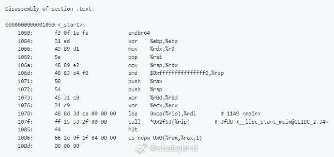
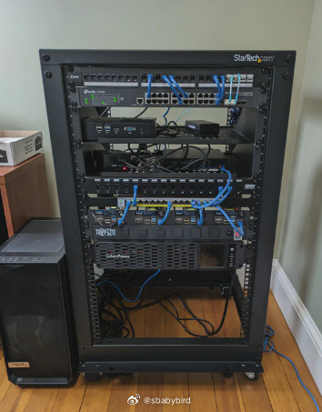
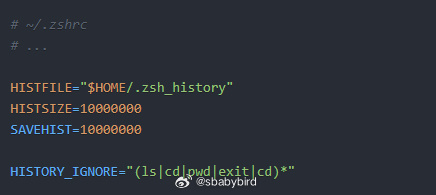
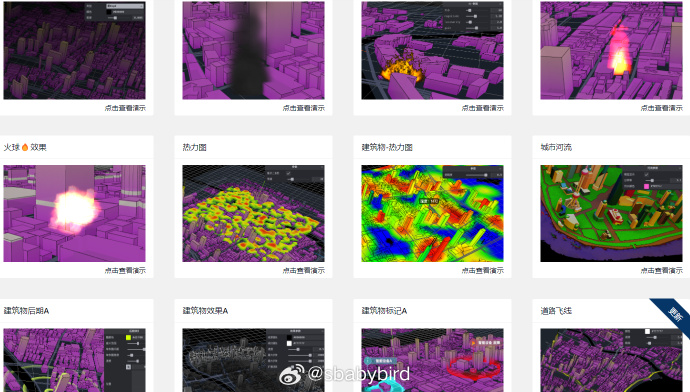
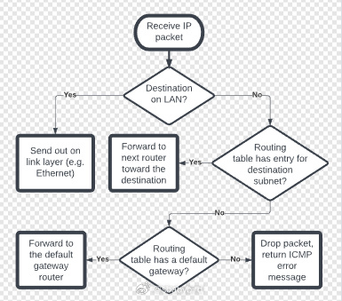
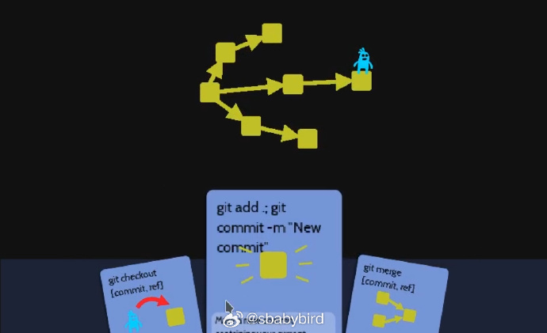
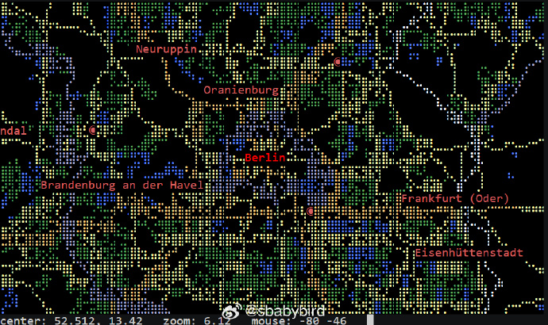

# 机器文摘 第 078 期

## 长文
### Hello world 不简单

这篇[《hello-world》](https://thecoder08.github.io/hello-world.html)，讲解了一个 C 语言编写的 helloworld 程序到底干了什么，它是怎样做到的。

文章提供了对“Hello World”程序从源代码到最终输出的全面解析，展示了现代操作系统和硬件之间复杂的交互过程。

通过这篇文章，可以更好地理解程序是如何在计算机上运行的，以及操作系统和硬件是如何协同工作的。

### 家庭服务器机架搭建指南

[家庭服务器机架搭建指南](https://mtlynch.io/building-first-homelab-rack/)。

如果你也考虑给自己的家庭服务器安装更专业的机架的话，可以参考这篇文章。

文章是关于作者Mike Lynch如何构建他的第一个家庭实验室（homelab）机架的经历。文章详细介绍了他为什么决定建立一个服务器机架、如何选择和购买各种组件、以及他在搭建过程中遇到的挑战和学到的经验教训。

### 有效利用你的 shell 历史记录

[有效利用你的 shell 历史记录](https://martinheinz.dev/blog/110)。

如果您经常在 shell/terminal 中工作，那么随着时间的推移，历史记录将成为您的个人知识库、文档和命令参考。能够有效地使用这些个人文档可以极大地提高您的工作效率。因此，这里有一些关于如何优化 shell 历史记录配置和使用以充分利用它的提示。 ​​​

## 资源
### 三维可视化前端库

[three vue ts js](https://github.com/hawk86104/icegl-three-vue-tres)。

一款让你的三维可视化项目快速落地の开源框架 🎊🎉🎉 永久开源，免费商用 ​​​。

### 开源大模型实用指南

[self-llm](https://github.com/datawhalechina/self-llm) 是一个围绕开源大模型、针对国内初学者、基于 AutoDL 平台的大模型教程，针对各类开源大模型提供包括环境配置、本地部署、高效微调等技能在内的全流程指导，简化开源大模型的部署、使用和应用流程，让更多的普通学生、研究者更好地使用开源大模型，帮助开源、自由的大模型更快融入到普通学习者的生活中。

### 网络编程入门教程

[Beej 的网络编程课（中文版）](https://github.com/rogerzhu/-bgnet0-cn)

国内有网友将 Beej 大神的 [Beej's Guide to Network Concepts](https://github.com/beejjorgensen/bgnet0) 翻译为中文。

译者自介绍：
> 我还记得我第一次看到 Beej 大神的文字是很多年前的一本基于c语言讲的计算机网络。按照 Beej 自己的官网上说法，这一系列的文章算不上一本正式的书，是他大学上课的资料整理。不同于之前的c语言版本，这一资料用的是现在使用的最广泛的语言之一python 来介绍原理，更加贴近整个学校的教学体系。

开头段落引用：
> 这是一份介绍计算机网络中一系列常见概念的读物，注意，这份文档里面并不是我的另外那本《Beej的网络编程指南--C语言版》[flbg[Beej的 的网络编程指南|bgnet]]。这一系列文章旨在让读者对各种繁杂的网络术语有所了解，当然，为了加深理解，文章中会有一些使用python进行的编程练习和例子。

### 通过游戏学习 Git

[ohmygit](https://ohmygit.org/)，一个学习 Git 操作的开源小游戏。

游戏通过故事性关卡的设置，让玩家可以再每一关都学习一个基本的 Git 操作。 ​​​

### 在终端里显示地图

[mapscii](https://github.com/rastapasta/mapscii)，一个有趣的项目，在终端里用字符绘制地图。

基于 nodejs 实现。

支持用鼠标缩放。

兼容大多数终端（Windows 需要使用 Putty 进行登录）。

以下命令可快速体验：telnet mapscii.me ​​​

## 观点
### 克制
保持克制，是感受幸福和美好的关键基础，正像是玩游戏不能作弊无限命那样，一旦失去限制，事情要么走向无聊和乏味，要么走向美好幸福的反面。

无论是工作还是日常生活，都适用。

## 订阅
这里会不定期分享我看到的有趣的内容（不一定是最新的，但是有意思），因为大部分都与机器有关，所以先叫它“机器文摘”吧。

Github仓库地址：https://github.com/sbabybird/MachineDigest

喜欢的朋友可以订阅关注：

- 通过微信公众号“从容地狂奔”订阅。

- 通过[竹白](https://zhubai.love/)进行邮件、微信小程序订阅。

