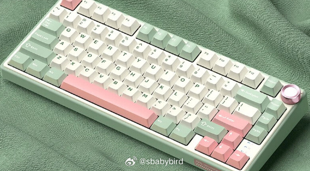
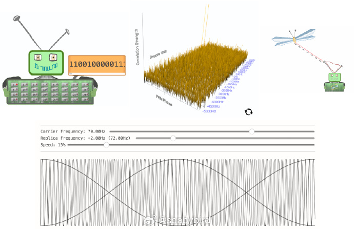
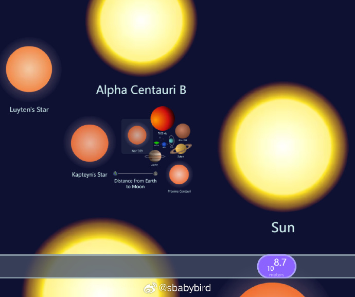
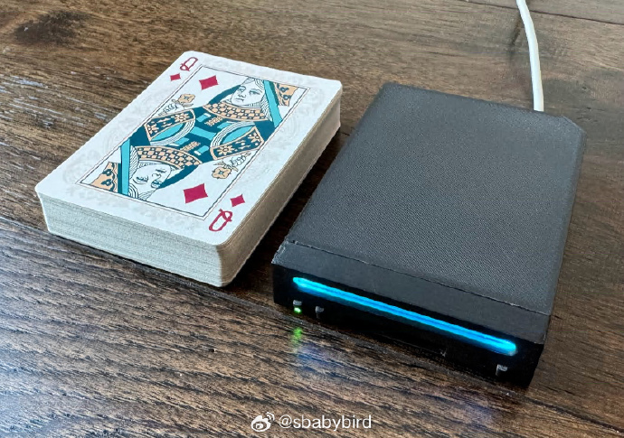
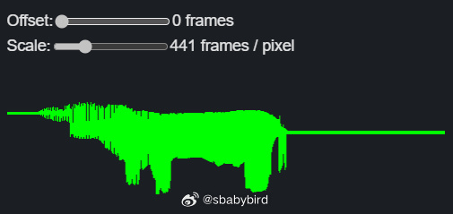

# 机器文摘 第 079 期

## 长文
### 人类关于航空武器的终极幻想：空中航母

这篇[《空中航母》](https://neverwasmag.com/2019/08/flying-aircraft-carriers/)探讨了空中航空母舰（flying aircraft carriers）这一概念，它在蒸汽朋克（steampunk）、柴油朋克（dieselpunk）和原子朋克（atompunk）等科幻小说中经常出现，已经成为这些类型文学的一个典型元素。

文章回顾了历史上的一些尝试，以及在流行文化中的各种表现。

大意如下：

1. **历史背景**：
   - 空中航母的概念在现实中有其基础。一战时期的英国飞艇携带了可以保卫母舰的双翼飞机。
   - 二战期间，苏联通过Zveno项目在图波列夫TB-3轰炸机的机翼下携带小型战斗机。

2. **海军将领的预言**：
   - 威廉·W·莫菲特（William W. Moffett）海军少将在1923年为《大众科学》（Popular Science）杂志撰写文章，预言了携带飞机的飞艇的诞生。

3. **美国海军的尝试**：
   - 美国海军建造了两艘空中航母：阿克伦号（Akron）和梅肯号（Macon），它们是有史以来最大的氦气填充飞艇，但最终都在恶劣天气中失事。

4. **太阳能飞行甲板**：
   - 1934年，《现代机械》（Modern Mechanix）杂志报道了一个提案，即使用可以兼作太阳能电池板的着陆带。

5. **广告和设计**：
   - 固特异（Goodyear）在1942年的《大众机械》（Popular Mechanics）杂志中宣传了一种“战斗机飞行航母”，声称其速度超过当时水面航母的两倍。

6. **Lockheed的CL-1201**：
   - 20世纪50年代，洛克希德（Lockheed）进行了一项更为严肃的研究，设计了CL-1201，这是一款核动力空中航母，翼下携带一系列喷气式飞机。

7. **波音747的改造**：
   - 70年代初，美国空军研究了将波音747客机改造为空中航母的可能性，主要挑战在于开发足够小的战斗机以适应其内部空间。

8. **虚构作品中的例子**：
   - 文章列举了多个虚构作品中的空中航母，包括漫威漫画和电影中的神盾局（S.H.I.E.L.D.）的直升机航母、《铁甲飞龙》（Girl Genius）中的沃尔芬巴赫城堡（Castle Wulfenbach）、《神秘博士》（Doctor Who）中的联合国情报特遣队（UNIT）的飞行航空母舰“勇者号”（Valiant），以及其他一些动画、游戏和电影中的类似设定。

### 为什么编程语言爱用分号作为语句终止符？

很多编程语言都使用 `;` 分号作为一个语句的终结符号，如果你也跟我一样好奇产生这个结果的原因，可以看看[《分号在编程语言中的起源和优势》](https://ntietz.com/blog/researching-why-we-use-semicolons-as-statement-terminators)这篇文章。

作者在做这项无聊的研究之前，本来是希望给自己的编程语言寻找一个合适的终结符，作者比较心仪 `.` 或者 `!` 这两个符号，但一番研究之后，作者选择随大流，仍然使用分号。

首先是为什么。

作者推测，早期的输入设备能够输入的字符比较有限，设计语法的人，需要找到一个字符既不像句号那么常用又得出现在键盘上，于是分号就进入候选了。

再者就是，使用分号进行断句，也比较符合英语的语法。

不会产生语义冲突，再拿句号举例，句号有时又表示小数点，这就有些麻烦。

最后作者说还可以选择一些比较偏门的符号（现在键盘都够用了），但是如果考虑到编程习惯，为了让他的语言更好上手，还是选择分号作为断句字符吧。

### 居中对齐没你想象的那么简单

这篇[《计算机科学中最难的事儿》](https://tonsky.me/blog/centering/)的作者有些强迫症，他总能轻易发现网页或者 App 应用里各种本该居中却没有居中的元素。

文中他认真阐述了造成这些不完美的原因，并列举了苹果、微软等大公司也在居中方面所犯的错误，证实即使是大公司，也不能保证在任何时候都能完美解决居中问题。

### 手搓一个 GPS 接收器

这是一篇很硬核的文章，[《手搓一个 GPS 接收器》](https://axleos.com/building-a-gps-receiver-part-1-hearing-whispers/)。

这是由 4 部分组成的系列文章，作者从最基本的原理讲起，带领你一步步构建一个 GPS 接收装置。

基本步骤：
1、首先买一个 SDR（软件定义无线电）设备，用于接收各种无线电信号。

2、用计算机处理接收到的信号（由于卫星距离很远且速度很快，需要处理多普勒效应）。

3、追踪和解析信号。

## 资源
### 宇宙的尺度

[scaleofuniverse](https://scaleofuniverse.com/en)

这个网站可以让你直观感受宇宙在不同尺度观察到的样子。

从普朗克长度，到最大的可观测宇宙。 ​​​

### 最强 Wii 主机改造

[short-stack](https://github.com/loopj/short-stack)

家有废旧任天堂 Wii 游戏机的不要扔。

按照这个开源教程操作一下，隔壁小孩馋哭了。

这是一个打磨 Wii 硬件（电路板）的开源项目，作者提供了相关图纸和操作步骤。

目的是将原本摆放在电视机旁边的 DVD 大小的游戏机，改装成一个像一盒扑克大小的可随身携带的游戏主机。

### 打字学英语两不误

[TermTyper](https://www.termtyper.com/)

通过打字练习学习一门语言（英文、法语、德语、西班牙语等）。 ​​​

### 在线生成字帖

[paper](https://paper.z2h.cn/)

一个优雅实用的在线字帖生成网站。

提供对中文汉字、词组和段落，以及英文字母、单词和段落的生成模式支持。其界面简洁清新，操作简单，可轻松自定义所需字帖内容。 ​​​

### Linux 内核实验室

[linux-kernel-labs](https://linux-kernel-labs-zh.xyz/)

布加勒斯特理工大学的 Linux 内核教学课程。该课程通过动手实践设备驱动编写，使学习者深入理解 Linux 内核，适合所有对 Linux 内核原理感兴趣的人阅读。

本文档主要分为两个模块，一个是“课程”，还有一个是“实验”。“课程”部分写得不甚详细，更适合有经验的教师上课时使用。而“实验”部分则是本文档最有价值的部分，写的非常的详细而且由浅入深，Linux 内核零基础的同学也可以来学习。注意“实验”模块学习之前，并不需要学习“课程”模块。

### 又一个波形渲染库

[webgpu-waveform](https://aykev.dev/webgpu-waveform/)。

一个使用 WebGPU 将音频波形渲染到 HTML 画布的 js 库。

## 观点
也许不久之后，新出的个人电脑都带有 AI 模型的加速芯片，都本地加载了类似 Coplit 之类的智能助理，届时操作电脑的体验可能又会有所不同。

一个可能的情况是，计算机厂商将会尝试提供一个围绕大模型的应用市场（或平台），应用开发者们，将再次像当年移动互联网流行那样，提供新一轮的各种创新应用。

只是不知这次引领着会是谁，以及会面临怎样的法律困扰等麻烦。

## 订阅
这里会不定期分享我看到的有趣的内容（不一定是最新的，但是有意思），因为大部分都与机器有关，所以先叫它“机器文摘”吧。

Github仓库地址：https://github.com/sbabybird/MachineDigest

喜欢的朋友可以订阅关注：

- 通过微信公众号“从容地狂奔”订阅。

- 通过[竹白](https://zhubai.love/)进行邮件、微信小程序订阅。

