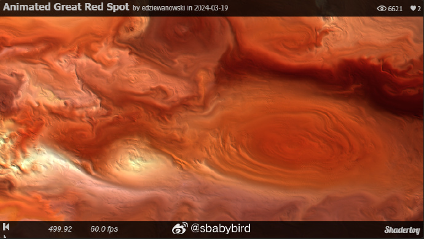
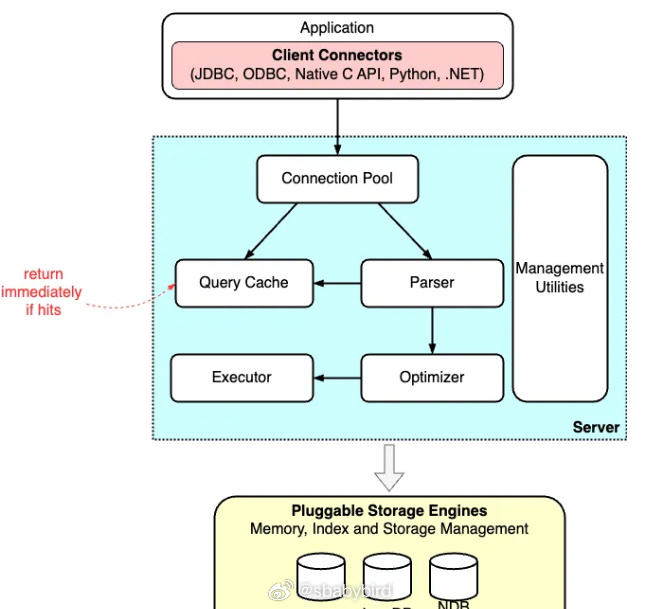
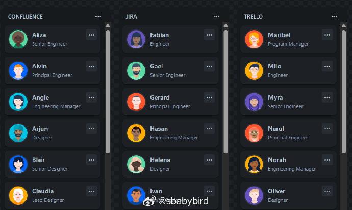
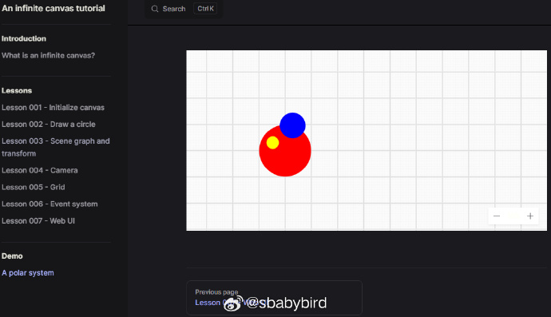
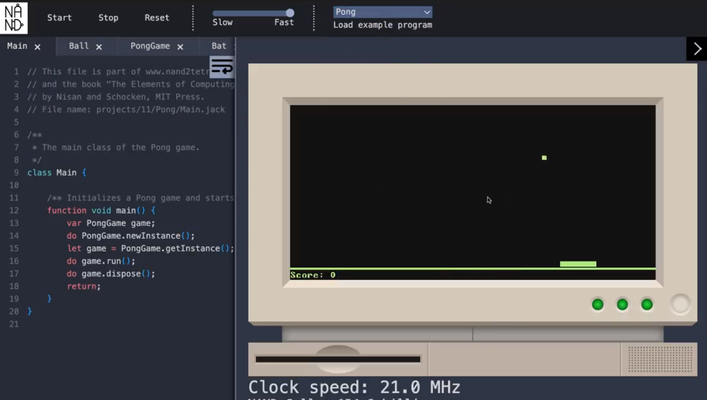

# 机器文摘 第 080 期

## 长文
### 利用计算机图形学模拟木星大红斑

[《流场》：模拟木星的大气流动效果](https://emildziewanowski.com/flowfields/)，这是一篇讲解视觉效果生成的文章，作者分享了他通过设计一些有趣的 Shader 着色器来实现模拟木星大气层流动效果的方法。

无论是否掌握着色器编程或者游戏引擎的材质制作技术，都可以跟随作者逐渐深入了解视觉效果的实现过程。

为了方便理解，作者从最古老的红白机游戏动画效果的技术讲起（魂斗罗里动态的水流实际上是基于对调色板的动态切换）。

然后使用 UE5 游戏引擎的材质编辑器逐渐创建示例，由浅入深展示实现效果的原理。

为了阅读体验更佳，页面中还嵌入了基于 ShaderToy 的可运行 Demo，直接渲染出了视觉效果（估计是使用的 UE5 的 GLSL 导出功能，否则光写这些 Demo 也够费劲的了）。

### 执行 SQL 时到底发生了什么？

理解SQL查询背后的复杂过程对于开发者至关重要，不仅可以提升查询性能，还能帮助选择有效的索引策略、改善资源管理，并有效诊断和解决性能瓶颈。

这篇[《执行 SQL 时到底发生了什么》](https://blog.bytebytego.com/p/what-happens-when-a-sql-is-executed)深入探讨了 SQL 命令在数据库中的执行过程，揭示了 SQL 作为现代数据管理的核心语言，是如何在关系型数据库中高效地检索、操纵和管理信息的。

文章以MySQL为例，详细阐述了SQL语句的生命周期，包括SQL解析器、查询优化器、执行引擎以及底层存储引擎的作用。

此外，还介绍了 SQL 标准的发展历程，从早期的 SQL-86、SQL-89 和 SQL-92，到现代的 SQL:1999 及后续标准，展示了 SQL 语言的不断进化和完善。

### 读什么你就是什么

我不记得我读过的书，也不记得我吃过的饭菜。

即便如此，他们还是造就了我。

[《读什么你就是什么》](https://blog.jim-nielsen.com/2024/you-are-what-you-read/) ​​​

## 资源
### 8bit 复古音效制作

[jsfxr](https://sfxr.me/)，一个在线音效制作工具，专门用于合成 8bit 风格的声音效果。

通过其提供的 js 库，可以将制作的成果集成到自己的网页游戏中。 ​​​

### 把手机作为电脑摄像头

[DroidCam](https://www.dev47apps.com/)

一个很方便的小工具，可以让你的手机作为你的电脑摄像头。

手机端支持安卓和苹果系统，电脑端支持 Windows、Linux 和 Mac。

应急开个视频会议，或者让手机当作你的视频采集终端应该没问题。 ​​​

### 前端拖拽库

[pragmatic-drag-and-drop](https://github.com/atlassian/pragmatic-drag-and-drop)

可以应用在任何前端技术栈（react、svelte 、 vue 、 angular）上的拖放组件库。 ​​​

### 从原理讲解基于 webgl、webgpu 进行画布渲染

这儿有一套关于[使用 WebGL 和 WebGPU 实现一套无线画布的教程](https://infinitecanvas.cc/)。

以下是原作者的介绍：

> 一些知名产品包括 Figma、Modyfi、rnote、tldraw、excalidraw等等都会使用无限画布。

> 作为一个前端，我对其中涉及到的渲染技术很感兴趣。尽管 tldraw、excalidraw 等普遍使用易用性更高的 Canvas2D / SVG 技术，但 JS 和 Rust 生态中也有很多编辑器、设计工具使用更底层的渲染技术对 2D 图形进行 GPU 加速，以获得更好的性能和体验，例如：

> Figma 使用 C++ 编写了一个 tile-based 的渲染引擎，编译成 WASM 后调用 WebGL 渲染
> Modyfi 使用了 Rust 生态中的 wgpu，同样编译成 WASM 后调用 WebGL2 渲染
> 因此我想通过一份教程一步步实现一个简单的无限画布，主要通过 WebGL1/2 和WebGPU 实现高性能渲染。

### 计算机原理教学项目

[NAND](https://github.com/ArhanChaudhary/NAND)，是一个图灵等价的16位计算机，完全由时钟频率和在Web上模拟的与非门电路组成。NAND拥有自己的CPU、机器语言、汇编语言、汇编器、虚拟机语言、虚拟机翻译器、编程语言、编译器、集成开发环境（IDE）和用户界面。

从第一原理构建现代计算机：从Nand到Tetris（以项目为中心的课程）

## 观点

### 关于 shell 编程
我一直对于 Shell 编程怀有抵触情绪，虽然它很强大，很多在命令行中生存的程序员也根本无法拒绝 Shell 编程。

但是我基本对 Shell 编程提不起兴趣，如果非要说原因的话，那就是：“Shell 编程对空格非常敏感”。

还记得那个笑话：在使用 rm 命令的时候，多打了一个空格，导致整个系统被删了 `rm -rf /空格/foo/bar`。

这足以说明 Shell 如果作为一个编程语言的话，特别容易产生难以捉摸的 Bug。

### 梦想与努力
我的梦想通过努力根本实现不了。

只有通过不努力才能实现。

请问您的梦想是什么？

当神仙。 ​​​

## 订阅
这里会不定期分享我看到的有趣的内容（不一定是最新的，但是有意思），因为大部分都与机器有关，所以先叫它“机器文摘”吧。

Github仓库地址：https://github.com/sbabybird/MachineDigest

喜欢的朋友可以订阅关注：

- 通过微信公众号“从容地狂奔”订阅。

- 通过[竹白](https://zhubai.love/)进行邮件、微信小程序订阅。

