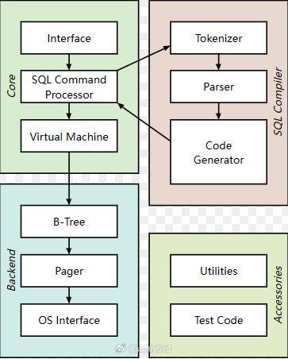
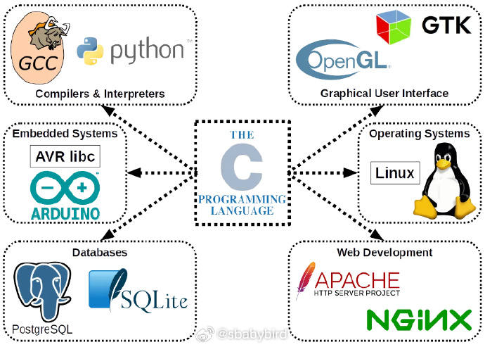
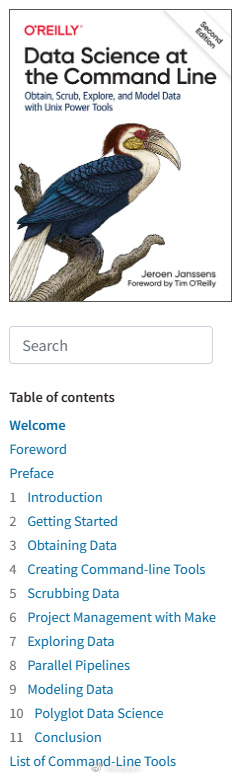
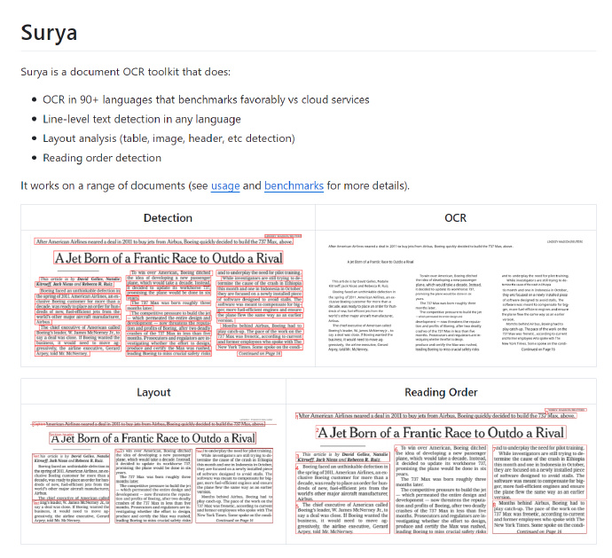
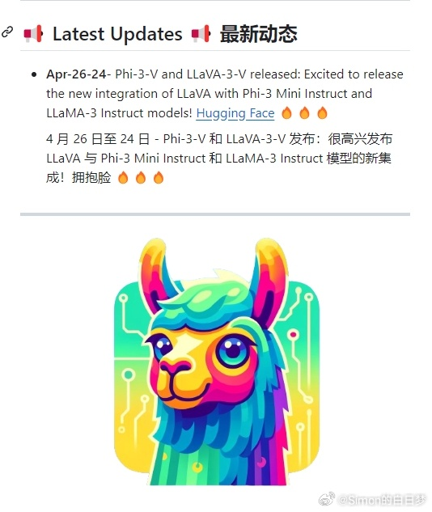
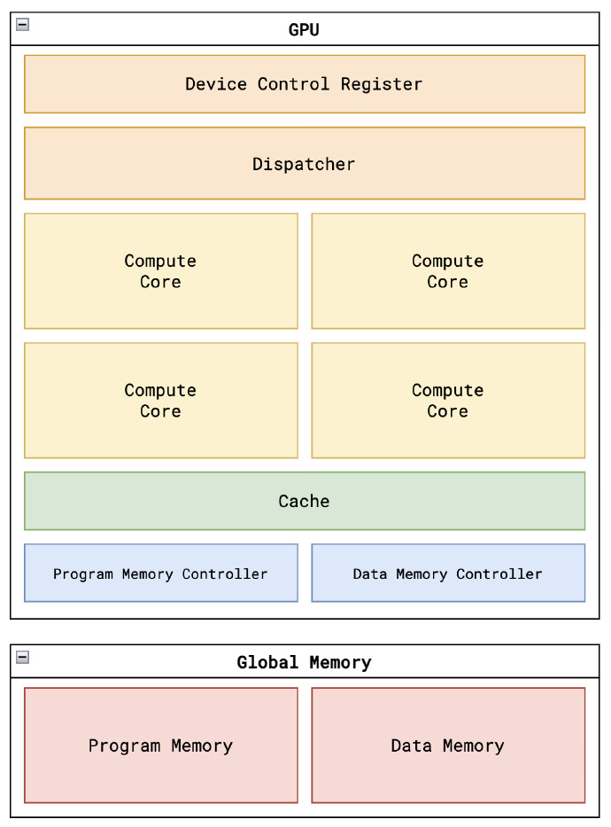

# 机器文摘 第 081 期

## 长文
### 为什么 SQLite 使用字节码来执行 SQL

每个 SQL 数据库引擎的执行 SQL 的步骤都差不多，一般来说都会先将输入的 SQL 文本转换为机器更容易理解的“预执行语句”。

然后通过某种“虚拟机”去执行它以生成结果。

如果了解一点儿编译原理的话，基本上所有的高级语言都会有类似的处理过程，SQL 有点儿像解释执行的语言。

具体虚拟机如何执行处理后的“预执行语句”，在数据库领域有两大技术路线，分别是：

1、字节码：输入 SQL 被转换为虚拟机语言，然后由虚拟机解释器运行。这是SQLite使用的技术。

2、对象树：输入 SQL 在表示要完成的处理的对象树中进行转换。SQL 是通过遍历此树来执行的。这是MySQL和PostgreSQL使用的技术。

这篇[《为什么 SQLite 使用字节码》](https://sqlite.org/draft/whybytecode.html)是 SQLite 的开发者写的解释文章，对比了这两种路线的各自优势，并解释了他们做出这样选择的理由。

简单来说，使用字节码的优点是：简单容易理解（是引擎容易理解，就像 CPU 更理解汇编语言）、容易调试、可以增量运行、占用空间小。

使用对象树的优点是：有些查询可以推迟运行（便于性能优化）、数据流程易于并行化（还是有利于性能）。

### C 编译器的历史

这篇文章是[《The Chip Letter》](https://thechipletter.substack.com/p/a-history-of-c-compilers-part-1-performance)系列的一部分，主题是 C 编译器的历史。

文章从C语言的起源讲起，探讨了 C 编译器的发展，以及它们对计算机架构、操作系统和编程语言的影响。

文章强调了C语言的可移植性对于软件行业的经济优势，以及 Richard Stallman 创建的 GCC 编译器对自由软件运动的重要性。

随着计算机架构的快速发展，如 Arm 和 RISC-V，高性能编译器成为支持这些架构的关键。

文章还提到了微软在Windows操作系统上的 C 编译器，以及 GCC 和 LLVM 编译器生态系统在支持新硬件和架构方面的重要作用。

最后，文章指出，高质量的 C 编译器对于任何成功的硬件生态系统都是必不可少的。

## 资源
### 用于科研的命令行技巧

[命令行中的数据科学](https://jeroenjanssens.com/dsatcl/)

这本在线电子书籍，讲解了在 Linux / Unix 命令行环境下进行数据建模和处理的工具使用技巧。

> 这份经过全面修订的指南演示了命令行的灵活性如何帮助您成为更高效、更富有成效的数据科学家。
> 您将学习如何结合小而强大的命令行工具，以快速获取、清理、浏览和建模数据。
> 为了帮助您入门，作者 Jeroen Janssens 提供了一个包含 100 多种 Unix 强大工具的 Docker 映像，无论您使用 Windows、macOS 还是 Linux，这对您的工作都很有帮助。

### 一个新的 OCR 框架

[surya](https://github.com/VikParuchuri/surya)

一个新的 OCR 框架，效果据说比 EasyOCR 要好。

### 开源多模态 LLM 模型

[LLaVA++](https://github.com/mbzuai-oryx/LLaVA-pp)

基于 Phi-3 和 LLaMA-3 的开源多模态 LLM，项目扩展了LLaVA模型，集成了 Phi-3 Mini Instruct 和 LLaMA-3 Instruct 模型，提升了模型的视觉和语言指令处理能力。

### 开源 GPU 学习项目

[tiny-gpu](https://github.com/adam-maj/tiny-gpu)，一个最小 GPU 实现，用于从头开始了解 GPU 的工作原理。

这个项目主要集中于探索：
- 架构 - GPU的架构是什么样子的？最重要的元素是什么？
- 并行化 - SIMD编程模型是如何在硬件中实现的？
- 内存 - GPU如何解决有限内存带宽的限制？ ​​​

## 观点
### 关于未来技术趋势的一点儿判断

AI 技术经过几十年长期发展，自去年开始引爆了应用点（大语言模型带来的自然语言对话以及多媒体生成技术）之后。基本上已经成为继云计算、移动互联网、物联网等超级技术概念之后的又一热点。

即便是理性看待，AI 也已经成为任何信息化相关产品不可或缺的能力，理论突破在提速、数据规模的增加在提速、各种意义上的基础设施也越来越完善，技术路线从实验室到消费端的周期也越来越短。

但是很难说 AI 是一个行业，应该把它看作是基于计算机技术的信息化、数字化行业的技术革新，是给各个行业进行赋能的一项技术。

所以，AI 技术本身只是一个基础，如果希望深耕，还需要细分出想要瞄准的应用市场，因为基础理论部分只能靠科学家去推动，我等凡人安心做好应用层工作已经不容易了。

如果说 AI 是未来信息技术的基础能力的话，那么虚拟增强现实则是在人机交互方面的发展必然。

人机交互自计算机诞生以来一直进展缓慢，输入输出设备虽然对应了人类的听觉、视觉、触觉等感官，但是交互方式仍然偏机械，而且缺乏互动性。

按照人类生物本能的需求，在交互方面肯定希望以一种自然的、不增加外部环节的人机沟通和交流，目前的输入输出设备还差的很远。

但随着芯片技术发展，算力增强的同时体积和能耗减小，增强现实设备有望以轻便的方式接入人眼，甚至达到现在无线耳机的佩戴舒适度，届时将类似 chatGPT 一样引爆交互革命。

伴随而来的就是面向新终端、场景的新一轮内容制作和应用制作的市场需求，人类可能在娱乐、效率生产力等方面全面依赖虚拟增强现实技术，像淘汰报纸、杂志一样淘汰现有的电视、电影、PC或手机。

护理机器人的发展严重依赖 AI 技术和工业制造能力，对其的强烈需求不是来自于工业生产，而是老龄化社会带来的护理需求。

可以想象，如果合理发展的话，未来针对行动不便老人的护理工作一定会以智能机器人为主，真人劳动力的成本将再一次大幅提升，生产力更加获得解放。

普通人在这样的趋势下所能获得市场机会，恐怕只能是内容创作、基础设施运维等低端工作，或者是非物质类的价值输出（比如聊天、网游陪玩等）；

客观规律决定了人类没有能力控制或改变历史进程的发展，恐怕赛博朋克 2077 那样的世界将不可避免地到来了。

## 订阅
这里会不定期分享我看到的有趣的内容（不一定是最新的，但是有意思），因为大部分都与机器有关，所以先叫它“机器文摘”吧。

Github仓库地址：https://github.com/sbabybird/MachineDigest

喜欢的朋友可以订阅关注：

- 通过微信公众号“从容地狂奔”订阅。

- 通过[竹白](https://zhubai.love/)进行邮件、微信小程序订阅。

