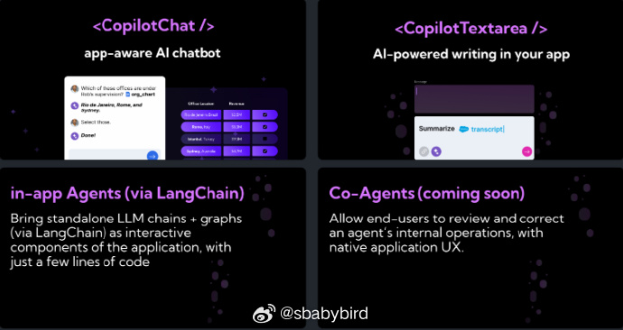

# 机器文摘 第 082 期

## 长文

### 微软是如何做到在 Windows 里直接运行 Linux 的 GUI 程序的？


我是 微软 WSL 的重度用户。

日常办公用 Windows 系统，一些必须在 Linux 下进行的开发试验工作就在 WSL 环境中，跟 Windows 无缝集成，同时性能又比虚拟机高一些，很满意。

从 2021 年开始，微软又发力，给 WSL 带来了图形支持（WSLg），可以在内部提供 GPU 硬件加速能力，以及图形界面的渲染。

可以直接使用 Linux 下的各种图形软件，跟普通 Linux 桌面的效果体验一致。

比如，在命令行输入 gedit、gvim 等带有图形界面的程序，窗口会直接在 Windows 里弹出，如果不仔细看，会觉得是 Windows 的原生程序。

我很好奇这种效果是怎样的技术路线做到的，之前在 Docker 里运行过带界面的程序，是通过在 Windows 上安装一个 X Server 实现的。

[《WSLg：为WSL增光添彩》](https://zhuanlan.zhihu.com/p/377263437)，这篇文章详细介绍了其实现原理，跟我之前想象的还是有些差别的。

微软果然还是喜欢骚操作，而且会凭借实力让这个骚操作成为既成事实的标准。

具体来说：

> 微软做了个和WSL用户发行版（User Distro，如Ubuntu、Debian、openSUSE、CentOS等）平级的“WSLg System Distro”，这个 Linux 发行版原本是微软内部在 Azure 云上的 Linux 系统，叫做“CBL-Mariner”，现在经过精心剪裁一番魔改之后，专门干一件事——跑 X Server。

> 好了现在 X Server 有了，但图形界面是显示在 WSLg System Distro 里，怎么进到这个系统里看呢？

> 微软在 WSLg System Distro 里加了远程桌面服务套件——FreeRDP，一个支持Windows远程桌面协议（RDP）的服务端，如果是在 Windows 里装 Linux虚拟机的话，可以用 Windows 自带的远程桌面客户端和虚拟 Linux 系统中的 FreeRDP 通信。

> 就这样，通过Windows -> RDP -> X Server一层套一层，把图形窗口“无缝”地集成到了Windows桌面环境中，整个形成了 WSLg 的架构。

### 使用 sockets 操作 X Window 窗口


既然上面讲 WSL2 里实现图形界面的事情，不妨再来一篇探索 X Server 技术的文章。

在这篇[《在 linux 中用 200 行纯手写 C 代码打开一个图形窗口》](https://hereket.com/posts/from-scratch-x11-windowing/)里，作者为了研究 X11 窗口图形协议，决定在不调用 xlib 这种基础库的情况下，通过套接字发送指令的方式，创建一个 GUI 窗口程序。

实际上 Linux 中用于显示图形界面的 X Server 也是一种网络服务，通过 X11 协议渲染图形界面，只要能够发送正确的信息给服务，就能进行图形界面的显示和交互。

虽然理论上是这样，然而实际实现时却没这么容易，作者花功夫研读了相关技术文档，并且进行了若干次尝试才最终成功。

作者在文末写道：
> X Server 在 linux 世界中正在慢慢被剥夺，并被 Wayland 取代。尽管如此，X11 仍然是一个有趣的协议。

### 向量嵌入的一些基础知识


随着 LLM 大模型的应用日趋成熟，基于 LLM 进行知识库搭建、模型微调等操作变得越来越普遍。

普通技术人员在进行此类应用操作时，接触到的第一个新技术名词可能就是“向量嵌入（Vector Embeddings）”，这是在 NLP 领域的一个基本概念。

理解它有助于在使用 LLM 模型进行应用层开发（尤其是在检索增强生成类应用）时充分发挥模型的力量，也能做到“知其所以然”。

这篇[《A Beginner’s Guide to Vector Embeddings》](https://www.timescale.com/blog/a-beginners-guide-to-vector-embeddings/)为读者提供了关于向量嵌入（Vector Embeddings）的基础知识，包括概念的定义、工作原理、如何在产品中应用等方面。

*虽然有 timescale 广告的成分，但是文章本身质量还挺高*

### 基于 SQLite 做一个搜索引擎


基于 SQLite 可以做全文检索吗？

答案是可以，SQLite FTS4 和 FTS5 扩展允许您对加载到 SQLite 中的文档执行全文搜索。

[使用 SQLite 构建高可用性搜索引擎](https://www.philipotoole.com/building-a-highly-available-search-engine-using-sqlite/)

这篇文章介绍了一个叫做 [rqlite](https://rqlite.io/) 的项目，它基于 SQLite 数据库实现了一个可用的搜索引擎。

文章详细介绍了使用这个搜索引擎进行测试和索引 Apache 日志的步骤。

像搭建轻量级全文检索服务的，不妨试一试。

### 爱上 Makefile


如果你和我一样对 Makefile 充满恐惧，不愿意碰它一下。

甚至认为它只是用于构建某个蹩脚的 C++ 工程所使用的老掉牙工具。

那可以看看这篇[《我是如何爱上 Makefile 的》](https://gagor.pro/2024/02/how-i-stopped-worrying-and-loved-makefiles)。

Makefile 拥有包括进行软件构建在内的多种用途，虽然大部分人仅仅用它来编译源码。

文章作者介绍了自己对 Makefile 由浅入深的使用过程，以及各种非软件构建的场景：包括 发送邮件、给 Python 项目准备环境、静态博客网站的生成等等。

如果你愿意的话，甚至可以用它来煮咖啡。

## 资源
### 基于终端的文件管理器


[Superfile](https://github.com/MHNightCat/superfile)，针对 Terminal 的文件管理应用。

界面很漂亮，可以方便地在控制台管理文件。

支持自定义主题和快捷键。 ​​​

### 阿里出的语音识别模型


[FunASR](https://github.com/alibaba-damo-academy/FunASR)，阿里巴巴的语音转文字，funasr，中文效果卓越，可以离线使用。

### 用 airpod 发射摩斯码


[headphone-morse-transmitter](https://github.com/EtherDream/headphone-morse-transmitter)。

这个开源项目可以把你的 airpod 耳机变成一个莫尔斯码发射器。

想象一下梁朝伟在无间道中使用耳机发送“有内鬼，终止交易”。 ​​​

### C++ 的坑，一网打尽。


地址：https://fouronnes.github.io/cppiceberg/

网站列举了 C++ 语言的一些反直觉的特性，标识在一座冰山上，点击链接可以看到该问题的详解。 ​​​

这其中就包含有网友整理的[“离职之前可以提交的代码片段”](https://gist.github.com/aras-p/6224951)。

可真是太能整活了, 加上它们会导致程序大概能跑，但是会不定期出 BUG。

### 开发 AI 助手的程序框架


[CopilotKit](https://github.com/CopilotKit/CopilotKit)，一个用于构建自定义 AI 智能助手的框架，包括应用内 AI 聊天机器人、应用内 Agent 代理和 AI 补全的文本编辑区域。 ​​​

### 一款100%免费的在线PDF工具，功能众多，界面好看。 ​​​


地址：https://onlinepdfedit.com/zh-cn/

### CodePen 的国内替代。 


地址：https://bi.cool/

## 观点
### 不能根据想象感受真实
电影《心灵捕手》中有段对白：
```
肖恩：如果我问你艺术,你可能会提出艺术书籍中的粗浅论调。有关米开朗基罗,你知道很多，他的满腔政治热情，与教皇相交莫逆，你对他很清楚吧？
但你连西斯汀教堂的气味也不曾嗅到？你未曾站在那儿，昂首眺望天花板上的名画吧？可是我见过。
...
你年轻彪悍，我如果和你谈论战争，你会向我大抛莎士比亚， 朗诵“共赴战场，亲爱的朋友”
但你从未亲临战阵，未试过把挚友的头拥入怀里，看着他吸着最后一口气，凝望着你，垂死向你求助。
...
```
- 我的体会是，感受一样东西，不能只靠想象（不是不能想象，而是不能仅依赖）。
- 也就是说，无论你从电视上、书本里、别人的讲述中能获取多少关于一件事物（或一个地方、一个人）的信息，在你真正与它接触之前，你都不可能真正认识它。
- 但不幸的是，现在数字化生活已经将人与真实生活剥离得过于孤立，我们仿佛被各种电子设备（尤其是手机）催眠了。
- 足不出户是很难感受完整的世界的，如果有可能，还是尽可能去自然中感受真实的东西。

### 看书与电视没多大区别

对我来说，吃完晚饭看书对比坐沙发看美剧的最大区别，就是看书可以走动以活动身体。

从吸收的内容营养上来说，看书并不比看电视高明到哪儿去，目前都是当作消遣的一种方式。

很多人过于抬高了读书的好，以及看电视的坏。

但如果一件事情能让人沉浸和放松，那就是最大的益处。

做事一旦太功利，就很无趣了。

## 订阅
这里会不定期分享我看到的有趣的内容（不一定是最新的，但是有意思），因为大部分都与机器有关，所以先叫它“机器文摘”吧。

Github仓库地址：https://github.com/sbabybird/MachineDigest

喜欢的朋友可以订阅关注：

- 通过微信公众号“从容地狂奔”订阅。


- 通过[竹白](https://zhubai.love/)进行邮件、微信小程序订阅。

