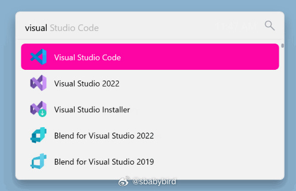

# 机器文摘 第 083 期

## 长文
### 打造拥有 600 万词库的微软拼音输入法

[打造拥有 600 万词库的微软拼音输入法](https://zhuanlan.zhihu.com/p/416966473)。

微软拼音输入法难用，主要是缺少国内一些常用的词汇，而且首选的候选往往会出现很诡异的错词。

但是我也已经忍了很久，因为不想被安装全家桶或者遭遇隐私问题（不想用某度或者某狗的输入法），只得忍着用。

上面这篇文章介绍了一个很不错的方法，充分发挥了微软拼音输入法的自定义词汇功能。

一次性导入 600 万常用词汇，让候选词的丰富程度和靠谱程度得到了大幅提升。

经过我的测试效果很好，不过偶尔会有网络用语冲在正式用语前面的情况，瑕不掩瑜吧。

600 万词库下载地址：https://pan.baidu.com/s/1uIdt_2nerdi6vhA9BB6M2A

分享码：yrhl

*个人使用三天后的体验*：词汇确实比之前好很多了，但是个别时候有一些网络用语冲到了最前面，也会造成不方便。

### Adobe Photoshop 1.0.1 版本的源代码

Photoshop，著名图像处理软件，又叫 PS，已成为一个动词，用于表示修图的行为。

它已诞生 35 年，[这篇文章介绍了它的诞生历程以及对最初版本源码的解释](https://computerhistory.org/blog/adobe-photoshop-source-code/)。

> 密歇根大学计算机视觉博士生托马斯·诺尔（Thomas Knoll）在1987年编写了一个程序来显示和修改数字图像。他的兄弟约翰在电影视觉效果公司工业光魔公司工作，发现它对编辑照片很有用，但它并不打算成为一种产品。托马斯说：“我们最初是为了我们自己使用而开发的......”

> 渐渐地，这个名为“Display”的程序变得更加复杂。

> 1988年夏天，他们意识到它确实可以成为一种可靠的商业产品。

> 他们将其重命名为“Photoshop”，并开始寻找一家公司来分发它。

> 大约 200 份 0.87 版被玻片扫描仪制造商 Barneyscan 捆绑为“Barneyscan XP”。

> 当Adobe在其艺术总监Russell Brown的鼓励下决定购买发行Photoshop增强版的许可证时，Photoshop的命运就此注定。

> 该交易于 1989 年 4 月完成，1.0 版于 1990 年初开始发货。

> 在接下来的十年中，Photoshop 的销量超过 300 万份。

> Photoshop 的第一个版本主要是用 Pascal 为 Apple Macintosh 编写的，为底层的摩托罗拉 68000 微处理器编写了一些机器语言。

> 第一个版本只有 Thomas 一个人开发，第二个版本团队增加到了两个工程师：Thomas 开发基本应用程序，John 编写图像处理插件。

下载 1.0.1 版本代码的地址在这里（必须先同意不用于商业用途的许可条款）：https://computerhistory.org/blogs/photoshop-software-license-agreement/

## 资源
### Linux Bash 参考指南

在线阅读地址：https://mr-dai.github.io/linux_bash_reference/

> 我写这篇文章主要是用来作为我的 Linux Bash 工具书的，希望这篇文章对你也能起到同样的效果。随着我学习到更多有关 Linux Bash 的知识，我会不断地更新这篇文章。

> 本文的内容假设你对 Linux 和 Linux 命令行有基本的了解。本文的内容分为三个主要部分：
> 🌟Linux Shell 脚本编程
> 🌟Linux Bash 内置命令
> 🌟常见的轻量级 Linux 命令工具

### 像素艺术编辑器

[用 Zig 语言编写的跨平台开源像素艺术编辑器和动画编辑器](https://github.com/foxnne/pixi), Pixel art editor made with Zig.

### 导出微信读书的电子版

[weread-exporter](https://github.com/drunkdream/weread-exporter) ​​​一个可以将微信读书中的书籍导出成epub、pdf、mobi等格式的工具。

### 展示各种语言编译过程的在线工具

[Compiler Explorer](https://godbolt.org/)

一个在线工具，直观展示各种编程语言的编译过程。

适合任何对编译器或计算机体系结构感兴趣的人。

只需在左侧窗格中输入源代码，站点就会立即在右侧的面板中显示编译后的输出（通常是汇编语言）。

[这里有一篇文章详细介绍了这个工具](https://thechipletter.substack.com/p/compiler-explorer)。

### 搭建自己的“今日热榜”

[glance](https://github.com/glanceapp/glance)

是一个漂亮的自托管个性化阅读看板。

支持 RSS 订阅源和各种小组件（天气、股票等）。

可以打造一个个性化的看板首页，根据自己的喜好将自己关注的信息一页看完。

### 精美高效的应用程序启动器

[Flow.Launcher](https://github.com/Flow-Launcher/Flow.Launcher)

适用于 Windows 的快速文件搜索和应用程序启动器，具有成熟的插件生态。

可以快速的查找文件（支持 Windows 自己的索引）、启动应用、做算术计算、打开网址、执行 cmd 命令、预览图片和 pdf 等文件内容。

喜欢快捷启动器的人不能错过，不过我还是喜欢老派的 Everything。

## 观点
### 做简单的事情不会使你成功
不要假装努力，总挑一些简单的事儿去做，应该挑一些难的。 ​​​

### 好的教学，一定是把背景铺垫做的足足的。
读《微积分的力量》过半，作者铺垫了三章的内容，终于讲到了微分和积分的推导过程，揭示答案那一刻，“就像魔术师从帽子里拿出兔子”（这句是书中原话）。

如果没有前面的铺垫，直接告诉答案，那就失去了本书的意义，与大学教材无异了。

这类深入浅出循循善诱的介绍数学的书籍极少，能够读到真乃幸事。

## 订阅
这里会不定期分享我看到的有趣的内容（不一定是最新的，但是有意思），因为大部分都与机器有关，所以先叫它“机器文摘”吧。

Github仓库地址：https://github.com/sbabybird/MachineDigest

喜欢的朋友可以订阅关注：

- 通过微信公众号“从容地狂奔”订阅。

- 通过[竹白](https://zhubai.love/)进行邮件、微信小程序订阅。

